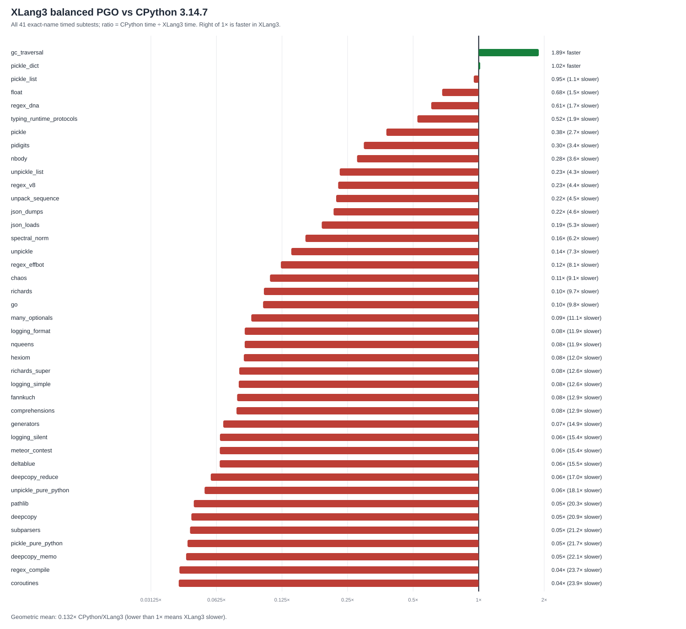

# XLang3 balanced PGO vs CPython 3.14.7: full pyperformance (2026-10-01)

This run attempted all 97 definitions from pyperformance 1.14.0 in fast mode using the balanced MSVC PGO Release executable. It recorded 41 exact-name subtests across 37 definitions; the other 60 definitions failed (25 timeouts and 35 worker deaths). The comparison below uses the saved CPython 3.14.7 reference from the same Windows host and includes only matching timed subtests.

Across the 41 matches, the geometric mean CPython-time / XLang3-time ratio is **0.132×**, so this PGO build is **7.57× slower than CPython on this matched fast-mode set**. XLang3 is faster in 2 subtests (`gc_traversal` and `pickle_dict`); the other 39 favor CPython. These fast-mode ratios are directional, with substantial run-to-run variance in several cases.

| Subtest | CPython 3.14.7 | XLang3 PGO | CPython / XLang3 |
|---|---:|---:|---:|
| `gc_traversal` | 2.191 ms | 1.16 ms | 1.888× faster in XLang3 |
| `pickle_dict` | 0.02321 ms | 0.02283 ms | 1.016× faster in XLang3 |
| `pickle_list` | 0.003952 ms | 0.004164 ms | 0.949× (1.05× slower) |
| `float` | 56.18 ms | 82.66 ms | 0.680× (1.47× slower) |
| `regex_dna` | 132.3 ms | 218.6 ms | 0.605× (1.65× slower) |
| `typing_runtime_protocols` | 0.1244 ms | 0.2378 ms | 0.523× (1.91× slower) |
| `pickle` | 0.009078 ms | 0.02409 ms | 0.377× (2.65× slower) |
| `pidigits` | 164.4 ms | 553.8 ms | 0.297× (3.37× slower) |
| `nbody` | 81.04 ms | 293.2 ms | 0.276× (3.62× slower) |
| `unpickle_list` | 0.003159 ms | 0.01373 ms | 0.230× (4.35× slower) |
| `regex_v8` | 16.46 ms | 72.75 ms | 0.226× (4.42× slower) |
| `unpack_sequence` | 3.545e-05 ms | 0.00016 ms | 0.222× (4.51× slower) |
| `json_dumps` | 7.584 ms | 35.17 ms | 0.216× (4.64× slower) |
| `json_loads` | 0.01754 ms | 0.09222 ms | 0.190× (5.26× slower) |
| `spectral_norm` | 72.18 ms | 450.9 ms | 0.160× (6.25× slower) |
| `unpickle` | 0.0097 ms | 0.07037 ms | 0.138× (7.26× slower) |
| `regex_effbot` | 1.795 ms | 14.54 ms | 0.123× (8.10× slower) |
| `chaos` | 46.86 ms | 425.8 ms | 0.110× (9.09× slower) |
| `richards` | 33.36 ms | 323.3 ms | 0.103× (9.69× slower) |
| `go` | 94.22 ms | 921.3 ms | 0.102× (9.78× slower) |
| `many_optionals` | 0.6684 ms | 7.402 ms | 0.090× (11.07× slower) |
| `logging_format` | 0.007316 ms | 0.08683 ms | 0.084× (11.87× slower) |
| `nqueens` | 73.94 ms | 878.1 ms | 0.084× (11.88× slower) |
| `hexiom` | 4.928 ms | 59.08 ms | 0.083× (11.99× slower) |
| `richards_super` | 37.31 ms | 469.2 ms | 0.080× (12.58× slower) |
| `logging_simple` | 0.006755 ms | 0.08542 ms | 0.079× (12.65× slower) |
| `fannkuch` | 312.3 ms | 4016 ms | 0.078× (12.86× slower) |
| `comprehensions` | 0.01369 ms | 0.1772 ms | 0.077× (12.95× slower) |
| `generators` | 27.01 ms | 402.3 ms | 0.067× (14.90× slower) |
| `logging_silent` | 6.693e-05 ms | 0.001032 ms | 0.065× (15.43× slower) |
| `meteor_contest` | 87.41 ms | 1350 ms | 0.065× (15.45× slower) |
| `deltablue` | 2.485 ms | 38.43 ms | 0.065× (15.46× slower) |
| `deepcopy_reduce` | 0.002203 ms | 0.03745 ms | 0.059× (17.00× slower) |
| `unpickle_pure_python` | 0.1614 ms | 2.93 ms | 0.055× (18.15× slower) |
| `pathlib` | 47.82 ms | 972.6 ms | 0.049× (20.34× slower) |
| `deepcopy` | 0.21 ms | 4.384 ms | 0.048× (20.87× slower) |
| `subparsers` | 7.601 ms | 160.9 ms | 0.047× (21.16× slower) |
| `pickle_pure_python` | 0.2523 ms | 5.484 ms | 0.046× (21.74× slower) |
| `deepcopy_memo` | 0.02147 ms | 0.4737 ms | 0.045× (22.07× slower) |
| `regex_compile` | 93.64 ms | 2217 ms | 0.042× (23.68× slower) |
| `coroutines` | 17.44 ms | 416 ms | 0.042× (23.85× slower) |

The complete 97-definition status table keeps every timeout and worker failure visible. The exact subtest means, standard deviations, and run counts are in the CSV and raw pyperf JSON. The previous standard Release full run is also saved for context; pyperf finds 28 significant matched changes between it and this PGO run, with a 1.09× geometric mean speedup in those changed subtests. The PGO gain is not consistent across every suite workload: `pidigits` and `pickle` are slower in this run, while `deltablue`, both pure-Python pickle cases, JSON, and the logging cases improved.

- [All 97 attempted definitions and statuses](data/pyperformance-xlang3-msvc-pgo-balanced-20261001-all-97-status.csv)
- [All 41 CPython-matched subtests, means, standard deviations, and speed ratios](data/pyperformance-xlang3-msvc-pgo-balanced-20261001-subtests.csv)
- [Raw XLang3 PGO pyperf JSON](data/pyperformance-xlang3-msvc-pgo-balanced-20261001.json)
- [Left-to-right log-scale chart](pyperformance-xlang3-msvc-pgo-balanced-20261001.svg)
- [CPython 3.14.7 reference JSON](data/pyperformance-cpython314-full-fast-gc-root-20260929.json)
- [Standard Release full-suite report and raw results](pyperformance-xlang3-vs-cpython314-20260930.md)

## Measurement notes

- XLang3 candidate: MSVC 19.51 Release, `/GL` plus balanced `/USEPROFILE`; the profile was trained on one run of each 11-case fixed gate workload and a smaller Python-heavy batch.
- The reference is the saved pyperformance 1.14.0 fast run on CPython 3.14.7 on the same Windows 11 x86-64 machine.
- The shimmed runner uses a 120-second cap per top-level definition. Missing optional packages, runtime/API incompatibilities, worker deaths, and timeouts are recorded as failures, not converted into timings.
- The fixed Release gate independently passes all 11 cases with a 1.22× geometric mean speedup over the ordinary XLang3 Release build. That is a self-comparison and does not change the CPython result above.
- The pure-Python pickle benchmarks run the same `Lib/pickle.py` on both runtimes. CPython 3.14.7 specializes dispatch-table lookup and exact-function call sites (`BINARY_OP_SUBSCR_DICT` and `CALL_PY_EXACT_ARGS`); XLang3 currently still performs generic `GetItem`, `Call`, and frame setup. See [the source and profile comparison](cpython314-vm-comparison-20260930.md).
