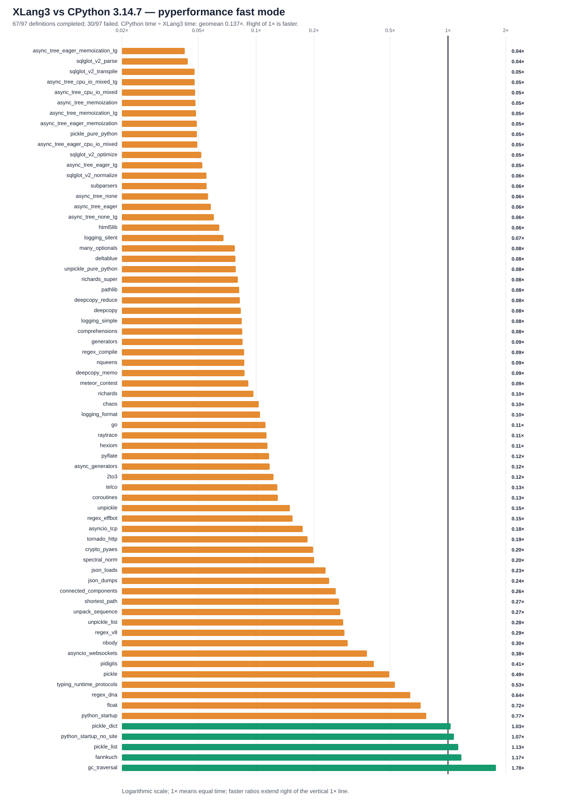

# XLang3 native-string checkpoint vs CPython 3.14.7: full pyperformance run

The corrected XLang3 run attempted all **97** pyperformance 1.14.0 definitions in `--fast` mode. It completed **67** definitions and recorded **30** failures/timeouts. The command returned exit code 1 because pyperformance treats those benchmark failures as an unsuccessful suite; every definition was attempted.

Of **70** matched subtests, XLang3 was faster on **5**. The geometric mean of CPython time divided by XLang3 time was **0.13722×**; values over 1× favor XLang3. Fast-mode samples carry stability warnings and are directional evidence.

The measured engine is checkpoint `003b3882d5d2f2c330d448846dc57d0c4254520c`.
The executable and DLL hashes matched at the start and end of the run, as
recorded in the [completed-run provenance](data/pyperformance-xlang3-native-string-checkpoint-full-fast-20261007-provenance.json).
The pending dictionary-iteration source change was not built into this binary.

On the **same 56 subtests** present in the previous XLang3 run, this run,
and the CPython reference, CPython-relative geometric mean speed changed from
**0.15654× to 0.16192×**. The old/new XLang3 timing ratio is **1.03435×**,
about a 3.4% nominal improvement. These separate fast-mode runs do not establish
statistical significance. The [complete shared-set comparison](pyperformance-xlang3-native-string-checkpoint-common-subtests-20261007.md)
records both timings, measurement counts, excluded names, and input hashes.

The previous run completed 53 definitions; this one completed 67. Its normal
case cap increased from 120 to 300 seconds, with 600 seconds for NetworkX.
Additional completions therefore cannot be attributed solely to engine fixes.
The overall 70-subtest mean includes 14 newly measured, mostly slow subtests;
compare the shared set when assessing speed changes between engine versions.

## Run configuration

- XLang3 Release executable SHA-256: `303F2E8BDCA58C4B555D13ADD7BFC41EEF9E0019F4780A0C9729596CE07DF177`.
- XLang3 runtime DLL SHA-256: `29431877C4306B05E43ABA818CB96A6CFEA548D90D55189FB21B8DE6AD0758F3`.
- CPython reference: pyperformance 1.14.0 on CPython 3.14.7; XLang3 loaded `C:\Python\Python314\Lib (Python 3.14.7)`.
- The XLang3 `PYTHONPATH` contains the Windows pyperf compatibility shim and the shared benchmark dependency site-packages. No Python 3.13 standard-library overlay was used.
- Each XLang3 benchmark definition had a 300-second cap covering pyperf worker calibration and measurement. Overrides: networkx*=600.

## Largest slowdowns and wins

| Subtest | CPython 3.14.7 | XLang3 | CPython / XLang3 |
|---|---:|---:|---:|
| `async_tree_eager_memoization_tg` | 261.1 ms | 6141 ms | 0.043× |
| `sqlglot_v2_parse` | 1.01 ms | 22.93 ms | 0.044× |
| `sqlglot_v2_transpile` | 1.302 ms | 27.22 ms | 0.048× |
| `async_tree_cpu_io_mixed_tg` | 425.6 ms | 8890 ms | 0.048× |
| `async_tree_cpu_io_mixed` | 428.6 ms | 8899 ms | 0.048× |

Nominal timing ratios above parity (not significance-tested wins):

- `gc_traversal`: **1.778×** (1.312 ms vs 2.332 ms).
- `fannkuch`: **1.175×** (275.8 ms vs 324 ms).
- `pickle_list`: **1.131×** (4.089 µs vs 4.625 µs).
- `python_startup_no_site`: **1.074×** (19.26 ms vs 20.68 ms).
- `pickle_dict`: **1.032×** (25.59 µs vs 26.41 µs).

## Failure breakdown

- 18 definitions: Benchmark died.
- 12 definitions: Benchmark timed out.

The [all-97 status CSV](data/pyperformance-xlang3-native-string-checkpoint-full-fast-20261007-all-97-status.csv) retains every benchmark definition and failure status. The [matched subtest CSV](data/pyperformance-xlang3-native-string-checkpoint-full-fast-20261007-subtests.csv) contains raw per-subtest means and speed ratios.

## Raw evidence

- XLang3 pyperf JSON: [`pyperformance-xlang3-native-string-checkpoint-full-fast-20261007.json`](data/pyperformance-xlang3-native-string-checkpoint-full-fast-20261007.json).
- Runner status log: [`pyperformance-xlang3-native-string-checkpoint-full-fast-20261007.log`](data/pyperformance-xlang3-native-string-checkpoint-full-fast-20261007.log).
- CPython 3.14.7 pyperf JSON: [`pyperformance-cpython314-clean-release-full-fast-20261002.json`](data/pyperformance-cpython314-clean-release-full-fast-20261002.json).
- Earlier runs that used a Python 3.13 standard library are retained separately; this run supersedes them as the same-version Python 3.14 comparison.

Benchmark worker failures have several causes, including unavailable optional benchmark dependencies, XLang3 native-module gaps, and interpreter compatibility bugs. The status CSV gives case-level failure details, and the runner log preserves worker tracebacks when available. A worker death is not a performance score; inspect its case-specific cause before treating it as a speed result.

## Targets confirmed by this run

- NetworkX shortest-path completed at about 1.74 seconds versus 470 ms for
  CPython; connected-components at 1.63 seconds versus 423 ms. The generic
  iterator ownership/refcount change remains unvalidated. K-core reached its
  600-second full-case limit and has no score.
- Pure-Python pickle measured 5.56 ms versus 274 microseconds, about 20.3 times
  as long. The Python implementation remains intact; existing insignificant
  forwarding trials must not be mistaken for successful optimizations.
- SciMark fails in `copy_vector` at `vec2[:] = vec[:]`, confirming the
  [native-array slice/storage gap](native-array-storage-source-audit-20261007.md).
- Tomli reaches the 300-second cap. The [Unicode-indexing source audit](tomli-unicode-indexing-source-audit-20261007.md)
  identifies repeated whole-source UTF-8 scans on its 16.8 MB input containing
  only 68 non-ASCII characters. A generic string-indexing candidate still
  needs implementation, correctness checks, and official benchmark evidence.

The later [validated dictionary-iteration comparison](native-dict-iteration-networkx-20261007.md)
records new engine results for the two completed NetworkX cases. Those scores
remain separate from this frozen full-suite dataset; they have not been mixed
into its chart or geometric mean.
