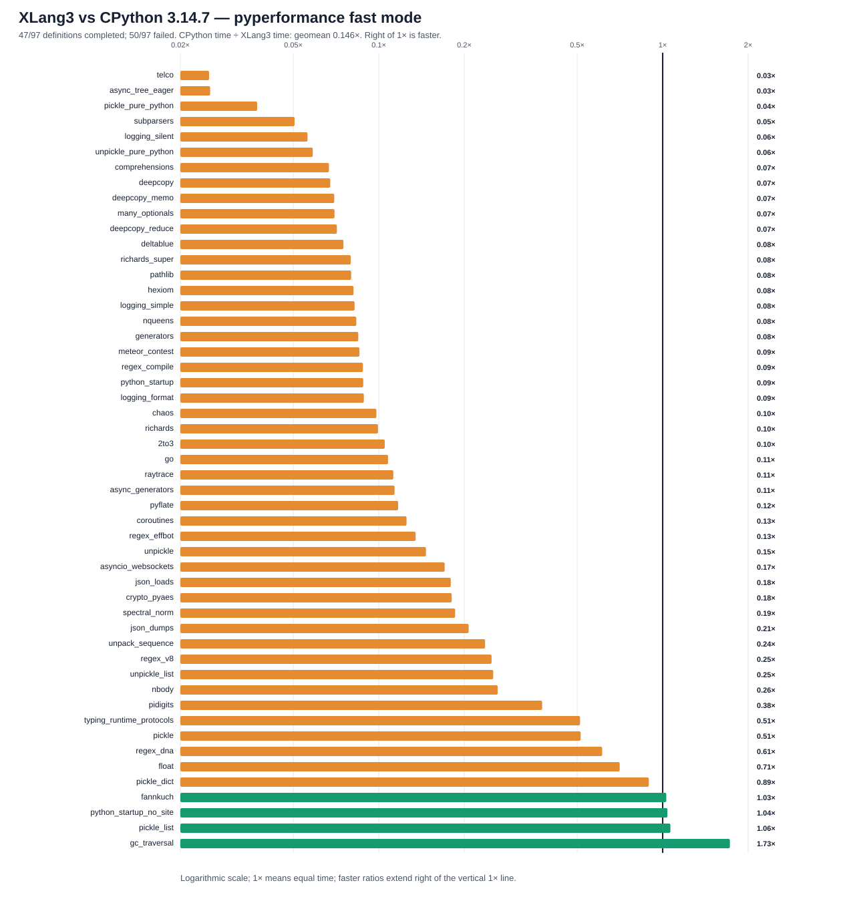

# XLang3 vs CPython 3.14.7: corrected full pyperformance run

The corrected XLang3 run attempted all **97** pyperformance 1.14.0 definitions in `--fast` mode. It completed **47** definitions and recorded **50** failures/timeouts. The command returned exit code 1 because pyperformance treats those benchmark failures as an unsuccessful suite; every definition was attempted.

Of **51** matched subtests, XLang3 was faster on **4**. The geometric mean of CPython time divided by XLang3 time was **0.14562×**; values over 1× favor XLang3. Fast-mode samples carry stability warnings and are directional evidence.

The strong August-era function-call microbenchmark does not represent a
general-purpose call path. Profiling the repository's 250,000-call
`function_calls` workload recorded only two executions of the guarded
`ForCallAccumulateLoop` IR operation; the optimizer recognizes that exact
integer-add loop and computes it in a fused native loop, reverting to ordinary
bytecode when its target, values, overflow, or observability guards fail. By
contrast, `subparsers` executed about 919,000 VM operations, including 51,073
`CallMethod`, 36,243 `Call`, and 65,856 `LoadLocalAttr` operations. The
microbenchmark gain is real for its recognized shape, but most library code
does not match that narrow pattern. This points the next work toward shared
call/frame and general opcode costs, rather than extending a benchmark-only
optimization to pure-Python libraries.

The operation counts come from opt-in instrumented runs of the repository's
`function_calls.py` and `subparsers.py` diagnostic cases:
[`function_calls` VM counters](data/profile-function-calls-20261003.log),
[`subparsers` VM counters](data/profile-subparsers-20261003.log). The official
pyperformance JSON remains the source of the timing ratios above.

## Run configuration

- XLang3 Release executable SHA-256: `0F4541BA603DF07FC031D04A1E9EF118B2D0DBC08EFF78C515A7E94607076B`.
- XLang3 runtime DLL SHA-256: `2A11460D4877EC6B8A60F66A3C58C5F1D3B9959343FF319A5D2A88F9067CAE46`.
- CPython reference: pyperformance 1.14.0 on CPython 3.14.7; XLang3 loaded `Python 3.14 standard library`.
- The XLang3 `PYTHONPATH` contains the Windows pyperf compatibility shim and the shared benchmark dependency site-packages. No Python 3.13 standard-library overlay was used.
- Each XLang3 benchmark definition had a 120-second cap covering pyperf worker calibration and measurement. Overrides: async_tree*=30s, async_tree_eager=300s.

## Largest slowdowns and wins

| Subtest | CPython 3.14.7 | XLang3 | CPython / XLang3 |
|---|---:|---:|---:|
| `telco` | 5.755 ms | 228 ms | 0.025× |
| `async_tree_eager` | 86.62 ms | 3401 ms | 0.025× |
| `pickle_pure_python` | 273.5 µs | 7.334 ms | 0.037× |
| `subparsers` | 8.151 ms | 161.3 ms | 0.051× |
| `logging_silent` | 70.03 ns | 1.248 µs | 0.056× |

Measured wins:

- `gc_traversal`: **1.725×** (1.352 ms vs 2.332 ms).
- `pickle_list`: **1.064×** (4.345 µs vs 4.625 µs).
- `python_startup_no_site`: **1.040×** (19.9 ms vs 20.68 ms).
- `fannkuch`: **1.030×** (314.7 ms vs 324 ms).

## Failure breakdown

- 29 definitions: Benchmark died.
- 21 definitions: Benchmark timed out.

The [all-97 status CSV](data/pyperformance-xlang3-ob3-corrected-full-fast-20261003-all-97-status.csv) retains every benchmark definition and failure status. The [matched subtest CSV](data/pyperformance-xlang3-ob3-corrected-full-fast-20261003-subtests.csv) contains raw per-subtest means and speed ratios.

## Raw evidence

- XLang3 pyperf JSON: [`pyperformance-xlang3-ob3-corrected-full-fast-20261003.json`](data/pyperformance-xlang3-ob3-corrected-full-fast-20261003.json).
- Runner status log: [`pyperformance-xlang3-ob3-corrected-full-fast-20261003.log`](data/pyperformance-xlang3-ob3-corrected-full-fast-20261003.log).
- CPython 3.14.7 pyperf JSON: [`pyperformance-cpython314-clean-release-full-fast-20261002.json`](data/pyperformance-cpython314-clean-release-full-fast-20261002.json).
- Earlier runs that used a Python 3.13 standard library are retained separately; this run supersedes them as the same-version Python 3.14 comparison.

Benchmark worker failures have several causes, including unavailable optional benchmark dependencies, XLang3 native-module gaps, and interpreter compatibility bugs. The status CSV gives case-level failure details, and the runner log preserves worker tracebacks when available. A worker death is not a performance score; inspect its case-specific cause before treating it as a speed result.
