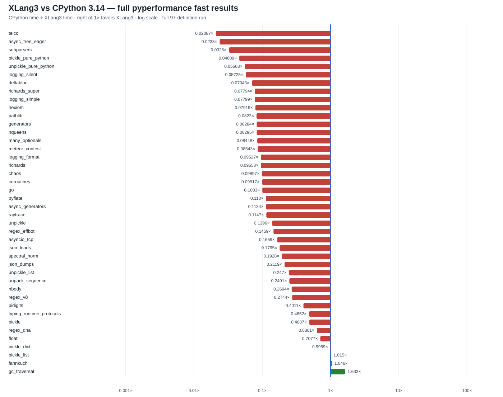

# XLang3 native pickle date-global fix: full pyperformance run

This run attempted all **97** pyperformance 1.14.0 definitions in `--fast`
mode with a 120-second per-definition cap. It used Release executable SHA-256
`0C3C75C0CBD7229900D89A7F9F50365B4E35472BC251B750AF297B6CF126B11C` and
runtime DLL SHA-256
`801FE02438C1ED166ABB212C70527A5D055EB01D79CE2820A867DF2AC1226D49`.

Of the **42** XLang3 subtests with a matching CPython 3.14.7 result, XLang3 was
faster on **3** and slower on **39**. The geometric mean of CPython time
divided by XLang3 time was **0.15129×**, meaning XLang3 took about **6.61× as
long** over this matched set. The overall speed goal remains unmet. Fast-mode
samples warn about instability and should be treated as directional evidence.

The three wins were `gc_traversal` (**1.63×**), `fannkuch` (**1.05×**), and
`pickle_list` (**1.01×**). The largest measured gaps were `telco` (**47.9×
slower**), `async_tree_eager` (**42.0×**), `subparsers` (**30.8×**),
`pickle_pure_python` (**21.7×**), and `unpickle_pure_python` (**18.0×**).

## How this compares with the August microbenchmarks

The early August benchmark milestone is not directly comparable to this
pyperformance run. Commit `d1b11df` introduced six hand-picked interpreter
kernels such as local-slot loops, scalar arithmetic, function calls, and list
append. Its harness launches a fresh process for every sample and reports the
best sample, so startup time contributes to the ratio and short runs are
especially sensitive to startup and scheduling noise. The README explicitly
describes those tests as an early visibility milestone, not a goal to beat
CPython everywhere. See the [August benchmark scope](https://github.com/CantorAI/xlang3/blob/d1b11df6e25f822f7c73722bf957e3c89c7b2d70/benchmarks/README.md)
and [harness timing method](https://github.com/CantorAI/xlang3/blob/d1b11df6e25f822f7c73722bf957e3c89c7b2d70/benchmarks/run.py).
Those targeted wins remain valid for their kernels, but they do not predict
the 97-definition pyperformance result, where only 3 of 42 matched subtests
currently beat CPython 3.14.7.

The `_pickle.loads` change is confirmed by the full run: `unpickle` measured
**75.8 µs** versus **10.6 µs** on CPython 3.14.7 (**7.16× slower**). The earlier
XLang3 full run on the same host measured **775 µs**, so this is a **10.2×
XLang3 speedup**. The pure-Python `unpickle_pure_python` case remains Python
code and measured **3.69 ms**; this change does not replace `pickle.py`.

## All cases and raw results

- [All 97 definition statuses and failure details](data/pyperformance-xlang3-pickle-fast-full-fast-20261002-all-97-status.csv)
- [All subtest timings and matched ratios](data/pyperformance-xlang3-pickle-fast-full-fast-20261002-subtests.csv)
- [Raw XLang3 pyperf JSON](data/pyperformance-xlang3-pickle-fast-full-fast-20261002.json)
- [Full XLang3 log](data/pyperformance-xlang3-pickle-fast-full-fast-20261002.log)
- [CPython 3.14.7 reference JSON](data/pyperformance-cpython314-clean-release-full-fast-20261002.json)
- [CPython reference log](data/pyperformance-cpython314-clean-release-full-fast-20261002.log)
- [Native `_pickle.loads` focused result and path trace](pickle-unpickle-datetime-global-fastpath-20261002.md)

The run recorded **38 completed** definitions, **2 partial** definitions that
timed out after yielding a measurement, **19 timeouts**, and **38 worker/runtime
failures**. Partial results remain labeled partial; failed cases are not given
synthetic timings. All 97 definitions were attempted. The full `async_tree`
group repeatedly timed out; only `async_tree_eager` yielded a partial mean.

There is a standard-library mismatch: XLang3 loads the accessible Python 3.13
standard library because its configured Python 3.14 library path returns
Access Denied. The saved comparison run uses CPython 3.14.7. The benchmark
definitions and pyperformance version match, but this does not isolate
interpreter speed from standard-library differences. Both raw results and the
full status table retain that limitation.

The fixed Release baseline gate could not be completed because its preserved
control binary also fails at startup against the accessible Python 3.13
standard library (`bytearray.copy` is missing). The focused pickle fixture and
Python 3.13 cross-runtime protocol-4 interoperability test pass; the full
fixture runner has an unrelated `runtime_protocol_fastcheck` output mismatch.
Further work must reduce the remaining VM/runtime and Decimal gaps, resolve
compatibility failures, and run the baseline gate in a matching Python 3.14
environment before the full objective can be considered complete.
