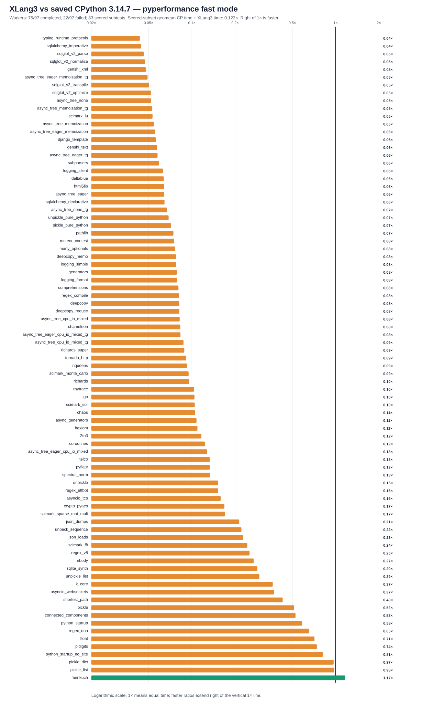

# XLang3 versus CPython 3.14.7 — full 97-case checkpoint

**All 97 definitions were attempted once: 75 completed and 22 failed (11 timeouts, 11 worker deaths).** The capture is valid; the benchmark suite did not pass. Two previously failed SQLAlchemy definitions now complete.

Of 84 recorded subtests, 83 have speed scores; GC traversal remains unscored. XLang3 has 1 nominal timing win(s). The successful scored subset has a geometric mean speed of **0.12306× CPython**, equivalent to **8.126× elapsed time**. This is not a whole-97 score or evidence that XLang3 is broadly faster.

**Read the ratios:** CPython = 1×. Speed is CP time ÷ XLang3 time; higher is faster. Elapsed time is XLang3 time ÷ CP time; lower is faster. For example, 0.05× speed means 20× elapsed time.

## Comparison scope

The XLang3 capture is from October 9, 2026. CPython is the saved October 7 run using `C:/Python/Python314/python.exe`, version **3.14.7**, with 97 completed definitions and 124 subtests. These runs are unpaired. Both use pyperformance 1.14.0 fast mode; stability warnings and outliers are retained. Nominal ratios do not establish statistical significance.

Historical benchmark Python sources, the compatibility hook, runner and dependency metadata match the recorded reference. Current benchmark/dependency source, data and native bytes are pinned before and after the run. Historical metadata does not retrospectively prove equality of every historical transitive/data byte.

The measured source base is `5997b264f8b71c38b57c98763788702f38146217`. The fixed run path is `D:/CantorAI/xlang3/build-repro/main-verify-20261006/Release/xlang3.exe`. Source identity covers 132 recorded inputs, Release178 and the fixed baseline177, with additional inventories in the receipt; this is not a clean-checkout build claim.

Executable SHA-256: `8a1c1936d7d765a6e14bc53106219ed24394893dcd04524c3e24224129f59545`. Runtime DLL SHA-256: `aacc20cd899e519dc19c67160a0edc2e873146671ce42286589fd9236f7d9a77`.

The entire original selection was run once. Caps were 300 seconds per definition and 600 seconds for `networkx*`, including calibration and setup. The one-second process watcher observed no compiler/CTest overlap or scanner failure; processes entirely between observations may be missed. All terminal source, binary, baseline and dependency checks passed.

## Change from the previous XLang3 capture

Coverage improved from 73 to 75 completed definitions. Resolved cases: `sqlalchemy_declarative`, `sqlalchemy_imperative`. On the 81 common scored subtests, the geometric mean previous-XLang3/current-XLang3 ratio is **1.00849×**. This directional comparison spans multiple retained changes and is not a causal constructor result; do not compare aggregates formed from different subsets.

The retained dictionary and UTF-8 improvements are runtime changes. The latest class-construction improvement reuses active VM frames for eligible Python `__new__`/`__init__` calls; its balanced component diagnostic showed 1.31×–1.39× over the previous XLang3 control. Lexer, property and closure changes primarily restored correctness. None of these component gains should be presented as CPython speedups.

[Constructor checkpoint and fixed regression gate](python-new-vm-continuation-r4-checkpoint-20261009.md).

## Every recorded subtest

[Machine-readable means and both ratios](data/pyperformance-xlang3-python-new-r4-vs-cpython3147-full-fast-20261009-subtests.csv). Failed-definition partial samples are listed separately and never scored.

| Subtest | CPython 3.14.7 | XLang3 | X speed (CP = 1×) | X elapsed (CP = 1×) |
|---|---:|---:|---:|---:|
| `2to3` | 315 ms | 2702 ms | 0.1166× | 8.576× |
| `many_optionals` | 638.1 µs | 8.328 ms | 0.07662× | 13.05× |
| `subparsers` | 7.881 ms | 133.3 ms | 0.05911× | 16.92× |
| `async_generators` | 286.2 ms | 2656 ms | 0.1078× | 9.28× |
| `async_tree_none` | 229.3 ms | 4416 ms | 0.05193× | 19.26× |
| `async_tree_cpu_io_mixed` | 428 ms | 5201 ms | 0.08228× | 12.15× |
| `async_tree_cpu_io_mixed_tg` | 425 ms | 4856 ms | 0.08753× | 11.42× |
| `async_tree_eager` | 85.71 ms | 1334 ms | 0.06424× | 15.57× |
| `async_tree_eager_cpu_io_mixed` | 338.2 ms | 2648 ms | 0.1277× | 7.828× |
| `async_tree_eager_cpu_io_mixed_tg` | 385.4 ms | 4623 ms | 0.08336× | 12× |
| `async_tree_eager_memoization` | 187.5 ms | 3380 ms | 0.05549× | 18.02× |
| `async_tree_eager_memoization_tg` | 266 ms | 5405 ms | 0.04921× | 20.32× |
| `async_tree_eager_tg` | 193.1 ms | 3343 ms | 0.05776× | 17.31× |
| `async_tree_memoization` | 278.5 ms | 5116 ms | 0.05445× | 18.37× |
| `async_tree_memoization_tg` | 275.8 ms | 5195 ms | 0.05309× | 18.84× |
| `async_tree_none_tg` | 239.4 ms | 3563 ms | 0.06717× | 14.89× |
| `asyncio_tcp` | 585.3 ms | 3689 ms | 0.1587× | 6.303× |
| `asyncio_websockets` | 176.4 ms | 473.4 ms | 0.3725× | 2.684× |
| `chameleon` | 11.6 ms | 139.4 ms | 0.08319× | 12.02× |
| `chaos` | 48.17 ms | 458 ms | 0.1052× | 9.506× |
| `comprehensions` | 13.96 µs | 173 µs | 0.0807× | 12.39× |
| `coroutines` | 17.41 ms | 141.4 ms | 0.1231× | 8.12× |
| `crypto_pyaes` | 57.55 ms | 341.5 ms | 0.1685× | 5.934× |
| `deepcopy` | 210.8 µs | 2.577 ms | 0.08182× | 12.22× |
| `deepcopy_reduce` | 2.213 µs | 27.02 µs | 0.08189× | 12.21× |
| `deepcopy_memo` | 21.83 µs | 281 µs | 0.07769× | 12.87× |
| `deltablue` | 2.516 ms | 39.43 ms | 0.0638× | 15.67× |
| `django_template` | 28.87 ms | 514.3 ms | 0.05613× | 17.81× |
| `fannkuch` | 317.2 ms | 272.1 ms | 1.166× | 0.8579× |
| `float` | 55.2 ms | 77.45 ms | 0.7127× | 1.403× |
| `gc_traversal` | 2.14 ms | 679 µs | unscored | unscored |
| `generators` | 26.63 ms | 338.3 ms | 0.07871× | 12.71× |
| `genshi_text` | 19.37 ms | 337.4 ms | 0.0574× | 17.42× |
| `genshi_xml` | 42.5 ms | 889.4 ms | 0.04779× | 20.93× |
| `go` | 95.73 ms | 917.6 ms | 0.1043× | 9.585× |
| `hexiom` | 5.091 ms | 46.52 ms | 0.1094× | 9.137× |
| `html5lib` | 42.62 ms | 663.6 ms | 0.06422× | 15.57× |
| `json_dumps` | 7.636 ms | 35.71 ms | 0.2138× | 4.677× |
| `json_loads` | 18.1 µs | 79.58 µs | 0.2275× | 4.396× |
| `logging_format` | 7.551 µs | 95.7 µs | 0.07891× | 12.67× |
| `logging_silent` | 69.12 ns | 1.098 µs | 0.06294× | 15.89× |
| `logging_simple` | 6.937 µs | 88.97 µs | 0.07797× | 12.83× |
| `meteor_contest` | 89.46 ms | 1187 ms | 0.07538× | 13.27× |
| `nbody` | 82.85 ms | 307.7 ms | 0.2693× | 3.713× |
| `shortest_path` | 425.8 ms | 993.8 ms | 0.4284× | 2.334× |
| `connected_components` | 380.9 ms | 723.8 ms | 0.5263× | 1.9× |
| `k_core` | 2085 ms | 5707 ms | 0.3653× | 2.738× |
| `nqueens` | 76.88 ms | 829.7 ms | 0.09267× | 10.79× |
| `pathlib` | 42.31 ms | 567.9 ms | 0.07451× | 13.42× |
| `pickle` | 9.425 µs | 18.3 µs | 0.5151× | 1.941× |
| `pickle_dict` | 23.59 µs | 24.35 µs | 0.9689× | 1.032× |
| `pickle_list` | 4.024 µs | 4.12 µs | 0.9767× | 1.024× |
| `pickle_pure_python` | 257.5 µs | 3.594 ms | 0.07165× | 13.96× |
| `pidigits` | 163 ms | 220.2 ms | 0.7402× | 1.351× |
| `pyflate` | 344.9 ms | 2586 ms | 0.1334× | 7.496× |
| `python_startup` | 18.6 ms | 31.91 ms | 0.5828× | 1.716× |
| `python_startup_no_site` | 15.75 ms | 19.34 ms | 0.8145× | 1.228× |
| `raytrace` | 227.3 ms | 2199 ms | 0.1034× | 9.673× |
| `regex_compile` | 98.07 ms | 1203 ms | 0.08155× | 12.26× |
| `regex_dna` | 137.4 ms | 210.4 ms | 0.6531× | 1.531× |
| `regex_effbot` | 1.86 ms | 12.21 ms | 0.1524× | 6.561× |
| `regex_v8` | 15.72 ms | 62.35 ms | 0.2521× | 3.967× |
| `richards` | 34.14 ms | 355.6 ms | 0.09601× | 10.42× |
| `richards_super` | 38.41 ms | 433.1 ms | 0.08869× | 11.27× |
| `scimark_fft` | 227.4 ms | 935.1 ms | 0.2432× | 4.113× |
| `scimark_lu` | 75.29 ms | 1413 ms | 0.0533× | 18.76× |
| `scimark_monte_carlo` | 52.83 ms | 556.6 ms | 0.09493× | 10.53× |
| `scimark_sor` | 97.53 ms | 931.3 ms | 0.1047× | 9.549× |
| `scimark_sparse_mat_mult` | 3.144 ms | 18.52 ms | 0.1698× | 5.89× |
| `spectral_norm` | 75.79 ms | 565.6 ms | 0.134× | 7.463× |
| `sqlalchemy_declarative` | 89.23 ms | 1382 ms | 0.06456× | 15.49× |
| `sqlalchemy_imperative` | 11.24 ms | 252.7 ms | 0.04446× | 22.49× |
| `sqlglot_v2_normalize` | 90.41 ms | 1915 ms | 0.0472× | 21.19× |
| `sqlglot_v2_optimize` | 42.47 ms | 819 ms | 0.05186× | 19.28× |
| `sqlglot_v2_parse` | 988.3 µs | 21.34 ms | 0.04632× | 21.59× |
| `sqlglot_v2_transpile` | 1.226 ms | 24.41 ms | 0.0502× | 19.92× |
| `sqlite_synth` | 1.833 µs | 6.414 µs | 0.2858× | 3.499× |
| `telco` | 5.71 ms | 42.84 ms | 0.1333× | 7.503× |
| `tornado_http` | 140.1 ms | 1532 ms | 0.09144× | 10.94× |
| `typing_runtime_protocols` | 128.1 µs | 2.948 ms | 0.04346× | 23.01× |
| `unpack_sequence` | 36.58 ns | 165.3 ns | 0.2214× | 4.518× |
| `unpickle` | 9.832 µs | 64.59 µs | 0.1522× | 6.569× |
| `unpickle_list` | 3.215 µs | 10.9 µs | 0.295× | 3.39× |
| `unpickle_pure_python` | 168.3 µs | 2.441 ms | 0.06892× | 14.51× |

## All 97 definition outcomes

[All-97 status CSV](data/pyperformance-xlang3-python-new-r4-vs-cpython3147-full-fast-20261009-all-97-status.csv). CPython completed every listed definition. A failed definition has no speed score, even if earlier subtests produced values.

| Definition | XLang3 outcome | Failure detail |
|---|---|---|
| `2to3` | completed |  |
| `argparse` | completed |  |
| `argparse_subparsers` | completed |  |
| `async_generators` | completed |  |
| `async_tree` | completed |  |
| `async_tree_cpu_io_mixed` | completed |  |
| `async_tree_cpu_io_mixed_tg` | completed |  |
| `async_tree_eager` | completed |  |
| `async_tree_eager_cpu_io_mixed` | completed |  |
| `async_tree_eager_cpu_io_mixed_tg` | completed |  |
| `async_tree_eager_io` | failed: Benchmark timed out | Benchmark timed out |
| `async_tree_eager_io_tg` | failed: Benchmark timed out | Benchmark timed out |
| `async_tree_eager_memoization` | completed |  |
| `async_tree_eager_memoization_tg` | completed |  |
| `async_tree_eager_tg` | completed |  |
| `async_tree_io` | failed: Benchmark timed out | Benchmark timed out |
| `async_tree_io_tg` | failed: Benchmark timed out | Benchmark timed out |
| `async_tree_memoization` | completed |  |
| `async_tree_memoization_tg` | completed |  |
| `async_tree_tg` | completed |  |
| `asyncio_tcp` | completed |  |
| `asyncio_tcp_ssl` | failed: Benchmark timed out | Benchmark timed out |
| `asyncio_websockets` | completed |  |
| `base64` | failed: Benchmark timed out | Benchmark timed out |
| `bpe_tokeniser` | failed: Benchmark timed out | Benchmark timed out |
| `chameleon` | completed |  |
| `chaos` | completed |  |
| `comprehensions` | completed |  |
| `concurrent_imap` | failed: Benchmark died | OSError: DuplicateHandle failed with Win32 error 6 |
| `coroutines` | completed |  |
| `coverage` | failed: Benchmark died | TypeError: print_exception(): Exception expected for value, object found |
| `crypto_pyaes` | completed |  |
| `dask` | failed: Benchmark died | AttributeError: module 'psutil._psutil_windows' has no attribute 'virtual_mem' |
| `deepcopy` | completed |  |
| `deltablue` | completed |  |
| `django_template` | completed |  |
| `docutils` | failed: Benchmark died | KeyError: "format mapping key 'parens' not found" |
| `dulwich_log` | failed: Benchmark died | TypeError: object is not subscriptable |
| `fannkuch` | completed |  |
| `fastapi` | failed: Benchmark timed out | Benchmark timed out |
| `float` | completed |  |
| `gc_collect` | failed: Benchmark died | Benchmark died |
| `gc_traversal` | completed |  |
| `generators` | completed |  |
| `genshi` | completed |  |
| `go` | completed |  |
| `hexiom` | completed |  |
| `html5lib` | completed |  |
| `json_dumps` | completed |  |
| `json_loads` | completed |  |
| `logging` | completed |  |
| `mako` | failed: Benchmark died | KeyError: '2' |
| `mdp` | failed: Benchmark died | Benchmark died |
| `meteor_contest` | completed |  |
| `nbody` | completed |  |
| `networkx` | completed |  |
| `networkx_connected_components` | completed |  |
| `networkx_k_core` | completed |  |
| `nqueens` | completed |  |
| `pathlib` | completed |  |
| `pickle` | completed |  |
| `pickle_dict` | completed |  |
| `pickle_list` | completed |  |
| `pickle_pure_python` | completed |  |
| `pidigits` | completed |  |
| `pprint` | failed: Benchmark timed out | Benchmark timed out |
| `pyflate` | completed |  |
| `python_startup` | completed |  |
| `python_startup_no_site` | completed |  |
| `raytrace` | completed |  |
| `regex_compile` | completed |  |
| `regex_dna` | completed |  |
| `regex_effbot` | completed |  |
| `regex_v8` | completed |  |
| `richards` | completed |  |
| `richards_super` | completed |  |
| `scimark` | completed |  |
| `spectral_norm` | completed |  |
| `sphinx` | failed: Benchmark died | KeyError: "format mapping key 'parens' not found" |
| `sqlalchemy_declarative` | completed |  |
| `sqlalchemy_imperative` | completed |  |
| `sqlglot_v2` | completed |  |
| `sqlglot_v2_optimize` | completed |  |
| `sqlglot_v2_parse` | completed |  |
| `sqlglot_v2_transpile` | completed |  |
| `sqlite_synth` | completed |  |
| `sympy` | failed: Benchmark died | RecursionError: maximum recursion depth exceeded |
| `telco` | completed |  |
| `tomli_loads` | failed: Benchmark timed out | Benchmark timed out |
| `tornado_http` | completed |  |
| `typing_runtime_protocols` | completed |  |
| `unpack_sequence` | completed |  |
| `unpickle` | completed |  |
| `unpickle_list` | completed |  |
| `unpickle_pure_python` | completed |  |
| `xdsl` | failed: Benchmark died | AttributeError: GenericAlias object has no attribute 'get' |
| `xml_etree` | failed: Benchmark timed out | Benchmark timed out |

## What the remaining gaps mean

The full results still show substantial runtime gaps. Indexed locals and X::Value do not remove Python frame entry, dynamic attribute/descriptor dispatch, native boundary work, allocation, or library setup. The full matrix establishes the gaps; it does not establish their individual CPU shares.

Coverage loses its trace setting after a nested native-to-Python callback; an independent CPython-first fixture already reproduces that runtime-state mismatch. Its exception-formatting failure is separate. Dask reports a missing `psutil._psutil_windows.virtual_mem` export. Remaining worker tracebacks and timeouts are retained below; a timeout alone does not separate setup from benchmark-body cost.

NetworkX loads its graph at module import, outside the algorithm timers. A later unchanged-load diagnostic can separate setup and body costs. The prepared object.__new__ lookup differential keeps the same Python frame entry and instance allocation; it has not been executed and does not justify a cache or projected gain.

CPython pure-Python library bodies remain Python. Generic compiler/IR/VM/runtime improvements and own implementations of CPython-native modules are the allowed routes. CPython native DLL reuse is not an optimization route.

GC traversal is withheld because equivalent work remains uncertified; its count assertion alone does not prove traversal coverage. This is conservative withholding, not a new claim that current GC code matches the historical audit.

[Current exclusion evidence](data/pyperformance-xlang3-python-new-r4-vs-cpython3147-full-fast-20261009-correctness-exclusions.json). [Failed-definition partial sample list](data/pyperformance-xlang3-python-new-r4-vs-cpython3147-full-fast-20261009-failed-definition-partial-values.json).

## Exact raw evidence

- [XLang3 pyperf JSON](data/pyperformance-xlang3-python-new-r4-full-fast-r3-20261009.json).
- [Merged raw log](data/pyperformance-xlang3-python-new-r4-full-fast-r3-20261009.log).
- [Terminal provenance and input inventories](data/pyperformance-xlang3-python-new-r4-full-fast-r3-20261009-provenance.json).
- [One-second process observations](data/pyperformance-xlang3-python-new-r4-full-fast-r3-20261009-all-97.external-process-observations.jsonl).
- [Saved CPython 3.14.7 JSON](data/pyperformance-cpython3147-live-eval-full-fast-20261007.json).
- [Saved CPython status log](data/pyperformance-cpython3147-live-eval-full-fast-20261007.log).
- [Saved CPython provenance](data/pyperformance-cpython3147-live-eval-full-fast-20261007-provenance.json).
