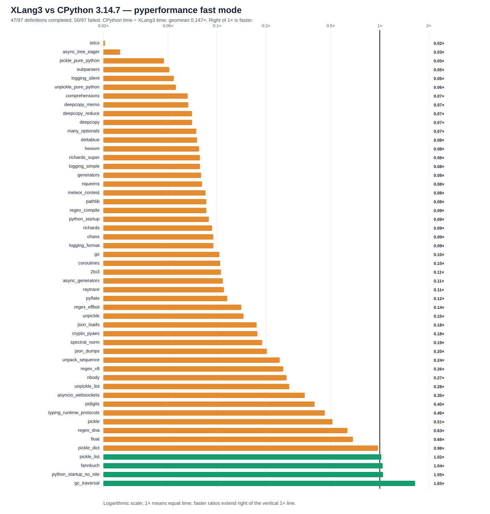

# XLang3 vs CPython 3.14.7: corrected full pyperformance run

The corrected XLang3 run attempted all **97** pyperformance 1.14.0 definitions in `--fast` mode. It completed **47** definitions and recorded **50** failures/timeouts. The command returned exit code 1 because pyperformance treats those benchmark failures as an unsuccessful suite; every definition was attempted.

Of **51** matched subtests, XLang3 was faster on **4**. The geometric mean of CPython time divided by XLang3 time was **0.14658×**; values over 1× favor XLang3. Fast-mode samples carry stability warnings and are directional evidence.

## Run configuration

- XLang3 Release executable SHA-256: `DC0976BB54FBB2AC448E2431FC508DDCB17A9EDD994AF2D01FA075B1A7950F41`.
- XLang3 runtime DLL SHA-256: `B67DFCA7F6D8098598BD43506A7E8CD2AAB7E580E01A5C6F05F7863E45FCBBC4`.
- CPython reference: pyperformance 1.14.0 on CPython 3.14.7; XLang3 loaded `C:\Python\Python314\Lib`.
- The XLang3 `PYTHONPATH` contains the Windows pyperf compatibility shim and the shared benchmark dependency site-packages. No Python 3.13 standard-library overlay was used.
- Each XLang3 benchmark definition had a 120-second cap covering pyperf worker calibration and measurement. Overrides: async_tree*=30s, async_tree_eager=300s.

## Largest slowdowns and wins

| Subtest | CPython 3.14.7 | XLang3 | CPython / XLang3 |
|---|---:|---:|---:|
| `telco` | 5.755 ms | 281.1 ms | 0.020× |
| `async_tree_eager` | 86.62 ms | 3416 ms | 0.025× |
| `pickle_pure_python` | 273.5 µs | 5.798 ms | 0.047× |
| `subparsers` | 8.151 ms | 160.1 ms | 0.051× |
| `logging_silent` | 70.03 ns | 1.292 µs | 0.054× |

Measured wins:

- `gc_traversal`: **1.649×** (1.414 ms vs 2.332 ms).
- `python_startup_no_site`: **1.047×** (19.75 ms vs 20.68 ms).
- `fannkuch`: **1.042×** (311 ms vs 324 ms).
- `pickle_list`: **1.022×** (4.524 µs vs 4.625 µs).

## Failure breakdown

- 29 definitions: Benchmark died.
- 21 definitions: Benchmark timed out.

The [all-97 status CSV](data/pyperformance-xlang3-python314-stdlib-full-fast-distutils-shim-20261003-all-97-status.csv) retains every benchmark definition and failure status. The [matched subtest CSV](data/pyperformance-xlang3-python314-stdlib-full-fast-distutils-shim-20261003-subtests.csv) contains raw per-subtest means and speed ratios.

## Raw evidence

- XLang3 pyperf JSON: [`pyperformance-xlang3-python314-stdlib-full-fast-distutils-shim-20261003.json`](data/pyperformance-xlang3-python314-stdlib-full-fast-distutils-shim-20261003.json).
- Runner status log: [`pyperformance-xlang3-python314-stdlib-full-fast-distutils-shim-20261003.log`](data/pyperformance-xlang3-python314-stdlib-full-fast-distutils-shim-20261003.log).
- CPython 3.14.7 pyperf JSON: [`pyperformance-cpython314-clean-release-full-fast-20261002.json`](data/pyperformance-cpython314-clean-release-full-fast-20261002.json).
- Earlier runs that used a Python 3.13 standard library are retained separately; this run supersedes them as the same-version Python 3.14 comparison.

Benchmark worker failures have several causes, including unavailable optional benchmark dependencies, XLang3 native-module gaps, and interpreter compatibility bugs. The status CSV gives case-level failure details, and the runner log preserves worker tracebacks when available. A worker death is not a performance score; inspect its case-specific cause before treating it as a speed result.
