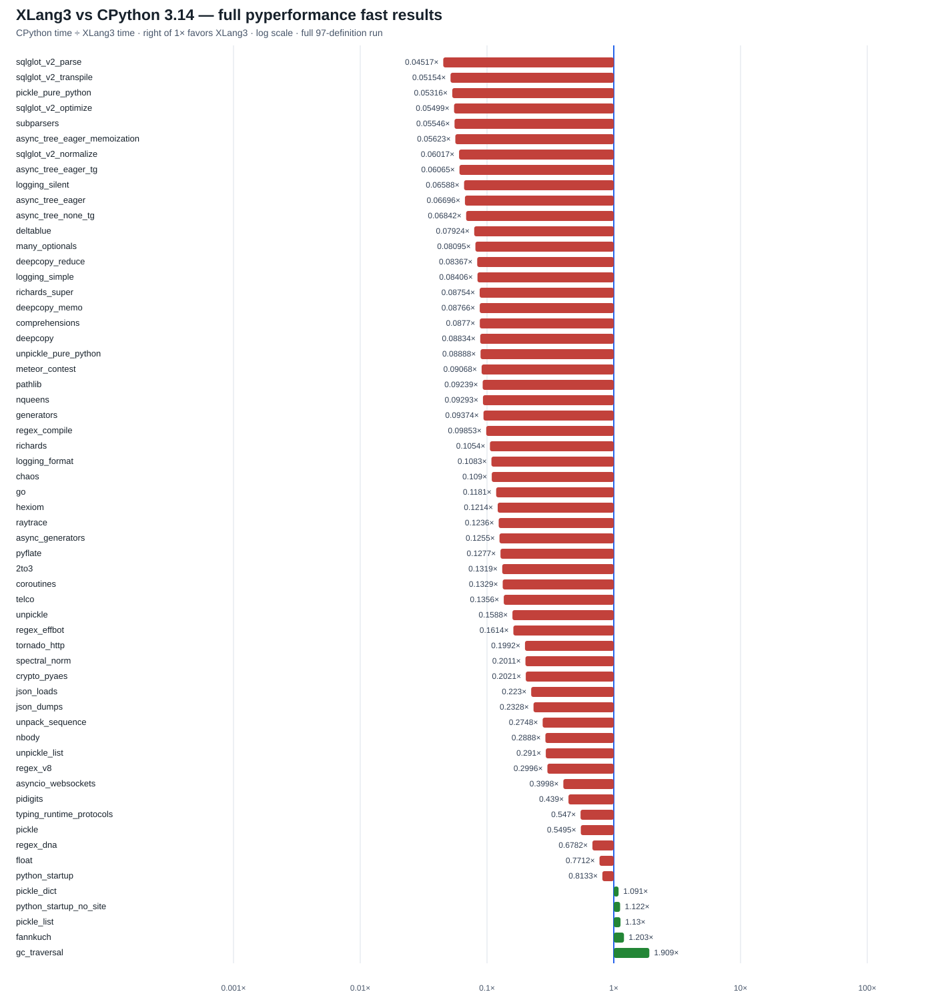

# XLang3 rebuilt Release vs CPython 3.14.7: full pyperformance run

This run remeasures the exact rebuilt executable after removing temporary
profiling counters. It attempted all **97** pyperformance 1.14.0 definitions
in fast mode. **55 completed** and **42 failed or timed out**. Among **59
matched subtests**, XLang3 was faster on **5**; the geometric mean of CPython
time divided by XLang3 time is **0.16131×**. XLang3 is therefore about **6.20×
slower** on this matched set. This confirms that the profiling instrumentation
and its cleanup did not account for the large gap.

## Largest slowdowns and wins

| Subtest | CPython 3.14.7 | XLang3 | CPython / XLang3 |
|---|---:|---:|---:|
| `sqlglot_v2_parse` | 1.010 ms | 22.36 ms | 0.0452× |
| `sqlglot_v2_transpile` | 1.302 ms | 25.26 ms | 0.0515× |
| `pickle_pure_python` | 273.5 µs | 5.146 ms | 0.0532× |
| `sqlglot_v2_optimize` | 41.61 ms | 756.8 ms | 0.0550× |
| `subparsers` | 8.151 ms | 146.98 ms | 0.0555× |

The five measured wins were `gc_traversal` (**1.909×**), `fannkuch`
(**1.203×**), `pickle_list` (**1.130×**), `python_startup_no_site`
(**1.122×**), and `pickle_dict` (**1.091×**).

## Complete run status

The run recorded **19 timeouts** and **23 worker deaths**. Timed-out cases:
`async_tree`, `async_tree_cpu_io_mixed`, `async_tree_cpu_io_mixed_tg`,
`async_tree_eager_cpu_io_mixed`, `async_tree_eager_cpu_io_mixed_tg`,
`async_tree_eager_io`, `async_tree_eager_io_tg`,
`async_tree_eager_memoization_tg`, `async_tree_io`, `async_tree_io_tg`,
`async_tree_memoization`, `async_tree_memoization_tg`, `asyncio_tcp`,
`asyncio_tcp_ssl`, `base64`, `bpe_tokeniser`, `fastapi`, `pprint`, and
`tomli_loads`.

The worker-death cases were `chameleon`, `concurrent_imap`, `coverage`,
`dask`, `django_template`, `docutils`, `dulwich_log`, `gc_collect`, `genshi`,
`html5lib`, `mako`, `mdp`, `networkx`, `networkx_connected_components`,
`networkx_k_core`, `scimark`, `sphinx`, `sqlalchemy_declarative`,
`sqlalchemy_imperative`, `sqlite_synth`, `sympy`, `xdsl`, and `xml_etree`.
The [all-97 CSV](data/pyperformance-xlang3-rebuilt-current-full-fast-20261006-all-97-status.csv)
lists CPython and XLang3 status, every measured subtest, and the recorded
failure detail for every definition. The
[subtest CSV](data/pyperformance-xlang3-rebuilt-current-full-fast-20261006-subtests.csv)
contains matched timings and ratios.

## Run configuration and validation

- XLang3 executable:
  `build-repro/main-verify-20261006/Release/xlang3.exe`
  (SHA-256 `FF66E309BED7F3226F52F59E06842F448992F31805D54685EA755365CCD2D389`).
- XLang3 runtime DLL SHA-256:
  `395BF96C94508A8E9E326D2C79C427489B729AC84CD244BACD4EDC037F331B1E`.
- CPython manager: **3.14.7** at `C:\Python\Python314`; pyperformance
  **1.14.0**. XLang3 used the same-version standard library and the project's
  existing CPython 3.14 benchmark dependency site.
- Each benchmark definition had a 120-second limit. The nonzero suite exit
  code is from the 42 recorded failures/timeouts; all 97 definitions were
  attempted.
- `tests/run_fixtures.py` passed against this executable, as did
  `xlang3_interpreter_tests.exe`.
- The 11-case paired Release gate against the untouched `build-repro/Release`
  baseline passed every case. The machine-readable result is
  [here](data/rebuilt-current-fixed-gate-20261006.json). The preserved baseline
  hashes remain `A5F5028C15E145EDCE645A5AFC25C11FBCE77F51E882312B1FBE06E63C72A4AF`
  (executable) and
  `BC1B9C0A8086F7E6FB0C037516DC9C1EEA20427FA887E3AA623714BC5EF5DA8D`
  (runtime DLL).

## Evidence

- [Raw XLang3 pyperf JSON](data/pyperformance-xlang3-rebuilt-current-full-fast-20261006.json)
- [Full runner log and worker tracebacks](data/pyperformance-xlang3-rebuilt-current-full-fast-20261006.log)
- [All 97 definition statuses](data/pyperformance-xlang3-rebuilt-current-full-fast-20261006-all-97-status.csv)
- [Matched and unmatched subtest data](data/pyperformance-xlang3-rebuilt-current-full-fast-20261006-subtests.csv)
- [Horizontal speed-ratio chart](pyperformance-xlang3-rebuilt-current-full-fast-20261006.svg)
- [CPython 3.14.7 reference JSON](data/pyperformance-cpython314-clean-release-full-fast-20261002.json)

The goal remains open. These measurements reconfirm that XLang3 executes the
same pure-Python benchmark and standard-library code but pays a much larger
runtime cost in SQLGlot, argument parsing, and pure-Python pickle. Small
call-boundary and value-ownership changes already tested did not close those
gaps; the next retained change must target a broader measured VM/runtime cost
and then pass this same 3.14.7 comparison.
