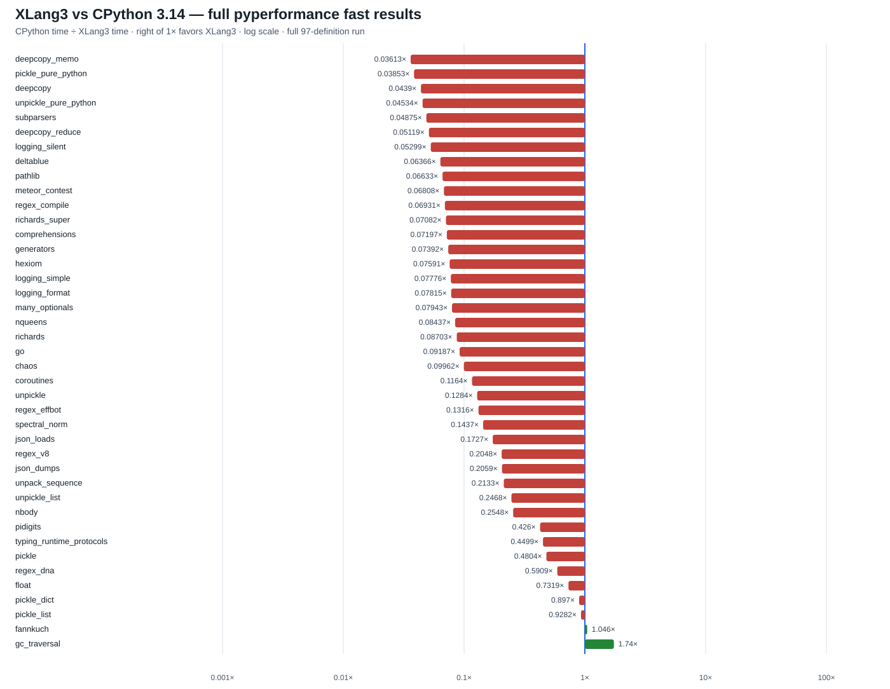

# XLang3 vs CPython 3.14: complete set/regex candidate run (2026-10-01)

All **97 benchmark definitions were attempted**: **37 completed**, **60 failed or timed out**. There are **41 matched subtest timings**, with **2 faster and 39 slower** than CPython 3.14.7. The geometric mean of CPython time divided by XLang3 time is **0.14048x** (**7.12x slower** across this measured subset). This is not an aggregate score for all 97 definitions.

A ratio above 1x favors XLang3; 1x is parity. Failed and timed-out cases have no speed ratio. Fast-mode results include instability warnings and are useful for screening; rigorous targeted results are recorded separately.

## Inputs and limits

- Suite: pyperformance 1.14.0 and pyperf 2.10.0, fast mode, all 97 definitions.
- CPython 3.14.7 reference: [raw JSON](data/pyperformance-cpython314-full-fast-gc-root-20260929.json).
- XLang3 candidate: [raw JSON](data/pyperformance-xlang3-set-regex-candidate-full-fast-20261001.json), [complete log](data/pyperformance-xlang3-set-regex-candidate-full-fast-20261001.log), [all-97 status CSV](data/pyperformance-xlang3-set-regex-candidate-full-fast-20261001-all-97-status.csv), and [all subtest timings CSV](data/pyperformance-xlang3-set-regex-candidate-full-fast-20261001-subtests.csv).
- Each XLang3 definition had a 60-second cap covering calibration and all workers. A timeout is not a steady-state timing or proof of a semantic hang. Runner exit 1 records failed definitions; the runner continued through case 97.
- The executable and runtime DLL stayed unchanged throughout this run. Source changes prepared for SSL and cache cleanup were not built into this candidate.
- Compatibility hooks disable Windows priority and host-metadata probes; the Python benchmark bodies remain unchanged.
- **26 definitions reported missing dependency imports.** The CPython reference used an existing benchmark venv whose optional Python package sources were absent from this XLang3 run's search path. See [dependency investigation](pyperformance-dependency-visibility-20261001.md). Those failures must be rerun with the same dependency sources before attributing them to runtime incompatibility.
- This run and previous full runs have different measured subsets and time caps. Changes in their geometric means do not establish a paired whole-suite performance gain.

| Binary | SHA-256 |
|---|---|
| `xlang3.exe` | `07A9B84493AF7A63A0167681044EAF9FCA29683D4FCADCFE1CD9EE6135FFA565` |
| `xlang3_runtime.dll` | `FC938DE91D857AF7EE3599F568A8D32BEEB0F48DCFE903EC2469B263E163CC75` |
| `xlang__ssl.x3pkg.dll` | `2128B4B294C5C3C20C62EBC42C4EE6BEA0951B45088BE2C38821B525FE4EEBAE` |

## Every matched timing

| Subtest | CPython 3.14 (ms) | XLang3 (ms) | CPython/XLang3 |
|---|---:|---:|---:|
| deepcopy_memo | 0.0214685 | 0.594267 | 0.036126x |
| pickle_pure_python | 0.252284 | 6.5477 | 0.03853x |
| deepcopy | 0.210039 | 4.78481 | 0.043897x |
| unpickle_pure_python | 0.161446 | 3.56041 | 0.045345x |
| subparsers | 7.60108 | 155.918 | 0.048751x |
| deepcopy_reduce | 0.00220295 | 0.0430379 | 0.051186x |
| logging_silent | 6.69281e-05 | 0.00126313 | 0.052986x |
| deltablue | 2.48469 | 39.0314 | 0.063659x |
| pathlib | 47.8175 | 720.909 | 0.066329x |
| meteor_contest | 87.4131 | 1283.9 | 0.068084x |
| regex_compile | 93.6407 | 1351 | 0.069312x |
| richards_super | 37.3086 | 526.822 | 0.070818x |
| comprehensions | 0.0136876 | 0.190186 | 0.07197x |
| generators | 27.0079 | 365.356 | 0.073922x |
| hexiom | 4.92847 | 64.9293 | 0.075905x |
| logging_simple | 0.00675492 | 0.0868684 | 0.07776x |
| logging_format | 0.00731575 | 0.0936119 | 0.07815x |
| many_optionals | 0.668398 | 8.41544 | 0.079425x |
| nqueens | 73.9361 | 876.297 | 0.084373x |
| richards | 33.3574 | 383.266 | 0.087035x |
| go | 94.2161 | 1025.52 | 0.091871x |
| chaos | 46.8551 | 470.343 | 0.099619x |
| coroutines | 17.4385 | 149.793 | 0.11642x |
| unpickle | 0.0097 | 0.0755531 | 0.12839x |
| regex_effbot | 1.7946 | 13.6333 | 0.13163x |
| spectral_norm | 72.1761 | 502.272 | 0.1437x |
| json_loads | 0.0175438 | 0.101611 | 0.17266x |
| regex_v8 | 16.4623 | 80.3952 | 0.20477x |
| json_dumps | 7.58351 | 36.837 | 0.20587x |
| unpack_sequence | 3.54493e-05 | 0.000166228 | 0.21326x |
| unpickle_list | 0.00315896 | 0.0128003 | 0.24679x |
| nbody | 81.038 | 318.003 | 0.25483x |
| pidigits | 164.38 | 385.849 | 0.42602x |
| typing_runtime_protocols | 0.124367 | 0.276446 | 0.44988x |
| pickle | 0.00907842 | 0.0188988 | 0.48037x |
| regex_dna | 132.329 | 223.951 | 0.59088x |
| float | 56.1802 | 76.7612 | 0.73188x |
| pickle_dict | 0.0232063 | 0.0258704 | 0.89702x |
| pickle_list | 0.00395186 | 0.00425764 | 0.92818x |
| fannkuch | 312.286 | 298.577 | 1.0459x |
| gc_traversal | 2.19122 | 1.25936 | 1.74x |

## All 97 definitions

The CPython column retains every reference subtest and its mean. The linked subtest CSV retains all raw numeric timings and evidence sources. Failure causes below summarize the benchmark traceback; consult the complete log for details.

| Definition | CPython subtests (ms) | XLang3 status | Failure cause |
|---|---|---|---|
| 2to3 | 2to3=251.674ms | failed: Benchmark died | Exception: Command failed with exit code 1 |
| argparse | many_optionals=0.668398ms | completed |  |
| argparse_subparsers | subparsers=7.60108ms | completed |  |
| async_generators | async_generators=277.756ms | failed: timed out | timed out |
| async_tree | async_tree_none=226.436ms; async_tree_none_tg=242.232ms | failed: timed out | timed out |
| async_tree_cpu_io_mixed | async_tree_cpu_io_mixed=430.097ms | failed: timed out | timed out |
| async_tree_cpu_io_mixed_tg | async_tree_cpu_io_mixed_tg=424ms | failed: timed out | timed out |
| async_tree_eager | async_tree_eager=84.8434ms | failed: timed out | timed out |
| async_tree_eager_cpu_io_mixed | async_tree_eager_cpu_io_mixed=333.81ms | failed: timed out | timed out |
| async_tree_eager_cpu_io_mixed_tg | async_tree_eager_cpu_io_mixed_tg=393.708ms | failed: timed out | timed out |
| async_tree_eager_io | async_tree_eager_io=564.455ms | failed: timed out | timed out |
| async_tree_eager_io_tg | async_tree_eager_io_tg=561.145ms | failed: timed out | timed out |
| async_tree_eager_memoization | async_tree_eager_memoization=191.569ms | failed: timed out | timed out |
| async_tree_eager_memoization_tg | async_tree_eager_memoization_tg=270.171ms | failed: timed out | timed out |
| async_tree_eager_tg | async_tree_eager_tg=196.478ms | failed: timed out | timed out |
| async_tree_io | async_tree_io=573.188ms | failed: timed out | timed out |
| async_tree_io_tg | async_tree_io_tg=558.669ms | failed: timed out | timed out |
| async_tree_memoization | async_tree_memoization=281.985ms | failed: timed out | timed out |
| async_tree_memoization_tg | async_tree_memoization_tg=282.14ms | failed: timed out | timed out |
| async_tree_tg | no CPython timing | failed: timed out | timed out |
| asyncio_tcp | asyncio_tcp=739.771ms | failed: timed out | timed out |
| asyncio_tcp_ssl | asyncio_tcp_ssl=4466.71ms | failed: Benchmark died | _ssl.SSLZeroReturnError: (6, 'TLS read: TLS/SSL connection has been closed') |
| asyncio_websockets | asyncio_websockets=192.169ms | failed: Benchmark died | ModuleNotFoundError: No module named 'websockets' |
| base64 | base64_large=7.90688ms; base64_small=0.267936ms | failed: timed out | timed out |
| bpe_tokeniser | bpe_tokeniser=3533.09ms | failed: timed out | timed out |
| chameleon | chameleon=11.5539ms | failed: Benchmark died | ModuleNotFoundError: No module named 'chameleon' |
| chaos | chaos=46.8551ms | completed |  |
| comprehensions | comprehensions=0.0136876ms | completed |  |
| concurrent_imap | no CPython timing | failed: Benchmark died | OSError: DuplicateHandle failed with Win32 error 6 |
| coroutines | coroutines=17.4385ms | completed |  |
| coverage | coverage=63.455ms | failed: Benchmark died | ModuleNotFoundError: No module named 'coverage' |
| crypto_pyaes | crypto_pyaes=55.2763ms | failed: Benchmark died | ModuleNotFoundError: No module named 'pyaes' |
| dask | dask=769.434ms | failed: Benchmark died | ModuleNotFoundError: No module named 'dask' |
| deepcopy | deepcopy=0.210039ms; deepcopy_memo=0.0214685ms; deepcopy_reduce=0.00220295ms | completed |  |
| deltablue | deltablue=2.48469ms | completed |  |
| django_template | django_template=28.9841ms | failed: Benchmark died | ModuleNotFoundError: No module named 'django' |
| docutils | docutils=1811.73ms | failed: Benchmark died | ModuleNotFoundError: No module named 'docutils' |
| dulwich_log | dulwich_log=66.5561ms | failed: Benchmark died | ModuleNotFoundError: No module named 'dulwich' |
| fannkuch | fannkuch=312.286ms | completed |  |
| fastapi | fastapi_http=415.245ms | failed: Benchmark died | ModuleNotFoundError: No module named 'httpx' |
| float | float=56.1802ms | completed |  |
| gc_collect | no CPython timing | failed: Benchmark died | RuntimeError: D:\CantorAI\xlang3\build\Release\xlang3.exe failed with exit code 1 |
| gc_traversal | gc_traversal=2.19122ms | completed |  |
| generators | generators=27.0079ms | completed |  |
| genshi | genshi_text=18.9624ms; genshi_xml=41.6582ms | failed: Benchmark died | ModuleNotFoundError: No module named 'genshi' |
| go | go=94.2161ms | completed |  |
| hexiom | hexiom=4.92847ms | completed |  |
| html5lib | html5lib=42.3449ms | failed: Benchmark died | ModuleNotFoundError: No module named 'html5lib' |
| json_dumps | json_dumps=7.58351ms | completed |  |
| json_loads | json_loads=0.0175438ms | completed |  |
| logging | logging_format=0.00731575ms; logging_silent=6.69281e-05ms; logging_simple=0.00675492ms | completed |  |
| mako | mako=7.49018ms | failed: Benchmark died | ModuleNotFoundError: No module named 'mako' |
| mdp | mdp=975.11ms | failed: Benchmark died | RuntimeError: D:\CantorAI\xlang3\build\Release\xlang3.exe failed with exit code 1 |
| meteor_contest | meteor_contest=87.4131ms | completed |  |
| nbody | nbody=81.038ms | completed |  |
| networkx | no CPython timing | failed: Benchmark died | ModuleNotFoundError: No module named 'networkx' |
| networkx_connected_components | no CPython timing | failed: Benchmark died | ModuleNotFoundError: No module named 'networkx' |
| networkx_k_core | no CPython timing | failed: Benchmark died | ModuleNotFoundError: No module named 'networkx' |
| nqueens | nqueens=73.9361ms | completed |  |
| pathlib | pathlib=47.8175ms | completed |  |
| pickle | pickle=0.00907842ms | completed |  |
| pickle_dict | pickle_dict=0.0232063ms | completed |  |
| pickle_list | pickle_list=0.00395186ms | completed |  |
| pickle_pure_python | pickle_pure_python=0.252284ms | completed |  |
| pidigits | pidigits=164.38ms | completed |  |
| pprint | pprint_pformat=1180.02ms; pprint_safe_repr=575.927ms | failed: timed out | timed out |
| pyflate | pyflate=328.524ms | failed: timed out | timed out |
| python_startup | python_startup=31.2637ms | failed: Benchmark died | Exception: Command failed with exit code 1 |
| python_startup_no_site | python_startup_no_site=24.6155ms | failed: Benchmark died | Exception: Command failed with exit code 1 |
| raytrace | raytrace=217.002ms | failed: timed out | timed out |
| regex_compile | regex_compile=93.6407ms | completed |  |
| regex_dna | regex_dna=132.329ms | completed |  |
| regex_effbot | regex_effbot=1.7946ms | completed |  |
| regex_v8 | regex_v8=16.4623ms | completed |  |
| richards | richards=33.3574ms | completed |  |
| richards_super | richards_super=37.3086ms | completed |  |
| scimark | scimark_fft=219.317ms; scimark_lu=72.8907ms; scimark_monte_carlo=50.9483ms; scimark_sor=94.2419ms; scimark_sparse_mat_mult=3.01707ms | failed: Benchmark died | TypeError: object cannot be interpreted as an integer |
| spectral_norm | spectral_norm=72.1761ms | completed |  |
| sphinx | sphinx=728.74ms | failed: Benchmark died | ModuleNotFoundError: No module named 'sphinx' |
| sqlalchemy_declarative | sqlalchemy_declarative=87.4334ms | failed: Benchmark died | ModuleNotFoundError: No module named 'sqlalchemy' |
| sqlalchemy_imperative | sqlalchemy_imperative=10.6188ms | failed: Benchmark died | ModuleNotFoundError: No module named 'sqlalchemy' |
| sqlglot_v2 | sqlglot_v2_normalize=85.1819ms | failed: Benchmark died | ModuleNotFoundError: No module named 'sqlglot' |
| sqlglot_v2_optimize | sqlglot_v2_optimize=41.0163ms | failed: Benchmark died | ModuleNotFoundError: No module named 'sqlglot' |
| sqlglot_v2_parse | sqlglot_v2_parse=0.94893ms | failed: Benchmark died | ModuleNotFoundError: No module named 'sqlglot' |
| sqlglot_v2_transpile | sqlglot_v2_transpile=1.1868ms | failed: Benchmark died | ModuleNotFoundError: No module named 'sqlglot' |
| sqlite_synth | sqlite_synth=0.00175974ms | failed: Benchmark died | AttributeError: 'Connection' object has no attribute 'create_aggregate' |
| sympy | sympy_expand=336.421ms; sympy_integrate=14.2253ms; sympy_str=194.058ms; sympy_sum=100.98ms | failed: Benchmark died | ModuleNotFoundError: No module named 'sympy' |
| telco | telco=5.54049ms | failed: timed out | timed out |
| tomli_loads | tomli_loads=1689.3ms | failed: Benchmark died | ModuleNotFoundError: No module named 'tomli' |
| tornado_http | tornado_http=232.943ms | failed: Benchmark died | ModuleNotFoundError: No module named 'tornado' |
| typing_runtime_protocols | typing_runtime_protocols=0.124367ms | completed |  |
| unpack_sequence | unpack_sequence=3.54493e-05ms | completed |  |
| unpickle | unpickle=0.0097ms | completed |  |
| unpickle_list | unpickle_list=0.00315896ms | completed |  |
| unpickle_pure_python | unpickle_pure_python=0.161446ms | completed |  |
| xdsl | xdsl_constant_fold=32.8031ms | failed: Benchmark died | ModuleNotFoundError: No module named 'xdsl' |
| xml_etree | xml_etree_generate=66.3037ms; xml_etree_iterparse=68.2502ms; xml_etree_parse=107.561ms; xml_etree_process=46.0111ms | failed: Benchmark died | AssertionError: missing end tags |

## Validated runtime changes

The [CPython source comparison](cpython314-source-comparison-followup-20261001.md) records the set-membership index, lazy native `_sre` matcher preparation, targeted official results, and performance comments. The pure-Python `copy`, `re._parser`, and `re._compiler` implementations stay Python. There is no CPython native fallback.

The measured Release build passed all 53 CTest tests and the [complete fixed 11-case regression gate](data/regex-set-final-regression-gate-20261001.json). After this full run ended, the expanded set fixture passed under both CPython 3.14.7 and the unchanged XLang3 candidate, including warm-index mutations, collision chains, and equality that changes the probed set.

The fixed gate compares with the accepted XLang3 baseline, not CPython. Its large local ratios must not be presented as CPython speedups. The prepared SSL clean-EOF and ownerless-cache candidates are separate, unvalidated follow-ups.
