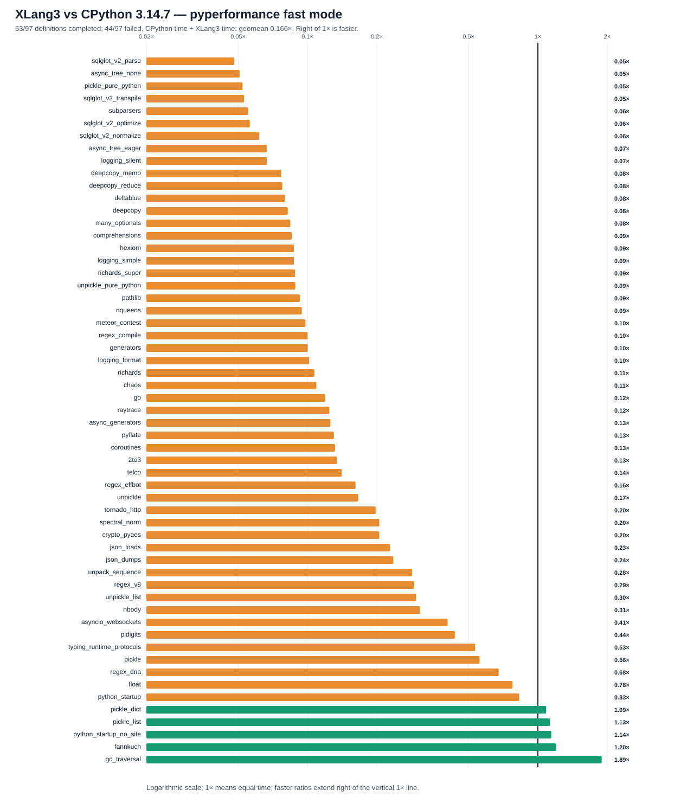

# XLang3 vs CPython 3.14.7: corrected full pyperformance run

The corrected XLang3 run attempted all **97** pyperformance 1.14.0 definitions in `--fast` mode. It completed **53** definitions and recorded **44** failures/timeouts. The command returned exit code 1 because pyperformance treats those benchmark failures as an unsuccessful suite; every definition was attempted.

Of **57** matched subtests, XLang3 was faster on **5**. The geometric mean of CPython time divided by XLang3 time was **0.16636×**; values over 1× favor XLang3. Fast-mode samples carry stability warnings and are directional evidence.

Against the previous main run's 50 shared matched subtests, 39 candidate
timings were lower and 11 were higher; the geometric mean of candidate / old
XLang3 elapsed time was **0.987×**. Seven additional subtests completed in
this run after their earlier workers had died, so the 57-case aggregate covers
a broader and slower mix and is not directly comparable to the earlier
50-case geomean. None of the previously completed definitions changed to a
failure. `fastapi` and `tomli_loads` still do not complete: both now hit the
120-second cap after their earlier worker deaths.

## Run configuration

- XLang3 Release executable SHA-256: `518179DFFFE39BFBD4015CAC645F42C68CC24A38198804472FF8FEF412D7A191`.
- XLang3 runtime DLL SHA-256: `7DB2363188AD64E7908CD29142AEACB8E0CED965661337ABEEB2D57505D1A9A3`.
- XLang3 revision: `4083e113` (sparse per-instruction cache storage).
- CPython reference: pyperformance 1.14.0 on CPython 3.14.7; XLang3 loaded `Python 3.14 standard library`.
- The XLang3 `PYTHONPATH` contains the Windows pyperf compatibility shim and the shared benchmark dependency site-packages. No Python 3.13 standard-library overlay was used.
- Each XLang3 benchmark definition had a 120-second cap covering pyperf worker calibration and measurement. Overrides: async_tree*=30s, async_tree=300s, async_tree_eager=300s.

## Largest slowdowns and wins

| Subtest | CPython 3.14.7 | XLang3 | CPython / XLang3 |
|---|---:|---:|---:|
| `sqlglot_v2_parse` | 1.01 ms | 20.96 ms | 0.048× |
| `async_tree_none` | 227.4 ms | 4481 ms | 0.051× |
| `pickle_pure_python` | 273.5 µs | 5.236 ms | 0.052× |
| `sqlglot_v2_transpile` | 1.302 ms | 24.52 ms | 0.053× |
| `subparsers` | 8.151 ms | 147.5 ms | 0.055× |

Measured wins:

- `gc_traversal`: **1.891×** (1.233 ms vs 2.332 ms).
- `fannkuch`: **1.201×** (269.8 ms vs 324 ms).
- `python_startup_no_site`: **1.143×** (18.1 ms vs 20.68 ms).
- `pickle_list`: **1.127×** (4.103 µs vs 4.625 µs).
- `pickle_dict`: **1.085×** (24.34 µs vs 26.41 µs).

## Failure breakdown

- 23 definitions: Benchmark died.
- 21 definitions: Benchmark timed out.

The [all-97 status CSV](data/pyperformance-xlang3-sparse-instr-cache-vs-cpython314-fast-20261005-all-97-status.csv) retains every benchmark definition and failure status. The [matched subtest CSV](data/pyperformance-xlang3-sparse-instr-cache-vs-cpython314-fast-20261005-subtests.csv) contains raw per-subtest means and speed ratios.

## Raw evidence

The focused [sparse-cache design and async-tree A/B report](sparse-instruction-cache-storage-trial-20261005.md)
documents why the cache storage changed and records its fixed Release gate.

- XLang3 pyperf JSON: [`pyperformance-xlang3-sparse-instr-cache-all-97-fast-20261005.json`](data/pyperformance-xlang3-sparse-instr-cache-all-97-fast-20261005.json).
- Runner status log: [`pyperformance-xlang3-sparse-instr-cache-all-97-fast-20261005.log`](data/pyperformance-xlang3-sparse-instr-cache-all-97-fast-20261005.log).
- CPython 3.14.7 pyperf JSON: [`pyperformance-cpython314-clean-release-full-fast-20261002.json`](data/pyperformance-cpython314-clean-release-full-fast-20261002.json).
- Earlier runs that used a Python 3.13 standard library are retained separately; this run supersedes them as the same-version Python 3.14 comparison.

Benchmark worker failures have several causes, including unavailable optional benchmark dependencies, XLang3 native-module gaps, and interpreter compatibility bugs. The status CSV gives case-level failure details, and the runner log preserves worker tracebacks when available. A worker death is not a performance score; inspect its case-specific cause before treating it as a speed result.
