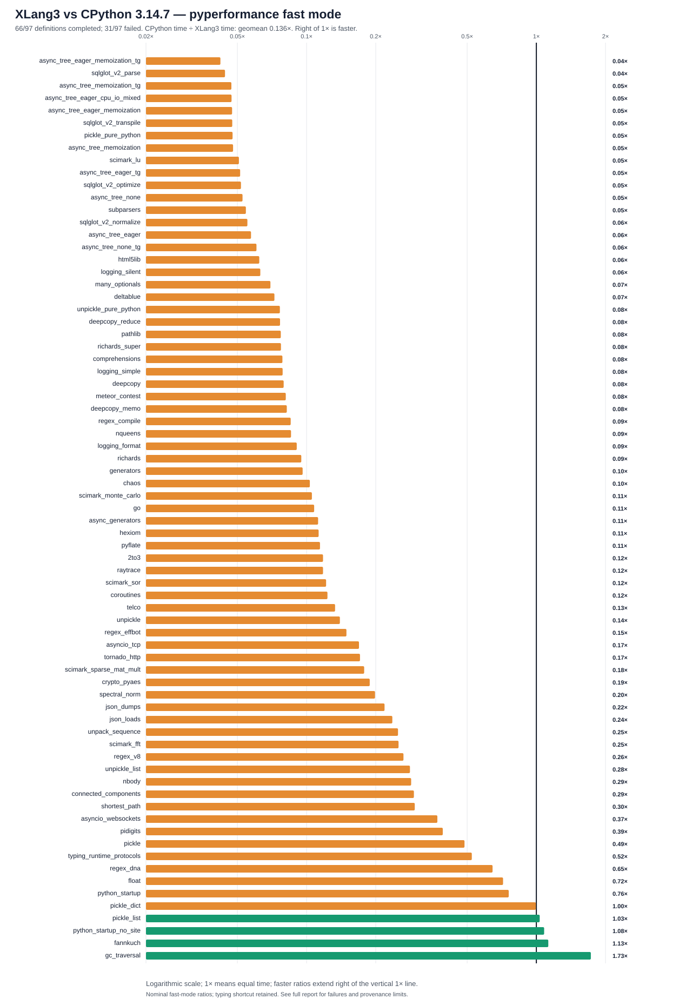

# XLang3 subscription checkpoint vs CPython 3.14.7: full pyperformance run

The frozen subscription-checkpoint XLang3 run attempted all **97** pyperformance 1.14.0 definitions in `--fast` mode. It completed **66** definitions and recorded **31** failures/timeouts. The command returned exit code 1 because pyperformance treats those benchmark failures as an unsuccessful suite; every definition was attempted.

Of **73** matched subtests, XLang3 was faster on **4**. The geometric mean of CPython time divided by XLang3 time was **0.13638×**; values over 1× favor XLang3. Fast-mode samples carry stability warnings and are directional evidence.

## Run configuration

- XLang3 Release executable SHA-256: `DC18F94D37AA662BB4F1BEF4284C79373E784781D74FFFE22205937CC5CB82CF`.
- XLang3 runtime DLL SHA-256: `990237AD095D6865F54A0A5974AD94E55B95A5D29E06E3EF59AB80DFE9474FFF`.
- CPython reference: pyperformance 1.14.0 on CPython 3.14.7; XLang3 loaded `C:\Python\Python314\Lib (Python 3.14.7)`.
- The XLang3 `PYTHONPATH` contains the Windows pyperf compatibility shim and the shared benchmark dependency site-packages. No Python 3.13 standard-library overlay was used.
- Each XLang3 benchmark definition had a 300-second cap covering pyperf worker calibration and measurement. Overrides: networkx*=600s.

## Largest slowdowns and wins

| Subtest | CPython 3.14.7 | XLang3 | CPython / XLang3 |
|---|---:|---:|---:|
| `async_tree_eager_memoization_tg` | 261.1 ms | 6191 ms | 0.042× |
| `sqlglot_v2_parse` | 1.01 ms | 22.87 ms | 0.044× |
| `async_tree_memoization_tg` | 281.8 ms | 5985 ms | 0.047× |
| `async_tree_eager_cpu_io_mixed` | 336.2 ms | 7131 ms | 0.047× |
| `async_tree_eager_memoization` | 189.1 ms | 3990 ms | 0.047× |

Nominal measured wins:

- `gc_traversal`: **1.727×** (1.351 ms vs 2.332 ms).
- `fannkuch`: **1.127×** (287.4 ms vs 324 ms).
- `python_startup_no_site`: **1.081×** (19.13 ms vs 20.68 ms).
- `pickle_list`: **1.035×** (4.47 µs vs 4.625 µs).

## Failure breakdown

- 17 definitions: Benchmark died.
- 14 definitions: Benchmark timed out.

The [all-97 status CSV](data/pyperformance-xlang3-subscription-dispatch-full-fast-20261007-all-97-status.csv) retains every benchmark definition and failure status. The [matched subtest CSV](data/pyperformance-xlang3-subscription-dispatch-full-fast-20261007-subtests.csv) contains raw per-subtest means and speed ratios.

## Raw evidence

- XLang3 pyperf JSON: [`pyperformance-xlang3-subscription-dispatch-full-fast-20261007.json`](data/pyperformance-xlang3-subscription-dispatch-full-fast-20261007.json).
- Runner status log: [`pyperformance-xlang3-subscription-dispatch-full-fast-20261007.log`](data/pyperformance-xlang3-subscription-dispatch-full-fast-20261007.log).
- CPython 3.14.7 pyperf JSON: [`pyperformance-cpython314-clean-release-full-fast-20261002.json`](data/pyperformance-cpython314-clean-release-full-fast-20261002.json).
- Earlier runs that used a Python 3.13 standard library are retained separately; this run supersedes them as the same-version Python 3.14 comparison.

Benchmark worker failures have several causes, including unavailable optional benchmark dependencies, XLang3 native-module gaps, and interpreter compatibility bugs. The status CSV gives case-level failure details, and the runner log preserves worker tracebacks when available. A worker death is not a performance score; inspect its case-specific cause before treating it as a speed result.

## Same-population comparison with the previous XLang3 checkpoint

The previous full run completed 67 definitions; this run completes 66.
SciMark now completes with all five subtests, while two previously completed
async-tree definitions hit the unchanged cap. Newly completed measurements
must not be counted as a speed improvement on previously measured cases.

On the **68 subtests completed in both XLang3 runs and matched to CPython**,
the geometric mean old-XLang3/new-XLang3 speed ratio is **0.97049x**:
nominally about 3% slower in the new run. Relative to CPython on that same
population, the means are **0.14152x before** and **0.13734x after**.
These unpaired fast-mode measurements contain stability warnings; they do
not prove a statistically significant 3% regression. They also do not
establish an overall improvement, restoration of August speed, or achievement
of the CPython speed goal. The fixed Release gate remains separate.

The [same-population report](data/subscription-dispatch-full-common-subtests-20261007.md),
[all 68 rows](data/subscription-dispatch-full-common-subtests-20261007.csv), and
[input hashes/statistics](data/subscription-dispatch-full-common-subtests-20261007.json)
retain both timings and sample counts. The five new SciMark results are
excluded from that comparison; see the [official parent/new SciMark comparison](subscription-dispatch-vm-frames-20261007.md)
for their measured gains over the native-array checkpoint. Those gains remain
slower than CPython in every SciMark subtest.

## Frozen executable and implementation policy

The [completed-run provenance](data/pyperformance-xlang3-subscription-dispatch-full-fast-20261007-provenance.json)
records measured source commit `23d1d443b8b93986549ada9efe1787ec5880858c`,
start/end times, exit code 1, and equal executable, runtime DLL, and native
hashlib hashes. The run lasted from 12:16:56 to 14:41:06 UTC on 2026-10-07.
Documentation commits and pending engine source edits made during the run
were not built into that executable. The exact measured executable and
native modules were preserved separately for subsequent paired diagnostics in the
[preserved-control record](data/subscription-dispatch-preserved-control-20261007.json).

The measured binary still contains the native
`try_runtime_protocol_instancecheck` translation of part of `typing.py`.
That conflicts with the project's pure-Python library rule. The raw
`typing_runtime_protocols` measurement is retained in this complete record,
but it is not evidence of compliant Python hook execution. It is not one of
the four nominal CPython wins. Pending source removes this shortcut and must
pass the Python-hook fixture, official benchmark, and unchanged fixed gate
before acceptance. See the [compile/type-check source audit](compile-source-identity-source-audit-20261007.md).

## Failed definitions and partial evidence

The 31 failures comprise **14 timeouts and 17 worker deaths**. In particular,
NetworkX k-core hit 600 seconds; pprint and tomli hit 300 seconds. The cap
covers setup, calibration, and all workers for a whole definition; it is not
a measured single-operation time. No failed definition is assigned an
invented score or presented as completed.

Base64 printed some rounded subtest means before its later timeout. The
original runner's upstream temporary-file cleanup did not preserve their raw
worker JSON. Those [console-only observations](data/subscription-dispatch-full-failed-console-means-20261007.json)
remain separate from successful raw measurements and every geometric mean.
The [partial-output preservation change](pyperformance-partial-evidence-preservation-20261007.md)
was committed during this run, after its manager loaded the original runner;
it applies to future runs and cannot retroactively recover deleted samples.

## CPython reference provenance limits

The saved CPython reference is identified as **3.14.7** by its
[contemporaneous report](pyperformance-xlang3-clean-release-vs-cpython314-full-fast-20261002.md)
and the dependency environment's `pyvenv.cfg`. Its JSON contains no worker
interpreter-version fields: the compatibility shim disabled pyperf metadata
collection for both interpreters. It also lacks a historical CPython binary
start/end hash. The [offline provenance audit](data/cpython3147-saved-reference-provenance-audit-20261007.json)
records those limits and hashes the original evidence without rewriting it.
Today's observed `C:/Python/Python314/python.exe` is 3.14.7; that observation
is not a substitute for a historical measured-binary hash. A future frozen
CPython run should record version and binary hashes explicitly.
