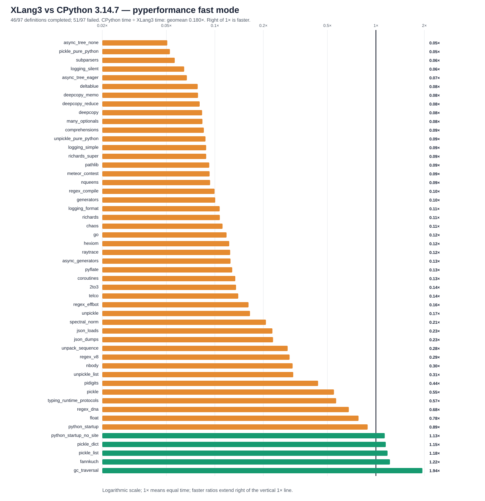

# XLang3 vs CPython 3.14.7: corrected full pyperformance run

The corrected XLang3 run attempted all **97** pyperformance 1.14.0 definitions in `--fast` mode. It completed **46** definitions and recorded **51** failures/timeouts. The command returned exit code 1 because pyperformance treats those benchmark failures as an unsuccessful suite; every definition was attempted.

Of **50** matched subtests, XLang3 was faster on **5**. The geometric mean of CPython time divided by XLang3 time was **0.17958×**; values over 1× favor XLang3. Fast-mode samples carry stability warnings and are directional evidence.

## Run configuration

- XLang3 Release executable SHA-256: `EADF7F0E846790573E189BE930537E021D4718A99F17E96FB2D95135694F5DE3`.
- XLang3 runtime DLL SHA-256: `DD81A0CD84510F9CA650A97989011D00304758E267BFE7E581BC9359AB33CE97`.
- CPython reference: pyperformance 1.14.0 on CPython 3.14.7; XLang3 loaded `Python 3.14 standard library`.
- The XLang3 `PYTHONPATH` contains the Windows pyperf compatibility shim and the shared benchmark dependency site-packages. No Python 3.13 standard-library overlay was used.
- Each XLang3 benchmark definition had a 120-second cap covering pyperf worker calibration and measurement. Overrides: async_tree*=30s, async_tree=300s, async_tree_eager=300s.

## Largest slowdowns and wins

| Subtest | CPython 3.14.7 | XLang3 | CPython / XLang3 |
|---|---:|---:|---:|
| `async_tree_none` | 227.4 ms | 4489 ms | 0.051× |
| `pickle_pure_python` | 273.5 µs | 5.204 ms | 0.053× |
| `subparsers` | 8.151 ms | 144.7 ms | 0.056× |
| `logging_silent` | 70.03 ns | 1.086 µs | 0.064× |
| `async_tree_eager` | 86.62 ms | 1292 ms | 0.067× |

Measured wins:

- `gc_traversal`: **1.944×** (1.2 ms vs 2.332 ms).
- `fannkuch`: **1.222×** (265.2 ms vs 324 ms).
- `pickle_list`: **1.181×** (3.916 µs vs 4.625 µs).
- `pickle_dict`: **1.151×** (22.94 µs vs 26.41 µs).
- `python_startup_no_site`: **1.135×** (18.23 ms vs 20.68 ms).

## Change since the prior full comparison

The prior main run and this run share the same 50 matched subtests. The
geometric mean of XLang3 elapsed time across those cases decreased by **2.6%**;
40 timings were lower and 10 higher. `hexiom` moved from **63.24 ms** to
**44.29 ms** (about 30% less time), consistent with the focused rigorous A/B.
This fast-mode whole-suite comparison is directional; the focused rigorous
`hexiom` pair is the stronger evidence for that targeted optimization.

## Failure breakdown

- 32 definitions: Benchmark died.
- 19 definitions: Benchmark timed out.

The [all-97 status CSV](data/pyperformance-xlang3-sum-int-gen-vs-cpython314-fast-20261006-all-97-status.csv) retains every benchmark definition and failure status. The [matched subtest CSV](data/pyperformance-xlang3-sum-int-gen-vs-cpython314-fast-20261006-subtests.csv) contains raw per-subtest means and speed ratios.

## Raw evidence

- XLang3 pyperf JSON: [`pyperformance-xlang3-sum-int-gen-full-fast-20261006.json`](data/pyperformance-xlang3-sum-int-gen-full-fast-20261006.json).
- Runner status log: [`pyperformance-xlang3-sum-int-gen-full-fast-20261006.log`](data/pyperformance-xlang3-sum-int-gen-full-fast-20261006.log).
- CPython 3.14.7 pyperf JSON: [`pyperformance-cpython314-clean-release-full-fast-20261002.json`](data/pyperformance-cpython314-clean-release-full-fast-20261002.json).
- Earlier runs that used a Python 3.13 standard library are retained separately; this run supersedes them as the same-version Python 3.14 comparison.

Benchmark worker failures have several causes, including unavailable optional benchmark dependencies, XLang3 native-module gaps, and interpreter compatibility bugs. The status CSV gives case-level failure details, and the runner log preserves worker tracebacks when available. A worker death is not a performance score; inspect its case-specific cause before treating it as a speed result.
