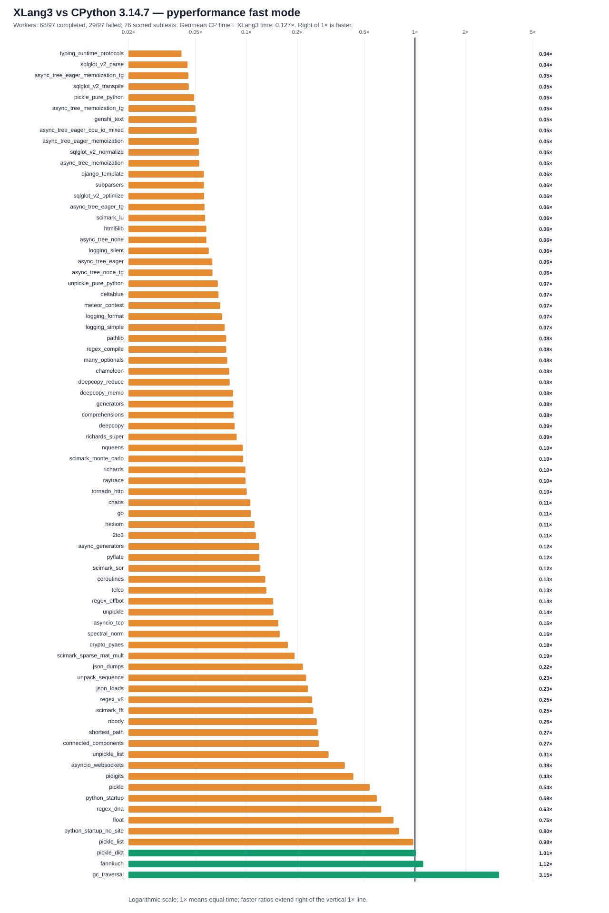

# XLang3 vs CPython 3.14.7: corrected full pyperformance run

The XLang3 run attempted all **97** pyperformance 1.14.0 definitions in `--fast` mode. Its workers completed **68** definitions and recorded **29** failures/timeouts. Benchmark failures make the suite unsuccessful; every definition was attempted.

Of **76** matched subtests, XLang3 was faster on **3**. The geometric mean of CPython time divided by XLang3 time was **0.12665×**; values over 1× favor XLang3. Fast-mode samples carry stability warnings and are directional evidence.

## Run configuration

- XLang3 Release executable SHA-256: `46a04e33a02022374347f98dcfb4d3ef73e158f5717b92b31d1fee360a8cccef`.
- XLang3 runtime DLL SHA-256: `560c7059523174fe73a45513ca1ff617be609f45e4f80b5b4254999512e58cf8`.
- CPython reference: pyperformance 1.14.0 on CPython 3.14.7; XLang3 loaded `C:\Python\Python314\Lib`.
- The XLang3 `PYTHONPATH` contains the Windows pyperf compatibility shim and the shared benchmark dependency site-packages. No Python 3.13 standard-library overlay was used.
- Each XLang3 benchmark definition had a 300-second cap covering pyperf worker calibration and measurement. Overrides: networkx*=600s.

## Largest slowdowns and wins

| Subtest | CPython 3.14.7 | XLang3 | CPython / XLang3 |
|---|---:|---:|---:|
| `typing_runtime_protocols` | 130.8 µs | 3.17 ms | 0.041× |
| `sqlglot_v2_parse` | 1.044 ms | 23.28 ms | 0.045× |
| `async_tree_eager_memoization_tg` | 280.6 ms | 6191 ms | 0.045× |
| `sqlglot_v2_transpile` | 1.296 ms | 28.44 ms | 0.046× |
| `pickle_pure_python` | 279.4 µs | 5.694 ms | 0.049× |

Nominal timing wins (not proof of statistical significance or correctness):

- `gc_traversal`: **3.152×** (743 µs vs 2.342 ms).
- `fannkuch`: **1.119×** (289.1 ms vs 323.5 ms).
- `pickle_dict`: **1.012×** (26.05 µs vs 26.36 µs).

## Failure breakdown

- 15 definitions: Benchmark died.
- 14 definitions: Benchmark timed out.

The [all-97 status CSV](data/pyperformance-xlang3-super-method-call-vs-cpython3147-full-fast-20261007-all-97-status.csv) retains every benchmark definition and failure status. The [matched subtest CSV](data/pyperformance-xlang3-super-method-call-vs-cpython3147-full-fast-20261007-subtests.csv) contains raw per-subtest means and speed ratios.
Partial values from failed definitions remain in raw evidence and are excluded from timing tables, speed ratios and aggregate statistics.

## Raw evidence

- XLang3 pyperf JSON: [`pyperformance-xlang3-super-method-call-full-fast-20261007.json`](data/pyperformance-xlang3-super-method-call-full-fast-20261007.json).
- Runner status log: [`pyperformance-xlang3-super-method-call-full-fast-20261007.log`](data/pyperformance-xlang3-super-method-call-full-fast-20261007.log).
- CPython 3.14.7 pyperf JSON: [`pyperformance-cpython3147-super-method-full-fast-20261007.json`](data/pyperformance-cpython3147-super-method-full-fast-20261007.json).
- Earlier runs that used a Python 3.13 standard library are retained separately; this run supersedes them as the same-version Python 3.14 comparison.

Benchmark worker failures have several causes, including unavailable optional benchmark dependencies, XLang3 native-module gaps, and interpreter compatibility bugs. The status CSV gives case-level failure details, and the runner log preserves worker tracebacks when available. A worker death is not a performance score; inspect its case-specific cause before treating it as a speed result.

- Fresh CPython status log: [`pyperformance-cpython3147-super-method-full-fast-20261007.log`](data/pyperformance-cpython3147-super-method-full-fast-20261007.log).

## Workload correctness exclusions

Worker completion does not prove equal work. The following raw timings remain in the CSV, but have no speed ratio and are excluded from the chart, win count and geometric mean:

- `genshi_xml`: XML output had zero rows and cells instead of 1000 rows and 10000 cells.

Evidence: [genshi-render-correctness-20261007.json](data/genshi-render-correctness-20261007.json).
