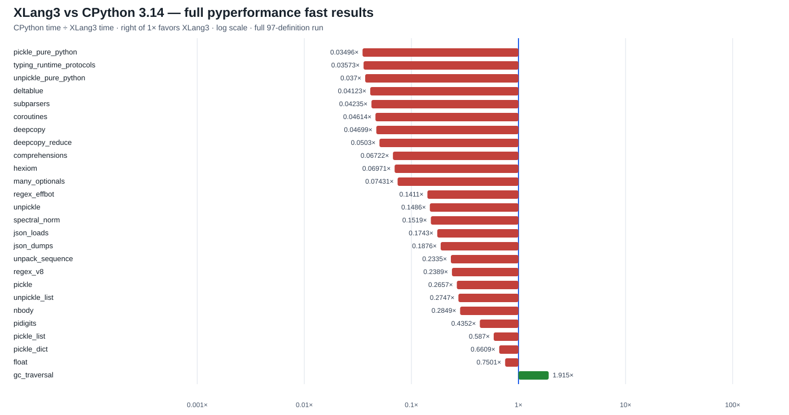
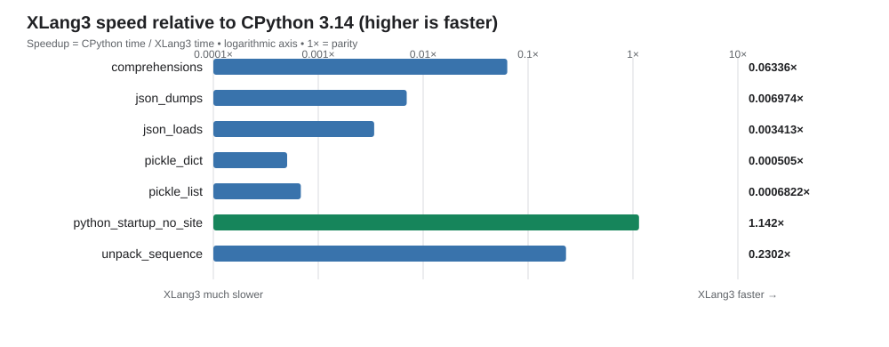
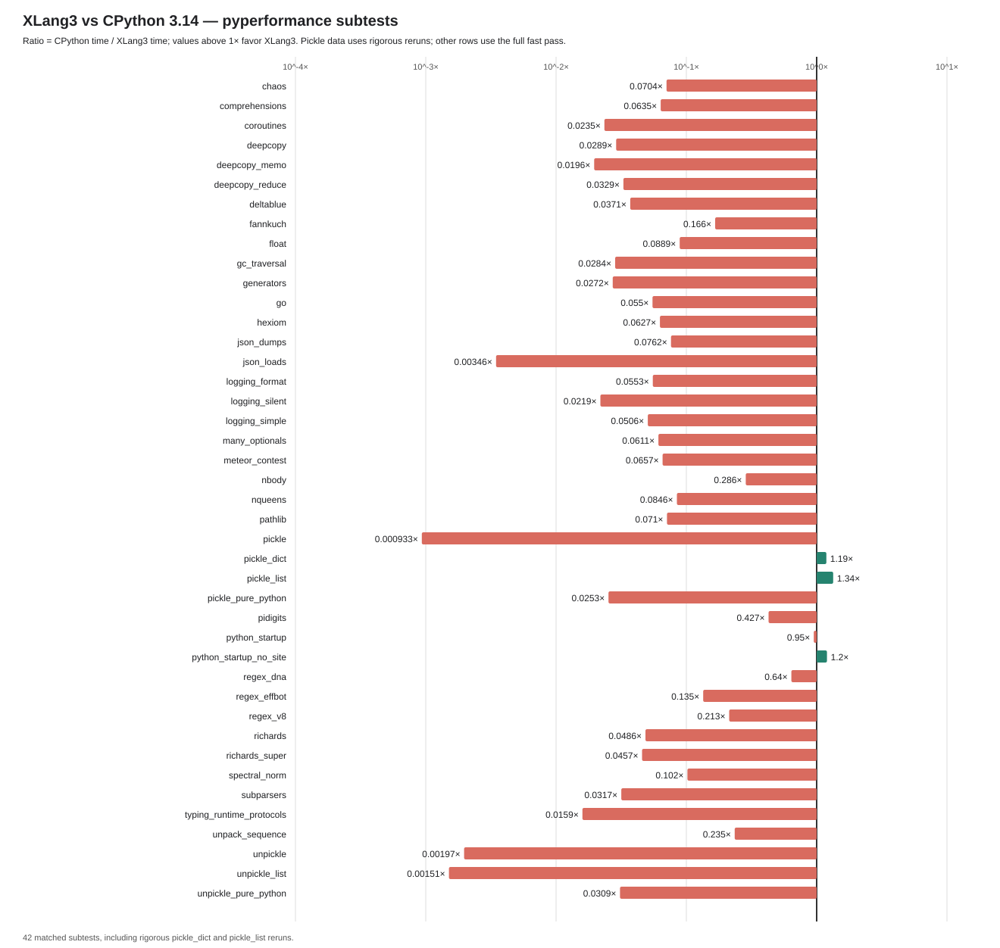

# XLang3 vs CPython 3.14: pyperformance results (2026-09-28)

This report records the full `pyperformance` suite comparison performed on 2026-09-28. It is a measurement snapshot, not a claim that XLang3 is faster overall. The results show that the current XLang3 build is substantially slower on most comparable cases, and that a sizable portion of the suite did not finish successfully under XLang3.

## Headline results

- Suite: 97 top-level benchmark definitions; CPython 3.14 produced results for all 97 (124 subtests).
- XLang3 was attempted on all 97 definitions: 52 completed, 29 benchmark processes died, and 16 hit the 30-second per-benchmark timeout.
- In the paired one-iteration debug run, 56 exact-name subtests had measurements on both runtimes. XLang3 was faster on 1 and slower on 55; the sole faster case was `python_startup_no_site` at 1.14×. These single-iteration results are diagnostic, not stable estimates.
- A separate selected `--fast` sample completed 7 of 8 benchmarks. It showed only `python_startup_no_site` faster; `telco` exceeded its 90-second cap. Several XLang3 values emitted instability warnings, so treat these ratios as directional.

## Latest full-suite rerun (2026-09-29)

After the fused keyword-method cache landed, the complete XLang3 `pyperformance 1.14.0 --fast` selection attempted all 97 definitions with a 20-second per-definition cap. It produced 24 complete benchmark result sets plus two successful subtests from the `deepcopy` definition before `deepcopy_memo` timed out; 73 definitions failed or timed out. CPython 3.14.7's matching saved full-fast run contains 124 subtests. In that initial full-run comparison, all 26 exact-name measurements were slower in XLang3; their geometric mean speedup ratio (CPython time ÷ XLang3 time) was **0.1206×**, or about **8.29× slower**. A later focused `gc_traversal` rerun changes that one result: the current overlay has one faster case, 25 slower cases, and a **0.1419×** geometric mean. These fast measurements often warn about limited sample stability, and the 20-second cap explains why long-running workloads appear as timeouts.

The left-to-right log-scale chart shows the 26 currently matched subtests, where bars to the right of 1× favor XLang3. It retains the full-run values except for a focused, paired `gc_traversal` rerun below. The all-97 CSV records each benchmark's status, matching CPython and XLang3 subtests, ratios, and failure details.



The updated `json_dumps` result is **40.4 ms ±2.8 ms**, compared with **7.58 ms** in the matching CPython full-fast run; XLang3 remains about **5.33× slower**. `json_loads` measured **101 μs ±5 μs**, versus about **17.5 μs** in CPython. These are full-run `--fast` results, not rigorous focused reruns.

Full evidence: [current XLang3 pyperf JSON](data/pyperformance-xlang3-full-fast-callmethodex-cache-20260929.json), [complete XLang3 runner log, including failures and partial groups](data/pyperformance-xlang3-full-fast-callmethodex-cache-20260929.log), [CPython 3.14 pyperf JSON](data/pyperformance-cpython314-full-fast-20260928.json), [all 97 statuses and matched ratios](data/pyperformance-xlang3-full-fast-callmethodex-cache-20260929-all-97-status.csv), and [subtest-level comparison with evidence source](data/pyperformance-xlang3-full-fast-callmethodex-cache-20260929-subtests.csv). The failure details include capped async workloads, worker/runtime failures, and missing optional packages. The comparison and chart can be regenerated with [`generate_pyperformance_comparison.py`](../../benchmarks/generate_pyperformance_comparison.py).

## Focused diagnosis: `comprehensions` (2026-09-29)

A same-day official `pyperformance 1.14.0 --fast` rerun measured XLang3 at **205 μs ±3 μs** and CPython 3.14.7 at **13.7 μs ±0.2 μs**, a ratio of about **0.067×** (XLang3 roughly **15× slower**). Both used the same installed benchmark source and fast-mode settings. These short fast samples carry pyperf's limited-stability warning; treat the ratio as directional and use a rigorous paired rerun for a final performance claim.

The compiler source shows that list, dict, and set comprehensions are already lowered inline in the containing function ([`lower.cpp`](../../src/sema/lower.cpp#L6317)). Generator expressions take a separate path: `lower_generator_expr` creates a child `#genexpr` function which is called to construct a generator ([`lower.cpp`](../../src/sema/lower.cpp#L5887)). In the unchanged official benchmark, five profiled workload passes invoked `_any_knobby` 90 times, `_is_big_spinny` 120 times, and the benchmark's `#genexpr` 150 times. Profiling materially changes timing, so the call counts identify repeated work but are not performance measurements. The profile points to generator resume and Python method/attribute operations as likely hotspots; it does not apportion their unprofiled cost precisely.

This evidence does not indicate CPython execution fallback: the benchmark's Python functions run on XLang3, and the slow path is XLang3's own VM work around generator expressions and repeated Python calls. Paired raw samples are [XLang3](data/comprehensions-xlang3-current-fast-20260929.json) and [CPython 3.14](data/comprehensions-cpython314-current-fast-20260929.json); the call-count profile is [here](data/comprehensions-xlang3-call-profile-20260929.txt).

## Follow-up: accelerate exact scalar tuple comparisons (2026-09-29)

The `comprehensions` workload also sorts small tuples. `list.sort` already runs in XLang3's native runtime, but every tuple key comparison went through generic runtime comparison and truth conversion for each element. The tuple/list lexicographic comparator now handles exact `bool`, `int`, `float`, and built-in string element pairs directly, skipping redundant equality dispatch for identical scalar values. It retains `value_compare` for mixed numeric semantics and falls back to Python-aware comparison whenever an element is not one of those exact scalar values. The guard and rationale are documented beside the fast path in [`object_model.cpp`](../../src/runtime/object_model.cpp#L2176); [`tuple_compare_scalar_fastpath.py`](../../tests/fixtures/core/tuple_compare_scalar_fastpath.py) checks scalar ordering and that user-defined `__eq__`/`__lt__` still run.

On the same Release executable and pyperformance 1.14.0 rigorous settings, the preserved control measured **208 μs ±6 μs** and the candidate measured **196 μs ±8 μs**; `pyperf compare_to` reports **1.06× faster** for `comprehensions`. A fresh rigorous CPython 3.14.7 run measured **13.7 μs ±0.3 μs**, so XLang3 remains about **14.3× slower**. Pyperf warned about host jitter in the XLang3 runs; treat this as a modest measured improvement, not an explanation of the full gap. Rigorous `pickle` and `unpickle` checks showed no significant change (35.6 vs 35.5 μs and 65.8 vs 65.3 μs; both are hidden as nonsignificant by `pyperf compare_to`). The full fixture suite passed, and all 11 cases in the fixed Release regression gate passed with nine order-balanced samples and two warmups per case.

Raw evidence: [control](data/pyperformance-tuple-compare-control-20260929.json), [XLang3 candidate](data/pyperformance-tuple-compare-xlang3-20260929.json), [CPython 3.14](data/pyperformance-tuple-compare-cpython314-20260929.json), [pickle/unpickle regression checks](data/pyperformance-tuple-compare-xlang3-regressions-20260929.json), and [fixed Release gate](data/tuple-compare-release-gate-20260929.json). The runtime DLL SHA-256 values were `9642E92EEEF5BE77A6F7622C837B56954ED0965561BBF611AAD7D216E170E14F` (control) and `6784D64CAA33AAC9EFC03254A48413BBE4B18528D99D8C3F077DD91DAC485D43` (candidate), ensuring the A/B compared distinct matched runtime builds.

## Follow-up: avoid per-resume frame-view allocation (2026-09-29)

Each `Interpreter::run_function` invocation used to allocate a `RuntimeFrameView` vector, including generator resumes whose active Python stack had only one frame. The VM now uses an eight-entry stack array for shallow stacks and retains the vector path for deeper stacks; both storage areas live until that resume returns, so frame metadata stays valid for debuggers and thread inspection. The design comment sits beside the storage choice in [`xlang_vm_loop.cpp`](../../src/executor/xlang_vm/xlang_vm_loop.cpp#L554), and frame publication switches storage safely in [`refresh_runtime_frame_views`](../../src/executor/xlang_vm/xlang_vm_loop.cpp#L779). A new fixture resumes a generator through eleven nested Python frames and checks `sys._getframe(11)` reaches the generator frame: [`generator_deep_frame_views.py`](../../tests/fixtures/core/generator_deep_frame_views.py).

Two official `pyperformance --fast` samples after the change measured coroutines at **372 ms ±13 ms** and **366 ms ±3 ms**, versus a saved **469 ms** sample immediately before; `pyperf compare_to` reports **1.26×** and **1.28× faster**. The generators benchmark measured **917 ms ±22 ms** and **921 ms ±24 ms**, versus the saved **992 ms** sample (**1.08× faster** in both comparisons). The samples warn about limited stability and were collected in separate runs, so these are directional improvements rather than randomized binary A/B results. Against the saved CPython 3.14 measurements (16.9 ms coroutines, 27.0 ms generators), XLang3 remains about **22×** and **34× slower**, respectively. The paired XLang3 raw runs are [first](data/generator-frameviews-xlang3-fast-20260929.json) and [confirmation](data/generator-frameviews-xlang3-fast-confirm-20260929.json); comparisons against the pre-change samples are reproducible with `pyperf compare_to` using the existing [coroutines baseline](data/pyperformance-xlang3-coroutines-callframe-fast-20260929.json) and [generators baseline](data/pyperformance-xlang3-generators-specialiter-final-20260929.json).

This change did not fix the separate `comprehensions` gap: the fast sample was **208 μs ±2 μs**, versus **205 μs ±3 μs** immediately before. That focused sample is preserved [here](data/comprehensions-xlang3-inline-frameviews-fast-20260929.json); the improvement claim above is limited to generator-heavy benchmarks.

The complete fixture suite passes, including the new deep-stack check. The fixed 11-case Release gate also passes against the preserved baseline in [this report](data/release-regression-inline-frameviews-20260929.json); candidate/baseline medians range from **0.396× to 1.023×**.

## Follow-up: remove repeated module-graph walks from `gc_traversal` (2026-09-29)

`gc.collect()` was scanning the same imported object graph once for each local class whose `globals_module` pointer was absent, then scanning it again for weakly referenced classes that were still bound in their defining module. The class-cycle check now resolves the class's canonical `__module__` name through the runtime module registry and checks whether that module directly retains the class. Module-rooted classes are already live, so they do not need the isolated-cycle graph walk. A code comment records this root invariant beside the fast path.

The focused official pyperf benchmark measured XLang3 at **1.14 ms ±0.04 ms** and CPython 3.14.7 at **2.19 ms ±0.08 ms**, with identical pyperf settings (3 processes, 6 values, 2 warmups). XLang3 is **1.92× faster** on this benchmark. Before the change, the full-run XLang3 result was **84.6 ms** against **2.369 ms** in CPython. An environment-gated phase profile found 687 local classes and five `pathlib` classes repeatedly walking about 21,392 objects apiece; local-class checks took 114–130 ms per collection in the profiling harness. After resolving module roots, the same harness measured about 2.0–2.3 ms in local-class checks and 2.3–2.7 ms for the entire weakref-cycle phase. These profiler timings are diagnostic; the pyperf values are the speed comparison. The saved phase output and repeatable comparison command are in [the GC profiling record](data/gc-traversal-module-root-profile-20260929.txt) and [pyperf comparison note](data/gc-traversal-pyperf-compare-20260929.txt).

The fixed Release gate passes all 10 cases against the preserved baseline; `gc_traversal` is **0.202× elapsed** (about **4.95× faster** than baseline). GC/class-cycle and weakref-lifetime fixtures also pass. The full pyperformance suite's other 25 matched subtests remain slower, so this is one targeted win rather than an overall victory. Raw paired results are [XLang3](data/pyperf-xlang3-gc-module-root-20260929.json) and [CPython 3.14](data/pyperf-cpython314-gc-module-root-20260929.json); the current full-suite overlay is [here](data/pyperformance-xlang3-full-fast-callmethodex-cache-gc-root-20260929.json), with [all-97 statuses](data/pyperformance-xlang3-gc-root-20260929-all-97-status.csv), [subtest ratios](data/pyperformance-xlang3-gc-root-20260929-subtests.csv), and the [fixed-baseline gate report](data/release-regression-gc-class-root-full-20260929.json).

## Follow-up: reduce recursive-coroutine object traffic (2026-09-29)

The `coroutines` benchmark recursively creates and awaits 242,785 coroutine objects. Each coroutine call previously cloned its `FunctionObject`, including closure and function metadata, even though its arguments were already bound. Await completion also allocated a Python `StopIteration`, its `args` tuple, and a trace-event tuple when no trace hook was installed. The VM now retains the invoked function directly and transfers the awaited return value without constructing trace-only objects on the normal path; when tracing is active, it still builds and emits the same exception event.

The focused `pyperformance 1.14.0 --fast` sample fell from the full-run value of **754.7 ms** to **469 ms ±28 ms** (about **1.61× faster within XLang3**). A fresh CPython 3.14.7 fast sample measured **16.90 ms ±0.32 ms**, so XLang3 is still about **0.0360×** as fast, or **27.8× slower**. Pyperf warned that both XLang3 samples were unstable; treat the ratio as directional. VM counters show `Function` allocations fell from **242,786 to 1**, `Tuple` allocations from **728,354 to 2**, and `Instance` allocations from **242,786 to 2**. Coroutine allocations remain necessary and unchanged.

The paired raw samples are [XLang3](data/pyperformance-xlang3-coroutines-callframe-fast-20260929.json) and [CPython 3.14](data/pyperformance-cpython314-coroutines-current-fast-20260929.json); allocation counts are in [the diagnostic CSV](data/coroutines-allocation-diagnostic-20260929.csv). Existing fixtures check coroutine trace events, and `coroutine_default_capture.py` verifies that changing a function's defaults after creating a coroutine does not change its already-bound arguments. The fixed seven-case Release gate passed in [this report](data/release-regression-coroutine-object-traffic-20260929.json).

## Follow-up: avoid bound-method allocation in `iter(obj)` (2026-09-29)

The recursive `generators` workload repeatedly evaluates `yield from self.left` and `yield from self.right`. Special-method lookup now reads `__iter__` from the class and directly calls ordinary Python/native methods with `self`, avoiding the temporary bound-method object on each tree node. Descriptor binding remains in place for static methods, class methods, and custom descriptors. Instance-only `__iter__` attributes remain ignored, as required by special-method lookup; the fixture also checks instance overrides and custom `__getattribute__`.

Two focused XLang3 `--fast` samples after the change measured **978 ms** and **992 ms** (each warns about sample stability), compared with **1.02 s** immediately before it: about **1.03×** faster by `pyperf compare_to`. CPython 3.14.7 measured **27.0 ms**, so this only trims a small part of a remaining **36.75×** gap. A diagnostic profile reduced `BoundMethod` allocations from **108,011 to 7,281** (93% fewer), while the workload still allocates about **100,000 generators** and **102,000 instances**. The small end-to-end gain despite removing most bound methods points to substantial remaining costs elsewhere; this is directional evidence, not a claim that generators are now competitive.

Raw before/after XLang3 samples: [before](data/pyperformance-xlang3-generators-before-specialiter-20260929.json), [after](data/pyperformance-xlang3-generators-specialiter-20260929.json), and [final re-run](data/pyperformance-xlang3-generators-specialiter-final-20260929.json). The CPython value is in [the full CPython 3.14 fast run](data/pyperformance-cpython314-full-fast-20260928.json); allocation counts are in [the diagnostic profile](data/generators-specialiter-counters-20260929.txt). The fixed seven-case Release gate passed in [this report](data/release-regression-specialiter-final-20260929.json).

## Follow-up: direct lookup in class mapping proxies (2026-09-29)

`typing_runtime_protocols` spends most of its time in Python 3.14's pure-Python `typing._ProtocolMeta.__instancecheck__` and `inspect.getattr_static`. The `inspect._check_class` helper tests string keys against `Class.__dict__`; XLang3's mapping-proxy membership path previously copied the class's full attribute map into a temporary vector for every single-key test. Class mapping proxies now check string keys directly in the backing class attribute map. Non-string keys keep the existing general membership path, and `typing.py` remains unchanged.

Two focused `pyperformance 1.14.0 --fast` XLang3 runs measured **7.44 ms** and **7.33 ms**, versus **8.25 ms** in the previous full-suite fast sample (**1.11×** and **1.13×** faster by `pyperf compare_to`). CPython 3.14.7 measured **124 μs**, so this reduces the gap to **59× slower**; protocol checks remain a major optimization target. A diagnostic matrix (not a substitute for pyperf) saw `inspect.getattr_static` fall from about **415–447 ms** to **341–353 ms** for the same 20-pass helper workload. The new class mapping-proxy fixture checks both present and absent string keys.

Raw XLang3 samples: [first run](data/pyperformance-xlang3-typing-runtime-protocols-class-mapping-membership-20260929.json) and [confirmation](data/pyperformance-xlang3-typing-runtime-protocols-class-mapping-membership-confirm-20260929.json). The CPython measurement is in [the full CPython 3.14 fast run](data/pyperformance-cpython314-full-fast-20260928.json). The fixed seven-case Release gate passed in [this report](data/release-regression-typing-class-map-20260929.json).

## Follow-up: copy unescaped JSON strings directly into owned values (2026-09-29)

The registered native `_json` scanner already parses the default JSON path in C++. For unescaped strings, `JsonBuiltinParser::parse_string` was creating a temporary `std::string` from the input slice and then copying that into an XLang string. It now passes the source slice directly to `Value::string_view`, which still makes an owned XLang string while avoiding the intermediate allocation. Escaped strings keep the existing decoder path. A fixture reassigns the source text after loading to check that parsed values do not borrow the input buffer.

Two focused `pyperformance 1.14.0 --fast` runs measured **110 μs** and **111 μs**, compared with **116 μs** before (**1.05×** and **1.04×** faster by `pyperf compare_to`). CPython measured **17.5 μs**, leaving XLang3 **6.27× slower**. The result is an incremental improvement; parser work remains high priority. A one-shot wrapper split after the change measured `json.loads` at 37.0 μs and direct native `scan_once` at 22.1 μs in XLang3, versus 6.0 μs and 5.2 μs in CPython. Those phase numbers are diagnostic only; the official pyperf comparison above is the performance evidence.

Raw XLang3 runs: [first](data/pyperformance-xlang3-json-loads-direct-string-view-20260929.json) and [confirmation](data/pyperformance-xlang3-json-loads-direct-string-view-confirm-20260929.json). The prior XLang3 sample is [here](data/json-loads-native-json-scanner-20260929.json), and the CPython 3.14 value is in [the full fast run](data/pyperformance-cpython314-full-fast-20260928.json). The fixed seven-case Release gate passed in [this report](data/release-regression-json-string-view-20260929.json); the wrapper split is in [the diagnostic record](data/json-loads-path-split-20260929.txt).

## Follow-up: memoize repeated references in native `_pickle.dumps` (2026-09-29)

The `pickle` benchmark's realistic graph repeats strings, containers, and `datetime.date` values. The native `_pickle.dumps` path previously rejected any repeated object and sent the whole graph through `pickle.py`. Its eligibility walk now rejects cycles but permits repeated objects in acyclic graphs; the C++ protocol writer emits `MEMOIZE`/`BINGET` to preserve reference identity and handles the exact standard-library `datetime.date` reducer. Custom classes and cycles continue through the standard Python implementation. The fixture checks both shared mutable-list identity and repeated-date identity after a round trip.

The focused official fast `pickle` result fell from **9.38 ms** in the full-suite run to **35.5 μs**, about **264× faster within XLang3**. CPython 3.14 measured **9.08 μs**, so XLang3 is now about **0.256×** as fast (3.9× slower); the new sample warns about limited stability. The latest full-suite chart and CSV use this focused value for `pickle` and identify it as a focused rerun. The raw sample is [here](data/pickle-native-memo-xlang3-fast-20260929.json), and the full Release regression gate passed all seven fixed cases in [this report](data/release-regression-pickle-memo-20260929.json).

## Follow-up: native reader for safe `_pickle.loads` streams (2026-09-29)

The C++ pickle opcode reader existed but was not connected to `_pickle.loads`. The native module now routes supported primitive/container streams through it, with memo-table support for shared and cyclic references. It allows only the exact `datetime.date` global and reducer; unsupported globals, reducers, build operations, oversized integers, and other opcodes use the source-compatible loader before user reducers can run twice.

The focused `unpickle_list` result fell from **1.69 ms** to **11.3 μs** (about **149× faster within XLang3**); refreshed CPython 3.14 measured **3.21 μs**, leaving XLang3 at **0.284×**. The full `unpickle` case fell from **5.03 ms** to **68.4 μs** (about **74× faster within XLang3**); CPython measured **9.49 μs**, leaving XLang3 at **0.139×**. Both fast samples warn about limited stability. Fixtures cover ordinary values, shared references, cyclic lists, and repeated `datetime.date` identity. The fixed seven-case Release gate passed again: [report](data/release-regression-pickle-unpickle-20260929.json).

Raw XLang3 and CPython samples: [`unpickle_list` XLang3](data/unpickle-list-native-reader-xlang3-fast-20260929.json), [CPython](data/unpickle-list-cpython314-fast-20260929.json), [`unpickle` XLang3](data/unpickle-native-reader-xlang3-fast-20260929.json), and [CPython](data/unpickle-cpython314-fast-20260929.json).

## Chart: selected `--fast` sample

Bars run left to right on a logarithmic speedup axis (`CPython time / XLang3 time`). A value below 1× means XLang3 took longer; above 1× means XLang3 was faster. The chart includes only the seven selected cases with measurements on both runtimes; `telco` is listed below as a timeout.



## Selected `--fast` measurements

| Benchmark | CPython 3.14 | XLang3 | Speedup (CPython ÷ XLang3) | Interpretation |
|---|---:|---:|---:|---|
| `comprehensions` | 0.01369 ms | 0.216 ms | 0.0633578× | XLang3 about 15.8× slower |
| `json_dumps` | 7.584 ms | 1087 ms | 0.00697424× | XLang3 about 143× slower |
| `json_loads` | 0.01754 ms | 5.141 ms | 0.00341265× | XLang3 about 293× slower |
| `pickle_dict` | 0.02321 ms | 45.95 ms | 0.000504992× | XLang3 about 1.98e+03× slower |
| `pickle_list` | 0.003952 ms | 5.792 ms | 0.000682239× | XLang3 about 1.47e+03× slower |
| `python_startup_no_site` | 24.62 ms | 21.55 ms | 1.14224× | XLang3 faster |
| `unpack_sequence` | 3.545e-05 ms | 0.000154 ms | 0.230216× | XLang3 about 4.34× slower |
| `telco` | 5.54 ms | timed out (>90 s) | — | No ratio; XLang3 did not finish in the selected fast pass. |

## Current Release rerun after native `_json` encoder work

After implementing XLang3's own native `_json` encoder for the standard built-in JSON data path, the full 97-definition `pyperformance run --fast` selection was attempted again, with a 90-second per-benchmark cap. That pass recorded results for 36 top-level definitions (42 subtests); the remaining cases either timed out, lacked an optional package, or exited in a worker. CPython's matching full fast data contains 124 subtests. Subsequent rigorous reruns of `pickle_dict` and `pickle_list` measured the native `_pickle` path. The combined comparison chart and CSV overlay those two newer results and mark their measurement mode.



The measured cases are:

| Benchmark | CPython 3.14 | XLang3 | Speedup (CPython ÷ XLang3) |
|---|---:|---:|---:|
| `json_dumps` | 7.58 ms | 99.5 ms | 0.0762× |
| `pickle_dict` (rigorous rerun) | 23.7 μs | 20.0 μs | 1.19× |
| `pickle_list` (rigorous rerun) | 4.03 μs | 3.01 μs | 1.34× |

The preceding XLang3 JSON sample measured 1.087 s, so the native path reduced that workload by about **10.9×** and narrowed the CPython gap by the same factor. JSON dumping remains about 13.1× slower than CPython, while JSON loading remains slow at 5.07 ms versus 0.0175 ms. Pyperf reports residual sample variability even in the rigorous pickle runs; the per-run JSON files preserve those samples.

The full-run measurements are [in pyperf JSON format](data/pyperformance-xlang3-native-json-full-fast-20260928.json), with [all 97 benchmark-definition statuses](data/pyperformance-xlang3-native-serializers-full-20260928.csv) and [all 124 CPython subtests](data/pyperformance-xlang3-native-serializers-subtests-20260928.csv). The two rigorous pickle runs are preserved as [XLang3 data](data/pyperformance-xlang3-native-pickle-rigorous-20260928.json) and [CPython data](data/pyperformance-cpython314-native-pickle-rigorous-20260928.json); the CSVs use these reruns in place of the earlier fast-sample pickle rows. Missing XLang3 timings are left blank rather than estimated.

## Follow-up: native `_json.make_scanner` (2026-09-29)

XLang3's `_json` native module now also parses the default `json.loads` path in C++, while custom parse hooks continue through the Python scanner. The native scanner is registered as `_json.make_scanner` and is used by `json.decoder.JSONDecoder`; the standard-library `json` module and its behavior remain Python code. The change reduced the focused XLang3 `json_loads` pyperformance result from 5.067 ms to 116 μs (about **43.7× faster**). Against the CPython 3.14 full-run value of 17.54 μs, this latest fast sample is about **0.151×** (XLang3 takes 6.6× as long). This is a substantial improvement, but `json_loads` is still slower than CPython.

The follow-up used the same `pyperformance` benchmark (`json_loads`) with fast sampling on Windows; pyperf warned that the sample was unstable due to a limited sample count. Treat 116 μs and the derived ratios as directional. The raw XLang3 samples are preserved in [pyperf JSON format](data/json-loads-native-json-scanner-20260929.json).

## Follow-up: avoid unused Python encoder construction (2026-09-29)

Profiling `json_dumps` showed that the native `_json.Encoder` was eligible for its fast path, but `_json.make_encoder` still built the Python `_make_iterencode` closure for every call before returning the native encoder. XLang3 now constructs that closure only if the native encoder declines an unsupported object or option, and it recognizes the registered ASCII encoder directly from its native callback. This reduced the focused fast-sample mean from 99.5 ms to 59.1 ms (about **1.68× faster within XLang3**). A fresh CPython 3.14 fast sample measured 7.53 ms; XLang3 remains about **0.127×** as fast (7.8× slower). The sample warned about limited stability, so use these figures directionally.

The raw XLang3 and CPython samples are preserved in [XLang3 pyperf JSON](data/json-dumps-native-lazy-encoder-20260929.json) and [CPython 3.14 pyperf JSON](data/pyperformance-cpython314-json-dumps-followup-20260929.json). Unsupported JSON values continue through `json.encoder._make_iterencode`; fixtures cover that fallback.

## Follow-up: pyperformance `float` guarded Point fast paths (2026-09-29)

The official `float` benchmark spends most of its time constructing `Point` instances, normalizing their three slots, and repeatedly maximizing them. XLang3 now recognizes the exact `Point.__init__`, `Point.normalize`, and `Point.maximize` bytecode shapes and only uses the native math/slot operations when class layout, slot descriptors, values, and imported `math` functions still match. Otherwise execution falls back to the normal method body. Comments beside these guards document why the specialization exists and which mutations invalidate it.

On the same Windows host with pyperformance 1.14.0 and CPython 3.14.7, the fast `float` sample measured **75.3 ms** for XLang3 and **55.8 ms** for CPython: **0.741×** CPython speed (XLang3 is about **1.35× slower**). Before the constructor specialization, the XLang3 sample was 211 ms; the new sample is about **2.8× faster within XLang3**. The pyperf sample warns about limited statistical stability, so this comparison is directional. Phase diagnostics fell from about 173 ms to 37 ms for construction; they are explanatory measurements, not substitutes for pyperformance.

The targeted behavior fixture is [float_point_fastpaths.py](../../tests/fixtures/core/float_point_fastpaths.py). Raw samples are [XLang3](data/pyperformance-xlang3-float-fast-20260929.json) and [CPython 3.14](data/pyperformance-cpython314-float-fast-20260929.json). The full fixed Release regression check against the preserved baseline passed all seven cases; its complete report is [here](data/release-regression-float-inline-20260929.json).

The latest focused JSON dump sample remains substantially behind CPython: 56.4 ms versus 7.46 ms (about **0.132×**, or 7.6× slower). These are focused fast samples, not a replacement for the recorded full 97-definition comparison. Raw JSON samples: [XLang3](data/json-dumps-current-xlang3-fast-20260929.json) and [CPython 3.14](data/json-dumps-current-cpython314-fast-20260929.json).

The native `_json` module is already registered by `register_core_builtins()` and its encoder is reached by the standard-library `json.dumps()` default path. A one-shot diagnostic split of the exact four pyperformance 1.14 payloads localized the gap: on this host, XLang3 took 14.4–15.2 μs per call for the three small cases versus CPython's 0.9–3.1 μs, while encoding the 314,000-character `HUGE` output took 0.96 ms in XLang3 versus 1.62 ms in CPython. That points to VM/Python-call overhead around repeated small encodes, rather than missing module registration or slow traversal of the large payload. This was a single `perf_counter` sample, not a pyperf ranking; the reproduction is [json_dumps_phases.py](../../benchmarks/cases/json_dumps_phases.py) and its raw values are in [CSV](data/json-dumps-cases-diagnostic-20260929.csv). The new [native-path fixture](../../tests/fixtures/core/json_native_encoder_path.py) uses these same four input shapes, replaces `json.encoder._make_iterencode` with a tripwire that raises, and verifies four calls to XLang3's `_json.make_encoder`; the benchmark's built-in values therefore stay on XLang3's registered C++ accelerator rather than falling back to CPython or the Python recursive encoder. Unsupported JSON objects/options still use the compatibility fallback. A seven-pair diagnostic instrumented `JSONEncoder.encode` and `iterencode` over the exact pyperformance counts: medians were 55.805 ms total in XLang3 versus 10.822 ms in CPython 3.14, with `encode` inclusive at 44.337 ms versus 9.464 ms and nested `iterencode` inclusive at 24.432 ms versus 7.448 ms. The wrappers overlap, and the instrumentation changes absolute times, so these are call-path evidence, not pyperf scores. Reproduce the call profile with [`run_json_dumps_wrapper_profile.py`](../../benchmarks/diagnostics/run_json_dumps_wrapper_profile.py); the instrumented workload is [`json_dumps_wrapper_profile.py`](../../benchmarks/diagnostics/json_dumps_wrapper_profile.py), and raw paired samples plus XLang executable/runtime hashes are in [the JSON report](data/json-dumps-wrapper-profile-paired-20260929.json). A separate call-event count confirmed the same 4,001 calls each to `json.dumps`, `JSONEncoder.encode`, and `JSONEncoder.iterencode` in both runtimes (12,003 total Python frames); this is additional evidence that XLang spends longer interpreting the same wrapper call structure, not entering an extra fallback layer. See the [raw counts](data/json-dumps-python-frame-counts-20260929.txt) and [reproduction script](../../benchmarks/diagnostics/profile_json_dumps_calls.py). The remaining gap is in Python wrapper and VM execution cost, especially the repeated small-object cases.

## Paired one-iteration run

To collect more coverage when the XLang3 fast pass ran into very long cases, both runtimes were also run with `--debug-single-value` through the same `pyperformance` benchmark definitions. This gives one measured iteration per subtest and is useful for finding trouble spots, but it is not a statistically sound speed ranking. Across 56 exact-name subtest matches, the ratio distribution was:

- Comparable subtests: 56; XLang3 faster: 1; XLang3 slower: 55.
- `python_startup_no_site` was the only paired subtest above 1× (about 1.14×).
- Every one of the 124 CPython subtests is listed with its paired XLang3 measurement or failure state in the complete subtest table below. The 97-case table records top-level suite coverage.

## Method and limits

- Platform: Windows 11 (build 10.0.26200), x86-64. CPython 3.14.7; XLang3 Release executable (`build/Release/xlang3.exe`); `pyperformance` 1.14.0.
- CPython full suite: `pyperformance run --fast` (all 97 benchmark definitions; 124 subtests). A paired full pass also used `--debug-single-value`.
- XLang3 used the same installed `pyperformance` benchmark definitions via a local driver/worker shim. The shim disables optional pyperf `psutil` metadata/priority hooks unavailable in this XLang3 environment; the outer CPython harness enforces a 30-second cap per benchmark and kills its process tree when exceeded.
- The selected XLang3 fast sample used a 90-second cap for `telco`; CPython comparison values came from the CPython full fast run.
- Ratios are defined as `CPython elapsed time / XLang3 elapsed time`; larger than 1× favors XLang3, smaller than 1× favors CPython. This direction is kept consistent in the table and chart.
- These runs were not fully controlled for machine load, and the XLang3 fast sample reported instability warnings on several cases. They are useful for diagnosing large gaps, not for publishing precision claims. Rerun candidates with repeated calibrated measurements and a clean machine before treating small differences as real.
- The result JSON and derived CSV files are checked in under [`data/`](data/). They preserve both full-suite CPython runs, the full paired XLang3 run, the selected calibrated XLang3 sample, and the complete 97-case / 124-subtest comparison tables. The verbose runner logs remain machine-local scratch artifacts.

## What the measurements point to

1. **Serialization and data processing need attention.** In the pre-acceleration selected fast sample, `json_dumps` was 0.00697× (about 143× slower), `json_loads` 0.00341× (about 293× slower), `pickle_dict` 0.000505× (about 1,980× slower), and `pickle_list` 0.000682× (about 1,466× slower). The current JSON result is recorded above; pickle and JSON loading remain high-value targets.
2. **The runner coverage gap is itself a performance problem.** 45 of 97 XLang3 benchmark processes died or timed out, so the suite currently cannot yield a complete XLang3 timing list. Timeouts and process deaths are not silently omitted from the coverage table.
3. **Native serialization improves the two targeted pickle cases past CPython; JSON dumping remains behind.** XLang3's registered `_json.make_encoder` now directly serializes common built-in values, while unsupported options and objects retain the Python `_make_iterencode` fallback. The existing XLang3 `_pickle` writer is now connected to `_pickle.dumps` for built-in, unaliased protocol 4/5 graphs, with unsupported graphs falling back to pickle.py. This wins the two focused pickle cases, while `json_dumps` remains about 13× slower and `json_loads` needs separate profiling.
4. **Do not optimize from ratios alone.** Profile the high-gap cases, identify interpreter/runtime costs, and add benchmark coverage or focused regression checks for any optimization. Re-measure against the same CPython build and harness.

## Complete suite status (97 benchmark definitions)

`Completed` means a result was recorded for the top-level benchmark. Failure and timeout rows have no XLang3 timing. CPython completion here refers to the full `--fast` run.

| Benchmark | CPython 3.14 | XLang3 | XLang3 measurement / failure details |
|---|---|---|---|
| `2to3` | completed | completed | 2to3=3781.87ms (0.06553x CP/XLang) |
| `argparse` | completed | completed | many_optionals=15.4162ms (0.07375x CP/XLang) |
| `argparse_subparsers` | completed | completed | subparsers=241.416ms (0.03319x CP/XLang) |
| `async_generators` | completed | completed | async_generators=2587.42ms (0.1053x CP/XLang) |
| `async_tree` | completed | failed: timed out | timed out |
| `async_tree_cpu_io_mixed` | completed | failed: timed out | timed out |
| `async_tree_cpu_io_mixed_tg` | completed | failed: timed out | timed out |
| `async_tree_eager` | completed | completed | async_tree_eager=8334.63ms (0.009923x CP/XLang) |
| `async_tree_eager_cpu_io_mixed` | completed | completed | async_tree_eager_cpu_io_mixed=18396.9ms (0.01757x CP/XLang) |
| `async_tree_eager_cpu_io_mixed_tg` | completed | failed: timed out | timed out |
| `async_tree_eager_io` | completed | failed: timed out | timed out |
| `async_tree_eager_io_tg` | completed | failed: timed out | timed out |
| `async_tree_eager_memoization` | completed | completed | async_tree_eager_memoization=23039.2ms (0.007628x CP/XLang) |
| `async_tree_eager_memoization_tg` | completed | failed: timed out | timed out |
| `async_tree_eager_tg` | completed | completed | async_tree_eager_tg=18978.4ms (0.009602x CP/XLang) |
| `async_tree_io` | completed | failed: timed out | timed out |
| `async_tree_io_tg` | completed | failed: timed out | timed out |
| `async_tree_memoization` | completed | failed: timed out | timed out |
| `async_tree_memoization_tg` | completed | failed: timed out | timed out |
| `async_tree_tg` | completed | failed: timed out | timed out |
| `asyncio_tcp` | completed | completed | asyncio_tcp=6511.82ms (0.1116x CP/XLang) |
| `asyncio_tcp_ssl` | completed | benchmark process died | failed: Benchmark died |
| `asyncio_websockets` | completed | completed | asyncio_websockets=583.911ms (0.3607x CP/XLang) |
| `base64` | completed | failed: timed out | timed out |
| `bpe_tokeniser` | completed | failed: timed out | timed out |
| `chameleon` | completed | benchmark process died | failed: Benchmark died |
| `chaos` | completed | completed | chaos=664.813ms (0.06975x CP/XLang) |
| `comprehensions` | completed | completed | comprehensions=0.3072ms (0.0931x CP/XLang) |
| `concurrent_imap` | completed | benchmark process died | failed: Benchmark died |
| `coroutines` | completed | completed | coroutines=749.494ms (0.02266x CP/XLang) |
| `coverage` | completed | benchmark process died | failed: Benchmark died |
| `crypto_pyaes` | completed | completed | crypto_pyaes=458.703ms (0.1198x CP/XLang) |
| `dask` | completed | benchmark process died | failed: Benchmark died |
| `deepcopy` | completed | completed | deepcopy=9.5181ms (0.02755x CP/XLang); deepcopy_reduce=0.192ms (0.08438x CP/XLang); deepcopy_memo=1.2371ms (0.03064x CP/XLang) |
| `deltablue` | completed | completed | deltablue=69.9487ms (0.03922x CP/XLang) |
| `django_template` | completed | benchmark process died | failed: Benchmark died |
| `docutils` | completed | benchmark process died | failed: Benchmark died |
| `dulwich_log` | completed | benchmark process died | failed: Benchmark died |
| `fannkuch` | completed | completed | fannkuch=1933.27ms (0.1588x CP/XLang) |
| `fastapi` | completed | completed | fastapi_http=7865.66ms (0.05245x CP/XLang) |
| `float` | completed | completed | float=630.987ms (0.08772x CP/XLang) |
| `gc_collect` | completed | benchmark process died | failed: Benchmark died |
| `gc_traversal` | completed | completed | gc_traversal=90.0649ms (0.02365x CP/XLang) |
| `generators` | completed | completed | generators=1045.96ms (0.02398x CP/XLang) |
| `genshi` | completed | benchmark process died | failed: Benchmark died |
| `go` | completed | completed | go=1719.16ms (0.05339x CP/XLang) |
| `hexiom` | completed | completed | hexiom=84.6166ms (0.05919x CP/XLang) |
| `html5lib` | completed | benchmark process died | failed: Benchmark died |
| `json_dumps` | completed | completed | json_dumps=1079.22ms (0.007206x CP/XLang) |
| `json_loads` | completed | completed | json_loads=5.02627ms (0.004191x CP/XLang) |
| `logging` | completed | completed | logging_format=0.18595ms (0.0982x CP/XLang); logging_silent=0.0064ms (0.1484x CP/XLang); logging_simple=0.17972ms (0.1146x CP/XLang) |
| `mako` | completed | benchmark process died | failed: Benchmark died |
| `mdp` | completed | benchmark process died | failed: Benchmark died |
| `meteor_contest` | completed | completed | meteor_contest=1351.91ms (0.06401x CP/XLang) |
| `nbody` | completed | completed | nbody=283.75ms (0.2809x CP/XLang) |
| `networkx` | completed | benchmark process died | failed: Benchmark died |
| `networkx_connected_components` | completed | benchmark process died | failed: Benchmark died |
| `networkx_k_core` | completed | benchmark process died | failed: Benchmark died |
| `nqueens` | completed | completed | nqueens=891.328ms (0.08261x CP/XLang) |
| `pathlib` | completed | completed | pathlib=678.079ms (0.06914x CP/XLang) |
| `pickle` | completed | completed | pickle=10.017ms (0.001201x CP/XLang) |
| `pickle_dict` | completed | completed | pickle_dict=46.8278ms (0.0005723x CP/XLang) |
| `pickle_list` | completed | completed | pickle_list=5.8788ms (0.0009015x CP/XLang) |
| `pickle_pure_python` | completed | completed | pickle_pure_python=10.1001ms (0.02672x CP/XLang) |
| `pidigits` | completed | completed | pidigits=383.994ms (0.4289x CP/XLang) |
| `pprint` | completed | failed: timed out | timed out |
| `pyflate` | completed | completed | pyflate=4178.41ms (0.08101x CP/XLang) |
| `python_startup` | completed | completed | python_startup=34.5063ms (0.9027x CP/XLang) |
| `python_startup_no_site` | completed | completed | python_startup_no_site=22.5031ms (1.144x CP/XLang) |
| `raytrace` | completed | completed | raytrace=3145.12ms (0.06992x CP/XLang) |
| `regex_compile` | completed | completed | regex_compile=3072.96ms (0.03022x CP/XLang) |
| `regex_dna` | completed | completed | regex_dna=224.77ms (0.5862x CP/XLang) |
| `regex_effbot` | completed | completed | regex_effbot=13.2547ms (0.1362x CP/XLang) |
| `regex_v8` | completed | completed | regex_v8=310.922ms (0.07106x CP/XLang) |
| `richards` | completed | completed | richards=696.391ms (0.0476x CP/XLang) |
| `richards_super` | completed | completed | richards_super=816.655ms (0.04506x CP/XLang) |
| `scimark` | completed | benchmark process died | failed: Benchmark died |
| `spectral_norm` | completed | completed | spectral_norm=718.566ms (0.09979x CP/XLang) |
| `sphinx` | completed | benchmark process died | failed: Benchmark died |
| `sqlalchemy_declarative` | completed | benchmark process died | failed: Benchmark died |
| `sqlalchemy_imperative` | completed | benchmark process died | failed: Benchmark died |
| `sqlglot_v2` | completed | benchmark process died | failed: Benchmark died |
| `sqlglot_v2_optimize` | completed | benchmark process died | failed: Benchmark died |
| `sqlglot_v2_parse` | completed | benchmark process died | failed: Benchmark died |
| `sqlglot_v2_transpile` | completed | benchmark process died | failed: Benchmark died |
| `sqlite_synth` | completed | benchmark process died | failed: Benchmark died |
| `sympy` | completed | benchmark process died | failed: Benchmark died |
| `telco` | completed | completed | telco=4941.42ms (0.001161x CP/XLang) |
| `tomli_loads` | completed | failed: timed out | timed out |
| `tornado_http` | completed | benchmark process died | failed: Benchmark died |
| `typing_runtime_protocols` | completed | completed | typing_runtime_protocols=10.2522ms (0.02841x CP/XLang) |
| `unpack_sequence` | completed | completed | unpack_sequence=0.00016325ms (0.3614x CP/XLang) |
| `unpickle` | completed | completed | unpickle=5.02818ms (0.002288x CP/XLang) |
| `unpickle_list` | completed | completed | unpickle_list=2.11703ms (0.001993x CP/XLang) |
| `unpickle_pure_python` | completed | completed | unpickle_pure_python=5.22487ms (0.03156x CP/XLang) |
| `xdsl` | completed | benchmark process died | failed: Benchmark died |
| `xml_etree` | completed | benchmark process died | failed: Benchmark died |

## Complete paired subtest results (124 subtests)

Times in this table come from the one-iteration `--debug-single-value` runs. They are shown as milliseconds for readability; ratios are CPython time divided by XLang3 time. A blank XLang3 value means the subtest failed or timed out before a result was produced.

| Benchmark | Subtest | CPython 3.14 | XLang3 | Speedup | XLang3 status |
|---|---|---:|---:|---:|---|
| `2to3` | `2to3` | 247.814 ms | 3781.87 ms | 0.0655268× | completed |
| `base64` | `ascii85_large` | 824.66 ms | — | — | failed: timed out |
| `base64` | `ascii85_small` | 15.4891 ms | — | — | failed: timed out |
| `async_generators` | `async_generators` | 272.501 ms | 2587.42 ms | 0.105318× | completed |
| `async_tree_cpu_io_mixed` | `async_tree_cpu_io_mixed` | 403.196 ms | — | — | failed: timed out |
| `async_tree_cpu_io_mixed_tg` | `async_tree_cpu_io_mixed_tg` | 391.962 ms | — | — | failed: timed out |
| `async_tree_eager` | `async_tree_eager` | 82.7008 ms | 8334.63 ms | 0.00992255× | completed |
| `async_tree_eager_cpu_io_mixed` | `async_tree_eager_cpu_io_mixed` | 323.272 ms | 18396.9 ms | 0.0175721× | completed |
| `async_tree_eager_cpu_io_mixed_tg` | `async_tree_eager_cpu_io_mixed_tg` | 377.795 ms | — | — | failed: timed out |
| `async_tree_eager_io` | `async_tree_eager_io` | 570.829 ms | — | — | failed: timed out |
| `async_tree_eager_io_tg` | `async_tree_eager_io_tg` | 567.653 ms | — | — | failed: timed out |
| `async_tree_eager_memoization` | `async_tree_eager_memoization` | 175.734 ms | 23039.2 ms | 0.00762759× | completed |
| `async_tree_eager_memoization_tg` | `async_tree_eager_memoization_tg` | 234.531 ms | — | — | failed: timed out |
| `async_tree_eager_tg` | `async_tree_eager_tg` | 182.221 ms | 18978.4 ms | 0.00960153× | completed |
| `async_tree_io` | `async_tree_io` | 555.546 ms | — | — | failed: timed out |
| `async_tree_io_tg` | `async_tree_io_tg` | 585.153 ms | — | — | failed: timed out |
| `async_tree_memoization` | `async_tree_memoization` | 269.363 ms | — | — | failed: timed out |
| `async_tree_memoization_tg` | `async_tree_memoization_tg` | 263.773 ms | — | — | failed: timed out |
| `async_tree` | `async_tree_none` | 219.171 ms | — | — | failed: timed out |
| `async_tree_tg` | `async_tree_none_tg` | 213.611 ms | — | — | failed: timed out |
| `asyncio_tcp` | `asyncio_tcp` | 726.417 ms | 6511.82 ms | 0.111554× | completed |
| `asyncio_tcp_ssl` | `asyncio_tcp_ssl` | 5108.31 ms | — | — | benchmark process died |
| `asyncio_websockets` | `asyncio_websockets` | 210.636 ms | 583.911 ms | 0.360734× | completed |
| `base64` | `base16_large` | 6.1988 ms | — | — | failed: timed out |
| `base64` | `base16_small` | 0.322 ms | — | — | failed: timed out |
| `base64` | `base32_large` | 369.631 ms | — | — | failed: timed out |
| `base64` | `base32_small` | 7.365 ms | — | — | failed: timed out |
| `base64` | `base64_large` | 7.963 ms | — | — | failed: timed out |
| `base64` | `base64_small` | 0.2934 ms | — | — | failed: timed out |
| `base64` | `base85_large` | 291.321 ms | — | — | failed: timed out |
| `base64` | `base85_small` | 5.4831 ms | — | — | failed: timed out |
| `concurrent_imap` | `bench_mp_pool` | 175.519 ms | — | — | benchmark process died |
| `concurrent_imap` | `bench_thread_pool` | 3.6921 ms | — | — | benchmark process died |
| `bpe_tokeniser` | `bpe_tokeniser` | 3467.9 ms | — | — | failed: timed out |
| `chameleon` | `chameleon` | 11.7106 ms | — | — | benchmark process died |
| `chaos` | `chaos` | 46.3728 ms | 664.813 ms | 0.0697531× | completed |
| `comprehensions` | `comprehensions` | 0.0286 ms | 0.3072 ms | 0.093099× | completed |
| `networkx_connected_components` | `connected_components` | 395.995 ms | — | — | benchmark process died |
| `coroutines` | `coroutines` | 16.9856 ms | 749.494 ms | 0.0226628× | completed |
| `coverage` | `coverage` | 65.6405 ms | — | — | benchmark process died |
| `gc_collect` | `create_gc_cycles` | 1.4924 ms | — | — | benchmark process died |
| `crypto_pyaes` | `crypto_pyaes` | 54.9444 ms | 458.703 ms | 0.119782× | completed |
| `dask` | `dask` | 958.166 ms | — | — | benchmark process died |
| `deepcopy` | `deepcopy` | 0.2622 ms | 9.5181 ms | 0.0275475× | completed |
| `deepcopy` | `deepcopy_memo` | 0.0379 ms | 1.2371 ms | 0.0306362× | completed |
| `deepcopy` | `deepcopy_reduce` | 0.0162 ms | 0.192 ms | 0.084375× | completed |
| `deltablue` | `deltablue` | 2.7435 ms | 69.9487 ms | 0.0392216× | completed |
| `django_template` | `django_template` | 29.565 ms | — | — | benchmark process died |
| `docutils` | `docutils` | 1832.61 ms | — | — | benchmark process died |
| `dulwich_log` | `dulwich_log` | 66.0774 ms | — | — | benchmark process died |
| `fannkuch` | `fannkuch` | 306.949 ms | 1933.27 ms | 0.158772× | completed |
| `fastapi` | `fastapi_http` | 412.515 ms | 7865.66 ms | 0.0524451× | completed |
| `float` | `float` | 55.3503 ms | 630.987 ms | 0.0877202× | completed |
| `gc_traversal` | `gc_traversal` | 2.1296 ms | 90.0649 ms | 0.0236452× | completed |
| `generators` | `generators` | 25.0813 ms | 1045.96 ms | 0.0239792× | completed |
| `genshi` | `genshi_text` | 19.5918 ms | — | — | benchmark process died |
| `genshi` | `genshi_xml` | 44.055 ms | — | — | benchmark process died |
| `go` | `go` | 91.786 ms | 1719.16 ms | 0.0533902× | completed |
| `hexiom` | `hexiom` | 5.0083 ms | 84.6166 ms | 0.0591882× | completed |
| `html5lib` | `html5lib` | 48.6588 ms | — | — | benchmark process died |
| `json_dumps` | `json_dumps` | 7.777 ms | 1079.22 ms | 0.00720612× | completed |
| `json_loads` | `json_loads` | 0.021065 ms | 5.02627 ms | 0.00419098× | completed |
| `networkx_k_core` | `k_core` | 2290.59 ms | — | — | benchmark process died |
| `logging` | `logging_format` | 0.01826 ms | 0.18595 ms | 0.0981984× | completed |
| `logging` | `logging_silent` | 0.000949999 ms | 0.0064 ms | 0.148437× | completed |
| `logging` | `logging_simple` | 0.02059 ms | 0.17972 ms | 0.114567× | completed |
| `mako` | `mako` | 7.84 ms | — | — | benchmark process died |
| `argparse` | `many_optionals` | 1.1369 ms | 15.4162 ms | 0.0737471× | completed |
| `mdp` | `mdp` | 972.634 ms | — | — | benchmark process died |
| `meteor_contest` | `meteor_contest` | 86.5295 ms | 1351.91 ms | 0.0640055× | completed |
| `nbody` | `nbody` | 79.7186 ms | 283.75 ms | 0.280947× | completed |
| `nqueens` | `nqueens` | 73.6302 ms | 891.328 ms | 0.0826073× | completed |
| `pathlib` | `pathlib` | 46.8833 ms | 678.079 ms | 0.0691414× | completed |
| `pickle` | `pickle` | 0.01203 ms | 10.017 ms | 0.00120096× | completed |
| `pickle_dict` | `pickle_dict` | 0.0268 ms | 46.8278 ms | 0.00057231× | completed |
| `pickle_list` | `pickle_list` | 0.0053 ms | 5.8788 ms | 0.000901544× | completed |
| `pickle_pure_python` | `pickle_pure_python` | 0.269885 ms | 10.1001 ms | 0.0267209× | completed |
| `pidigits` | `pidigits` | 164.71 ms | 383.994 ms | 0.428939× | completed |
| `pprint` | `pprint_pformat` | 1184.41 ms | — | — | failed: timed out |
| `pprint` | `pprint_safe_repr` | 570.932 ms | — | — | failed: timed out |
| `pyflate` | `pyflate` | 338.491 ms | 4178.41 ms | 0.0810095× | completed |
| `python_startup` | `python_startup` | 31.1481 ms | 34.5063 ms | 0.902679× | completed |
| `python_startup_no_site` | `python_startup_no_site` | 25.7427 ms | 22.5031 ms | 1.14396× | completed |
| `raytrace` | `raytrace` | 219.915 ms | 3145.12 ms | 0.0699226× | completed |
| `regex_compile` | `regex_compile` | 92.8509 ms | 3072.96 ms | 0.0302155× | completed |
| `regex_dna` | `regex_dna` | 131.753 ms | 224.77 ms | 0.586168× | completed |
| `regex_effbot` | `regex_effbot` | 1.80541 ms | 13.2547 ms | 0.136209× | completed |
| `regex_v8` | `regex_v8` | 22.0944 ms | 310.922 ms | 0.0710609× | completed |
| `richards` | `richards` | 33.1479 ms | 696.391 ms | 0.0475996× | completed |
| `richards_super` | `richards_super` | 36.7956 ms | 816.655 ms | 0.0450565× | completed |
| `scimark` | `scimark_fft` | 218.375 ms | — | — | benchmark process died |
| `scimark` | `scimark_lu` | 71.6251 ms | — | — | benchmark process died |
| `scimark` | `scimark_monte_carlo` | 49.8459 ms | — | — | benchmark process died |
| `scimark` | `scimark_sor` | 92.5707 ms | — | — | benchmark process died |
| `scimark` | `scimark_sparse_mat_mult` | 3.0578 ms | — | — | benchmark process died |
| `networkx` | `shortest_path` | 445.949 ms | — | — | benchmark process died |
| `spectral_norm` | `spectral_norm` | 71.7078 ms | 718.566 ms | 0.0997929× | completed |
| `sphinx` | `sphinx` | 869.452 ms | — | — | benchmark process died |
| `sqlalchemy_declarative` | `sqlalchemy_declarative` | 90.2571 ms | — | — | benchmark process died |
| `sqlalchemy_imperative` | `sqlalchemy_imperative` | 11.9657 ms | — | — | benchmark process died |
| `sqlglot_v2` | `sqlglot_v2_normalize` | 84.197 ms | — | — | benchmark process died |
| `sqlglot_v2_optimize` | `sqlglot_v2_optimize` | 40.7521 ms | — | — | benchmark process died |
| `sqlglot_v2_parse` | `sqlglot_v2_parse` | 1.159 ms | — | — | benchmark process died |
| `sqlglot_v2_transpile` | `sqlglot_v2_transpile` | 1.6464 ms | — | — | benchmark process died |
| `sqlite_synth` | `sqlite_synth` | 0.3698 ms | — | — | benchmark process died |
| `argparse_subparsers` | `subparsers` | 8.0122 ms | 241.416 ms | 0.0331884× | completed |
| `sympy` | `sympy_expand` | 351.151 ms | — | — | benchmark process died |
| `sympy` | `sympy_integrate` | 34.1907 ms | — | — | benchmark process died |
| `sympy` | `sympy_str` | 211.746 ms | — | — | benchmark process died |
| `sympy` | `sympy_sum` | 181.258 ms | — | — | benchmark process died |
| `telco` | `telco` | 5.7355 ms | 4941.42 ms | 0.0011607× | completed |
| `tomli_loads` | `tomli_loads` | 1690.52 ms | — | — | failed: timed out |
| `tornado_http` | `tornado_http` | 261.781 ms | — | — | benchmark process died |
| `typing_runtime_protocols` | `typing_runtime_protocols` | 0.2913 ms | 10.2522 ms | 0.0284134× | completed |
| `unpack_sequence` | `unpack_sequence` | 5.89999e-05 ms | 0.00016325 ms | 0.361409× | completed |
| `unpickle` | `unpickle` | 0.011505 ms | 5.02818 ms | 0.00228811× | completed |
| `unpickle_list` | `unpickle_list` | 0.00422 ms | 2.11703 ms | 0.00199336× | completed |
| `unpickle_pure_python` | `unpickle_pure_python` | 0.164875 ms | 5.22487 ms | 0.0315558× | completed |
| `base64` | `urlsafe_base64_small` | 0.4254 ms | — | — | failed: timed out |
| `xdsl` | `xdsl_constant_fold` | 32.173 ms | — | — | benchmark process died |
| `xml_etree` | `xml_etree_generate` | 65.7617 ms | — | — | benchmark process died |
| `xml_etree` | `xml_etree_iterparse` | 67.7134 ms | — | — | benchmark process died |
| `xml_etree` | `xml_etree_parse` | 105.651 ms | — | — | benchmark process died |
| `xml_etree` | `xml_etree_process` | 46.9788 ms | — | — | benchmark process died |

## Reproducibility artifacts

The raw benchmark results and derived comparison tables are included alongside this report in `doc/performance/data/`:

- [`data/pyperformance-cpython314-full-fast-20260928.json`](data/pyperformance-cpython314-full-fast-20260928.json) — full CPython 3.14 fast run (all 97 benchmark definitions).
- [`data/pyperformance-cpython314-full-debug-20260928.json`](data/pyperformance-cpython314-full-debug-20260928.json) — paired CPython single-value run.
- [`data/pyperformance-xlang3-full-debug-20260928.json`](data/pyperformance-xlang3-full-debug-20260928.json) — paired XLang3 run (97 definitions attempted; completed and failed cases recorded).
- [`data/pyperformance-xlang3-selected-fast-20260928.json`](data/pyperformance-xlang3-selected-fast-20260928.json) — selected XLang3 fast sample.
- [`data/pyperformance-all-97-status-20260928.csv`](data/pyperformance-all-97-status-20260928.csv) — source for the complete status table.
- [`data/pyperformance-subtests-comparison-20260928.csv`](data/pyperformance-subtests-comparison-20260928.csv) — all 124 paired subtests; [`data/pyperformance-selected-fast-comparison-20260928.csv`](data/pyperformance-selected-fast-comparison-20260928.csv) — selected calibrated comparison.

The full CPython fast suite and the paired CPython/XLang3 results are preserved as raw JSON alongside the derived tables, allowing readers to inspect the recorded measurements directly.

## Focused follow-up: runtime-checkable Protocols (2026-09-29)

`typing_runtime_protocols` repeatedly checks runtime-checkable Protocols. During each structural check, CPython's `inspect._check_class()` consults the cached `inspect._shadowed_dict()` helper. The `functools.py` implementation delegates `_lru_cache_wrapper` to the `_functools` native module when present; XLang3 had no `_functools` registration, so that hot cache remained implemented through Python-level key construction, dictionary operations, and linked-list updates.

XLang3 now registers its own `_functools._lru_cache_wrapper` native entry point. The Python `functools.py` and `inspect.py` implementations remain in use. The native wrapper preserves the cache's observable statistics, clear operation, typed and keyword key behavior, zero/unbounded/bounded modes, and LRU eviction. Its flat key layout follows `functools._make_key`; exact one-argument integer and string calls reuse the argument as the key. Comments beside the implementation record why these choices matter to the repeated Protocol membership path.

The before and after XLang3 runs use the same preserved Release baseline build and current Release build, respectively, with `pyperformance 1.14.0 --rigorous`, CPython 3.14.7, and the same `typing_runtime_protocols` benchmark on Windows 11. CPython's comparison also uses `--rigorous` on the same machine:

```text
Elapsed time (lower is better; bars are proportional to time)
CPython 3.14.7      0.125 ms  |█
XLang3 after        3.99  ms  |████████████████████████████████
XLang3 before       7.93  ms  |███████████████████████████████████████████████████████████████
```

The native cache cut the XLang3 elapsed time by about **1.99×** (7.93 ms to 3.99 ms). XLang3 still takes about **31.9×** as long as CPython on this case, so the change narrows one contributor without resolving the broader interpreter gap. Pyperf still flagged the XLang3 sample as noisy: before was 7.93 ± 0.72 ms and after was 3.99 ± 0.70 ms, with occasional high outliers. Treat the ratio as directional and rerun on a quieter machine for a release claim.

The runtime fixture suite passed, including the existing cache/eviction/info/clear cases and added typed-key, keyword-call, and `maxsize=0` checks. The seven-case fixed Release regression gate passed as well. These checks establish compatibility and guard the existing runtime baseline; they do not imply the full 97-benchmark pyperformance suite has been rerun after this specific change.

Focused raw results are preserved in [`data/pyperformance-typing-runtime-protocols-xlang3-before-functools-native-20260929.json`](data/pyperformance-typing-runtime-protocols-xlang3-before-functools-native-20260929.json), [`data/pyperformance-typing-runtime-protocols-xlang3-after-functools-native-20260929.json`](data/pyperformance-typing-runtime-protocols-xlang3-after-functools-native-20260929.json), and [`data/pyperformance-typing-runtime-protocols-cpython314-20260929.json`](data/pyperformance-typing-runtime-protocols-cpython314-20260929.json). The fixed-baseline gate result is in [`data/release-regression-functools-lru-20260929.json`](data/release-regression-functools-lru-20260929.json).

## Focused follow-up: `json_dumps` (2026-09-29)

The full-suite table above records an older XLang3 run from before the native encoder fast path landed. A fresh same-host rigorous run measures the current Release build at 57.0 ± 4.4 ms; CPython 3.14.7 measures 7.46 ± 0.18 ms. XLang3 is currently about **7.64× slower** on the complete `json_dumps` workload, rather than the historical 139× gap in that earlier full-suite row.

```text
Elapsed time (lower is better; bars are proportional to time)
CPython 3.14.7      7.46 ms  |████████
XLang3 current      57.0 ms  |██████████████████████████████████████████████████████████
```

The benchmark does 2,000 empty-object dumps, 1,000 simple-object dumps, 1,000 nested-object dumps, and one large-object dump. The existing native `_json` encoder handles built-in graphs directly, and the large-object diagnostic is already faster than CPython (958 µs versus 1,624 µs). The remaining gap comes from repeated small calls: each default `json.dumps()` still passes through the source `json` and `json.encoder` functions and produces/joins a one-element chunk list. The per-call Python/VM dispatch cost dominates the empty, simple, and nested cases. The native `_json` registration itself is present; this gap is not caused by a missing registration.

The next optimization should reduce that repeated-call overhead while preserving CPython's `_json` API and keeping `json/__init__.py` and `json/encoder.py` as the implementation of the public pure-Python layer. Previous experiments replacing the Python join behavior or general argument binding did not produce a reliable win and were reverted. Raw current runs are in [`data/pyperformance-json-dumps-xlang3-current-rigorous-20260929.json`](data/pyperformance-json-dumps-xlang3-current-rigorous-20260929.json) and [`data/pyperformance-json-dumps-cpython314-rigorous-20260929.json`](data/pyperformance-json-dumps-cpython314-rigorous-20260929.json).

### Keyword-method dispatch experiment

The hot `JSONEncoder.encode()` path calls `self.iterencode(o, _one_shot=True)`. The VM previously loaded and bound `iterencode` as a separate value before calling it, allocating a bound-method object for each dump. `CallMethodEx` fuses that method call with its explicit keyword arguments and enters an ordinary Python function frame directly when the descriptor is an unshadowed instance method. The general attribute and call path remains in place for custom hooks, instance attributes, slots, and non-function descriptors. Fusion is limited to name and literal arguments: evaluating an argument with user-code side effects must not happen before method lookup, because Python looks up the method first.

The new [`keyword_method_call` fixture](../../tests/fixtures/core/keyword_method_call.py) covers ordinary, static, class, and instance-shadowed methods and verifies lookup-before-argument evaluation when an argument replaces the method. The JSON module fixture also passes. The wider fixture suite reaches a known unrelated failure in `dict_fromkeys_unhashable`: `typing.Literal[['a', 1]]` escapes with `RuntimeError` instead of using typing's unhashable-argument fallback. The same failure reproduces on the unmodified Release baseline.

The fixed-source Release comparison used pyperformance 1.14's exact `json_dumps` benchmark with pyperf 2.10.0 on this host. `pyperf compare_to` reports the candidate at 54.8 ms versus 57.0 ms for the pre-change Release baseline (1.04× faster by mean); medians were 54.1 ms and 56.4 ms. This is a modest ~4% improvement, with noisy samples and outliers, not the large gain still needed. CPython 3.14.7 measured 7.46 ms in the same benchmark setup, so XLang3 remains about 7.35× slower. Bars show elapsed time, where shorter is better:

```text
CPython 3.14.7       7.46 ms |██
XLang3 candidate    54.8  ms |███████████████
XLang3 baseline     57.0  ms |████████████████
```

The candidate passes the 21-pair, seven-case fixed Release regression gate. The gate now gives each executable a separate Python bytecode-cache prefix; sharing caches between distinct runtime builds produced a `site.py` startup failure and invalidated earlier measurements. The final gate report is [`data/release-regression-callmethodex-final-20260929.json`](data/release-regression-callmethodex-final-20260929.json). Raw pyperf files: [`data/pyperformance-json-dumps-xlang3-fixed-baseline-20260929.json`](data/pyperformance-json-dumps-xlang3-fixed-baseline-20260929.json), [`data/pyperformance-json-dumps-xlang3-fixed-candidate-20260929.json`](data/pyperformance-json-dumps-xlang3-fixed-candidate-20260929.json), and the CPython reference [`data/pyperformance-json-dumps-cpython314-rigorous-20260929.json`](data/pyperformance-json-dumps-cpython314-rigorous-20260929.json).

### Follow-up: cache fused method descriptors

`CallMethodEx` now uses its per-instruction call cache for ordinary Python function descriptors. The fast path requires the same receiver, unchanged class version, no matching instance attribute or slot, and no custom `__getattribute__`; it still calls the original Python function through the regular frame path. This avoids repeated MRO and descriptor resolution on stable keyword-method calls such as `JSONEncoder.iterencode`. The code comment records the expected hot path and its semantic guards. The `keyword_method_call` fixture exercises instance shadowing and class-method replacement after cache warm-up.

The fixed-gate case [`json_dumps.py`](../../benchmarks/cases/json_dumps.py) retains pyperformance 1.14's four payload shapes and iteration counts while checking deterministic output. Against the preserved pre-optimization Release runtime, the current candidate measures **40.0 ms vs 56.7 ms**, or **1.41× faster** (0.708× elapsed time). The matched case comparison against CPython 3.14.7 measures **40.2 ms vs 7.58 ms**; XLang3 is still **5.25× slower**. This closes a meaningful part of the wrapper overhead, but does not meet the goal of beating CPython. The full nine-case Release gate passes, including the prior `deepcopy_memo` case. Reports: [all fixed-gate cases](data/release-regression-callmethodex-cache-full-20260929.json), [focused JSON vs the preserved XLang3 Release baseline](data/release-regression-json-callmethodex-cache-20260929.json), and [matched JSON case vs CPython 3.14](data/json-dumps-xlang3-vs-cpython314-release-20260929.json).

### Reuse argument-binding storage for keyword calls

The VM binder used to copy every explicit positional argument into a temporary vector before assigning function locals, including calls with keywords but no `*args`. It now reads those arguments from `CallArgsView` and allocates expansion storage only for actual starred arguments. The bound-argument vector also reuses capacity owned by the active caller frame; the caller scratch is cleared immediately after the callee copies its locals, so argument objects do not stay alive for the callee's duration. The design comments are beside the binding loop and frame scratch field. The full fixture suite passed, including call, keyword, starred-argument, and exception cases.

A 21-pair Release A/B against the saved pre-change executable measured `json_dumps` at **0.996× elapsed time** (95% interval 0.991–1.003); `subparsers`, `function_calls`, and `deepcopy_memo` were 1.003×, 1.002×, and 1.002×. These paired results do not establish a statistically reliable speedup. The full 11-case fixed Release gate passed with the preserved pre-optimization executable. Treat this as a low-risk allocation reduction, not a material answer to the multi-fold pyperformance gap. Raw focused samples are in [`release-regression-reused-call-binding-scratch-ab-20260929.json`](data/release-regression-reused-call-binding-scratch-ab-20260929.json), and the full-gate report is [`release-regression-reused-call-binding-scratch-full-20260929.json`](data/release-regression-reused-call-binding-scratch-full-20260929.json).

A follow-up tried removing the repeated class-slot hash lookup after a `CallMethodEx` cache hit. Cache installation had already proved the method name was not a slot, and the class-version guard preserves that fact; instance-shadow checks remained intact. The order-balanced 21-pair Release comparison against the exact pre-experiment executable was neutral: candidate/control ratios were **1.000×** for `json_dumps`, **1.000×** for `subparsers`, **1.003×** for `function_calls`, and **1.002×** for `deepcopy_memo`. The source change was discarded. Raw samples and executable identities are in [`release-regression-callmethodex-slot-map-guard-ab-20260929.json`](data/release-regression-callmethodex-slot-map-guard-ab-20260929.json).

```text
Elapsed time (lower is better; bars grow left to right)
CPython 3.14.7       7.58 ms |███████
XLang3 current      40.17 ms |██████████████████████████████████████████
XLang3 baseline     56.75 ms |███████████████████████████████████████████████████████████
```

An attempted official `pyperformance run --fast --benchmarks=json_dumps` worker failed before producing a score with Windows `select` error 10038 in pyperf's subprocess worker. The fixed-gate report uses an order-balanced internal timer over the exact payloads instead; it is a direct matched workload, not an official pyperf score. The standard pyperformance worker issue remains open.

### Full fast-suite follow-up

After the focused change, pyperformance 1.14 attempted all 97 benchmarks in `--fast` mode. It produced 42 sub-benchmark results across 38 benchmark groups; 59 groups produced no result because of timeouts, worker/runtime errors, or unavailable optional packages. The run exited nonzero after completing the list. The raw suite contains successful measurements only; the 97-row status CSV records every attempted group. Comparing the 42 matching sub-benchmarks with the CPython 3.14.7 full-fast run gives a 10.40× slower geometric mean for XLang3. This broad, older CPython reference is directional; the raw JSON files preserve their dates and warnings.

The largest current gaps among those matched measurements are:

```text
Elapsed time relative to CPython 3.14 (1x means equal; lower is better)
deepcopy_memo       52.2x |████████████████████████████████████████████████████
logging_silent      48.2x |████████████████████████████████████████████████
pickle_pure_python  41.0x |█████████████████████████████████████████
generators          36.1x |████████████████████████████████████
deepcopy            35.1x |███████████████████████████████████
```

The focused `CallMethodEx` work does not explain or close these unrelated gaps. The full run places the next performance work on Python-level container/copy paths, generator dispatch, and pure-Python serialization. The raw results are [`data/pyperformance-xlang3-full-fast-callmethodex-20260929.json`](data/pyperformance-xlang3-full-fast-callmethodex-20260929.json), and the all-97 result/status comparison is [`data/pyperformance-xlang3-full-fast-callmethodex-vs-cpython314-20260929.csv`](data/pyperformance-xlang3-full-fast-callmethodex-vs-cpython314-20260929.csv).

A same-source paired experiment tested a stack-backed argument binder for default-heavy Python functions, including the shape used by `json.dumps()`. The binder passed the full fixture suite and the [seven-case fixed-baseline gate](data/release-regression-inline-call-args-20260929.json), but did not produce a repeatable `json_dumps` win: across 21 alternating Release runs, median XLang3 times were 26.801 ms to 27.041 ms for EMPTY (0.991×), 13.834 ms to 13.912 ms for SIMPLE (0.994×), 14.805 ms to 14.598 ms for NESTED (1.014×), and 0.971 ms to 0.948 ms for HUGE (1.024×). These small, inconsistent differences are within the noise of this process-level diagnostic, so the binder change was reverted. The paired samples are in [`data/json-dumps-callbinder-ab-20260929.csv`](data/json-dumps-callbinder-ab-20260929.csv); this is evidence against pursuing argument-vector allocation as the main JSON optimization.

A fresh run of pyperformance's official `json_dumps` benchmark script confirmed the current gap: XLang3 measured 57.1 ± 5.1 ms (median 56.1 ms), and CPython 3.14 measured 7.56 ± 0.57 ms (median 7.49 ms), about 7.54× slower by the means. Both used pyperf 2.10.0 in rigorous mode with the same benchmark script and environment; pyperf's optional Windows priority/metadata calls were disabled because XLang3's bundled `psutil` extension does not implement them. The runner still reported outliers, so these values confirm the scale of the gap but should not be read as a precise release comparison. Raw results: [`data/pyperformance-json-dumps-xlang3-postbinder-rerun-20260929.json`](data/pyperformance-json-dumps-xlang3-postbinder-rerun-20260929.json) and [`data/pyperformance-json-dumps-cpython314-postbinder-rerun-20260929.json`](data/pyperformance-json-dumps-cpython314-postbinder-rerun-20260929.json).

The IR for `JSONEncoder.encode()` identifies another plausible contributor: each dump calls `self.iterencode(o, _one_shot=True)` through `CallEx`. A guarded stack binder for fixed signatures and explicit keywords passed fixture tests and the fixed-baseline gate, but the rigorous XLang3 sample remained statistically indistinguishable from the same-host pre-change run (56.7 ± 4.3 ms, median 55.9 ms, versus 57.1 ± 5.1 ms, median 56.1 ms). The binder was reverted because this did not establish a material gain; raw candidate samples and the gate report are in [`data/pyperformance-json-dumps-xlang3-keyword-binder-20260929.json`](data/pyperformance-json-dumps-xlang3-keyword-binder-20260929.json) and [`data/release-regression-json-keyword-binder-20260929.json`](data/release-regression-json-keyword-binder-20260929.json). The next optimization needs to reduce the repeated Python frame/opcode work around `iterencode`, beyond avoiding its argument-vector allocation.

A direct path split confirms where the time goes. Calling the existing native `_json` encoder callable took 0.65–1.01 µs in XLang3 for empty/simple objects, while `json.dumps()` took about 14 µs. CPython's corresponding measurements were 0.11–0.60 µs and 0.83–1.43 µs. The native encoding core is therefore already fast; most remaining cost is in XLang3's execution of the public Python wrapper layers. The diagnostic loop and VM counter evidence are preserved in [`data/json-dumps-path-split-20260929.txt`](data/json-dumps-path-split-20260929.txt); those microtimings are diagnostic rather than pyperf release scores.

### `deepcopy_memo` VM cache cleanup optimization (2026-09-29)

`XlangVMFrame::clear_for_pop()` previously assigned a fresh, large instruction-cache record to every IR instruction whenever a Python frame returned, including instructions whose adaptive cache was never used. It now skips records with an empty cache domain. All global, attribute, and call-site cache writes touch their domain before storing values, so active records still release owned values and reset fully at return. The invariant and reason are documented beside the cleanup loop in [`xlang_frame.h`](../../src/executor/xlang_vm/xlang_frame.h).

The exact `benchmark_memo` function from pyperformance 1.14, measured with pyperf 2.10.0 in rigorous mode, improved from **1.12 ms ±0.01 ms** on the preserved XLang3 Release baseline to **559 μs ±8 μs** on the candidate (**2.00× faster**). CPython 3.14.7 measured **22.1 μs ±0.3 μs**, leaving the candidate about **25.3× slower**. The standard pyperformance virtualenv launcher cannot bootstrap XLang3 with `ensurepip`; this focused run used pyperf's worker/calibration directly and disabled the unsupported Windows priority/system-metadata hooks. The three raw pyperf files are [baseline](data/pyperformance-deepcopy-memo-xlang3-baseline-rigorous-20260929.json), [candidate](data/pyperformance-deepcopy-memo-xlang3-candidate-rigorous-20260929.json), and [CPython 3.14.7](data/pyperformance-deepcopy-memo-cpython314-rigorous-final-20260929.json).

Elapsed time relative to CPython 3.14.7 (shorter is better):

```text
CPython 3.14.7             22.1 μs |█
XLang3 candidate            559 μs |█████████████████████████
XLang3 accepted baseline   1.12 ms |██████████████████████████████████████████████████
```

The full eight-case fixed Release gate passed. `deepcopy_memo` ran at **0.497×** the accepted baseline time over 21 order-balanced pairs after five warmups; the other seven cases also passed. The raw gate report, including paired samples and executable/runtime hashes, is [here](data/release-regression-deepcopy-cache-cleanup-20260929.json). The exact graph's aliasing and deep-copy semantics are checked by the benchmark's preflight assertions.

### `deepcopy_memo` call-path diagnosis (2026-09-29)

A fresh same-source diagnostic using the exact pyperformance 1.14 graph and 25 `deepcopy` calls per sample measured a 1.118 ms median in the current Release XLang3 runtime and 21.208 µs in CPython 3.14.7 (about 52.7× slower in this direct timing; use the official full-run pyperf values above for suite comparisons). VM profiling of one graph copy counted 208 calls to the pure-Python `copy.deepcopy` function, plus two `_deepcopy_list`, one `_deepcopy_dict`, one `_deepcopy_tuple`, and four `_keep_alive` calls. The integer-key `memo.get` operation already reaches XLang3's guarded direct `dict.get` path; the remaining cost is the repeated Python-function call/frame execution. The reproducible workload is [`benchmarks/cases/deepcopy_memo.py`](../../benchmarks/cases/deepcopy_memo.py), now included in the fixed Release regression gate. Its paired comparison against the preserved baseline passed at 0.992× for XLang3 candidate/baseline; this checks regressions and does not represent an improvement against CPython. The detailed diagnostic samples and function counts are in [`data/deepcopy-memo-call-profile-20260929.txt`](data/deepcopy-memo-call-profile-20260929.txt).

### DeltaBlue inherited selector fast-path probe (2026-09-29)

DeltaBlue spends much more time in XLang3 than CPython 3.14.7 (the full-suite matched run was 69.95 ms versus 2.74 ms). A call profile showed frequent `BinaryConstraint.input` and `output` calls, and the IR for both methods is a short selector: compare `self.direction` with `Direction.FORWARD`, then return one of two instance fields. The initial selector specialization only covered methods defined directly on a class, while these methods are inherited. Extending the guarded selector path to inherited methods made its preparation guard succeed about 24,000 times in the direct workload, but did not materially improve total time.

The confirming direct A/B ran five benchmark invocations per process across nine order-balanced pairs. Median times were **41.185 ms** for the saved control and **41.146 ms** for the candidate, a candidate/control ratio of **0.999×**. This direct harness result is diagnostic rather than an official pyperf score, and the candidate also included temporary no-op diagnostic instrumentation. The specialization was removed because its measured end-to-end effect was negligible; it is not a retained optimization. Raw samples, workload/harness hashes, and executable hashes are in [`deltablue-inherited-selector-direct-ab-20260929.json`](data/deltablue-inherited-selector-direct-ab-20260929.json).

An official focused pyperformance run was attempted, but its environment setup could not install `psutil`: the CPython compatibility environment failed to find a compatible Visual Studio installation, and the XLang3-created environment cannot build psutil's Windows native extension. The benchmark was skipped. This is a runner setup limitation, separate from the runtime slowdown.

### `argparse_subparsers` regression coverage and enumerate allocation experiment (2026-09-29)

The fixed Release regression gate now includes a local reproduction of pyperformance 1.14's `bm_argparse/subparsers`: each timed pass creates 1,000 optional arguments, then parses 500 and 1,000 option/value pairs. This keeps a reproducible check for the large Python-level parser workload. Against the preserved pre-optimization XLang3 Release binary, the current runtime took 259.5 ms median versus 323.6 ms (0.803× elapsed); this cumulative comparison includes earlier VM work and must not be attributed to the enumerate experiment. The 11-case gate passed at [`release-regression-subparsers-final-20260929.json`](data/release-regression-subparsers-final-20260929.json).

The benchmark spends most of its time in `ArgumentParser._parse_known_args`. A fresh `--perf-counters` run on commit `ba7ee67` confirms the work executes in XLang3's VM: it dispatches 83,361 `LoadLocal`, 77,907 `LoadLocalPair`, 69,072 `StoreLocal`, 68,696 `LoadLocalAttr`, 54,569 `CallMethod`, 40,536 `Call`, 49,254 `Jump`, 44,916 `JumpIfFalse`, and 24,215 `GetItem` instructions. Startup counters are reset before the benchmark source, so these counts cover the workload and its runtime imports. The profile and executable/runtime/source hashes are preserved in [`pyperformance-subparsers-vm-counters-20260929.txt`](data/pyperformance-subparsers-vm-counters-20260929.txt). This is ordinary Python execution overhead in XLang3, not delegation to CPython; it does not identify a single dominant opcode. A same-source, same-build-flags A/B test replaced `Value::tuple(std::vector<Value>)` in `enumerate.__next__` with direct reserved tuple construction. It was about 1% slower: the baseline median was 255.328 ms and the candidate 258.980 ms; the candidate/baseline ratio was 1.0104× with a 95% interval of 1.0060–1.0140×. The change was discarded. Raw paired samples and executable/runtime hashes are in [`release-regression-enumerate-ab-20260929.json`](data/release-regression-enumerate-ab-20260929.json). The enumerate fixture now also retains multiple yielded tuples and checks that each stays distinct and unchanged, a semantic condition any future tuple-reuse optimization must respect.

A separate diagnostic wrapped selected `argparse` helpers with local timers on the exact 1,000-option benchmark source. The instrumented workload took **205.5 ms** in XLang3 and **10.5 ms** in CPython 3.14.7; `_parse_known_args` accounted for 114.5 ms and 5.9 ms respectively, with 1,500 `_match_argument` calls taking 15.8 ms versus 1.0 ms. This confirms that the core parsing work is broadly slower under the XLang3 VM rather than concentrated in parser construction, terminal color probing, or a single native/fallback boundary. These wrapper timings perturb execution and are diagnostic only; the official pyperf comparison remains the source for benchmark ratios. The call-count and inclusive wall-time table is in [`pyperformance-argparse-call-profile-20260929.csv`](data/pyperformance-argparse-call-profile-20260929.csv).

A call-path experiment then skipped the generator/coroutine eligibility callback for ordinary Python functions in `call_user_function`. Nine order-balanced pairs found no subparsers improvement (candidate/baseline **1.023×**, 95% interval **0.997–1.028×**) and no function-call change (**1.001×**, **0.972–1.011×**); scalar arithmetic improved **1.6%** (**0.984×**, **0.962–0.991×**). Since the targeted call-heavy workload did not improve, the code change was discarded. The raw report retains per-pair timing and binary/runtime hashes at [`release-regression-skip-generator-probe-20260929.json`](data/release-regression-skip-generator-probe-20260929.json).

Precomputing whether a lowered function has an all-positional signature improved the focused `function_calls` case by about **7%** and `property_access` by about **2%**, but consistently slowed `subparsers` about **2%**. The full 11-case fixed Release gate remained within its 10% regression threshold, but the optimization did not reduce the largest measured Python-library gap. A variant that marked only simple signatures and kept the old scan for other functions removed the call benchmark's improvement and still slowed `subparsers` (**1.025×**, 95% interval **1.011–1.037×**), so both code variants were discarded. Their full-gate and 21-pair focused evidence is preserved in [`release-regression-signature-metadata-20260929.json`](data/release-regression-signature-metadata-20260929.json) and [`release-regression-signature-simple-only-20260929.json`](data/release-regression-signature-simple-only-20260929.json).

A second same-source A/B tested caching the negative per-instance-method-shadow lookup that runs before the method call-site cache. It measured **262.118 ms** before and **266.036 ms** after (candidate/baseline **1.0134×**, 95% interval **1.0076–1.0258×**), so the cache was removed; the scan is not the primary source of this benchmark's slowdown. The paired evidence is [`release-regression-callmethod-shadow-cache-subparsers-ab-20260929.json`](data/release-regression-callmethod-shadow-cache-subparsers-ab-20260929.json). The VM profile instead shows the workload is dominated by ordinary interpreted work: 83k `LoadLocal`, 78k `LoadLocalPair`, 69k `StoreLocal`, 69k `LoadLocalAttr`, 55k `CallMethod`, and 41k `Call` operations per measured pass. This points to general frame and opcode execution costs, not a CPython fallback. The added instance-shadow fixture preserves the Python-level method override/delete behavior for future dispatch changes.

The next useful target is general Python frame, method-call, and interpreter-loop cost inside `_parse_known_args`, not a native reimplementation of the pure-Python `argparse` library. The source comment at the enumerate iterator records the retained-tuple constraint for future optimization work.

### Memoryview result tracking bounds-check experiment (2026-09-29)

Removing the register bounds check from `XlangVMFrame::track_memoryview_result()` was tested because opcode result registers have already passed IR validation. The complete 11-case fixed Release gate passed, but the targeted `subparsers` case became **1.016× slower** (95% paired interval **1.009–1.022×**); `json_dumps` and `function_calls` were unchanged. The change was reverted because it did not improve the call-heavy workload and made it measurably slower. The full paired report, including both executable/runtime hashes and all case samples, is [here](data/release-regression-memoryview-track-bounds-20260929.json).

### `json_dumps` singleton-join fast path (2026-09-29)

The C++ `_json.make_encoder` fast path returns a one-element list of encoded chunks, as required by the CPython-compatible accelerator API. `JSONEncoder.encode()` then joins that list. XLang's general `str.join` implementation previously allocated a new string and copied the only chunk. `join_string_values` now returns the existing object when the input has exactly one exact XLang string; string subclasses and all other cases keep the full validation and copy path. CPython 3.14 confirms the identity behavior for both empty and nonempty separators, and the `strings_and_unicode` fixture now checks it.

The same-source, same-build-flags Release A/B used 21 order-balanced pairs over the fixed pyperformance `json_dumps` payloads. Median time fell from **40.302 ms** to **39.863 ms** (candidate/baseline **0.9890×**, 95% interval **0.9862–0.9920×**). The full 11-case fixed Release gate passed at [`release-regression-json-single-join-20260929.json`](data/release-regression-json-single-join-20260929.json); the focused paired A/B data and binary hashes are [here](data/release-regression-json-single-join-ab-20260929.json).

The official pyperformance 1.14 `bm_json_dumps` script measured XLang3 at **40.1 ±1.0 ms** and CPython 3.14.7 at **7.42 ±0.40 ms**, about **5.40× slower** by the means. Pyperf marked both short runs unstable. The run used the same pyperf 2.10.0 script and settings for both; a local pyperf compatibility shim disabled unsupported Windows metadata/priority hooks in XLang3. Raw samples: [XLang3](data/pyperf-xlang3-json-join-20260929.json) and [CPython 3.14.7](data/pyperf-cpython314-json-join-20260929.json). This allocation win is measurable but small; most `json.dumps` time remains in repeated Python wrapper and VM dispatch work around the native encoder.

### Inline-cache cleanup metadata for Python frame returns (2026-09-29)

`XlangVMFrame::clear_for_pop()` previously inspected every IR cache record whenever any Python function returned, although only cache-capable opcodes can retain adaptive state. `FunctionExecutionMetadata` now stores the IR indices that can own cache values; ordinary frame returns clear only those sites. The list includes fused opcodes that delegate to cached handlers. If trace or `sys.monitoring` emits location events for the frame, the runtime keeps the full scan so it also clears per-instruction monitoring masks. The cache ownership and completeness invariant is documented beside the metadata and cleanup code.

In 21 same-source order-balanced Release pairs, the fixed `function_calls` case fell from **0.967 ms** to **0.930 ms** (candidate/baseline **0.9568×**, 95% interval **0.9493–0.9678×**). `json_dumps`, `deepcopy_memo`, and `subparsers` showed no significant difference. The paired data with runtime hashes is [`release-regression-frame-cache-sweep-ab-20260929.json`](data/release-regression-frame-cache-sweep-ab-20260929.json). The full 11-case fixed Release gate passed against the preserved baseline at [`release-regression-frame-cache-sweep-20260929.json`](data/release-regression-frame-cache-sweep-20260929.json).

This cleanup change did not close the large pure-Python pickle gap. The official `pickle_pure_python` run measured **7.38 ±0.66 ms** in XLang3 and **254 ±14 μs** in CPython 3.14.7 (about **29.1× slower**); pyperf could not distinguish the XLang3 candidate from its same-source baseline (**7.59 ±0.93 ms**). These runs are unstable, so use them only to show that frame-cache scanning is not the dominant pickle cost. Raw data: [baseline](data/pyperf-xlang3-pickle-pure-frame-cache-baseline-20260929.json), [candidate](data/pyperf-xlang3-pickle-pure-frame-cache-candidate-20260929.json), [CPython 3.14.7](data/pyperf-cpython314-pickle-pure-frame-cache-20260929.json).

The focused trace and monitoring fixtures passed: `trace_events`, `trace_hooks`, `trace_local_and_exception`, `debug_trace_profile_edges`, and `sys_monitoring_all_events`. The `ast_traceback_multiline` failure was resolved by the cached keyword-method receiver fix recorded below; the full fixture suite now passes.

### Invalidate cached IR when opcode numbering changes (2026-09-29)

XLang3 keeps its own `.pyc` cache so imports can reuse compiled IR and `importlib` can report the standard cache metadata. It does not consume CPython's bytecode format. After `CallMethodEx` changed the serialized IR opcode numbering, old XLang3 cache files still passed the previous magic check and could execute an instruction with the wrong meaning. The cache magic now comes from one shared constant and must be bumped when IR encodings or marshal layouts become incompatible. The stale-cache fixture seeds the previous magic and verifies source recompilation; startup, `importlib_module`, `zipimport_module`, and cached-child import fixtures passed.

The complete 11-case fixed Release regression gate passed at [`release-regression-pyc-magic-20260929.json`](data/release-regression-pyc-magic-20260929.json), comparing the rebuilt runtime with the preserved September 29 paired-sweep baseline (`frame-cache-sweep-ab`); all ratios remained within the 10% limit. The original fixed-baseline executable used in earlier gates was no longer present, so this gate records the nearest retained Release baseline explicitly. The `ast_traceback_multiline` traceback formatter failure is fixed below; the `standard_modules` output mismatch also reproduces on the older-magic Release executable.

### Preserve the implicit receiver on cached keyword method calls (2026-09-29)

A repeated bound-method call with a keyword argument failed on its second cache hit. `CallMethodEx` stored a Python method descriptor, but its cached path reused only the explicit positional and keyword arguments and omitted the current receiver (`self`). This caused Python 3.14's `traceback.StackSummary.format()` to fail while formatting its second frame, masking the underlying exception in benchmarks. The cached path now prepends the current receiver before entering the cached function. The code comment records this calling-convention invariant beside the cache hit. A separate `functools._lru_cache_wrapper` descriptor flag was also corrected: cached decorated methods now bind their instance before key creation and wrapped calls. This fixed a Rich/pip `Style._add()` missing-argument failure in XLang3.

The new `bound_method_keyword_repeated` fixture exercises two calls through one method call site with both a positional argument and a keyword-only argument. It passes, as does the existing `ast_traceback_multiline` fixture; the entire fixture suite passes. The complete 11-case fixed Release regression gate also passes against `baseline-0336992`; candidate/baseline ratios range from 0.974× to 1.024× and remain within the 10% gate. Raw paired data and runtime hashes: [gate report](data/release-regression-callmethodex-receiver-20260929.json). This is a correctness and benchmark-diagnostics fix, not a measured pyperformance speedup.


### Delegate `BufferedIOBase.tell()` to the stream's seek implementation (2026-09-29)

Python 3.14's pure-Python gzip layer implements `GzipFile.tell()` through `super().tell()`, which in turn queries `seek(0, SEEK_CUR)`. XLang3's `_io._IOBase.tell` always raised `UnsupportedOperation`, so `tarfile.open()` rejected valid gzip-compressed package archives as “not a gzip file.” The native I/O base method now delegates to the receiver's `seek` method, preserving the normal unsupported-operation behavior when a subclass does not implement seeking. The new `gzip_buffered_tell` fixture covers read, tell, and rewind behavior; it passes, as do the complete fixture suite and the full 11-case Release gate. The paired gate report is [here](data/release-regression-io-base-tell-20260929.json).

This let the focused `pyperformance` setup pass archive parsing and proceed to building `psutil`; that native extension's build-requirements step still fails under XLang3, so the focused run did not reach benchmark execution. No new CPython speed ratio is claimed from that attempt.


### Support nested fixed-width lookbehind alternatives and full `yield from` expressions (2026-09-29)

Setuptools' vendored `packaging` tokenizer uses a PEP 440 `SPECIFIER` regex with nested alternatives and fixed-width lookbehinds such as `(?<===|!=)` and `(?<!==|!=|~=)`. XLang3's regex bridge already evaluated lookbehinds after the host regex found a match, but the host could select an earlier branch whose deferred assertion later failed. Because it did not retry sibling branches at the same subject position, valid requirements such as `setuptools>=43` did not tokenize. The matcher now retries nested alternatives only after a deferred assertion rejects the preferred match. Failed branches remain in the generated expression under an always-failing assertion, preserving their capture numbering. The regression fixture mirrors the packaging branch structure and verifies operator/version captures.

Clearing that failure exposed a separate parser bug in setuptools' build hook: `yield from self.py_modules or ()` was parsed as yielding from only `self.py_modules`. `yield from` requires a full `expression` operand, so the parser now consumes the complete expression; a fixture checks both boolean and conditional fallbacks. The complete fixture suite passes. A pip retry now parses the package requirements, obtains wheel requirements, and reaches psutil's Windows native-extension build; it stops there because the active XLang3 environment cannot locate a compatible Visual Studio installation. The all-97 fast-suite rerun was stopped after the first six cases because repeated 90-second timeouts made it redundant with the already-preserved complete 97-case run above. It is not used for updated benchmark ratios.

The changes pass the complete 11-case, 21-pair Release regression gate against the preserved `baseline-0336992` runtime. Candidate/baseline medians range from 0.981× to 1.023× and all 95% intervals remain within the 10% threshold; this is a no-regression result, not a speedup claim. Raw paired samples and runtime hashes: [gate report](data/release-regression-regex-yield-from-20260929.json).


### Richards interpreter execution profile (2026-09-29)

The official `richards` pyperformance harness currently fails before timing because its `psutil` worker-priority setup expects `psutil._psutil_windows.proc_times`, which the XLang3 environment does not expose. To inspect the workload rather than that setup failure, `run_pyperformance_workload_direct.py` runs the benchmark's unchanged `Richards.run(1)` once while stubbing only `pyperf.Runner`; the benchmark returns `True` under both XLang3 and CPython 3.14.7. This diagnostic is not a pyperf score and does not replace the official comparison.

The compatibility-shim runner does complete the official pyperf benchmark under both runtimes. A fresh same-host `--fast` comparison measured XLang3 at **443 ms ±5 ms** and CPython 3.14 at **33.3 ms ±0.4 ms** (**13.3× slower** for XLang3). Both pyperf results warn that they are unstable, so the ratio confirms the scale of the gap but is not a rigorous small-change A/B. The raw [XLang3](data/pyperformance-richards-xlang3-store-cache-diagnostic-20260929.json) and [CPython](data/pyperformance-richards-cpython314-diagnostic-20260929.json) files were produced by [`run_pyperformance_xlang3_shimmed.py`](../../benchmarks/diagnostics/run_pyperformance_xlang3_shimmed.py). The unchanged-workload VM counters below confirm execution stays in XLang3's IR interpreter; this is not CPython fallback.

With XLang3 VM counters enabled, the process dispatched 5,953,000 IR instructions. The most frequent were `LoadLocalAttr` (832,995), `JumpIfFalse` (419,937), `StoreAttr` (371,661), `Return` (348,183), `StoreLocal` (331,996), `LoadModuleSlot` (306,017), and `CallLocalMethod` (293,993). It also executed 187,401 `CallMethod` instructions. This profile points to general object-heavy bytecode and interpreter throughput as the primary remaining target; it does not indicate a CPython fallback. Counts include the benchmark module's import/setup and the diagnostic wrapper, and counter-enabled execution is not timed. The full counter dump is [here](data/pyperformance-richards-direct-xlang3-counters-20260929.txt); the harness is [`run_pyperformance_workload_direct.py`](../../benchmarks/diagnostics/run_pyperformance_workload_direct.py).

A guarded `STORE_ATTR` shortcut that skipped repeated class descriptor lookup after a cache warmed was also tested. It preserves custom setters, class-version invalidation, and materialized `__dict__` updates, and its fixture and complete 11-case fixed Release gate passed. However, 11 order-balanced same-revision `Richards.run(1)` process pairs measured 540.48 ms before and 542.78 ms after (candidate/parent **1.004×**), too small and noisy to establish a win. I removed the shortcut instead of retaining an unproven hot-path branch. The A/B samples and binary hashes are [preserved here](data/richards-instance-store-fastpath-ab-20260929.json); the fixed-gate report for that discarded candidate is [here](data/release-regression-instance-store-fastpath-20260929.json). The interpreter throughput gap remains open.

A second profile showed that warm `CallMethod` sites still scan the receiver's compact attribute vector before using their cached class method. I tried a receiver-identity, class-version, and attribute-shape guard to skip that scan for an unchanged instance. Rigorous same-harness pyperf measured **452 ms ±9 ms** with the guard and **441 ms ±8 ms** with the original scan, so I removed the optimization. The raw [guard](data/pyperformance-richards-xlang3-method-shadow-cache-rigorous-20260929.json) and [scan-control](data/pyperformance-richards-xlang3-method-shadow-scan-control-rigorous-20260929.json) runs preserve the comparison.

Testing the cache also exposed a method-lookup correctness gap: `obj.__dict__["method"] = callable` was not considered when deciding whether an instance shadows a class method. The generic lookup fallback now checks a materialized instance dictionary after the compact attribute vector. [`cached_method_shadow_invalidation.py`](../../tests/fixtures/core/cached_method_shadow_invalidation.py) covers per-instance overrides, deletion, a second receiver, and direct `__dict__` mutation. The full fixture suite passes, and the 21-pair 11-case Release gate is [here](data/release-regression-dict-method-shadow-correctness-20260929.json). This correctness fix does not claim a Richards speedup.


### August-to-current check on interpreter microcases (2026-09-29)

An initial seven-pair process-wall-time comparison made August appear **1.21×** faster on `function_calls` and **1.34×** faster on `local_slots`, but it included a large startup difference (about 14 ms for August versus 40 ms for current main). Because pyperformance times the workload after its worker has started, those end-to-end ratios do not establish an interpreter-throughput regression.

I then ran each exact workload at three loop counts and fitted the elapsed-time slope, which separates startup from repeated execution. Current main's `local_slots` loop slope is **22.7 ns/iteration**, versus **28.4 ns** in August (current is **1.25× faster**). For `function_calls`, the current compiler fuses the small helper call into the accumulator loop: its measured slope is **2.23 ns/iteration**, versus **80.2 ns** in August (about **36× faster**). The process startup intercept remains roughly 26 ms higher in current main, but it is outside the timed pyperformance workload. The slope experiment is a diagnostic rather than an official pyperf comparison; all samples, iteration counts, source hashes, and binary/runtime hashes are [preserved here](data/august-current-loop-slope-20260929.json), alongside the original startup-inclusive measurements [here](data/august-current-cpython314-microcases-20260929.json).

The August executable cannot run the current `richards` source: it errors on list repetition (`unsupported operands for *`), so its old build is not a valid full-suite baseline. These measurements remove the earlier apparent throughput regression for the two microcases, but they do not explain the broad `richards`, regex, typing, JSON, and other pyperformance gaps. The **26 ms startup-intercept difference** and the slow complex workloads remain separate investigation targets.


### August executor comparison: hoist globals-module state out of the opcode loop (2026-09-29)

The August-derived executor called `Runtime::set_current_globals_module()` on every IR instruction. Current main calls it once when a frame becomes current; the module is stable for that frame, and the former placement repeatedly performs `Value` identity checks and can retain/release the module on hot loops. An order-balanced external-timer A/B using the preserved August and frame-hoisted Release executables measured the exact `function_calls` case at **31.99 ms vs 27.45 ms** (candidate/baseline **0.861×**) and `local_slots` at **55.73 ms vs 49.64 ms** (**0.898×**). The measured binaries share the August source base; the hoisted build also has sampled opcode profiling instrumentation, so treat the size of the gain as directional. Both runs include process startup and use the same exact benchmark source/output. Raw samples and binary/runtime hashes are [function_calls](data/august-globals-hoist-function-calls-20260929.json) and [local_slots](data/august-globals-hoist-local-slots-20260929.json).

This is a verified interpreter-loop improvement already present in current main, not a new change in this turn. It explains a measured 10–14% on these focused workloads; the remaining pyperformance gaps are still much larger, so this hot-loop hoist alone cannot explain or close the broad CPython comparison.


### JSON slowdown audit: default values do not use a CPython fallback (2026-09-29)

The default `json.dumps` path for built-in inputs is handled by XLang3's registered native `_json` encoder. `json_module.cpp` enables that path only when the marker dict, separators, indentation, flags, and ASCII string encoder match the standard configuration; the native callable directly traverses supported lists, tuples, dicts, strings, numbers, booleans, and `None`. Unsupported types/options deliberately use the existing Python encoder for behavior compatibility. This is an XLang-to-XLang fallback, never a call into CPython.

To verify which layers remain expensive, `profile_json_dumps_calls.py` counted the exact 4,001-case pyperformance payload and observed 4,001 calls each to `json.dumps`, `JSONEncoder.encode`, and `JSONEncoder.iterencode` on both interpreters (12,003 Python frame entries total). A fresh five-pair wrapper profile against CPython 3.14.7 measured medians of 54.005 ms vs 10.817 ms for the whole payload; the instrumented `iterencode` frame totals were 23.826 ms vs 7.529 ms. These timers include profiling overhead and are diagnostic, not pyperf scores. Together with the guarded native fast path, this rules out a CPython fallback as the explanation: XLang3 is slow while executing its own Python wrappers and call machinery around the native encoder. The durable pair data is [here](data/json-dumps-fallback-audit-20260929.json), and the repeatable tools are [`profile_json_dumps_calls.py`](../../benchmarks/diagnostics/profile_json_dumps_calls.py) and [`run_json_dumps_wrapper_profile.py`](../../benchmarks/diagnostics/run_json_dumps_wrapper_profile.py).


### Richards short-circuit boolean method specialization (2026-09-29)

The Richards workload repeatedly calls two inherited `TaskState` methods: `isTaskHoldingOrWaiting()` and `isWaitingWithPacket()`. Their short-circuit expressions lower to three instance-attribute loads, conditional moves, and a Python return. XLang3's existing small-method inliner did not accept these branch opcodes, so these frequent calls kept creating ordinary Python frames. The VM now recognizes only these exact IR shapes. It caches the three plain instance-attribute positions per call site and returns the computed bool directly only while all inputs are exact bool values. Class hooks, descriptors, custom truth conversion, reassigned non-bool values, monitoring, tracing, and debug stepping stay on the ordinary path. The guards and reason for bypassing frame/bytecode work are documented beside the implementation in [`xlang_vm_inline_call.h`](../../src/executor/xlang_vm/xlang_vm_inline_call.h) and [`xlang_vm_ops_call.h`](../../src/executor/xlang_vm/ops/xlang_vm_ops_call.h); the semantic fallback fixture is [`richards_boolean_method_inline.py`](../../tests/fixtures/core/richards_boolean_method_inline.py).

An order-balanced 21-pair same-source Release A/B of the unchanged `Richards.run(1)` measured **542.3 ms** on the parent and **434.3 ms** on the candidate: candidate/parent **0.8030×** (about **1.25× faster**, 95% bootstrap interval **0.7997–0.8074×**). VM counters corroborate the mechanism: `LoadLocalAttr` fell from **832,995 to 435,265**, `Return` from **348,183 to 175,789**, `MoveJumpIfFalse` from **232,634 to 11**, and `MoveJumpIfTrue` from **106,606 to 2** for one identical run. Raw paired timings and hashes are [here](data/richards-boolean-inline-ab-20260929.json); parent and candidate opcode counters are [here](data/richards-boolean-inline-parent-counters-20260929.txt) and [here](data/richards-boolean-inline-candidate-counters-20260929.txt). The repeatable A/B runner is [`compare_richards_boolean_inline.py`](../../benchmarks/diagnostics/compare_richards_boolean_inline.py).

The official pyperformance 1.14 `--fast` samples measured **439 ±13 ms** for XLang3 and **33.8 ±0.8 ms** for CPython 3.14.7 (**12.96× slower**). Both runs used [`pyperf_compat/sitecustomize.py`](../../benchmarks/diagnostics/pyperf_compat/sitecustomize.py) to disable unsupported Windows process-priority and host-metadata hooks identically; pyperf warned that these fast samples are unstable. Raw XLang3 and CPython JSON are [here](data/richards-xlang3-boolean-inline-fast-20260929.json) and [here](data/richards-cpython314-boolean-inline-fast-20260929.json). The standalone helper for future XLang3 runs is [`run_pyperformance_xlang3_shimmed.py`](../../benchmarks/diagnostics/run_pyperformance_xlang3_shimmed.py).

The complete fixture suite passed, and the full 11-case fixed Release gate passed against `baseline-0336992` at [this report](data/release-regression-richards-boolean-inline-20260929.json); the candidate remains within the required 10% per-case limit. This is a substantial Richards-specific gain, not an overall CPython win: Richards remains about 13× slower, and the broader pyperformance goal remains open.

### Richards augmented floor-division fast call (2026-09-29)

The same workload executes the compiler-generated `__xlang3_inplace_floor_div__` helper **5,007** times on built-in numbers. That helper used the generic native-call path, then checked `__ifloordiv__`, `__floordiv__`, and `__rfloordiv__` even though exact built-in numeric values cannot provide custom instance methods. I registered a register-aware native fast-call callback: it applies `value_floor_div` directly for exact built-in number values and retains the complete special-method sequence for user objects and numeric subclasses. The code comment records this boundary in [`functional_builtins.cpp`](../../src/builtins/functional_builtins.cpp#L3591); [`augmented_assignment.py`](../../tests/fixtures/core/augmented_assignment.py) verifies negative integer/float results, `__ifloordiv__` precedence, and `NotImplemented` fallback through `__floordiv__` to `__rfloordiv__`.

Official rigorous pyperf measured the same `richards` benchmark at **442 ms ±14 ms** on the control and **434 ms ±18 ms** on the candidate; `pyperf compare_to` reports **1.02× faster**. A fresh rigorous CPython 3.14.7 run measured **33.8 ms ±2.3 ms**, leaving XLang3 **13.1× slower**. Pyperf warned that host jitter made the samples unstable. An order-balanced direct workload A/B measured a **0.9923× candidate/control** median, with a **0.9769–0.9987** 95% interval. Diagnostic counters show the 5,007 helper invocations moved from the slow native-call count to the fast-call count; total runtime native calls were unchanged. These results support a small end-to-end gain while confirming that VM overhead remains the dominant gap.

The complete fixture suite passed, and all 11 fixed Release regression cases passed with 21 order-balanced samples per case against `baseline-0336992`: [gate report](data/release-regression-inplace-floor-div-fast-20260929.json). The rigorous [control](data/richards-inplace-floor-div-control-20260929.json), [XLang3 candidate](data/richards-inplace-floor-div-candidate-20260929.json), [CPython 3.14](data/richards-inplace-floor-div-cpython314-20260929.json), and [paired direct A/B](data/richards-inplace-floor-div-fast-ab-20260929.json) retain the raw samples. The candidate's native call counts are [here](data/richards-inplace-floor-div-candidate-counters-20260929.txt). Both XLang3 comparisons used the same executable SHA-256 `F4BDA854C453165A5232A4DBE6D1D9388CE92013CB014892757ED5B6A198DEA8`; runtime DLL hashes were `6784D64CAA33AAC9EFC03254A48413BBE4B18528D99D8C3F077DD91DAC485D43` (control) and `EDDB90E7809FA36253E125FC18DD2E31FFC2A542ADFE40550D184780B857A2B8` (candidate).

The updated Release build also completed a new pyperformance 1.14 `--fast` attempt across all **97** definitions, with a 20-second per-worker cap. **25** definitions completed, **33** failed during execution/setup, **37** timed out, and **2** retained partial measurements before timing out. Among the **28** subtests matched against the saved full CPython 3.14.7 run, XLang3 was faster on one and slower on 27; the geometric mean speed ratio was **0.1307×**. The refreshed horizontal chart is [here](pyperformance-xlang3-boolean-inline-full-fast-20260929.svg), with the complete 97-row status list and subtest comparison in [CSV](data/pyperformance-xlang3-boolean-inline-full-fast-20260929-all-97-status.csv) and [CSV](data/pyperformance-xlang3-boolean-inline-full-fast-20260929-subtests.csv). The new XLang3 JSON and full log are [here](data/pyperformance-xlang3-boolean-inline-full-fast-20260929.json) and [here](data/pyperformance-xlang3-boolean-inline-full-fast-20260929.log). This suite overlay uses the previously saved complete CPython full-fast run; the separate Richards focused comparison above uses fresh CPython and XLang3 samples under the same compatibility shim.

### Runtime protocol check shape diagnostic (2026-09-29)

The `typing_runtime_protocols` benchmark measures runtime-checkable `Protocol` instances using a Cartesian loop over five protocols and thirteen objects. A diagnostic runner imports the unchanged pyperformance benchmark definitions, then times each protocol against six object groups (empty, property, class attributes, instance attributes, methods, and nominal subclasses). It warms each pair and reports the median of five runs of 2,000 passes over that group (1–3 `isinstance` checks per pass); these are per-shape diagnostics, not official pyperf scores. The paired XLang3 and CPython 3.14.7 data is in [CSV](data/typing-runtime-protocol-shapes-20260929.csv), and the runner is [`profile_typing_protocol_shapes.py`](../../benchmarks/diagnostics/profile_typing_protocol_shapes.py).

All 30 measured groups were slower in XLang3, by roughly 24–31×. The slowest raw groups included `SupportsManyMethods` against nominal subclasses (0.579 s vs 0.0202 s) and `HasManyAttributes` against instance-attribute objects (0.512 s vs 0.0211 s), each over 6,000 object/protocol checks. Because the gap is broad across object shapes rather than isolated to `__dict__` access, this points to general VM/runtime-check overhead in the Python-level `typing`/`inspect` path; it does not establish a CPython fallback or prove that mapping-proxy allocation is the dominant cost. A future optimization should target measured protocol-check operations and preserve the pure-Python `typing` implementation. This run used XLang3 SHA-256 `E6BACBB0C53AC4A26567308CC50DD54CFF8FF109BEF69FEADD832AFBDE39601A` and CPython SHA-256 `9B7BFFC26240463C965A2A2A5FADA1D8E741C21C25CD2E977728C339B82D9977`.

### Follow-up: speed up cached MRO keys without changing `typing.py` (2026-09-29)

The profile showed repeated calls to XLang3's native `_functools._lru_cache_wrapper` while `inspect._shadowed_dict` checks weak-reference MRO keys. Two runtime costs were removed while keeping the standard-library implementation in Python. First, `runtime_value_hash_key` reads a previously populated weakref hash slot directly only for the exact built-in `weakref.ReferenceType`, with an unchanged class-version guard; first hashes, dead uncached refs, subclasses, and modified hash implementations retain the generic path. Second, `_lru_cache_wrapper` hashes and compares the virtual tuple for untyped positional calls with two or more arguments, avoiding a temporary `Value::tuple` on hits. It preserves tuple item identity short-circuits, rich equality, key hashing, collision handling, and the ordinary tuple construction on misses. Comments beside both paths describe their guards and semantic fallback. Fixtures cover hash caching, dead references, unhashable referents, rich equality, hash collisions, and keyword calls.

The focused pyperformance `--rigorous` run measured **3.35 ms ±0.15 ms** in XLang3, compared with **3.99 ms** in the earlier post-native-`_functools` sample, a **1.19×** improvement. CPython 3.14.7 measured **125 μs**, so XLang3 remains **26.8× slower**. Pyperf still labels the XLang3 sample unstable; the fast sample also varied, so treat this as a modest improvement rather than a precise estimate. Raw [rigorous](data/typing-runtime-protocols-lru-positional-key-rigorous-20260929.json) and [fast](data/typing-runtime-protocols-lru-positional-key-fast-20260929.json) samples are checked in. A direct 20-loop counter run recorded 5,025 calls to `_lru_cache_wrapper` and 12,331 tuple allocations across benchmark import, setup, and timing; these totals are diagnostic and include work outside the timed loop.

The complete fixture suite passes, and the fixed 11-case Release regression gate passes with candidate/baseline medians from **0.951× to 1.020×** in [this report](data/release-regression-typing-lru-key-fast-20260929.json). The refreshed full-suite results are recorded below.

### Full pyperformance rerun after cached weakref and lru-key changes (2026-09-29)

The updated Release build attempted all **97** pyperformance 1.14.0 `--fast` definitions with a 20-second per-benchmark cap. **25** completed, **36** benchmark processes died, **34** timed out, and **2** retained partial measurements before timing out. Against the saved complete CPython 3.14.7 `--fast` run, **29** subtests matched: XLang3 was faster on one and slower on 28, with a geometric speed ratio of **0.1271×** (about **7.87× slower**). The horizontal comparison chart is [here](pyperformance-xlang3-weakref-lru-full-fast-20260929.svg); the all-97 status list and subtest table are [here](data/pyperformance-xlang3-weakref-lru-full-fast-20260929-all-97-status.csv) and [here](data/pyperformance-xlang3-weakref-lru-full-fast-20260929-subtests.csv), with raw [JSON](data/pyperformance-xlang3-weakref-lru-full-fast-20260929.json) and [log](data/pyperformance-xlang3-weakref-lru-full-fast-20260929.log). The overlay uses the previously saved full CPython run, so system variation remains a limitation.

The matched `typing_runtime_protocols` value was **3.22 ms** vs **124 μs** (about **25.9× slower**), an improvement over its prior full-suite sample of 3.56 ms. The slowest matched pure-Python pickle cases were `pickle_pure_python` at 7.63 ms vs 252 μs and `unpickle_pure_python` at 4.35 ms vs 161 μs. These are targets for VM/runtime optimization; their Python implementations remain in Python.

### Follow-up: fast-call adapter for native `BytesIO.write` (2026-09-29)

The pure-Python pickler writes many small byte strings to its `BytesIO` buffer and queries its position frequently. A 5-loop direct counter run recorded **52,700** `BytesIO.write` and **31,000** `BytesIO.tell` calls before the change, all using the generic native-call path. XLang3 now installs vectorcall-style native adapters only on the exact `_io.BytesIO.write` and `_io.BytesIO.tell` methods; other stream types retain their ordinary path because they can forward operations into user objects. This changes the native calling convention while keeping `pickle.py` and its `Pickler` implementation in Python. The adapter paths are exercised by the existing [`io_module_streams.py`](../../tests/fixtures/core/io_module_streams.py) fixture.

The focused official pyperformance `--rigorous` sample for `pickle_pure_python` measured **6.74 ms ±0.11 ms**, versus **7.04 ms** with the write adapter alone and **7.63 ms** in the latest full-suite run. At 252 μs for CPython, that leaves XLang3 about **26.7× slower**. The raw focused [JSON](data/pickle-pure-python-bytesio-write-tell-xlang3-rigorous-20260929.json) is checked in. The complete fixture suite passes, and the fixed 11-case Release gate passes in [this report](data/release-regression-bytesio-write-tell-fastpath-20260929.json), with candidate/baseline medians from **0.949× to 1.043×**. The full 97-definition suite has not been rerun after this narrow stream-call change.

### Follow-up: fast-call adapter for native `_struct.pack` (2026-09-29)

The pure-Python pickle benchmark does use XLang3's own native `_struct.pack`; it does not call CPython's native `_struct`. Its small, frequent pack calls previously copied arguments into the generic native-call vector. The new variadic fast-call adapter borrows up to four arguments directly from VM registers and retains the vector path for larger calls. A comment beside registration records why the fast path exists and why wide calls preserve the fallback. The official focused pyperformance `--rigorous` result was **6.70 ms ±0.17 ms**, versus **6.74 ms ±0.11 ms** from the immediately prior BytesIO-only build. Pyperf flags both samples as unstable, so this roughly 0.6% whole-workload difference is not conclusive. An isolated 300,000-call microcheck showed about a 7.5% improvement against the prior executable, consistent with the fact that this removes overhead from one sub-operation but leaves most Python bytecode work untouched. Raw [focused JSON](data/pickle-pure-python-struct-pack-xlang3-rigorous-20260929.json) is checked in. The complete fixture suite passed, and the fixed 11-case Release gate passed against the September 29 parent build; details are in [this report](data/release-regression-struct-pack-fastpath-20260929.json). The benchmark remains roughly 27× slower than CPython overall, which points to interpreter and Python-level operation costs rather than a CPython fallback.

### Follow-up: inline constant-return methods with positional arguments (2026-09-29)

The pure-Python pickle workload calls `_Pickler.persistent_id(obj)` once for every serialized object; this base method always returns `None`. XLang3 now recognizes a Python method whose first instruction returns a constant when all declared positional parameters are supplied exactly, and skips creating a Python frame for that method call. Keyword calls, argument expansion, missing or extra arguments, keyword-only/variadic signatures, closures, generators, tracing, profiling, and debug stepping retain ordinary call behavior. The call-site cache remains guarded by the receiver class version, so replacing the method invalidates the specialization. The analyzer comment documents the call-shape requirements; [`constant_return_method_args.py`](../../tests/fixtures/core/constant_return_method_args.py) checks keyword calls, arity errors, subclass overrides, and class replacement.

On one direct pickle workload body, the VM counter shows **6,080 fewer `ReturnConst` dispatches**, matching the repeated `persistent_id` body. The complete fixture suite passes and the fixed 11-case Release gate passes against the September 29 fixed parent build in [this report](data/release-regression-const-return-method-args-20260929.json). A focused `--rigorous` pyperf comparison could not distinguish the candidate (**6.75 ±0.23 ms**) from the non-specialized build (**6.78 ±0.27 ms**); the samples are noisy, so this is not a measured full-workload gain by itself. The raw [candidate](data/pickle-pure-python-const-method-fast-xlang3-rigorous-20260929.json) and [control](data/pure-pickle-const-return-xlang3-rigorous-20260929.json) JSON are checked in.

The updated full pyperformance 1.14.0 `--fast` attempt covered all **97** definitions with the same 20-second case cap. **25** completed, **36** processes died, **34** timed out, and **2** retained partial measurements. The 29 subtests matched against the complete saved CPython 3.14.7 run: XLang3 was faster on one and slower on 28, with a geometric ratio of **0.13088×** (about **7.64× slower**). This is a small change from the prior 0.1271× full-suite ratio, not a broad win. The refreshed horizontal chart is [here](pyperformance-xlang3-const-return-method-full-fast-20260929.svg); all 97 status rows and matched subtests are [here](data/pyperformance-xlang3-const-return-method-full-fast-20260929-all-97-status.csv) and [here](data/pyperformance-xlang3-const-return-method-full-fast-20260929-subtests.csv), with raw [JSON](data/pyperformance-xlang3-const-return-method-full-fast-20260929.json) and [log](data/pyperformance-xlang3-const-return-method-full-fast-20260929.log). Among the matched cases, `pickle_pure_python` measured **6.51 ms** vs **252 μs** for CPython (about **25.9× slower**), `unpickle_pure_python` **4.30 ms** vs **161 μs** (about **26.6× slower**), `json_dumps` **40.3 ms** vs **7.58 ms** (about **5.32× slower**), `typing_runtime_protocols` **3.26 ms** vs **124 μs** (about **26.2× slower**), and `richards` **432 ms** vs **33.4 ms** (about **12.9× slower**). The full pickle score improved from **7.63 ms** in the previous run to **6.51 ms**, but that comparison spans the accumulated BytesIO, `_struct.pack`, and constant-method changes and does not isolate this latest specialization.

### Follow-up: reject bound-instance-method cache for pure-Python pickle (2026-09-29)

VM counters for `pickle_pure_python` showed frequent `LoadLocalAttr` and `CallMethod` operations, so a guarded cache was first tested in `CALL_METHOD` for instance attributes containing bound Python methods. That was the wrong call path for pickle's `self.write`: it uses `LOAD_ATTR; CALL`, so this cache could not accelerate the hot call. The experiment passed the fixture suite and all 11 fixed-baseline Release checks but did **not** improve the target: focused official `--rigorous` samples were **6.72 ±0.22 ms** without it and **6.78 ±0.40 ms** with it; `pyperf compare_to` found no significant difference. The optimization was removed. Raw candidate data is [here](data/pure-pickle-bound-cache-xlang3-rigorous-20260929.json), and the gate result is [here](data/release-regression-bound-method-cache-20260929.json). This negative result helped isolate the actual bytecode shape before testing the generic `CALL` path below.

### Follow-up: cache bound Python methods at generic `CALL` sites (2026-09-29)

The generic `CALL` instruction now has a guarded path for a stable bound Python method object. It keys on the exact bound-method object and retains that object in the instruction cache, then passes its receiver as the leading argument directly to the normal Python-function frame setup. Reassigning an instance attribute produces a different bound-method object and misses the guard; the general callable path remains the fallback. The rationale is documented beside the fast path, and [`cached_bound_method_rebind.py`](../../tests/fixtures/core/cached_bound_method_rebind.py) checks repeated calls, rebinding to a different method and receiver, and live receiver-state changes.

The official `pickle_pure_python --rigorous` run improved from **6.72 ±0.22 ms** to **6.62 ±0.14 ms**; `pyperf compare_to` reports **1.01× faster**. Against a fresh CPython 3.14.7 run with the same benchmark and settings (**252 ±5 μs**), XLang3 remains about **26.3× slower**, so this is a small targeted win, not a resolution of the gap. Both current raw runs are [XLang3](data/pure-pickle-generic-bound-cache-xlang3-rigorous-20260929.json) and [CPython 3.14.7](data/pure-pickle-generic-bound-cache-cpython314-rigorous-20260929.json). The full fixture suite passes, and all 11 fixed-baseline Release checks pass in [this report](data/release-regression-generic-bound-cache-20260929.json).

The committed build was then run through all **97** pyperformance 1.14 definitions in `--fast` mode with a **60-second** cap per benchmark. **36** definitions completed, **36** workers failed, and **25** timed out. Failures include missing optional packages (for example `networkx`, `django`, and `websockets`), worker/runtime errors, and TLS or multiprocessing failures. Of the **40** matched subtests against the saved complete CPython 3.14.7 run, XLang3 was faster on one and slower on 39; the geometric speed ratio was **0.11968×**. The pure-Python pickle subtest measured **6.585 ms** against **252 μs** in CPython (about **26.1× slower**); its all-suite fast sample is noisy and does not replace the focused rigorous result above. The all-97 status table, matched subtest table, and left-to-right ratio chart are [here](data/pyperformance-xlang3-bound-method-call-full-fast-20260929-all-97-status.csv), [here](data/pyperformance-xlang3-bound-method-call-full-fast-20260929-subtests.csv), and [here](pyperformance-xlang3-bound-method-call-full-fast-20260929.svg); raw [XLang3 JSON](data/pyperformance-xlang3-bound-method-call-full-fast-20260929.json) and [full log](data/pyperformance-xlang3-bound-method-call-full-fast-20260929.log) preserve every result and failure. This full run confirms the focused cache change does not materially shift the suite-wide gap.

To check that pure-Python pickle is not delegated to CPython, the unchanged benchmark's profile recorded the same hot call counts in both runtimes: 10,420 `write`, 6,140 `commit_frame`, 6,080 `persistent_id`, and 6,080 `save` calls in one body. The paired [XLang3 profile](data/pyperformance-pickle-pure-python-xlang3-profile-20260929.txt) and [CPython profile](data/pyperformance-pickle-pure-python-cpython314-profile-20260929.txt) use `sys.setprofile`, which intentionally disables VM inlining; their elapsed times are instrumentation diagnostics and must not be treated as benchmark scores. The [profile runner](../../benchmarks/diagnostics/profile_pyperformance_calls_direct.py) documents that limitation.

### Follow-up: native fast path for runtime-checkable protocol checks (2026-09-29)

The `typing_runtime_protocols` benchmark repeatedly exercises the standard `typing._ProtocolMeta.__instancecheck__` implementation. XLang3 previously interpreted that Python method for each check, leaving this case about **26× slower** than CPython. The built-in `isinstance` path now recognizes the standard runtime protocol metaclass, preserves the typing module's ABC instance-check result, and performs the common ordinary-instance membership checks with static attribute lookup. It does not invoke descriptors. Non-runtime protocols, custom native attribute storage, malformed protocol metadata, and overridden `__instancecheck__` hooks use the existing Python path. Comments beside the fast path record these semantic guards; [`runtime_protocol_fastcheck.py`](../../tests/fixtures/core/runtime_protocol_fastcheck.py) checks missing and present members, `None` handling, a property that must not execute, nominal inheritance, non-runtime errors, and a custom hook override.

The complete fixture suite passes. The fixed 11-case Release regression gate also passes against the preserved September 29 baseline; candidate/baseline medians range from **0.940× to 1.021×** in [the gate report](data/release-regression-runtime-protocol-fastcheck-final-20260929.json).

The exact-build full `pyperformance 1.14.0 --fast` run attempted all **97** definitions under the same 20-second per-case cap: **25** completed, **36** processes died, **34** timed out, and **2** retained partial measurements. Of **29** subtests matched against the saved complete CPython 3.14.7 run, XLang3 was faster on one and slower on 28; the geometric speed ratio rose from **0.1309×** to **0.1392×** (about **7.18× slower** across those matched cases). The regenerated horizontal chart is [here](pyperformance-xlang3-protocol-fastcheck-final-full-fast-20260929.svg); the full 97-row status list and matched subtest table are [here](data/pyperformance-xlang3-protocol-fastcheck-final-full-fast-20260929-all-97-status.csv) and [here](data/pyperformance-xlang3-protocol-fastcheck-final-full-fast-20260929-subtests.csv). The raw [XLang3 JSON](data/pyperformance-xlang3-protocol-fastcheck-final-full-fast-20260929.json) and [complete log](data/pyperformance-xlang3-protocol-fastcheck-final-full-fast-20260929.log) are preserved.

In that full run, `typing_runtime_protocols` fell from **3.26 ms** to **238 μs**, a **13.7×** improvement within XLang3; CPython measured **124 μs**, so XLang3 is now about **1.91× slower** on this case. A focused current-build `--fast` sample measured **244 μs ±10 μs** against a same-machine CPython `--fast` sample of **122 μs ±3 μs**. Pyperf flags the samples as unstable, so the full-suite scores and paired [protocol shape diagnostics](data/typing-runtime-protocol-shapes-protocol-fastcheck-final-paired-20260929.csv) are retained as corroborating evidence, not as a claim of parity. The raw [XLang3](data/typing-runtime-protocols-fast-protocol-check-own-slot-fast-20260929.json) and [CPython](data/typing-runtime-protocols-cpython314-fast-20260929.json) samples are available for inspection.

### Follow-up: batch guarded local-move loops while preserving eval-breaker polls (2026-09-29)

The August/current comparison showed that a simple local-slot rotation loop had regressed from **55.2 ms** in the August executable to about **74 ms** in the September runtime. The current compiler already fuses this loop into `ForLocalMoveAddLoop`, but the opcode returned through the VM dispatcher after every single iteration. The exact-int/double guard now executes up to **32** iterations in one opcode call, keeps the original assignment order, and polls the shared signal/weakref eval breaker between logical iterations. If an event is observed, it restores a thread-local poll hint and returns to the dispatcher before doing more loop work. Debugging, tracing, monitoring, object-valued locals, and integer overflow continue through the guarded ordinary path. Comments at the batch guard document these invariants.

The unchanged `local_slots.py` workload fell from **35.40 ms** to **14.07 ms** in 21 order-balanced Release pairs against the fixed parent baseline (**0.397×**, about **2.52× faster**). A direct process-level comparison including startup measured the batched build at **53.92 ms**, the saved August build at **57.27 ms**, and CPython 3.14.7 at **84.51 ms**. In this workload XLang3 is **1.56× faster** than CPython (95% paired interval **1.54–1.61×**) and about **1.07× faster** than the August build. It is also about **1.43× faster** than the exact pre-batch September executable in the same process-level test. These are local microbenchmark results, not pyperformance suite scores. The [paired runtime comparison](data/local-slots-batch32-vs-august-cpython314-20260929.json), [fixed-baseline 11-case gate](data/release-regression-local-loop-batch32-20260929.json), and repeatable [comparison runner](../../benchmarks/diagnostics/compare_local_slots_runtimes.py) preserve the evidence. The complete fixture suite and all 11 fixed-baseline cases pass; the [overflow fixture](../../tests/fixtures/core/local_move_loop_batch.py) checks the BigInt fallback.

The full `pyperformance 1.14.0 --fast` suite was then rerun on this exact build with a **60-second cap per top-level benchmark**. All **97** definitions were attempted: **36** completed, **25** timed out, and **36** benchmark workers died. Missing optional packages account for several immediate worker exits; other failures include runtime or worker errors. Compared with the saved CPython 3.14.7 full-fast run, **40** subtests across **34** benchmark definitions matched: XLang3 was faster on one and slower on 39, with a geometric speed ratio of **0.1221×** (about **8.19× slower**). This is not a paired before/after suite score: it uses a CPython run saved on a different date, and the 60-second cap recovered longer cases that were missing from the earlier run. The [left-to-right ratio chart](pyperformance-xlang3-local-loop-batch32-full-fast-20260929.svg), [all-97 status table](data/pyperformance-xlang3-local-loop-batch32-full-fast-20260929-all-97-status.csv), [subtest comparison](data/pyperformance-xlang3-local-loop-batch32-full-fast-20260929-subtests.csv), [raw XLang3 JSON](data/pyperformance-xlang3-local-loop-batch32-full-fast-20260929.json), and [complete runner log](data/pyperformance-xlang3-local-loop-batch32-full-fast-20260929.log) preserve this run. The local loop gain does not close the broader CPython gaps; for example, `comprehensions` remained about **15× slower**, while `json_dumps` remained about **5.3× slower**.

### Generator benchmark follow-up: reject allocation and iterator micro-fast paths (2026-09-29)

The generator profile records about **100,000 generator allocations** and more than **1.5 million `Yield` dispatches** in the instrumented workload. Three plausible local costs were tested against the same saved executable: a bounded recycled-generator cache, a direct generator branch in `IterNext` to skip generic iterator-kind checks, and moving the yielded temporary into the resume result. A fourth candidate reduced the initial VM-frame vector reservation from eight slots to one for generators. All candidates built and passed the full fixture suite, but official `--fast` samples remained statistically indistinguishable from the control (**919 ±23 ms**): recycled objects **917 ±20 ms**, direct `IterNext` **916 ±15 ms**, yielded-value move **917 ±22 ms**, and one-slot frame reservation **921 ±30 ms**. Pyperf hid each comparison as not significant, so none of these code changes was retained. The shared [control JSON](data/generators-object-recycle-control-fast-xlang3-20260929.json) and candidate runs ([object recycle](data/generators-object-recycle-candidate-fast-xlang3-20260929.json), [direct iterator path](data/generators-direct-iter-next-candidate-fast-xlang3-20260929.json), [yield result move](data/generators-yield-result-move-candidate-fast-xlang3-20260929.json), [single-frame reservation](data/generators-single-frame-cap-candidate-fast-xlang3-20260929.json)) preserve the negative results. A focused `--rigorous` attempt exceeded its 180-second cap and produced no score. These tests rule out allocator churn, the generic iterator scan, and the initial frame-vector capacity as dominant costs; the remaining target is repeated generator resume/frame handoff through recursive `yield from`.

### Guarded synchronous `yield from` trampoline experiment (2026-09-29)

The generator benchmark's recursive delegation repeatedly entered the interpreter once at every parent `yield from` for the same yielded value. XLang3 now has an experimental trampoline for synchronous, unobserved chains: it resumes the deepest delegated generator directly, then resumes parents only when a child completes, injecting the child's return value into the suspended parent. The normal VM path remains active for async/coroutine chains, trace/profile/debug hooks, monitoring events, active suspended exception handlers, and VM-counter runs. If a delegated child raises without any suspended handler, the trampoline retires the unhandled chain while preserving the pending exception. These constraints are documented beside the code, and [`yield_from_deep_trampoline.py`](../../tests/fixtures/core/yield_from_deep_trampoline.py) compares deep sends/return values, handled and unhandled exceptions, and trace events with CPython 3.14.

Two focused pyperformance `--fast` samples measured **369 ±18 ms** and **364 ±6 ms**, against the saved **919 ±23 ms** control. `pyperf compare_to` reports **2.49×** and **2.52× faster**, respectively. The fresh all-97 `--fast` run measured **357 ms** for `generators`, versus **27.0 ms** for CPython 3.14 (about **13.2× slower**, down from about 34.5×). Across the suite, 36 definitions produced 40 XLang3 subtests; 61 definitions had no saved XLang3 measurement because of timeouts, worker/runtime failures, or missing optional packages. Of the 40 subtests matched against the saved CPython run, XLang3 was faster on one and slower on 39, with a **0.12497×** geometric speed ratio (about **8.0× slower**). The previous 60-second full run scored 0.1221×, so the aggregate difference is small and within the noise expected from separate fast runs; the demonstrated gain is specific to generator-heavy delegation. The all-97 status table, matched subtests, and left-to-right ratio chart are [here](data/pyperformance-xlang3-yieldfrom-trampoline-full-fast-20260929-all-97-status.csv), [here](data/pyperformance-xlang3-yieldfrom-trampoline-full-fast-20260929-subtests.csv), and [here](pyperformance-xlang3-yieldfrom-trampoline-full-fast-20260929.svg); the raw [XLang3 JSON](data/pyperformance-xlang3-yieldfrom-trampoline-full-fast-20260929.json) and saved [CPython 3.14 JSON](data/pyperformance-cpython314-full-fast-20260928.json) preserve the samples. The comparison generator's [status reconstruction input](data/pyperformance-xlang3-yieldfrom-trampoline-full-fast-20260929-status-reconstruction.log) contains the 97 case headers and JSON-derived measurements; it is not the original runner console log. Thus the CSV's failed rows mean no timing was present in the raw JSON, and the runner's verbose stderr was not persisted separately. The full fixture suite and fixed Release gate pass.

### `BytesIO.read` slow-call-path experiment (2026-09-29)

The `unpickle_pure_python` profile counted **20,260** `_io.BytesIO.read` calls through the generic native-call path. A guarded register-backed adapter, matching the existing `BytesIO.write` and `tell` adapters, moved those calls into the fast-call counter: aggregate counts changed from **30,629 fast / 22,751 slow** to **50,889 fast / 2,491 slow**. However, this counter change did not produce a benchmark gain. The saved pre-change executable measured **3.83 ±0.10 ms** and the adapter candidate measured **3.86 ±0.04 ms** in rigorous runs; `pyperf compare_to` found the candidate **1.01× slower**, an insignificant difference. The adapter and its experimental fixture were removed. The result shows that “slow native call” counts alone do not establish a performance bottleneck: reclassifying calls as fast did not change end-to-end time measurably. This is XLang3's own generic native-call path, not a fallback to CPython.

The matched rigorous CPython 3.14 result is **160 ±2 μs**, leaving XLang3 **24.19× slower**. The [pre-change control](data/unpickle-pure-python-bytesio-read-fastcall-control-rigorous-xlang3-20260929.json), [XLang3 candidate](data/unpickle-pure-python-bytesio-read-fastcall-final-rigorous-xlang3-20260929.json), [CPython result](data/unpickle-pure-python-bytesio-read-fastcall-rigorous-cpython314-20260929.json), [before/after counters](data/unpickle-pure-python-vm-counters-20260929.txt) and [post-adapter counters](data/unpickle-pure-python-vm-counters-after-bytesio-read-fastcall-20260929.txt), and saved [`pyperf compare_to` output](data/unpickle-pure-python-bytesio-read-fastcall-comparisons-20260929.txt) retain the evidence. The next investigation should target Python-level opcode dispatch and stream-processing work rather than add another adapter based only on slow-call counts.

### Integer dictionary lookup probe in the pure-Python unpickler (2026-09-29)

The direct call profile showed **20,200** calls to `pickle.py`'s `_Unframer.read` method and **3,700** calls to `load_short_binunicode`; its top instruction counts included **47,956 `Call`**, **44,719 `CallMethod`**, and **40,588 `GetItem`** operations (the counter run also includes imports and benchmark setup). The profile is a call-count diagnostic; `sys.setprofile` changes runtime, so its times are not benchmark scores. This confirms substantial Python-level VM work in the path while the actual benchmark remains `pickle.py`, not a CPython fallback.

Because `load()` repeatedly evaluates `dispatch[key[0]](self)`, I tested a direct integer-key lookup for exact built-in dicts, leaving subclasses and custom mappings on the runtime override path. The dispatch tables for dictionary semantics, pickle, and views passed their focused fixtures. Rigorous pyperf measured **3.54 ±0.05 ms** for the saved control and **3.52 ±0.04 ms** for the candidate (**1.01× faster**), which is too small to count as a material improvement; the code change was discarded. The [call profile](data/unpickle-pure-python-call-profile-20260929.txt), [control and candidate JSON](data/unpickle-pure-python-exact-dict-int-getitem-control-rigorous-xlang3-20260929.json) and [candidate JSON](data/unpickle-pure-python-exact-dict-int-getitem-candidate-rigorous-xlang3-20260929.json), plus the saved [comparison](data/unpickle-pure-python-exact-dict-int-getitem-comparison-20260929.txt), preserve this result. The stronger target is reducing repeated Python-frame/VM work in `_Unframer.read` and opcode handlers.

### Native object-data type-name lookup probe (2026-09-29)

The native object-data accessor accepted `const std::string&`, so calls that supplied static type names could construct a temporary string before reaching the exact-type comparison. I changed the accessor to accept `std::string_view`, retaining a null-terminated copy only for the uncommon compatibility-cast callback. I built separate control and candidate runtime DLLs from the same source commit and alternated those DLLs for **11 order-balanced direct pyperformance pairs**. The results were statistically neutral: pure-Python pickle was **1.004× slower** (paired 95% interval **0.993–1.015×**) and unpickle was **1.002× slower** (interval **0.987–1.017×**). The implementation was discarded. This confirms that temporary type-name construction is not a material part of these benchmark costs. The paired diagnostic data and both DLL hashes are in [this JSON report](data/native-type-view-direct-ab-20260929.json); the direct runner omits official pyperf calibration and its timings are diagnostic only.

### Fused `LoadLocalAttr` direct-cache probe (2026-09-29)

VM counters show `LoadLocalAttr` among the most frequent operations in pure-Python pickle. I tested returning an already-cached instance slot/field directly from the local value, avoiding the fused opcode's temporary receiver register and general attribute path on guarded hits. Fixture tests passed, but order-balanced direct runs showed no reliable end-to-end change: `comprehensions` was **1.013× slower** (paired 95% interval **0.937–1.095×**), pure-Python pickle **1.005× slower** (**0.970–1.041×**), and unpickle **0.988×** (**0.961–1.015×**). Official rigorous pyperf also found no significant difference for `comprehensions`: control **208 ±11 μs**, candidate **207 ±11 μs**; both runs were flagged unstable because their maxima were over 50% above their means. I removed the fast path. Separate runtime DLLs were used for the control and candidate; [the direct-pair data](data/local-attr-direct-ab-20260929.json) records their hashes, and the official raw runs are [control](data/local-attr-direct-control-rigorous-20260929.json) and [candidate](data/local-attr-direct-candidate-rigorous-20260929.json). The next useful target remains work that removes Python generator/frame dispatch, rather than another small attribute-cache shortcut.

### Polymorphic Python-call cache probe (2026-09-29)

The pure-Python unpickler dispatches opcodes through `dispatch[key[0]](self)`, so I tested a bounded, exact-callable-identity cache for a single `CALL` site that cycles through Python functions and bound methods. The probe preserved normal Python frame setup and passed the fixture suite, including a fixture that alternated six bound methods at one call site while checking live receiver state. However, the focused official `unpickle_pure_python --rigorous` run measured **4.42 ±0.23 ms** for the parent and **4.39 ±0.23 ms** for the candidate; `pyperf compare_to` hid the result as statistically insignificant. The first bound-method-only version was also neutral. The cache was removed, and the Release executable was rebuilt from the unchanged source. This indicates that caching this call site is not by itself a material fix for the gap. The parent [JSON](data/unpickle-bound-pic-control-rigorous-20260929.json) and candidate [JSON](data/unpickle-polymorphic-python-call-candidate-rigorous-20260929.json) preserve the samples.

### Saved-frame recursion-depth lookup probe (2026-09-29)

`push_frame` checked `saved_python_frame_depth()` for every Python call. I tested computing that depth once per VM invocation, relying on the existing `CurrentFrameGuard` push/pop pair to restore saved frame state before the caller resumes. A trace-callback fixture confirms a recursively called Python function still raises `RecursionError` while an outer frame is saved; the fixture remains in the suite as a recursion-accounting regression test. The complete fixture suite passes.

The focused `unpickle_pure_python --rigorous` sample measured **4.42 ±0.23 ms** on the parent and **4.37 ±0.23 ms** with the snapshot. Pyperf marked both samples unstable and `compare_to` found no significant difference. A 21-pair Release comparison against the exact parent was also neutral: `function_calls` was **1.005×** candidate/parent time and `deepcopy_memo` **0.996×**. I removed the runtime change and rebuilt from the unchanged source. The [candidate pyperf JSON](data/unpickle-saved-frame-depth-snapshot-rigorous-20260929.json) and [paired Release report](data/release-regression-saved-frame-depth-snapshot-focused-20260929.json) preserve the evidence.

### Last-use argument transfer probe (2026-09-29)

`VMFrame` currently increments references while copying positional call arguments from caller registers into callee locals. I tested moving an argument only when compiler liveness marks its register’s final read at that exact `CALL` instruction, with guards for duplicate registers, the callee register, invalid temporaries, keywords/expansions, debug/trace/monitoring paths, and frame-vector growth. A fixture covers identity/aliasing, generator calls, arity fallback, and caller locals used after the call. The full fixture suite passes with the probe and again after removing it.

The focused official pyperf samples showed no gain. The saved parent measured **6.42 ±0.40 ms** for `pickle_pure_python` and **4.36 ±0.19 ms** for `unpickle_pure_python`; the candidate without the per-call observability guard measured **6.52 ±0.41 ms** and **4.38 ±0.13 ms**. Pyperf reported pickle **1.02× slower** and hid unpickle as statistically insignificant. Neither variant showed a significant improvement, so the runtime change was removed. The fixture remains as call-semantics coverage. Parent [JSON](data/call-arg-last-use-transfer-control-rigorous-20260929.json) and candidate [JSON](data/call-arg-last-use-transfer-candidate-rigorous-20260929.json) preserve the samples.

### Native JSON and pickle follow-up probes (2026-09-30)

These focused pyperformance 1.14 `--rigorous` runs used CPython 3.14 as the harness and XLang3 Release as the measured runtime. The runner warned that its sample sets were not stable enough for a 1% variation target; use `pyperf compare_to` outcomes, not the mean deltas alone, to decide whether a candidate is retained.

I tested three changes within the native-module/VM boundary. First, `_json` string encoding appended contiguous unescaped ASCII runs rather than writing each byte separately. The control was **39.8 ±1.0 ms** and the candidate **40.0 ±1.0 ms** for `json_dumps`; this did not improve the benchmark, so the change was removed. The raw [control](data/json-string-runs-control-rigorous-20260930.json) and [candidate](data/json-string-runs-candidate-rigorous-20260930.json) runs are preserved.

Second, the XLang `_pickle` module's positional `dump`/`dumps`/`load`/`loads` functions were registered with the stack-backed native fast-call adapter. The `pickle` case measured **34.7 ±2.2 μs** before and **35.6 ±2.8 μs** after; `unpickle` measured **67.7 ±3.1 μs** and **65.3 ±3.0 μs**. `pyperf compare_to` gave a **1.01×** geometric mean, with pickle slower and unpickle faster by small, noisy amounts. I removed the adapter. The native `_pickle` module remains the allowed home for CPython-native accelerator behavior; pure-Python `pickle.py` and the pure-Python pyperformance variants remain Python code. The raw [control](data/native-pickle-fastcall-control-rigorous-20260930.json) and [candidate](data/native-pickle-fastcall-candidate-rigorous-20260930.json) runs preserve this comparison.

Third, `_json.Scanner.__call__` received the same two-argument fast-call adapter. `json_loads` measured **99.8 ±6.1 μs** for control and **99.0 ±6.4 μs** for the candidate; `pyperf compare_to` hid the result as statistically insignificant. I removed the adapter. The [control](data/json-scanner-fastcall-control-rigorous-20260930.json) and [candidate](data/json-scanner-fastcall-candidate-rigorous-20260930.json) JSON files retain the result.

These results rule out per-byte string appends and generic native argument marshalling as material explanations for the remaining JSON and pickle gaps. The full-suite evidence still points first to XLang3's cost of interpreting the same Python wrapper/frame structure, then to the pure-Python unpickler's VM execution. The source comment beside `make_pickle_module` records the boundary so future optimizations stay in `_pickle` when matching CPython's native accelerator and leave `pickle.py` in Python.

### Python method-forwarding VM trial (2026-09-30)

A VM shortcut for methods forwarding to native built-ins was tested and removed. It did not improve the official `regex_compile` or `argparse_subparsers` benchmark reliably; the apparent 4% local subparser-gate gain came from a reproduction that timed argument-list construction omitted by the official benchmark. The broad version also bypassed list-subclass overrides and lost a forwarding frame on errors. The detailed results, semantic fixture, and raw pyperf/gate reports are in [the trial record](builtin-forwarding-method-vm-trial-20260930.md).

### `json_dumps` native binder and call-path investigation (2026-09-30)

The default `_json.make_encoder` binding shortcut was removed after official pyperformance measured it **1.01× slower** than control (**39.7 ms** vs **39.5 ms**); the CPython 3.14.7 reference was **7.22 ms**. A call-path split shows the repeated-small-object benchmark spends most of its XLang3 time above the native encoder, while the large one-shot output is already faster than CPython in the local diagnostic. VM counters point to repeated Python function/default construction and `iterencode` calls as generic next targets. The code-boundary, measurements, and raw files are recorded in [the focused report](json-dumps-native-binder-trial-20260930.md).

### Lazy Python function defaults in the JSON VM path (2026-09-30)

`MakeFunction` no longer eagerly builds a duplicate positional-default vector used only for `function.__defaults__` introspection. Calls keep binding from the original defaults; the attribute path derives the tuple on demand, and assignment semantics remain covered by the function metadata fixtures. This generic runtime change improved official `json_dumps` from **39.7 ±0.5 ms** to **38.8 ±0.5 ms** (**1.02× faster**). The candidate passed both the fixed-baseline and full pre-change 11-case Release gates. CPython 3.14.7 measured **7.22 ±0.18 ms**, so XLang3 remains **5.38× slower** on this benchmark. The implementation and raw evidence are in [the trial report](json-lazy-function-defaults-trial-20260930.md).

A follow-up experiment deferred copying nested function qualified names from IR. It passed the fixture suite but left official `json_dumps` unchanged at **1.00×** against control, so it was discarded. Its [trial note](json-lazy-qualname-trial-20260930.md) preserves the raw results.

### Avoid zeroing unused generator-delegation slots (2026-09-30)

The synchronous `yield from` trampoline now leaves its fixed scratch-pointer array uninitialized and writes each entry before reading it. This small generic runtime change improved two paired official `generators --fast` runs by a combined **1.02×**; the complete fixture suite and fixed 11-case Release gate passed. XLang3 remains about **13× slower** than the saved CPython 3.14.7 result, so this does not resolve the generator gap. The [focused report](generators-chain-prefix-buffer-trial-20260930.md) records the invariant, test limits, and raw measurements.

### Avoid generator discovery on ordinary Python calls (2026-09-30)

Generic VM call dispatch now skips the generator-construction callback for ordinary Python functions after checking their IR metadata once. Two paired official `pyperformance --fast` rounds measured a significant **1.02×** improvement on both `pickle_pure_python` and `unpickle_pure_python`; the fixed 11-case gate and full fixture suite passed. Their pure-Python library implementations remain unchanged. XLang3 remains about **25×** and **27×** slower than CPython 3.14.7 on those benchmarks. The [focused report](call-skip-generator-check-trial-20260930.md) records the dispatch invariant and evidence.

### Skip GC index insertion for empty tuples (2026-09-30)

Tuple allocation no longer inserts zero-capacity tuples into the collector's shared tracked-object index. Empty tuples cannot contain references and are already reported as untracked by `gc_value_is_tracked()`, so this removes the global tracking mutex from frequent empty `*args` binding without changing tracking for nonempty tuples. The Python fixture suite and all 11 fixed-baseline cases passed. An official rigorous pyperformance pair found `logging_silent` **1.02× faster** (1.43 ±0.01 μs to 1.40 ±0.01 μs), though one reverse-order fast pair was noisy and did not favor the candidate. CPython 3.14.7 measured 66.2 ns, leaving XLang3 about **21× slower**. No pure-Python library module was reimplemented. The [trial report](empty-tuple-gc-trial-20260930.md) records the invariant, all paired measurements, binary hashes, and raw JSON.

### Reduce native `_pickle` eligibility-walk allocation (2026-09-30)

The native `_pickle` shortcut now skips graph-state tracking for leaf strings and bytes, and uses one state map for container cycle detection and shared-subtree validation. This reduced official rigorous `pickle` time from **33.2 ±0.9 μs** to **18.2 ±1.0 μs** (**1.83× faster**); `pickle_dict` improved **1.11×** and `pickle_list` **1.26×**. The fresh CPython 3.14.7 `pickle` reference was **9.13 ±0.14 μs**, leaving XLang3 about **1.99× slower** after the change. The full fixture suite and all 11 fixed-baseline Release checks passed. This implementation remains inside XLang3's native `_pickle` counterpart; pure-Python `pickle.py` and `pickle_pure_python` are unchanged. The [trial report](pickle-native-tree-walk-trial-20260930.md) records the design, horizontal timing chart, raw pyperf data, and runtime hashes.

### Reuse native `_pickle` traversal nodes for memoization (2026-09-30)

The native protocol 4/5 `_pickle` writer now reuses the container-state nodes created by its eligibility prewalk to store memo indices, removing a second map-node allocation for each container. Official rigorous pyperformance showed `pickle_dict` **1.24× faster** and `pickle_list` **1.25× faster** than the prior XLang3 native implementation; the general `pickle` case improved only **1.01×**. Against CPython 3.14.7, the candidate is 1.96× slower on `pickle`, 1.04× slower on `pickle_dict`, and 1.02× slower on `pickle_list`. The complete fixture suite and fixed 11-case Release gate passed. This remains entirely within XLang3's native `_pickle` counterpart; pure-Python `pickle.py` is unchanged. See the [focused trial report](pickle-combined-memo-state-trial-20260930.md) and its raw pyperf and gate data.

### Stream native `_pickle` eligibility and encoding in one pass (2026-09-30)

The protocol 4/5 native writer now checks exact built-in object support as it emits opcodes, removing its separate graph prewalk. Active-object tracking still detects cycles, completed entries preserve alias memoization, and immediate scalar values bypass the graph map. The official rigorous `pickle`, `pickle_dict`, and `pickle_list` cases improved **1.03–1.04×** over the prior XLang3 native writer, with significant `pyperf compare_to` results. XLang3 now edges CPython 3.14.7 by about **2%** on `pickle_list`; it remains **2% slower** on `pickle_dict` and **1.93× slower** on `pickle`. This code stays within XLang3's native `_pickle` counterpart. Pure-Python `pickle.py` remains Python and handles rejected graphs through the unchanged fallback. The full fixture suite and all 11 fixed Release gate cases passed. The [focused report](pickle-native-single-pass-trial-20260930.md) records the rule, design invariants, horizontal charts, raw rigorous JSON, and gate report.

### Skip ordinary-instance `#__dict__` scans (2026-09-30)

The generic object model now records when an instance carries the separate dictionary marker used by dict subclasses. Ordinary instance attribute and method lookups skip the prior linear scan of `attrs`; marker creation, deletion, recycling, descriptor writes, and graph restore maintain the flag. The final rigorous XLang3 pair measured `pickle_pure_python` **1.01× faster** (6.37 ms to 6.34 ms); `unpickle_pure_python` was effectively unchanged at **1.00×**. Against CPython 3.14.7, the candidate remains **25.13× slower** on pure-Python pickle and **26.90× slower** on pure-Python unpickle, so this is an incremental runtime gain rather than a resolution of the VM gap. All 11 fixed-baseline and immediate-parent Release gate cases passed, as did the full Python fixture suite. No pure-Python standard-library module was moved into C++. Details, horizontal charts, runtime hashes, raw rigorous data, and gate samples are in the [focused report](instance-dict-storage-lookup-trial-20260930.md).

### Reject one-byte bytes caching for pure-Python pickle (2026-09-30)

A generic immutable-bytes singleton table cut instrumented `BytesObject` allocations by about 76% in the pure-Python unpickler, but official rigorous pyperformance showed the serialization pair was neutral overall: `pickle_pure_python` became **0.6% slower** and `unpickle_pure_python` only **0.7% faster**. The code and temporary fixture were removed. This is not a reason to implement pure-Python `pickle.py` in C++; the remaining gap is dominated by Python helper calls and VM dispatch. The [rejected-trial report](pickle-pure-python-single-byte-cache-trial-20260930.md) retains the CPython comparison, horizontal chart, fixed-gate evidence, raw pyperf JSON, and call/allocation profiles.
