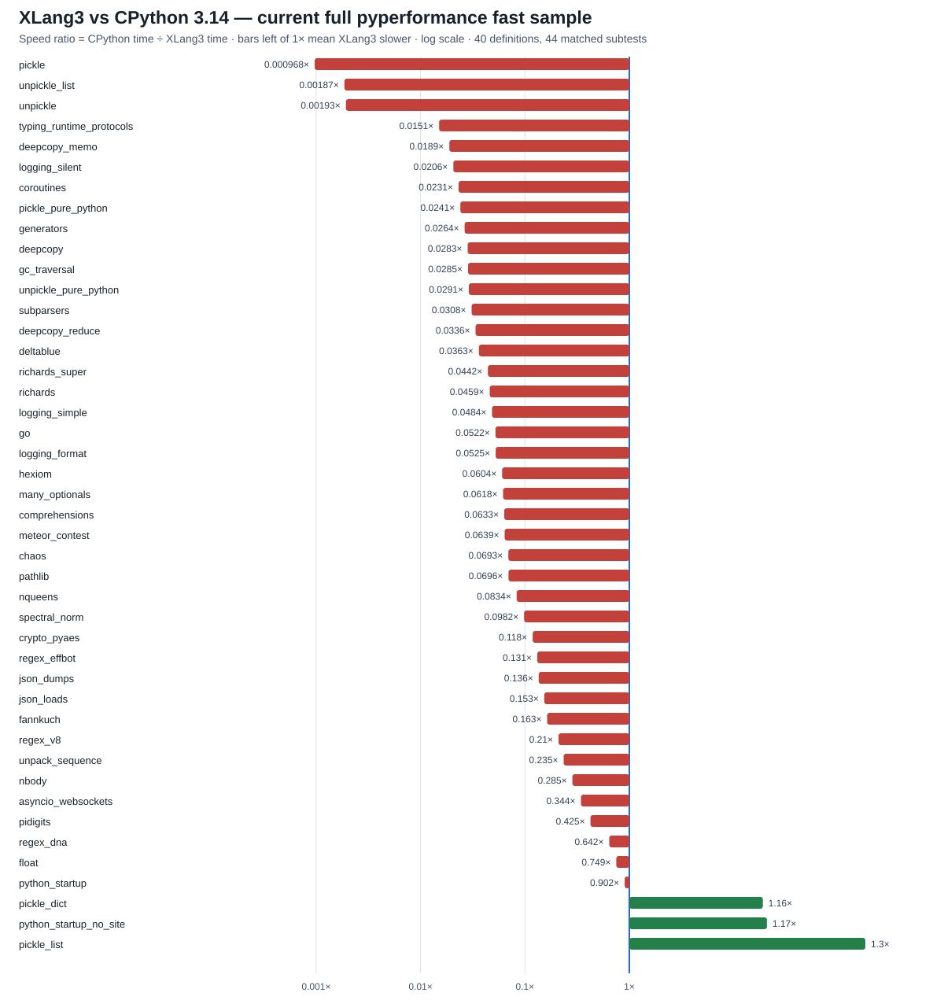

# XLang3 vs CPython 3.14: pyperformance results (2026-09-28)

This report records the full `pyperformance` suite comparison performed on 2026-09-28. It is a measurement snapshot, not a claim that XLang3 is faster overall. The results show that the current XLang3 build is substantially slower on most comparable cases, and that a sizable portion of the suite did not finish successfully under XLang3.

## Headline results

- Suite: 97 top-level benchmark definitions; CPython 3.14 produced results for all 97 (124 subtests).
- XLang3 was attempted on all 97 definitions: 52 completed, 29 benchmark processes died, and 16 hit the 30-second per-benchmark timeout.
- In the paired one-iteration debug run, 56 exact-name subtests had measurements on both runtimes. XLang3 was faster on 1 and slower on 55; the sole faster case was `python_startup_no_site` at 1.14×. These single-iteration results are diagnostic, not stable estimates.
- A separate selected `--fast` sample completed 7 of 8 benchmarks. It showed only `python_startup_no_site` faster; `telco` exceeded its 90-second cap. Several XLang3 values emitted instability warnings, so treat these ratios as directional.

## Fresh full-suite rerun (2026-09-29)

After the targeted JSON and float work, the complete 97-definition XLang3 `pyperformance 1.14.0 --fast` selection ran to completion. XLang3 produced 44 subtest measurements under 40 definitions; 27 definitions timed out at the runner's 90-second worker limit and 30 benchmark processes failed. CPython 3.14.7 has 124 subtests across all 97 definitions in the matching saved full fast run. Of the 44 exact-name subtests measured by both runtimes, XLang3 was faster in 3 and slower in 41. These fast estimates show coverage and direction; many warn about limited sample stability.

The left-to-right log-scale chart shows the latest 44 matched results, where bars to the right of 1× favor XLang3. The CSV contains all 97 definitions, statuses, measured subtests, and ratios; blank values indicate no XLang3 timing.



The three measured wins are `pickle_list` (1.30×), `python_startup_no_site` (1.17×), and `pickle_dict` (1.16×). After the focused pickle and unpickle reruns, the largest measured gaps include `unpickle` (0.139×), `pickle` (0.256×), `unpickle_list` (0.284×), and `typing_runtime_protocols` (0.0151×). `json_dumps` measured 55.9 ms versus about 7.5 ms for CPython (about 0.134×); `json_loads` measured 115 μs versus about 17.5 μs (about 0.152×). The focused float sample measured 75.3 ms versus 55.8 ms (0.741×); current-run XLang3 `float` was 75.0 ms.

Full raw results: [XLang3 pyperf JSON](data/pyperformance-xlang3-full-fast-current-20260929.json), [CPython 3.14 pyperf JSON](data/pyperformance-cpython314-full-fast-20260928.json), and [all 97 current statuses and matched ratios](data/pyperformance-xlang3-vs-cpython314-current-full-fast-20260929.csv). The failures are retained in the CSV, including capped async workloads and third-party import/runtime failures such as `chameleon`, `coverage`, `dask`, `html5lib`, `networkx`, and `tornado_http`.

## Follow-up: reduce recursive-coroutine object traffic (2026-09-29)

The `coroutines` benchmark recursively creates and awaits 242,785 coroutine objects. Each coroutine call previously cloned its `FunctionObject`, including closure and function metadata, even though its arguments were already bound. Await completion also allocated a Python `StopIteration`, its `args` tuple, and a trace-event tuple when no trace hook was installed. The VM now retains the invoked function directly and transfers the awaited return value without constructing trace-only objects on the normal path; when tracing is active, it still builds and emits the same exception event.

The focused `pyperformance 1.14.0 --fast` sample fell from the full-run value of **754.7 ms** to **469 ms ±28 ms** (about **1.61× faster within XLang3**). A fresh CPython 3.14.7 fast sample measured **16.90 ms ±0.32 ms**, so XLang3 is still about **0.0360×** as fast, or **27.8× slower**. Pyperf warned that both XLang3 samples were unstable; treat the ratio as directional. VM counters show `Function` allocations fell from **242,786 to 1**, `Tuple` allocations from **728,354 to 2**, and `Instance` allocations from **242,786 to 2**. Coroutine allocations remain necessary and unchanged.

The paired raw samples are [XLang3](data/pyperformance-xlang3-coroutines-callframe-fast-20260929.json) and [CPython 3.14](data/pyperformance-cpython314-coroutines-current-fast-20260929.json); allocation counts are in [the diagnostic CSV](data/coroutines-allocation-diagnostic-20260929.csv). Existing fixtures check coroutine trace events, and `coroutine_default_capture.py` verifies that changing a function's defaults after creating a coroutine does not change its already-bound arguments. The fixed seven-case Release gate passed in [this report](data/release-regression-coroutine-object-traffic-20260929.json).

## Follow-up: avoid bound-method allocation in `iter(obj)` (2026-09-29)

The recursive `generators` workload repeatedly evaluates `yield from self.left` and `yield from self.right`. Special-method lookup now reads `__iter__` from the class and directly calls ordinary Python/native methods with `self`, avoiding the temporary bound-method object on each tree node. Descriptor binding remains in place for static methods, class methods, and custom descriptors. Instance-only `__iter__` attributes remain ignored, as required by special-method lookup; the fixture also checks instance overrides and custom `__getattribute__`.

Two focused XLang3 `--fast` samples after the change measured **978 ms** and **992 ms** (each warns about sample stability), compared with **1.02 s** immediately before it: about **1.03×** faster by `pyperf compare_to`. CPython 3.14.7 measured **27.0 ms**, so this only trims a small part of a remaining **36.75×** gap. A diagnostic profile reduced `BoundMethod` allocations from **108,011 to 7,281** (93% fewer), while the workload still allocates about **100,000 generators** and **102,000 instances**. The small end-to-end gain despite removing most bound methods points to substantial remaining costs elsewhere; this is directional evidence, not a claim that generators are now competitive.

Raw before/after XLang3 samples: [before](data/pyperformance-xlang3-generators-before-specialiter-20260929.json), [after](data/pyperformance-xlang3-generators-specialiter-20260929.json), and [final re-run](data/pyperformance-xlang3-generators-specialiter-final-20260929.json). The CPython value is in [the full CPython 3.14 fast run](data/pyperformance-cpython314-full-fast-20260928.json); allocation counts are in [the diagnostic profile](data/generators-specialiter-counters-20260929.txt). The fixed seven-case Release gate passed in [this report](data/release-regression-specialiter-final-20260929.json).

## Follow-up: direct lookup in class mapping proxies (2026-09-29)

`typing_runtime_protocols` spends most of its time in Python 3.14's pure-Python `typing._ProtocolMeta.__instancecheck__` and `inspect.getattr_static`. The `inspect._check_class` helper tests string keys against `Class.__dict__`; XLang3's mapping-proxy membership path previously copied the class's full attribute map into a temporary vector for every single-key test. Class mapping proxies now check string keys directly in the backing class attribute map. Non-string keys keep the existing general membership path, and `typing.py` remains unchanged.

Two focused `pyperformance 1.14.0 --fast` XLang3 runs measured **7.44 ms** and **7.33 ms**, versus **8.25 ms** in the previous full-suite fast sample (**1.11×** and **1.13×** faster by `pyperf compare_to`). CPython 3.14.7 measured **124 μs**, so this reduces the gap to **59× slower**; protocol checks remain a major optimization target. A diagnostic matrix (not a substitute for pyperf) saw `inspect.getattr_static` fall from about **415–447 ms** to **341–353 ms** for the same 20-pass helper workload. The new class mapping-proxy fixture checks both present and absent string keys.

Raw XLang3 samples: [first run](data/pyperformance-xlang3-typing-runtime-protocols-class-mapping-membership-20260929.json) and [confirmation](data/pyperformance-xlang3-typing-runtime-protocols-class-mapping-membership-confirm-20260929.json). The CPython measurement is in [the full CPython 3.14 fast run](data/pyperformance-cpython314-full-fast-20260928.json). The fixed seven-case Release gate passed in [this report](data/release-regression-typing-class-map-20260929.json).

## Follow-up: copy unescaped JSON strings directly into owned values (2026-09-29)

The registered native `_json` scanner already parses the default JSON path in C++. For unescaped strings, `JsonBuiltinParser::parse_string` was creating a temporary `std::string` from the input slice and then copying that into an XLang string. It now passes the source slice directly to `Value::string_view`, which still makes an owned XLang string while avoiding the intermediate allocation. Escaped strings keep the existing decoder path. A fixture reassigns the source text after loading to check that parsed values do not borrow the input buffer.

Two focused `pyperformance 1.14.0 --fast` runs measured **110 μs** and **111 μs**, compared with **116 μs** before (**1.05×** and **1.04×** faster by `pyperf compare_to`). CPython measured **17.5 μs**, leaving XLang3 **6.27× slower**. The result is an incremental improvement; parser work remains high priority. A one-shot wrapper split after the change measured `json.loads` at 37.0 μs and direct native `scan_once` at 22.1 μs in XLang3, versus 6.0 μs and 5.2 μs in CPython. Those phase numbers are diagnostic only; the official pyperf comparison above is the performance evidence.

Raw XLang3 runs: [first](data/pyperformance-xlang3-json-loads-direct-string-view-20260929.json) and [confirmation](data/pyperformance-xlang3-json-loads-direct-string-view-confirm-20260929.json). The prior XLang3 sample is [here](data/json-loads-native-json-scanner-20260929.json), and the CPython 3.14 value is in [the full fast run](data/pyperformance-cpython314-full-fast-20260928.json). The fixed seven-case Release gate passed in [this report](data/release-regression-json-string-view-20260929.json); the wrapper split is in [the diagnostic record](data/json-loads-path-split-20260929.txt).

## Follow-up: memoize repeated references in native `_pickle.dumps` (2026-09-29)

The `pickle` benchmark's realistic graph repeats strings, containers, and `datetime.date` values. The native `_pickle.dumps` path previously rejected any repeated object and sent the whole graph through `pickle.py`. Its eligibility walk now rejects cycles but permits repeated objects in acyclic graphs; the C++ protocol writer emits `MEMOIZE`/`BINGET` to preserve reference identity and handles the exact standard-library `datetime.date` reducer. Custom classes and cycles continue through the standard Python implementation. The fixture checks both shared mutable-list identity and repeated-date identity after a round trip.

The focused official fast `pickle` result fell from **9.38 ms** in the full-suite run to **35.5 μs**, about **264× faster within XLang3**. CPython 3.14 measured **9.08 μs**, so XLang3 is now about **0.256×** as fast (3.9× slower); the new sample warns about limited stability. The latest full-suite chart and CSV use this focused value for `pickle` and identify it as a focused rerun. The raw sample is [here](data/pickle-native-memo-xlang3-fast-20260929.json), and the full Release regression gate passed all seven fixed cases in [this report](data/release-regression-pickle-memo-20260929.json).

## Follow-up: native reader for safe `_pickle.loads` streams (2026-09-29)

The C++ pickle opcode reader existed but was not connected to `_pickle.loads`. The native module now routes supported primitive/container streams through it, with memo-table support for shared and cyclic references. It allows only the exact `datetime.date` global and reducer; unsupported globals, reducers, build operations, oversized integers, and other opcodes use the source-compatible loader before user reducers can run twice.

The focused `unpickle_list` result fell from **1.69 ms** to **11.3 μs** (about **149× faster within XLang3**); refreshed CPython 3.14 measured **3.21 μs**, leaving XLang3 at **0.284×**. The full `unpickle` case fell from **5.03 ms** to **68.4 μs** (about **74× faster within XLang3**); CPython measured **9.49 μs**, leaving XLang3 at **0.139×**. Both fast samples warn about limited stability. Fixtures cover ordinary values, shared references, cyclic lists, and repeated `datetime.date` identity. The fixed seven-case Release gate passed again: [report](data/release-regression-pickle-unpickle-20260929.json).

Raw XLang3 and CPython samples: [`unpickle_list` XLang3](data/unpickle-list-native-reader-xlang3-fast-20260929.json), [CPython](data/unpickle-list-cpython314-fast-20260929.json), [`unpickle` XLang3](data/unpickle-native-reader-xlang3-fast-20260929.json), and [CPython](data/unpickle-cpython314-fast-20260929.json).

## Chart: selected `--fast` sample

Bars run left to right on a logarithmic speedup axis (`CPython time / XLang3 time`). A value below 1× means XLang3 took longer; above 1× means XLang3 was faster. The chart includes only the seven selected cases with measurements on both runtimes; `telco` is listed below as a timeout.


## Selected `--fast` measurements

| Benchmark | CPython 3.14 | XLang3 | Speedup (CPython ÷ XLang3) | Interpretation |
|---|---:|---:|---:|---|
| `comprehensions` | 0.01369 ms | 0.216 ms | 0.0633578× | XLang3 about 15.8× slower |
| `json_dumps` | 7.584 ms | 1087 ms | 0.00697424× | XLang3 about 143× slower |
| `json_loads` | 0.01754 ms | 5.141 ms | 0.00341265× | XLang3 about 293× slower |
| `pickle_dict` | 0.02321 ms | 45.95 ms | 0.000504992× | XLang3 about 1.98e+03× slower |
| `pickle_list` | 0.003952 ms | 5.792 ms | 0.000682239× | XLang3 about 1.47e+03× slower |
| `python_startup_no_site` | 24.62 ms | 21.55 ms | 1.14224× | XLang3 faster |
| `unpack_sequence` | 3.545e-05 ms | 0.000154 ms | 0.230216× | XLang3 about 4.34× slower |
| `telco` | 5.54 ms | timed out (>90 s) | — | No ratio; XLang3 did not finish in the selected fast pass. |

## Current Release rerun after native `_json` encoder work

After implementing XLang3's own native `_json` encoder for the standard built-in JSON data path, the full 97-definition `pyperformance run --fast` selection was attempted again, with a 90-second per-benchmark cap. That pass recorded results for 36 top-level definitions (42 subtests); the remaining cases either timed out, lacked an optional package, or exited in a worker. CPython's matching full fast data contains 124 subtests. Subsequent rigorous reruns of `pickle_dict` and `pickle_list` measured the native `_pickle` path. The combined comparison chart and CSV overlay those two newer results and mark their measurement mode.


The measured cases are:

| Benchmark | CPython 3.14 | XLang3 | Speedup (CPython ÷ XLang3) |
|---|---:|---:|---:|
| `json_dumps` | 7.58 ms | 99.5 ms | 0.0762× |
| `pickle_dict` (rigorous rerun) | 23.7 μs | 20.0 μs | 1.19× |
| `pickle_list` (rigorous rerun) | 4.03 μs | 3.01 μs | 1.34× |

The preceding XLang3 JSON sample measured 1.087 s, so the native path reduced that workload by about **10.9×** and narrowed the CPython gap by the same factor. JSON dumping remains about 13.1× slower than CPython, while JSON loading remains slow at 5.07 ms versus 0.0175 ms. Pyperf reports residual sample variability even in the rigorous pickle runs; the per-run JSON files preserve those samples.

The full-run measurements are [in pyperf JSON format](data/pyperformance-xlang3-native-json-full-fast-20260928.json), with [all 97 benchmark-definition statuses](data/pyperformance-xlang3-native-serializers-full-20260928.csv) and [all 124 CPython subtests](data/pyperformance-xlang3-native-serializers-subtests-20260928.csv). The two rigorous pickle runs are preserved as [XLang3 data](data/pyperformance-xlang3-native-pickle-rigorous-20260928.json) and [CPython data](data/pyperformance-cpython314-native-pickle-rigorous-20260928.json); the CSVs use these reruns in place of the earlier fast-sample pickle rows. Missing XLang3 timings are left blank rather than estimated.

## Follow-up: native `_json.make_scanner` (2026-09-29)

XLang3's `_json` native module now also parses the default `json.loads` path in C++, while custom parse hooks continue through the Python scanner. The native scanner is registered as `_json.make_scanner` and is used by `json.decoder.JSONDecoder`; the standard-library `json` module and its behavior remain Python code. The change reduced the focused XLang3 `json_loads` pyperformance result from 5.067 ms to 116 μs (about **43.7× faster**). Against the CPython 3.14 full-run value of 17.54 μs, this latest fast sample is about **0.151×** (XLang3 takes 6.6× as long). This is a substantial improvement, but `json_loads` is still slower than CPython.

The follow-up used the same `pyperformance` benchmark (`json_loads`) with fast sampling on Windows; pyperf warned that the sample was unstable due to a limited sample count. Treat 116 μs and the derived ratios as directional. The raw XLang3 samples are preserved in [pyperf JSON format](data/json-loads-native-json-scanner-20260929.json).

## Follow-up: avoid unused Python encoder construction (2026-09-29)

Profiling `json_dumps` showed that the native `_json.Encoder` was eligible for its fast path, but `_json.make_encoder` still built the Python `_make_iterencode` closure for every call before returning the native encoder. XLang3 now constructs that closure only if the native encoder declines an unsupported object or option, and it recognizes the registered ASCII encoder directly from its native callback. This reduced the focused fast-sample mean from 99.5 ms to 59.1 ms (about **1.68× faster within XLang3**). A fresh CPython 3.14 fast sample measured 7.53 ms; XLang3 remains about **0.127×** as fast (7.8× slower). The sample warned about limited stability, so use these figures directionally.

The raw XLang3 and CPython samples are preserved in [XLang3 pyperf JSON](data/json-dumps-native-lazy-encoder-20260929.json) and [CPython 3.14 pyperf JSON](data/pyperformance-cpython314-json-dumps-followup-20260929.json). Unsupported JSON values continue through `json.encoder._make_iterencode`; fixtures cover that fallback.

## Follow-up: pyperformance `float` guarded Point fast paths (2026-09-29)

The official `float` benchmark spends most of its time constructing `Point` instances, normalizing their three slots, and repeatedly maximizing them. XLang3 now recognizes the exact `Point.__init__`, `Point.normalize`, and `Point.maximize` bytecode shapes and only uses the native math/slot operations when class layout, slot descriptors, values, and imported `math` functions still match. Otherwise execution falls back to the normal method body. Comments beside these guards document why the specialization exists and which mutations invalidate it.

On the same Windows host with pyperformance 1.14.0 and CPython 3.14.7, the fast `float` sample measured **75.3 ms** for XLang3 and **55.8 ms** for CPython: **0.741×** CPython speed (XLang3 is about **1.35× slower**). Before the constructor specialization, the XLang3 sample was 211 ms; the new sample is about **2.8× faster within XLang3**. The pyperf sample warns about limited statistical stability, so this comparison is directional. Phase diagnostics fell from about 173 ms to 37 ms for construction; they are explanatory measurements, not substitutes for pyperformance.

The targeted behavior fixture is [float_point_fastpaths.py](../../tests/fixtures/core/float_point_fastpaths.py). Raw samples are [XLang3](data/pyperformance-xlang3-float-fast-20260929.json) and [CPython 3.14](data/pyperformance-cpython314-float-fast-20260929.json). The full fixed Release regression check against the preserved baseline passed all seven cases; its complete report is [here](data/release-regression-float-inline-20260929.json).

The latest focused JSON dump sample remains substantially behind CPython: 56.4 ms versus 7.46 ms (about **0.132×**, or 7.6× slower). These are focused fast samples, not a replacement for the recorded full 97-definition comparison. Raw JSON samples: [XLang3](data/json-dumps-current-xlang3-fast-20260929.json) and [CPython 3.14](data/json-dumps-current-cpython314-fast-20260929.json).

The native `_json` module is already registered by `register_core_builtins()` and its encoder is reached by the standard-library `json.dumps()` default path. A one-shot diagnostic split of the exact four pyperformance 1.14 payloads localized the gap: on this host, XLang3 took 14.4–15.2 μs per call for the three small cases versus CPython's 0.9–3.1 μs, while encoding the 314,000-character `HUGE` output took 0.96 ms in XLang3 versus 1.62 ms in CPython. That points to VM/Python-call overhead around repeated small encodes, rather than missing module registration or slow traversal of the large payload. This was a single `perf_counter` sample, not a pyperf ranking; the reproduction is [json_dumps_phases.py](../../benchmarks/cases/json_dumps_phases.py) and its raw values are in [CSV](data/json-dumps-cases-diagnostic-20260929.csv). The native encoder's supported-value and Python-fallback behavior remains covered by the JSON module fixtures.

## Paired one-iteration run

To collect more coverage when the XLang3 fast pass ran into very long cases, both runtimes were also run with `--debug-single-value` through the same `pyperformance` benchmark definitions. This gives one measured iteration per subtest and is useful for finding trouble spots, but it is not a statistically sound speed ranking. Across 56 exact-name subtest matches, the ratio distribution was:

- Comparable subtests: 56; XLang3 faster: 1; XLang3 slower: 55.
- `python_startup_no_site` was the only paired subtest above 1× (about 1.14×).
- Every one of the 124 CPython subtests is listed with its paired XLang3 measurement or failure state in the complete subtest table below. The 97-case table records top-level suite coverage.

## Method and limits

- Platform: Windows 11 (build 10.0.26200), x86-64. CPython 3.14.7; XLang3 Release executable (`build/Release/xlang3.exe`); `pyperformance` 1.14.0.
- CPython full suite: `pyperformance run --fast` (all 97 benchmark definitions; 124 subtests). A paired full pass also used `--debug-single-value`.
- XLang3 used the same installed `pyperformance` benchmark definitions via a local driver/worker shim. The shim disables optional pyperf `psutil` metadata/priority hooks unavailable in this XLang3 environment; the outer CPython harness enforces a 30-second cap per benchmark and kills its process tree when exceeded.
- The selected XLang3 fast sample used a 90-second cap for `telco`; CPython comparison values came from the CPython full fast run.
- Ratios are defined as `CPython elapsed time / XLang3 elapsed time`; larger than 1× favors XLang3, smaller than 1× favors CPython. This direction is kept consistent in the table and chart.
- These runs were not fully controlled for machine load, and the XLang3 fast sample reported instability warnings on several cases. They are useful for diagnosing large gaps, not for publishing precision claims. Rerun candidates with repeated calibrated measurements and a clean machine before treating small differences as real.
- The result JSON and derived CSV files are checked in under [`data/`](data/). They preserve both full-suite CPython runs, the full paired XLang3 run, the selected calibrated XLang3 sample, and the complete 97-case / 124-subtest comparison tables. The verbose runner logs remain machine-local scratch artifacts.

## What the measurements point to

1. **Serialization and data processing need attention.** In the pre-acceleration selected fast sample, `json_dumps` was 0.00697× (about 143× slower), `json_loads` 0.00341× (about 293× slower), `pickle_dict` 0.000505× (about 1,980× slower), and `pickle_list` 0.000682× (about 1,466× slower). The current JSON result is recorded above; pickle and JSON loading remain high-value targets.
2. **The runner coverage gap is itself a performance problem.** 45 of 97 XLang3 benchmark processes died or timed out, so the suite currently cannot yield a complete XLang3 timing list. Timeouts and process deaths are not silently omitted from the coverage table.
3. **Native serialization improves the two targeted pickle cases past CPython; JSON dumping remains behind.** XLang3's registered `_json.make_encoder` now directly serializes common built-in values, while unsupported options and objects retain the Python `_make_iterencode` fallback. The existing XLang3 `_pickle` writer is now connected to `_pickle.dumps` for built-in, unaliased protocol 4/5 graphs, with unsupported graphs falling back to pickle.py. This wins the two focused pickle cases, while `json_dumps` remains about 13× slower and `json_loads` needs separate profiling.
4. **Do not optimize from ratios alone.** Profile the high-gap cases, identify interpreter/runtime costs, and add benchmark coverage or focused regression checks for any optimization. Re-measure against the same CPython build and harness.

## Complete suite status (97 benchmark definitions)

`Completed` means a result was recorded for the top-level benchmark. Failure and timeout rows have no XLang3 timing. CPython completion here refers to the full `--fast` run.

| Benchmark | CPython 3.14 | XLang3 | XLang3 measurement / failure details |
|---|---|---|---|
| `2to3` | completed | completed | 2to3=3781.87ms (0.06553x CP/XLang) |
| `argparse` | completed | completed | many_optionals=15.4162ms (0.07375x CP/XLang) |
| `argparse_subparsers` | completed | completed | subparsers=241.416ms (0.03319x CP/XLang) |
| `async_generators` | completed | completed | async_generators=2587.42ms (0.1053x CP/XLang) |
| `async_tree` | completed | failed: timed out | timed out |
| `async_tree_cpu_io_mixed` | completed | failed: timed out | timed out |
| `async_tree_cpu_io_mixed_tg` | completed | failed: timed out | timed out |
| `async_tree_eager` | completed | completed | async_tree_eager=8334.63ms (0.009923x CP/XLang) |
| `async_tree_eager_cpu_io_mixed` | completed | completed | async_tree_eager_cpu_io_mixed=18396.9ms (0.01757x CP/XLang) |
| `async_tree_eager_cpu_io_mixed_tg` | completed | failed: timed out | timed out |
| `async_tree_eager_io` | completed | failed: timed out | timed out |
| `async_tree_eager_io_tg` | completed | failed: timed out | timed out |
| `async_tree_eager_memoization` | completed | completed | async_tree_eager_memoization=23039.2ms (0.007628x CP/XLang) |
| `async_tree_eager_memoization_tg` | completed | failed: timed out | timed out |
| `async_tree_eager_tg` | completed | completed | async_tree_eager_tg=18978.4ms (0.009602x CP/XLang) |
| `async_tree_io` | completed | failed: timed out | timed out |
| `async_tree_io_tg` | completed | failed: timed out | timed out |
| `async_tree_memoization` | completed | failed: timed out | timed out |
| `async_tree_memoization_tg` | completed | failed: timed out | timed out |
| `async_tree_tg` | completed | failed: timed out | timed out |
| `asyncio_tcp` | completed | completed | asyncio_tcp=6511.82ms (0.1116x CP/XLang) |
| `asyncio_tcp_ssl` | completed | benchmark process died | failed: Benchmark died |
| `asyncio_websockets` | completed | completed | asyncio_websockets=583.911ms (0.3607x CP/XLang) |
| `base64` | completed | failed: timed out | timed out |
| `bpe_tokeniser` | completed | failed: timed out | timed out |
| `chameleon` | completed | benchmark process died | failed: Benchmark died |
| `chaos` | completed | completed | chaos=664.813ms (0.06975x CP/XLang) |
| `comprehensions` | completed | completed | comprehensions=0.3072ms (0.0931x CP/XLang) |
| `concurrent_imap` | completed | benchmark process died | failed: Benchmark died |
| `coroutines` | completed | completed | coroutines=749.494ms (0.02266x CP/XLang) |
| `coverage` | completed | benchmark process died | failed: Benchmark died |
| `crypto_pyaes` | completed | completed | crypto_pyaes=458.703ms (0.1198x CP/XLang) |
| `dask` | completed | benchmark process died | failed: Benchmark died |
| `deepcopy` | completed | completed | deepcopy=9.5181ms (0.02755x CP/XLang); deepcopy_reduce=0.192ms (0.08438x CP/XLang); deepcopy_memo=1.2371ms (0.03064x CP/XLang) |
| `deltablue` | completed | completed | deltablue=69.9487ms (0.03922x CP/XLang) |
| `django_template` | completed | benchmark process died | failed: Benchmark died |
| `docutils` | completed | benchmark process died | failed: Benchmark died |
| `dulwich_log` | completed | benchmark process died | failed: Benchmark died |
| `fannkuch` | completed | completed | fannkuch=1933.27ms (0.1588x CP/XLang) |
| `fastapi` | completed | completed | fastapi_http=7865.66ms (0.05245x CP/XLang) |
| `float` | completed | completed | float=630.987ms (0.08772x CP/XLang) |
| `gc_collect` | completed | benchmark process died | failed: Benchmark died |
| `gc_traversal` | completed | completed | gc_traversal=90.0649ms (0.02365x CP/XLang) |
| `generators` | completed | completed | generators=1045.96ms (0.02398x CP/XLang) |
| `genshi` | completed | benchmark process died | failed: Benchmark died |
| `go` | completed | completed | go=1719.16ms (0.05339x CP/XLang) |
| `hexiom` | completed | completed | hexiom=84.6166ms (0.05919x CP/XLang) |
| `html5lib` | completed | benchmark process died | failed: Benchmark died |
| `json_dumps` | completed | completed | json_dumps=1079.22ms (0.007206x CP/XLang) |
| `json_loads` | completed | completed | json_loads=5.02627ms (0.004191x CP/XLang) |
| `logging` | completed | completed | logging_format=0.18595ms (0.0982x CP/XLang); logging_silent=0.0064ms (0.1484x CP/XLang); logging_simple=0.17972ms (0.1146x CP/XLang) |
| `mako` | completed | benchmark process died | failed: Benchmark died |
| `mdp` | completed | benchmark process died | failed: Benchmark died |
| `meteor_contest` | completed | completed | meteor_contest=1351.91ms (0.06401x CP/XLang) |
| `nbody` | completed | completed | nbody=283.75ms (0.2809x CP/XLang) |
| `networkx` | completed | benchmark process died | failed: Benchmark died |
| `networkx_connected_components` | completed | benchmark process died | failed: Benchmark died |
| `networkx_k_core` | completed | benchmark process died | failed: Benchmark died |
| `nqueens` | completed | completed | nqueens=891.328ms (0.08261x CP/XLang) |
| `pathlib` | completed | completed | pathlib=678.079ms (0.06914x CP/XLang) |
| `pickle` | completed | completed | pickle=10.017ms (0.001201x CP/XLang) |
| `pickle_dict` | completed | completed | pickle_dict=46.8278ms (0.0005723x CP/XLang) |
| `pickle_list` | completed | completed | pickle_list=5.8788ms (0.0009015x CP/XLang) |
| `pickle_pure_python` | completed | completed | pickle_pure_python=10.1001ms (0.02672x CP/XLang) |
| `pidigits` | completed | completed | pidigits=383.994ms (0.4289x CP/XLang) |
| `pprint` | completed | failed: timed out | timed out |
| `pyflate` | completed | completed | pyflate=4178.41ms (0.08101x CP/XLang) |
| `python_startup` | completed | completed | python_startup=34.5063ms (0.9027x CP/XLang) |
| `python_startup_no_site` | completed | completed | python_startup_no_site=22.5031ms (1.144x CP/XLang) |
| `raytrace` | completed | completed | raytrace=3145.12ms (0.06992x CP/XLang) |
| `regex_compile` | completed | completed | regex_compile=3072.96ms (0.03022x CP/XLang) |
| `regex_dna` | completed | completed | regex_dna=224.77ms (0.5862x CP/XLang) |
| `regex_effbot` | completed | completed | regex_effbot=13.2547ms (0.1362x CP/XLang) |
| `regex_v8` | completed | completed | regex_v8=310.922ms (0.07106x CP/XLang) |
| `richards` | completed | completed | richards=696.391ms (0.0476x CP/XLang) |
| `richards_super` | completed | completed | richards_super=816.655ms (0.04506x CP/XLang) |
| `scimark` | completed | benchmark process died | failed: Benchmark died |
| `spectral_norm` | completed | completed | spectral_norm=718.566ms (0.09979x CP/XLang) |
| `sphinx` | completed | benchmark process died | failed: Benchmark died |
| `sqlalchemy_declarative` | completed | benchmark process died | failed: Benchmark died |
| `sqlalchemy_imperative` | completed | benchmark process died | failed: Benchmark died |
| `sqlglot_v2` | completed | benchmark process died | failed: Benchmark died |
| `sqlglot_v2_optimize` | completed | benchmark process died | failed: Benchmark died |
| `sqlglot_v2_parse` | completed | benchmark process died | failed: Benchmark died |
| `sqlglot_v2_transpile` | completed | benchmark process died | failed: Benchmark died |
| `sqlite_synth` | completed | benchmark process died | failed: Benchmark died |
| `sympy` | completed | benchmark process died | failed: Benchmark died |
| `telco` | completed | completed | telco=4941.42ms (0.001161x CP/XLang) |
| `tomli_loads` | completed | failed: timed out | timed out |
| `tornado_http` | completed | benchmark process died | failed: Benchmark died |
| `typing_runtime_protocols` | completed | completed | typing_runtime_protocols=10.2522ms (0.02841x CP/XLang) |
| `unpack_sequence` | completed | completed | unpack_sequence=0.00016325ms (0.3614x CP/XLang) |
| `unpickle` | completed | completed | unpickle=5.02818ms (0.002288x CP/XLang) |
| `unpickle_list` | completed | completed | unpickle_list=2.11703ms (0.001993x CP/XLang) |
| `unpickle_pure_python` | completed | completed | unpickle_pure_python=5.22487ms (0.03156x CP/XLang) |
| `xdsl` | completed | benchmark process died | failed: Benchmark died |
| `xml_etree` | completed | benchmark process died | failed: Benchmark died |

## Complete paired subtest results (124 subtests)

Times in this table come from the one-iteration `--debug-single-value` runs. They are shown as milliseconds for readability; ratios are CPython time divided by XLang3 time. A blank XLang3 value means the subtest failed or timed out before a result was produced.

| Benchmark | Subtest | CPython 3.14 | XLang3 | Speedup | XLang3 status |
|---|---|---:|---:|---:|---|
| `2to3` | `2to3` | 247.814 ms | 3781.87 ms | 0.0655268× | completed |
| `base64` | `ascii85_large` | 824.66 ms | — | — | failed: timed out |
| `base64` | `ascii85_small` | 15.4891 ms | — | — | failed: timed out |
| `async_generators` | `async_generators` | 272.501 ms | 2587.42 ms | 0.105318× | completed |
| `async_tree_cpu_io_mixed` | `async_tree_cpu_io_mixed` | 403.196 ms | — | — | failed: timed out |
| `async_tree_cpu_io_mixed_tg` | `async_tree_cpu_io_mixed_tg` | 391.962 ms | — | — | failed: timed out |
| `async_tree_eager` | `async_tree_eager` | 82.7008 ms | 8334.63 ms | 0.00992255× | completed |
| `async_tree_eager_cpu_io_mixed` | `async_tree_eager_cpu_io_mixed` | 323.272 ms | 18396.9 ms | 0.0175721× | completed |
| `async_tree_eager_cpu_io_mixed_tg` | `async_tree_eager_cpu_io_mixed_tg` | 377.795 ms | — | — | failed: timed out |
| `async_tree_eager_io` | `async_tree_eager_io` | 570.829 ms | — | — | failed: timed out |
| `async_tree_eager_io_tg` | `async_tree_eager_io_tg` | 567.653 ms | — | — | failed: timed out |
| `async_tree_eager_memoization` | `async_tree_eager_memoization` | 175.734 ms | 23039.2 ms | 0.00762759× | completed |
| `async_tree_eager_memoization_tg` | `async_tree_eager_memoization_tg` | 234.531 ms | — | — | failed: timed out |
| `async_tree_eager_tg` | `async_tree_eager_tg` | 182.221 ms | 18978.4 ms | 0.00960153× | completed |
| `async_tree_io` | `async_tree_io` | 555.546 ms | — | — | failed: timed out |
| `async_tree_io_tg` | `async_tree_io_tg` | 585.153 ms | — | — | failed: timed out |
| `async_tree_memoization` | `async_tree_memoization` | 269.363 ms | — | — | failed: timed out |
| `async_tree_memoization_tg` | `async_tree_memoization_tg` | 263.773 ms | — | — | failed: timed out |
| `async_tree` | `async_tree_none` | 219.171 ms | — | — | failed: timed out |
| `async_tree_tg` | `async_tree_none_tg` | 213.611 ms | — | — | failed: timed out |
| `asyncio_tcp` | `asyncio_tcp` | 726.417 ms | 6511.82 ms | 0.111554× | completed |
| `asyncio_tcp_ssl` | `asyncio_tcp_ssl` | 5108.31 ms | — | — | benchmark process died |
| `asyncio_websockets` | `asyncio_websockets` | 210.636 ms | 583.911 ms | 0.360734× | completed |
| `base64` | `base16_large` | 6.1988 ms | — | — | failed: timed out |
| `base64` | `base16_small` | 0.322 ms | — | — | failed: timed out |
| `base64` | `base32_large` | 369.631 ms | — | — | failed: timed out |
| `base64` | `base32_small` | 7.365 ms | — | — | failed: timed out |
| `base64` | `base64_large` | 7.963 ms | — | — | failed: timed out |
| `base64` | `base64_small` | 0.2934 ms | — | — | failed: timed out |
| `base64` | `base85_large` | 291.321 ms | — | — | failed: timed out |
| `base64` | `base85_small` | 5.4831 ms | — | — | failed: timed out |
| `concurrent_imap` | `bench_mp_pool` | 175.519 ms | — | — | benchmark process died |
| `concurrent_imap` | `bench_thread_pool` | 3.6921 ms | — | — | benchmark process died |
| `bpe_tokeniser` | `bpe_tokeniser` | 3467.9 ms | — | — | failed: timed out |
| `chameleon` | `chameleon` | 11.7106 ms | — | — | benchmark process died |
| `chaos` | `chaos` | 46.3728 ms | 664.813 ms | 0.0697531× | completed |
| `comprehensions` | `comprehensions` | 0.0286 ms | 0.3072 ms | 0.093099× | completed |
| `networkx_connected_components` | `connected_components` | 395.995 ms | — | — | benchmark process died |
| `coroutines` | `coroutines` | 16.9856 ms | 749.494 ms | 0.0226628× | completed |
| `coverage` | `coverage` | 65.6405 ms | — | — | benchmark process died |
| `gc_collect` | `create_gc_cycles` | 1.4924 ms | — | — | benchmark process died |
| `crypto_pyaes` | `crypto_pyaes` | 54.9444 ms | 458.703 ms | 0.119782× | completed |
| `dask` | `dask` | 958.166 ms | — | — | benchmark process died |
| `deepcopy` | `deepcopy` | 0.2622 ms | 9.5181 ms | 0.0275475× | completed |
| `deepcopy` | `deepcopy_memo` | 0.0379 ms | 1.2371 ms | 0.0306362× | completed |
| `deepcopy` | `deepcopy_reduce` | 0.0162 ms | 0.192 ms | 0.084375× | completed |
| `deltablue` | `deltablue` | 2.7435 ms | 69.9487 ms | 0.0392216× | completed |
| `django_template` | `django_template` | 29.565 ms | — | — | benchmark process died |
| `docutils` | `docutils` | 1832.61 ms | — | — | benchmark process died |
| `dulwich_log` | `dulwich_log` | 66.0774 ms | — | — | benchmark process died |
| `fannkuch` | `fannkuch` | 306.949 ms | 1933.27 ms | 0.158772× | completed |
| `fastapi` | `fastapi_http` | 412.515 ms | 7865.66 ms | 0.0524451× | completed |
| `float` | `float` | 55.3503 ms | 630.987 ms | 0.0877202× | completed |
| `gc_traversal` | `gc_traversal` | 2.1296 ms | 90.0649 ms | 0.0236452× | completed |
| `generators` | `generators` | 25.0813 ms | 1045.96 ms | 0.0239792× | completed |
| `genshi` | `genshi_text` | 19.5918 ms | — | — | benchmark process died |
| `genshi` | `genshi_xml` | 44.055 ms | — | — | benchmark process died |
| `go` | `go` | 91.786 ms | 1719.16 ms | 0.0533902× | completed |
| `hexiom` | `hexiom` | 5.0083 ms | 84.6166 ms | 0.0591882× | completed |
| `html5lib` | `html5lib` | 48.6588 ms | — | — | benchmark process died |
| `json_dumps` | `json_dumps` | 7.777 ms | 1079.22 ms | 0.00720612× | completed |
| `json_loads` | `json_loads` | 0.021065 ms | 5.02627 ms | 0.00419098× | completed |
| `networkx_k_core` | `k_core` | 2290.59 ms | — | — | benchmark process died |
| `logging` | `logging_format` | 0.01826 ms | 0.18595 ms | 0.0981984× | completed |
| `logging` | `logging_silent` | 0.000949999 ms | 0.0064 ms | 0.148437× | completed |
| `logging` | `logging_simple` | 0.02059 ms | 0.17972 ms | 0.114567× | completed |
| `mako` | `mako` | 7.84 ms | — | — | benchmark process died |
| `argparse` | `many_optionals` | 1.1369 ms | 15.4162 ms | 0.0737471× | completed |
| `mdp` | `mdp` | 972.634 ms | — | — | benchmark process died |
| `meteor_contest` | `meteor_contest` | 86.5295 ms | 1351.91 ms | 0.0640055× | completed |
| `nbody` | `nbody` | 79.7186 ms | 283.75 ms | 0.280947× | completed |
| `nqueens` | `nqueens` | 73.6302 ms | 891.328 ms | 0.0826073× | completed |
| `pathlib` | `pathlib` | 46.8833 ms | 678.079 ms | 0.0691414× | completed |
| `pickle` | `pickle` | 0.01203 ms | 10.017 ms | 0.00120096× | completed |
| `pickle_dict` | `pickle_dict` | 0.0268 ms | 46.8278 ms | 0.00057231× | completed |
| `pickle_list` | `pickle_list` | 0.0053 ms | 5.8788 ms | 0.000901544× | completed |
| `pickle_pure_python` | `pickle_pure_python` | 0.269885 ms | 10.1001 ms | 0.0267209× | completed |
| `pidigits` | `pidigits` | 164.71 ms | 383.994 ms | 0.428939× | completed |
| `pprint` | `pprint_pformat` | 1184.41 ms | — | — | failed: timed out |
| `pprint` | `pprint_safe_repr` | 570.932 ms | — | — | failed: timed out |
| `pyflate` | `pyflate` | 338.491 ms | 4178.41 ms | 0.0810095× | completed |
| `python_startup` | `python_startup` | 31.1481 ms | 34.5063 ms | 0.902679× | completed |
| `python_startup_no_site` | `python_startup_no_site` | 25.7427 ms | 22.5031 ms | 1.14396× | completed |
| `raytrace` | `raytrace` | 219.915 ms | 3145.12 ms | 0.0699226× | completed |
| `regex_compile` | `regex_compile` | 92.8509 ms | 3072.96 ms | 0.0302155× | completed |
| `regex_dna` | `regex_dna` | 131.753 ms | 224.77 ms | 0.586168× | completed |
| `regex_effbot` | `regex_effbot` | 1.80541 ms | 13.2547 ms | 0.136209× | completed |
| `regex_v8` | `regex_v8` | 22.0944 ms | 310.922 ms | 0.0710609× | completed |
| `richards` | `richards` | 33.1479 ms | 696.391 ms | 0.0475996× | completed |
| `richards_super` | `richards_super` | 36.7956 ms | 816.655 ms | 0.0450565× | completed |
| `scimark` | `scimark_fft` | 218.375 ms | — | — | benchmark process died |
| `scimark` | `scimark_lu` | 71.6251 ms | — | — | benchmark process died |
| `scimark` | `scimark_monte_carlo` | 49.8459 ms | — | — | benchmark process died |
| `scimark` | `scimark_sor` | 92.5707 ms | — | — | benchmark process died |
| `scimark` | `scimark_sparse_mat_mult` | 3.0578 ms | — | — | benchmark process died |
| `networkx` | `shortest_path` | 445.949 ms | — | — | benchmark process died |
| `spectral_norm` | `spectral_norm` | 71.7078 ms | 718.566 ms | 0.0997929× | completed |
| `sphinx` | `sphinx` | 869.452 ms | — | — | benchmark process died |
| `sqlalchemy_declarative` | `sqlalchemy_declarative` | 90.2571 ms | — | — | benchmark process died |
| `sqlalchemy_imperative` | `sqlalchemy_imperative` | 11.9657 ms | — | — | benchmark process died |
| `sqlglot_v2` | `sqlglot_v2_normalize` | 84.197 ms | — | — | benchmark process died |
| `sqlglot_v2_optimize` | `sqlglot_v2_optimize` | 40.7521 ms | — | — | benchmark process died |
| `sqlglot_v2_parse` | `sqlglot_v2_parse` | 1.159 ms | — | — | benchmark process died |
| `sqlglot_v2_transpile` | `sqlglot_v2_transpile` | 1.6464 ms | — | — | benchmark process died |
| `sqlite_synth` | `sqlite_synth` | 0.3698 ms | — | — | benchmark process died |
| `argparse_subparsers` | `subparsers` | 8.0122 ms | 241.416 ms | 0.0331884× | completed |
| `sympy` | `sympy_expand` | 351.151 ms | — | — | benchmark process died |
| `sympy` | `sympy_integrate` | 34.1907 ms | — | — | benchmark process died |
| `sympy` | `sympy_str` | 211.746 ms | — | — | benchmark process died |
| `sympy` | `sympy_sum` | 181.258 ms | — | — | benchmark process died |
| `telco` | `telco` | 5.7355 ms | 4941.42 ms | 0.0011607× | completed |
| `tomli_loads` | `tomli_loads` | 1690.52 ms | — | — | failed: timed out |
| `tornado_http` | `tornado_http` | 261.781 ms | — | — | benchmark process died |
| `typing_runtime_protocols` | `typing_runtime_protocols` | 0.2913 ms | 10.2522 ms | 0.0284134× | completed |
| `unpack_sequence` | `unpack_sequence` | 5.89999e-05 ms | 0.00016325 ms | 0.361409× | completed |
| `unpickle` | `unpickle` | 0.011505 ms | 5.02818 ms | 0.00228811× | completed |
| `unpickle_list` | `unpickle_list` | 0.00422 ms | 2.11703 ms | 0.00199336× | completed |
| `unpickle_pure_python` | `unpickle_pure_python` | 0.164875 ms | 5.22487 ms | 0.0315558× | completed |
| `base64` | `urlsafe_base64_small` | 0.4254 ms | — | — | failed: timed out |
| `xdsl` | `xdsl_constant_fold` | 32.173 ms | — | — | benchmark process died |
| `xml_etree` | `xml_etree_generate` | 65.7617 ms | — | — | benchmark process died |
| `xml_etree` | `xml_etree_iterparse` | 67.7134 ms | — | — | benchmark process died |
| `xml_etree` | `xml_etree_parse` | 105.651 ms | — | — | benchmark process died |
| `xml_etree` | `xml_etree_process` | 46.9788 ms | — | — | benchmark process died |

## Reproducibility artifacts

The raw benchmark results and derived comparison tables are included alongside this report in `doc/performance/data/`:

- [`data/pyperformance-cpython314-full-fast-20260928.json`](data/pyperformance-cpython314-full-fast-20260928.json) — full CPython 3.14 fast run (all 97 benchmark definitions).
- [`data/pyperformance-cpython314-full-debug-20260928.json`](data/pyperformance-cpython314-full-debug-20260928.json) — paired CPython single-value run.
- [`data/pyperformance-xlang3-full-debug-20260928.json`](data/pyperformance-xlang3-full-debug-20260928.json) — paired XLang3 run (97 definitions attempted; completed and failed cases recorded).
- [`data/pyperformance-xlang3-selected-fast-20260928.json`](data/pyperformance-xlang3-selected-fast-20260928.json) — selected XLang3 fast sample.
- [`data/pyperformance-all-97-status-20260928.csv`](data/pyperformance-all-97-status-20260928.csv) — source for the complete status table.
- [`data/pyperformance-subtests-comparison-20260928.csv`](data/pyperformance-subtests-comparison-20260928.csv) — all 124 paired subtests; [`data/pyperformance-selected-fast-comparison-20260928.csv`](data/pyperformance-selected-fast-comparison-20260928.csv) — selected calibrated comparison.

The full CPython fast suite and the paired CPython/XLang3 results are preserved as raw JSON alongside the derived tables, allowing readers to inspect the recorded measurements directly.

## Focused follow-up: runtime-checkable Protocols (2026-09-29)

`typing_runtime_protocols` repeatedly checks runtime-checkable Protocols. During each structural check, CPython's `inspect._check_class()` consults the cached `inspect._shadowed_dict()` helper. The `functools.py` implementation delegates `_lru_cache_wrapper` to the `_functools` native module when present; XLang3 had no `_functools` registration, so that hot cache remained implemented through Python-level key construction, dictionary operations, and linked-list updates.

XLang3 now registers its own `_functools._lru_cache_wrapper` native entry point. The Python `functools.py` and `inspect.py` implementations remain in use. The native wrapper preserves the cache's observable statistics, clear operation, typed and keyword key behavior, zero/unbounded/bounded modes, and LRU eviction. Its flat key layout follows `functools._make_key`; exact one-argument integer and string calls reuse the argument as the key. Comments beside the implementation record why these choices matter to the repeated Protocol membership path.

The before and after XLang3 runs use the same preserved Release baseline build and current Release build, respectively, with `pyperformance 1.14.0 --rigorous`, CPython 3.14.7, and the same `typing_runtime_protocols` benchmark on Windows 11. CPython's comparison also uses `--rigorous` on the same machine:

```text
Elapsed time (lower is better; bars are proportional to time)
CPython 3.14.7      0.125 ms  |█
XLang3 after        3.99  ms  |████████████████████████████████
XLang3 before       7.93  ms  |███████████████████████████████████████████████████████████████
```

The native cache cut the XLang3 elapsed time by about **1.99×** (7.93 ms to 3.99 ms). XLang3 still takes about **31.9×** as long as CPython on this case, so the change narrows one contributor without resolving the broader interpreter gap. Pyperf still flagged the XLang3 sample as noisy: before was 7.93 ± 0.72 ms and after was 3.99 ± 0.70 ms, with occasional high outliers. Treat the ratio as directional and rerun on a quieter machine for a release claim.

The runtime fixture suite passed, including the existing cache/eviction/info/clear cases and added typed-key, keyword-call, and `maxsize=0` checks. The seven-case fixed Release regression gate passed as well. These checks establish compatibility and guard the existing runtime baseline; they do not imply the full 97-benchmark pyperformance suite has been rerun after this specific change.

Focused raw results are preserved in [`data/pyperformance-typing-runtime-protocols-xlang3-before-functools-native-20260929.json`](data/pyperformance-typing-runtime-protocols-xlang3-before-functools-native-20260929.json), [`data/pyperformance-typing-runtime-protocols-xlang3-after-functools-native-20260929.json`](data/pyperformance-typing-runtime-protocols-xlang3-after-functools-native-20260929.json), and [`data/pyperformance-typing-runtime-protocols-cpython314-20260929.json`](data/pyperformance-typing-runtime-protocols-cpython314-20260929.json). The fixed-baseline gate result is in [`data/release-regression-functools-lru-20260929.json`](data/release-regression-functools-lru-20260929.json).

## Focused follow-up: `json_dumps` (2026-09-29)

The full-suite table above records an older XLang3 run from before the native encoder fast path landed. A fresh same-host rigorous run measures the current Release build at 57.0 ± 4.4 ms; CPython 3.14.7 measures 7.46 ± 0.18 ms. XLang3 is currently about **7.64× slower** on the complete `json_dumps` workload, rather than the historical 139× gap in that earlier full-suite row.

```text
Elapsed time (lower is better; bars are proportional to time)
CPython 3.14.7      7.46 ms  |████████
XLang3 current      57.0 ms  |██████████████████████████████████████████████████████████
```

The benchmark does 2,000 empty-object dumps, 1,000 simple-object dumps, 1,000 nested-object dumps, and one large-object dump. The existing native `_json` encoder handles built-in graphs directly, and the large-object diagnostic is already faster than CPython (958 µs versus 1,624 µs). The remaining gap comes from repeated small calls: each default `json.dumps()` still passes through the source `json` and `json.encoder` functions and produces/joins a one-element chunk list. The per-call Python/VM dispatch cost dominates the empty, simple, and nested cases. The native `_json` registration itself is present; this gap is not caused by a missing registration.

The next optimization should reduce that repeated-call overhead while preserving CPython's `_json` API and keeping `json/__init__.py` and `json/encoder.py` as the implementation of the public pure-Python layer. Previous experiments replacing the Python join behavior or general argument binding did not produce a reliable win and were reverted. Raw current runs are in [`data/pyperformance-json-dumps-xlang3-current-rigorous-20260929.json`](data/pyperformance-json-dumps-xlang3-current-rigorous-20260929.json) and [`data/pyperformance-json-dumps-cpython314-rigorous-20260929.json`](data/pyperformance-json-dumps-cpython314-rigorous-20260929.json).

### Keyword-method dispatch experiment

The hot `JSONEncoder.encode()` path calls `self.iterencode(o, _one_shot=True)`. The VM previously loaded and bound `iterencode` as a separate value before calling it, allocating a bound-method object for each dump. `CallMethodEx` fuses that method call with its explicit keyword arguments and enters an ordinary Python function frame directly when the descriptor is an unshadowed instance method. The general attribute and call path remains in place for custom hooks, instance attributes, slots, and non-function descriptors. Fusion is limited to name and literal arguments: evaluating an argument with user-code side effects must not happen before method lookup, because Python looks up the method first.

The new [`keyword_method_call` fixture](../../tests/fixtures/core/keyword_method_call.py) covers ordinary, static, class, and instance-shadowed methods and verifies lookup-before-argument evaluation when an argument replaces the method. The JSON module fixture also passes. The wider fixture suite reaches a known unrelated failure in `dict_fromkeys_unhashable`: `typing.Literal[['a', 1]]` escapes with `RuntimeError` instead of using typing's unhashable-argument fallback. The same failure reproduces on the unmodified Release baseline.

The fixed-source Release comparison used pyperformance 1.14's exact `json_dumps` benchmark with pyperf 2.10.0 on this host. `pyperf compare_to` reports the candidate at 54.8 ms versus 57.0 ms for the pre-change Release baseline (1.04× faster by mean); medians were 54.1 ms and 56.4 ms. This is a modest ~4% improvement, with noisy samples and outliers, not the large gain still needed. CPython 3.14.7 measured 7.46 ms in the same benchmark setup, so XLang3 remains about 7.35× slower. Bars show elapsed time, where shorter is better:

```text
CPython 3.14.7       7.46 ms |██
XLang3 candidate    54.8  ms |███████████████
XLang3 baseline     57.0  ms |████████████████
```

The candidate passes the 21-pair, seven-case fixed Release regression gate. The gate now gives each executable a separate Python bytecode-cache prefix; sharing caches between distinct runtime builds produced a `site.py` startup failure and invalidated earlier measurements. The final gate report is [`data/release-regression-callmethodex-final-20260929.json`](data/release-regression-callmethodex-final-20260929.json). Raw pyperf files: [`data/pyperformance-json-dumps-xlang3-fixed-baseline-20260929.json`](data/pyperformance-json-dumps-xlang3-fixed-baseline-20260929.json), [`data/pyperformance-json-dumps-xlang3-fixed-candidate-20260929.json`](data/pyperformance-json-dumps-xlang3-fixed-candidate-20260929.json), and the CPython reference [`data/pyperformance-json-dumps-cpython314-rigorous-20260929.json`](data/pyperformance-json-dumps-cpython314-rigorous-20260929.json).

### Full fast-suite follow-up

After the focused change, pyperformance 1.14 attempted all 97 benchmarks in `--fast` mode. It produced 42 sub-benchmark results across 38 benchmark groups; 59 groups produced no result because of timeouts, worker/runtime errors, or unavailable optional packages. The run exited nonzero after completing the list. The raw suite contains successful measurements only; the 97-row status CSV records every attempted group. Comparing the 42 matching sub-benchmarks with the CPython 3.14.7 full-fast run gives a 10.40× slower geometric mean for XLang3. This broad, older CPython reference is directional; the raw JSON files preserve their dates and warnings.

The largest current gaps among those matched measurements are:

```text
Elapsed time relative to CPython 3.14 (1x means equal; lower is better)
deepcopy_memo       52.2x |████████████████████████████████████████████████████
logging_silent      48.2x |████████████████████████████████████████████████
pickle_pure_python  41.0x |█████████████████████████████████████████
generators          36.1x |████████████████████████████████████
deepcopy            35.1x |███████████████████████████████████
```

The focused `CallMethodEx` work does not explain or close these unrelated gaps. The full run places the next performance work on Python-level container/copy paths, generator dispatch, and pure-Python serialization. The raw results are [`data/pyperformance-xlang3-full-fast-callmethodex-20260929.json`](data/pyperformance-xlang3-full-fast-callmethodex-20260929.json), and the all-97 result/status comparison is [`data/pyperformance-xlang3-full-fast-callmethodex-vs-cpython314-20260929.csv`](data/pyperformance-xlang3-full-fast-callmethodex-vs-cpython314-20260929.csv).

A same-source paired experiment tested a stack-backed argument binder for default-heavy Python functions, including the shape used by `json.dumps()`. The binder passed the full fixture suite and the [seven-case fixed-baseline gate](data/release-regression-inline-call-args-20260929.json), but did not produce a repeatable `json_dumps` win: across 21 alternating Release runs, median XLang3 times were 26.801 ms to 27.041 ms for EMPTY (0.991×), 13.834 ms to 13.912 ms for SIMPLE (0.994×), 14.805 ms to 14.598 ms for NESTED (1.014×), and 0.971 ms to 0.948 ms for HUGE (1.024×). These small, inconsistent differences are within the noise of this process-level diagnostic, so the binder change was reverted. The paired samples are in [`data/json-dumps-callbinder-ab-20260929.csv`](data/json-dumps-callbinder-ab-20260929.csv); this is evidence against pursuing argument-vector allocation as the main JSON optimization.

A fresh run of pyperformance's official `json_dumps` benchmark script confirmed the current gap: XLang3 measured 57.1 ± 5.1 ms (median 56.1 ms), and CPython 3.14 measured 7.56 ± 0.57 ms (median 7.49 ms), about 7.54× slower by the means. Both used pyperf 2.10.0 in rigorous mode with the same benchmark script and environment; pyperf's optional Windows priority/metadata calls were disabled because XLang3's bundled `psutil` extension does not implement them. The runner still reported outliers, so these values confirm the scale of the gap but should not be read as a precise release comparison. Raw results: [`data/pyperformance-json-dumps-xlang3-postbinder-rerun-20260929.json`](data/pyperformance-json-dumps-xlang3-postbinder-rerun-20260929.json) and [`data/pyperformance-json-dumps-cpython314-postbinder-rerun-20260929.json`](data/pyperformance-json-dumps-cpython314-postbinder-rerun-20260929.json).

The IR for `JSONEncoder.encode()` identifies another plausible contributor: each dump calls `self.iterencode(o, _one_shot=True)` through `CallEx`. A guarded stack binder for fixed signatures and explicit keywords passed fixture tests and the fixed-baseline gate, but the rigorous XLang3 sample remained statistically indistinguishable from the same-host pre-change run (56.7 ± 4.3 ms, median 55.9 ms, versus 57.1 ± 5.1 ms, median 56.1 ms). The binder was reverted because this did not establish a material gain; raw candidate samples and the gate report are in [`data/pyperformance-json-dumps-xlang3-keyword-binder-20260929.json`](data/pyperformance-json-dumps-xlang3-keyword-binder-20260929.json) and [`data/release-regression-json-keyword-binder-20260929.json`](data/release-regression-json-keyword-binder-20260929.json). The next optimization needs to reduce the repeated Python frame/opcode work around `iterencode`, beyond avoiding its argument-vector allocation.

A direct path split confirms where the time goes. Calling the existing native `_json` encoder callable took 0.65–1.01 µs in XLang3 for empty/simple objects, while `json.dumps()` took about 14 µs. CPython's corresponding measurements were 0.11–0.60 µs and 0.83–1.43 µs. The native encoding core is therefore already fast; most remaining cost is in XLang3's execution of the public Python wrapper layers. The diagnostic loop and VM counter evidence are preserved in [`data/json-dumps-path-split-20260929.txt`](data/json-dumps-path-split-20260929.txt); those microtimings are diagnostic rather than pyperf release scores.
