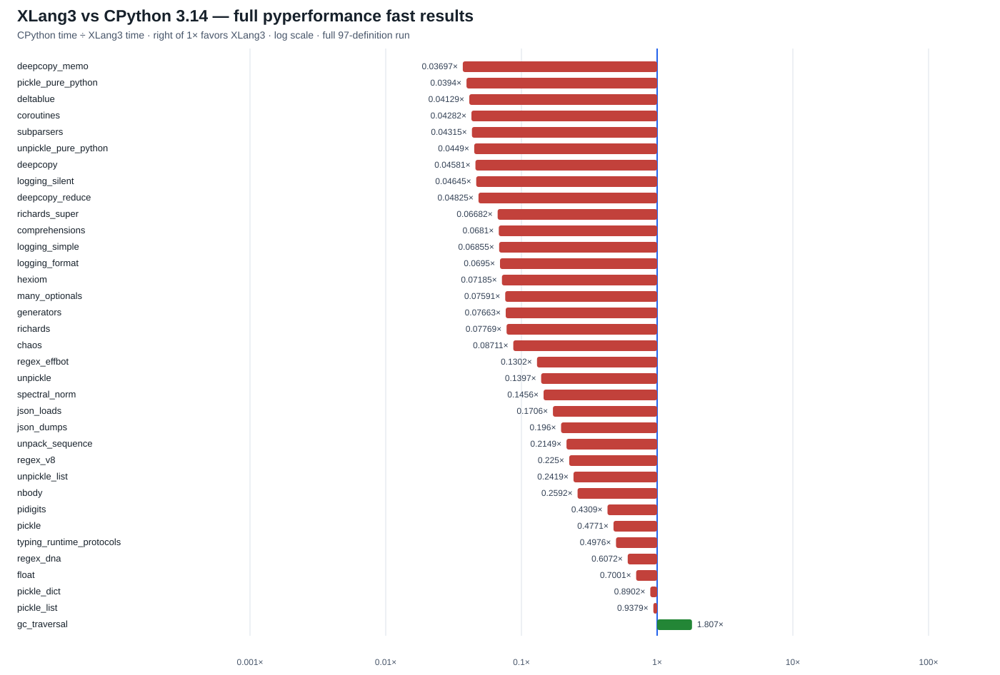

# XLang3 vs CPython 3.14: full pyperformance run (2026-09-30)

This report covers all 97 benchmark definitions in pyperformance 1.14.0 using XLang3's current Release build and a saved CPython 3.14.7 full-fast reference. The XLang3 runner used `--fast` and a 30-second cap per definition; worker deaths, missing optional packages, timeouts, and semantic failures stay visible in the status file. This is a coverage run, not a stable performance ranking: many fast-mode samples report host jitter.

## Results

The run reached all 97 benchmark definitions. XLang3 completed 31 definitions
and recorded 66 failures. Across the completed definitions, 35 subtests matched
the CPython reference: one favored XLang3 (`gc_traversal`, 1.81x), and 34 were
slower. Their geometric mean was **0.137x CPython/XLang3**, which means XLang3
was about **7.32x slower** across those measured subtests. This is a directional
fast-mode result; many samples are unstable, so small differences need a
rigorous paired rerun.

The largest interpreter-heavy gaps include `deepcopy_memo` (27.1x slower),
`pickle_pure_python` (25.4x), `unpickle_pure_python` (22.3x in this fast run),
`deltablue` (24.2x), and `coroutines` (23.4x). `json_dumps` measured 38.69 ms
for XLang3 and 7.58 ms for CPython (5.10x slower). The focused rigorous
`unpickle_pure_python` comparison remains 3.41 ms versus 160 us: 21.36x longer
for XLang3. The fast and rigorous measurements are separate and must not be
combined.

The 66 failures comprise 30 timeouts and 36 worker deaths. The timeout list
includes the async workloads, `base64`, `bpe_tokeniser`, `fannkuch`, `pathlib`,
`pprint`, and other slow cases. Worker deaths include missing optional
dependencies (for example `coverage`, `pyaes`, `dask`, `sphinx`, and `sympy`),
plus runtime or semantic failures such as `mdp`, `scimark`, `python_startup`,
and `xml_etree`. The status CSV and raw log keep every failure visible.

The horizontal log-scale chart uses **CPython time ÷ XLang3 time**. A bar to the right of 1× means XLang3 was faster; a bar to the left means CPython was faster. The chart includes only exact-name subtests measured by both runs. The CSV records every top-level definition and subtest, including failures.

- [All 97 benchmark statuses](data/pyperformance-xlang3-main-20260930-all-97-status.csv)
- [Subtest timings and speed ratios](data/pyperformance-xlang3-main-20260930-subtests.csv)
- [XLang3 pyperf JSON](data/pyperformance-xlang3-main-20260930.json)
- [XLang3 runner log, including failures](data/pyperformance-xlang3-main-20260930.log)
- [CPython 3.14.7 reference JSON](data/pyperformance-cpython314-full-fast-gc-root-20260929.json)

## Measurement details

- XLang3 Release executable SHA-256: `40D7E3A12BE6101376EEB106579D74FAD6E8FF79C513698422C726ED970DA921`.
- XLang3 Release runtime DLL SHA-256: `C4B49BB9A68C50923916FE9195E180D9A21834F8F244EEB4DFA4D273869A662E`.
- The CPython reference is the saved pyperformance 1.14.0 full-fast run on CPython 3.14.7 from 2026-09-29, on the same Windows 11 x86-64 host.
- The XLang3 runner used `benchmarks/diagnostics/run_pyperformance_xlang3_shimmed.py`; its 30-second timeout kills a benchmark process tree and continues to the next definition.
- Ratios are directional because both runs use fast-mode settings and some XLang3 workers are unstable. Use focused rigorous A/B data for small differences.

## Why the Python-call hot path trails CPython

The source comparison is in [the CPython 3.14.7 VM diagnosis](cpython314-vm-comparison-20260930.md).
For `unpickle_pure_python`, both runtimes execute the same CPython `pickle.py`
implementation. CPython's warmed evaluator specializes the dispatch dictionary
subscription and one-argument Python call (`BINARY_OP_SUBSCR_DICT` and
`CALL_PY_EXACT_ARGS`). XLang3 already uses indexed locals and borrowed `Value`
loads, so name lookup and local retains are not the missing optimization. The
instrumented XLang3 profile instead places substantial time in VM loop control,
`GetItem`, Python call dispatch, and frame switching. This comparison is why
the next experiments target generic VM costs instead of changing the
pure-Python `pickle.py` code. A frame-owner reuse trial measured 2% slower and
was discarded.

## Hot-loop diagnosis

The dedicated [CPython 3.14.7 VM comparison](cpython314-vm-comparison-20260930.md) records the warmed `unpickle_pure_python` loop and XLang3 IR. CPython specializes the dispatch dictionary access and exact-argument function call. XLang3 already uses indexed local slots and borrowed local loads; its measured cost is in VM loop control, `GetItem`, Python call dispatch, and frame switching. The fast all-suite `pickle_pure_python` / `unpickle_pure_python` values are kept separate from the focused rigorous result in that diagnosis.
