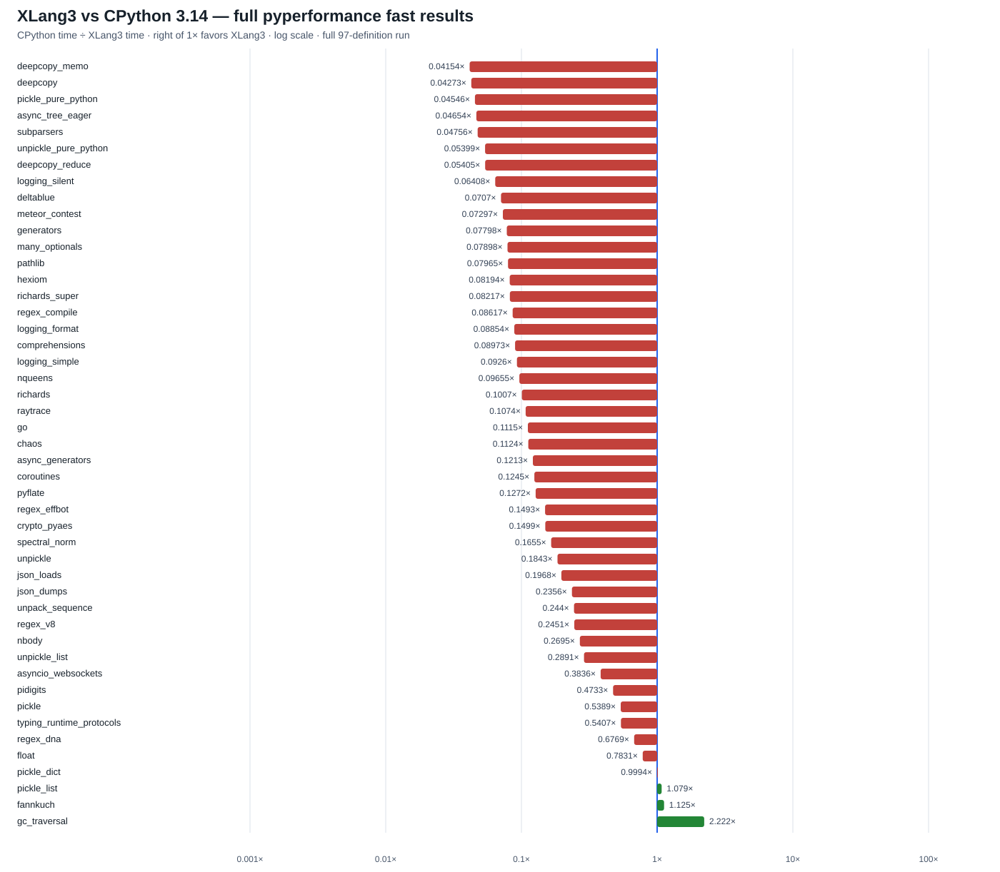

# XLang3 vs CPython 3.14: full pyperformance run (2026-10-01)

This run covers all **97 pyperformance 1.14.0 definitions** using the XLang3
Release executable built with the Context map-transfer change. XLang3 measured
**46 definitions** and failed or timed out on **51**. The matched CPython 3.14.7
reference measured **92 definitions** and failed on **5**. Failed definitions
remain visible in the status file; they are not assigned fabricated timings.

Across **47 subtests with measurements from both runtimes**, XLang3 was slower
on **44** and faster on **3**. The geometric mean of CPython time divided by
XLang3 time is **0.15545×**, or XLang3 taking about **6.43× as long** on these
matched subtests. This combines distinct workloads and is directional evidence,
not a single-program speed claim. Most results used `--fast` and are marked
unstable by pyperf; rerun rigorously before making decisions from small gaps.

The chart plots CPython time divided by XLang3 time on a logarithmic axis.
Every matched subtest has a horizontal bar, with the 1× reference marked in
blue. The full table has all 97 definition statuses and preserves each timing,
timeout, or error.

## Results

- [Horizontal 47-subtest chart](pyperformance-xlang3-current-asyncio-context-vs-cpython314-full-fast-20261001.svg)
- [All 97 definition statuses and errors](data/pyperformance-xlang3-current-asyncio-context-vs-cpython314-full-fast-20261001-all-97-status.csv)
- [All subtests, raw timings, and matched speed ratios](data/pyperformance-xlang3-current-asyncio-context-vs-cpython314-full-fast-20261001-subtests.csv)
- [XLang3 pyperf JSON](data/pyperformance-xlang3-current-asyncio-context-fast-20261001.json)
- [XLang3 full run log](data/pyperformance-xlang3-current-asyncio-context-fast-20261001.log)
- [CPython 3.14.7 pyperf JSON](data/pyperformance-cpython314-native-iocp-shared-deps-full-fast-20261001.json)
- [CPython full run log](data/pyperformance-cpython314-native-iocp-shared-deps-full-fast-20261001.log)

Both runs use pyperformance 1.14.0, the shared CPython 3.14 dependency site,
the Windows command-safe shim, and the same benchmark definitions. Each XLang3
definition was capped at 120 seconds, including worker startup and calibration.
The CPython reference completed 92 definitions; its five failed definitions
and details are in the status CSV. XLang3 emitted 50 subtest measurements, of
which 47 have a matching CPython measurement. The other 3 have no valid ratio.

## Largest measured gaps

| Subtest | CPython 3.14 | XLang3 | CPython/XLang3 | Assessment |
|---|---:|---:|---:|---|
| `deepcopy_memo` | 25.32 µs | 609.5 µs | 0.0415× | XLang3 about 24.1× slower |
| `deepcopy` | 211.8 µs | 4.956 ms | 0.0427× | XLang3 about 23.4× slower |
| `pickle_pure_python` | 264.6 µs | 5.822 ms | 0.0455× | XLang3 about 22.0× slower |
| `async_tree_eager` | 88.48 ms | 1.901 s | 0.0465× | XLang3 about 21.5× slower |
| `subparsers` | 7.891 ms | 165.9 ms | 0.0476× | XLang3 about 21.0× slower |
| `unpickle_pure_python` | 174.7 µs | 3.235 ms | 0.0540× | XLang3 about 18.5× slower |
| `deepcopy_reduce` | 2.316 µs | 42.84 µs | 0.0540× | XLang3 about 18.5× slower |

`gc_traversal` was the strongest XLang3 result at **2.22× faster**; `fannkuch`
was **1.12× faster**, and `pickle_list` was **1.08× faster**. These are the
only three matched subtests above 1×. None of the 16 `async_tree` definitions
completed within 120 seconds except `async_tree_eager` (1.901 s); treat every
timeout as a failed case, not a timing or ratio. The ordinary non-eager tree
has a separate diagnostic: CPython completed `async_tree_none` in 254 ms,
while XLang3's targeted invocation needed several seconds and did not finish
under the full-suite 120-second cap.

## What the CPython comparison shows

CPython 3.14's native `_asyncio` stores Future and Task fields inline in
`FutureObj`/`TaskObj`, keeps exact Future and Task type pointers in per-module
state, resumes a native coroutine with `PyIter_Send`, and calls the loop's
`call_soon` through `PyObject_VectorcallMethod`. The exact implementation is
[`_asynciomodule.c` at CPython 3.14.7](https://github.com/python/cpython/blob/v3.14.7/Modules/_asynciomodule.c).

XLang3 already resumes VM coroutines directly with `generator_send`, and its
Task fields are inline in `FutureState`; it also has native Future methods and
an intrusive Task registry. The latest instrumented 4-level task-tree probe
showed that hundreds of `Future.done`, `cancelled`, `exception`, `result`,
callback-registration, and awaited-by native calls were still taking the
generic native argument path. The native C method implementations do less
argument and object work than that path, making register-backed fast callbacks
a targeted match to CPython's borrowed-pointer/vectorcall boundary. The probe
is diagnostic only; the official benchmark remains the performance evidence.

The full-suite results show the main remaining problem is broader than exact
type lookup or one callback. XLang3 still takes about 21× as long for the
eager task-tree workload, and pure-Python `deepcopy` and `pickle` cases are
similarly far behind. Those pure-Python libraries remain Python code; the next
work must improve shared VM and runtime paths rather than replacing them with
C++ implementations.

## Full-suite failure groups

The 51 XLang3 failures comprise **22 timeouts** and **29 benchmark process
failures**. The timeouts include 15 non-eager `async_tree` variants plus
`asyncio_tcp`, `asyncio_tcp_ssl`, `base64`, `bpe_tokeniser`, `telco`, and
`tomli_loads`. The other 30 failures include parser/runtime compatibility
errors in third-party packages and benchmark worker/process failures. The CSV
and full log preserve the exact case and error details. This run therefore
does not yet represent a successful full-suite execution even though every
definition was attempted.

## Run identity and limits

- XLang3 executable SHA-256: `3afb3e841a8ba45ae5cb0df05a21fa6390c786709a5dab6b1a11cfaa0906483b`.
- XLang3 runtime DLL SHA-256: `94cefb57f705b9e2a3c53026c7f5e19857d7aa8b750f52fde934307255ef6b72`.
- CPython reference: 3.14.7, same pyperformance 1.14.0 definitions and dependency site.
- `--fast` samples are not stable enough to interpret small differences; preserve
  the full JSON and rerun selected cases rigorously after each engine change.
