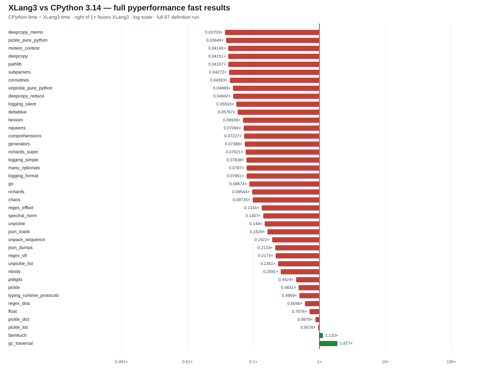

# XLang3 vs CPython 3.14: full pyperformance fast run (2026-10-01)

This report records one full pyperformance 1.14.0 attempt using the XLang3 Release build and the saved CPython 3.14.7 reference. Every one of the 97 benchmark definitions was attempted. XLang3 completed 36 top-level definitions; 61 failed or hit the per-case timeout. The completed comparisons contain 40 matched subtests: XLang3 is faster in 2 and slower in 38, with a geometric speedup of **0.136×** (CPython time divided by XLang3 time).

A ratio above 1× means XLang3 is faster. A ratio below 1× means XLang3 is slower. The aggregate is calculated over the 40 matched subtests only; it does not treat failed cases as zero-time measurements.

The chart uses a logarithmic horizontal axis and places the 1× parity line at the center. Green bars favor XLang3; red bars favor CPython.

## Run details

- XLang3: `build/Release/xlang3.exe`, version `3.14.7 (64-bit) revision 823f032`, SHA-256 `5D667CB114AB6AA62CC6DA7E12D7DFD4C5FE5F848E920A1ABD4A75833085FCD3`.
- CPython: 3.14.7 reference in [`pyperformance-cpython314-full-fast-gc-root-20260929.json`](data/pyperformance-cpython314-full-fast-gc-root-20260929.json); this file contains 124 pyperf benchmark records.
- XLang3 results: [`pyperformance-xlang3-permutation-loop-fused-full-fast-shim-20261001.json`](data/pyperformance-xlang3-permutation-loop-fused-full-fast-shim-20261001.json) (40 result records) and [`pyperformance-xlang3-permutation-loop-fused-full-fast-shim-20261001.log`](data/pyperformance-xlang3-permutation-loop-fused-full-fast-shim-20261001.log) (full run log).
- Suite: pyperformance 1.14.0, pyperf 2.10.0, fast mode, all 97 definitions, on the same 20-CPU host. The saved CPython run and current XLang3 run both report Python version 3.14.7.
- The XLang3 worker used the local compatibility shim on `PYTHONPATH` to avoid the Windows `psutil` ABI mismatch; CPython was measured from the saved reference JSON.
- Each XLang3 case had a 90-second cap. Crashed and timed-out cases were recorded and the runner continued through the remaining definitions.
- The comparison generator keeps printed pyperf means for a subtest even if a later subtest in the same top-level definition fails and the pyperf JSON omits that partial definition.

## All matched subtest timings

| Subtest | Benchmark | CPython 3.14 (ms) | XLang3 (ms) | CPython/XLang3 |
|---|---|---:|---:|---:|
| deepcopy_memo | deepcopy | 0.02147 | 0.5798 | 0.03703× |
| pickle_pure_python | pickle_pure_python | 0.2523 | 6.554 | 0.03849× |
| meteor_contest | meteor_contest | 87.41 | 2108 | 0.04146× |
| deepcopy | deepcopy | 0.21 | 5.06 | 0.04151× |
| pathlib | pathlib | 47.82 | 1148 | 0.04167× |
| subparsers | argparse_subparsers | 7.601 | 177.9 | 0.04272× |
| coroutines | coroutines | 17.44 | 397 | 0.04393× |
| unpickle_pure_python | unpickle_pure_python | 0.1614 | 3.302 | 0.04889× |
| deepcopy_reduce | deepcopy | 0.002203 | 0.04458 | 0.04942× |
| logging_silent | logging | 6.693e-05 | 0.001216 | 0.05503× |
| deltablue | deltablue | 2.485 | 43.09 | 0.05767× |
| hexiom | hexiom | 4.928 | 71.03 | 0.06939× |
| nqueens | nqueens | 73.94 | 1042 | 0.07094× |
| comprehensions | comprehensions | 0.01369 | 0.1894 | 0.07227× |
| generators | generators | 27.01 | 365.6 | 0.07388× |
| richards_super | richards_super | 37.31 | 489.6 | 0.07621× |
| logging_simple | logging | 0.006755 | 0.08618 | 0.07838× |
| many_optionals | argparse | 0.6684 | 8.493 | 0.0787× |
| logging_format | logging | 0.007316 | 0.09283 | 0.07881× |
| go | go | 94.22 | 1086 | 0.08674× |
| richards | richards | 33.36 | 349.5 | 0.09544× |
| chaos | chaos | 46.86 | 481.3 | 0.09735× |
| regex_effbot | regex_effbot | 1.795 | 13.45 | 0.1334× |
| spectral_norm | spectral_norm | 72.18 | 512.9 | 0.1407× |
| unpickle | unpickle | 0.0097 | 0.06553 | 0.148× |
| json_loads | json_loads | 0.01754 | 0.1077 | 0.1629× |
| unpack_sequence | unpack_sequence | 3.545e-05 | 0.0001844 | 0.1922× |
| json_dumps | json_dumps | 7.584 | 35.56 | 0.2133× |
| regex_v8 | regex_v8 | 16.46 | 75.77 | 0.2173× |
| unpickle_list | unpickle_list | 0.003159 | 0.01338 | 0.2361× |
| nbody | nbody | 81.04 | 312.7 | 0.2591× |
| pidigits | pidigits | 164.4 | 371.6 | 0.4424× |
| pickle | pickle | 0.009078 | 0.01879 | 0.4831× |
| typing_runtime_protocols | typing_runtime_protocols | 0.1244 | 0.2503 | 0.4969× |
| regex_dna | regex_dna | 132.3 | 218.9 | 0.6046× |
| float | float | 56.18 | 79.4 | 0.7076× |
| pickle_dict | pickle_dict | 0.02321 | 0.02674 | 0.8679× |
| pickle_list | pickle_list | 0.003952 | 0.004126 | 0.9578× |
| fannkuch | fannkuch | 312.3 | 275.7 | 1.133× |
| gc_traversal | gc_traversal | 2.191 | 1.168 | 1.877× |

Of the 40 matched subtests, **2 favor XLang3** and **38 favor CPython**. See the [`all-97 status CSV`](data/pyperformance-xlang3-vs-cpython314-full-fast-shim-20261001-all-97-status.csv) for every definition and the [`subtest CSV`](data/pyperformance-xlang3-vs-cpython314-full-fast-shim-20261001-subtests.csv) for full-precision seconds, status, and evidence source.

## Status of all 97 definitions

| Benchmark | CPython status and subtests | XLang3 status and measured subtests |
|---|---|---|
| 2to3 | completed: 2to3=251.674ms | failed: Benchmark died: — |
| argparse | no CPython timing: — | completed: many_optionals=8.49271ms (0.078702× CP/XLang) |
| argparse_subparsers | no CPython timing: — | completed: subparsers=177.932ms (0.042719× CP/XLang) |
| async_generators | completed: async_generators=277.756ms | failed: timed out: — |
| async_tree | completed: async_tree_none=226.436ms; async_tree_none_tg=242.232ms | failed: timed out: — |
| async_tree_cpu_io_mixed | completed: async_tree_cpu_io_mixed=430.097ms | failed: timed out: — |
| async_tree_cpu_io_mixed_tg | completed: async_tree_cpu_io_mixed_tg=424ms | failed: timed out: — |
| async_tree_eager | completed: async_tree_eager=84.8434ms | failed: timed out: — |
| async_tree_eager_cpu_io_mixed | completed: async_tree_eager_cpu_io_mixed=333.81ms | failed: timed out: — |
| async_tree_eager_cpu_io_mixed_tg | completed: async_tree_eager_cpu_io_mixed_tg=393.708ms | failed: timed out: — |
| async_tree_eager_io | completed: async_tree_eager_io=564.455ms | failed: timed out: — |
| async_tree_eager_io_tg | completed: async_tree_eager_io_tg=561.145ms | failed: timed out: — |
| async_tree_eager_memoization | completed: async_tree_eager_memoization=191.569ms | failed: timed out: — |
| async_tree_eager_memoization_tg | completed: async_tree_eager_memoization_tg=270.171ms | failed: timed out: — |
| async_tree_eager_tg | completed: async_tree_eager_tg=196.478ms | failed: timed out: — |
| async_tree_io | completed: async_tree_io=573.188ms | failed: timed out: — |
| async_tree_io_tg | completed: async_tree_io_tg=558.669ms | failed: timed out: — |
| async_tree_memoization | completed: async_tree_memoization=281.985ms | failed: timed out: — |
| async_tree_memoization_tg | completed: async_tree_memoization_tg=282.14ms | failed: timed out: — |
| async_tree_tg | no CPython timing: — | failed: timed out: — |
| asyncio_tcp | completed: asyncio_tcp=739.771ms | failed: timed out: — |
| asyncio_tcp_ssl | completed: asyncio_tcp_ssl=4466.71ms | failed: Benchmark died: — |
| asyncio_websockets | completed: asyncio_websockets=192.169ms | failed: Benchmark died: — |
| base64 | completed: base64_large=7.90688ms; base64_small=0.267936ms | failed: timed out: — |
| bpe_tokeniser | completed: bpe_tokeniser=3533.09ms | failed: timed out: — |
| chameleon | completed: chameleon=11.5539ms | failed: Benchmark died: — |
| chaos | completed: chaos=46.8551ms | completed: chaos=481.321ms (0.097347× CP/XLang) |
| comprehensions | completed: comprehensions=0.0136876ms | completed: comprehensions=0.18939ms (0.072272× CP/XLang) |
| concurrent_imap | no CPython timing: — | failed: Benchmark died: — |
| coroutines | completed: coroutines=17.4385ms | completed: coroutines=396.974ms (0.043929× CP/XLang) |
| coverage | completed: coverage=63.455ms | failed: Benchmark died: — |
| crypto_pyaes | completed: crypto_pyaes=55.2763ms | failed: Benchmark died: — |
| dask | completed: dask=769.434ms | failed: Benchmark died: — |
| deepcopy | completed: deepcopy=0.210039ms; deepcopy_memo=0.0214685ms; deepcopy_reduce=0.00220295ms | completed: deepcopy=5.05997ms (0.04151× CP/XLang); deepcopy_memo=0.579787ms (0.037028× CP/XLang); deepcopy_reduce=0.0445773ms (0.049419× CP/XLang) |
| deltablue | completed: deltablue=2.48469ms | completed: deltablue=43.0875ms (0.057666× CP/XLang) |
| django_template | completed: django_template=28.9841ms | failed: Benchmark died: — |
| docutils | completed: docutils=1811.73ms | failed: Benchmark died: — |
| dulwich_log | completed: dulwich_log=66.5561ms | failed: Benchmark died: — |
| fannkuch | completed: fannkuch=312.286ms | completed: fannkuch=275.711ms (1.1327× CP/XLang) |
| fastapi | completed: fastapi_http=415.245ms | failed: Benchmark died: — |
| float | completed: float=56.1802ms | completed: float=79.397ms (0.70759× CP/XLang) |
| gc_collect | no CPython timing: — | failed: Benchmark died: — |
| gc_traversal | completed: gc_traversal=2.19122ms | completed: gc_traversal=1.16751ms (1.8768× CP/XLang) |
| generators | completed: generators=27.0079ms | completed: generators=365.561ms (0.073881× CP/XLang) |
| genshi | completed: genshi_text=18.9624ms; genshi_xml=41.6582ms | failed: Benchmark died: — |
| go | completed: go=94.2161ms | completed: go=1086.16ms (0.086742× CP/XLang) |
| hexiom | completed: hexiom=4.92847ms | completed: hexiom=71.027ms (0.069389× CP/XLang) |
| html5lib | completed: html5lib=42.3449ms | failed: Benchmark died: — |
| json_dumps | completed: json_dumps=7.58351ms | completed: json_dumps=35.5609ms (0.21325× CP/XLang) |
| json_loads | completed: json_loads=0.0175438ms | completed: json_loads=0.107677ms (0.16293× CP/XLang) |
| logging | completed: logging_format=0.00731575ms; logging_silent=6.69281e-05ms; logging_simple=0.00675492ms | completed: logging_format=0.0928258ms (0.078812× CP/XLang); logging_silent=0.0012161ms (0.055035× CP/XLang); logging_simple=0.0861771ms (0.078384× CP/XLang) |
| mako | completed: mako=7.49018ms | failed: Benchmark died: — |
| mdp | completed: mdp=975.11ms | failed: Benchmark died: — |
| meteor_contest | completed: meteor_contest=87.4131ms | completed: meteor_contest=2108.5ms (0.041458× CP/XLang) |
| nbody | completed: nbody=81.038ms | completed: nbody=312.714ms (0.25914× CP/XLang) |
| networkx | no CPython timing: — | failed: Benchmark died: — |
| networkx_connected_components | no CPython timing: — | failed: Benchmark died: — |
| networkx_k_core | no CPython timing: — | failed: Benchmark died: — |
| nqueens | completed: nqueens=73.9361ms | completed: nqueens=1042.27ms (0.070937× CP/XLang) |
| pathlib | completed: pathlib=47.8175ms | completed: pathlib=1147.54ms (0.041669× CP/XLang) |
| pickle | completed: pickle=0.00907842ms | completed: pickle=0.0187937ms (0.48306× CP/XLang) |
| pickle_dict | completed: pickle_dict=0.0232063ms | completed: pickle_dict=0.0267397ms (0.86786× CP/XLang) |
| pickle_list | completed: pickle_list=0.00395186ms | completed: pickle_list=0.00412597ms (0.9578× CP/XLang) |
| pickle_pure_python | completed: pickle_pure_python=0.252284ms | completed: pickle_pure_python=6.5537ms (0.038495× CP/XLang) |
| pidigits | completed: pidigits=164.38ms | completed: pidigits=371.558ms (0.44241× CP/XLang) |
| pprint | completed: pprint_pformat=1180.02ms; pprint_safe_repr=575.927ms | failed: timed out: — |
| pyflate | completed: pyflate=328.524ms | failed: timed out: — |
| python_startup | completed: python_startup=31.2637ms | failed: Benchmark died: — |
| python_startup_no_site | completed: python_startup_no_site=24.6155ms | failed: Benchmark died: — |
| raytrace | completed: raytrace=217.002ms | failed: timed out: — |
| regex_compile | completed: regex_compile=93.6407ms | failed: timed out: — |
| regex_dna | completed: regex_dna=132.329ms | completed: regex_dna=218.876ms (0.60458× CP/XLang) |
| regex_effbot | completed: regex_effbot=1.7946ms | completed: regex_effbot=13.4479ms (0.13345× CP/XLang) |
| regex_v8 | completed: regex_v8=16.4623ms | completed: regex_v8=75.768ms (0.21727× CP/XLang) |
| richards | completed: richards=33.3574ms | completed: richards=349.523ms (0.095437× CP/XLang) |
| richards_super | completed: richards_super=37.3086ms | completed: richards_super=489.575ms (0.076206× CP/XLang) |
| scimark | completed: scimark_fft=219.317ms; scimark_lu=72.8907ms; scimark_monte_carlo=50.9483ms; scimark_sor=94.2419ms; scimark_sparse_mat_mult=3.01707ms | failed: Benchmark died: — |
| spectral_norm | completed: spectral_norm=72.1761ms | completed: spectral_norm=512.854ms (0.14073× CP/XLang) |
| sphinx | completed: sphinx=728.74ms | failed: Benchmark died: — |
| sqlalchemy_declarative | completed: sqlalchemy_declarative=87.4334ms | failed: Benchmark died: — |
| sqlalchemy_imperative | completed: sqlalchemy_imperative=10.6188ms | failed: Benchmark died: — |
| sqlglot_v2 | completed: sqlglot_v2_normalize=85.1819ms | failed: Benchmark died: — |
| sqlglot_v2_optimize | completed: sqlglot_v2_optimize=41.0163ms | failed: Benchmark died: — |
| sqlglot_v2_parse | completed: sqlglot_v2_parse=0.94893ms | failed: Benchmark died: — |
| sqlglot_v2_transpile | completed: sqlglot_v2_transpile=1.1868ms | failed: Benchmark died: — |
| sqlite_synth | completed: sqlite_synth=0.00175974ms | failed: Benchmark died: — |
| sympy | completed: sympy_expand=336.421ms; sympy_integrate=14.2253ms; sympy_str=194.058ms; sympy_sum=100.98ms | failed: Benchmark died: — |
| telco | completed: telco=5.54049ms | failed: timed out: — |
| tomli_loads | completed: tomli_loads=1689.3ms | failed: Benchmark died: — |
| tornado_http | completed: tornado_http=232.943ms | failed: Benchmark died: — |
| typing_runtime_protocols | completed: typing_runtime_protocols=0.124367ms | completed: typing_runtime_protocols=0.250289ms (0.49689× CP/XLang) |
| unpack_sequence | completed: unpack_sequence=3.54493e-05ms | completed: unpack_sequence=0.000184421ms (0.19222× CP/XLang) |
| unpickle | completed: unpickle=0.0097ms | completed: unpickle=0.0655319ms (0.14802× CP/XLang) |
| unpickle_list | completed: unpickle_list=0.00315896ms | completed: unpickle_list=0.0133792ms (0.23611× CP/XLang) |
| unpickle_pure_python | completed: unpickle_pure_python=0.161446ms | completed: unpickle_pure_python=3.302ms (0.048893× CP/XLang) |
| xdsl | completed: xdsl_constant_fold=32.8031ms | failed: Benchmark died: — |
| xml_etree | completed: xml_etree_generate=66.3037ms; xml_etree_iterparse=68.2502ms; xml_etree_parse=107.561ms; xml_etree_process=46.0111ms | failed: Benchmark died: — |

The status CSV is the authoritative machine-readable list for all 97 definitions, including failure details. These fast-mode timings are a broad screening baseline; use repeated rigorous paired runs for claims about small changes.
