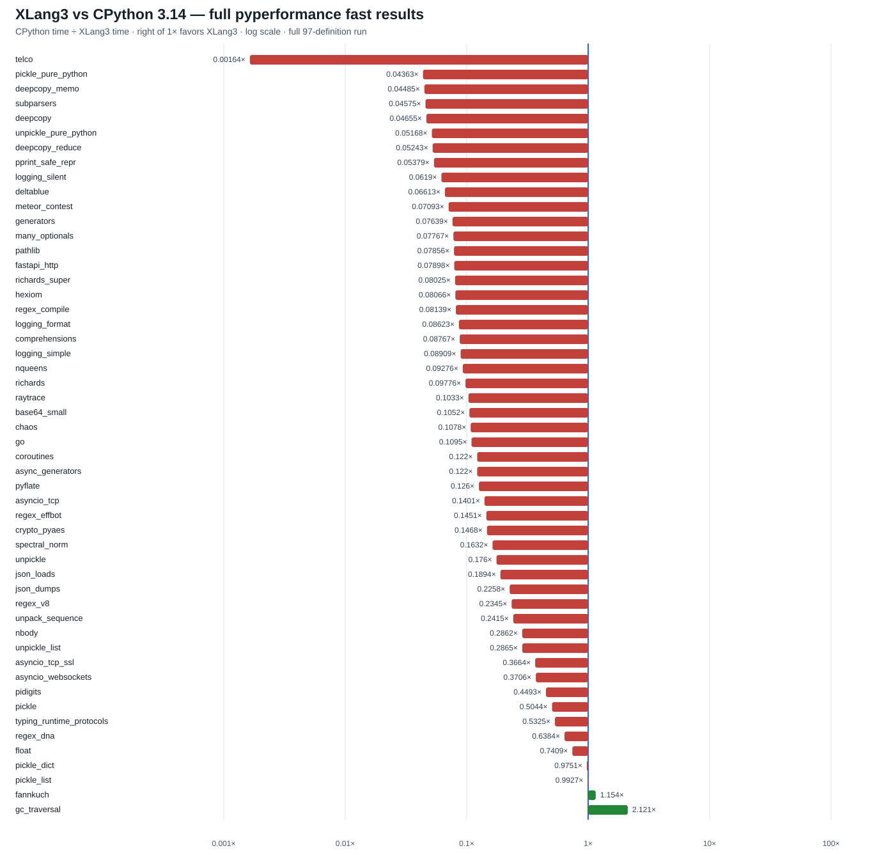

# XLang3 vs CPython 3.14: full pyperformance, 2026-10-01

The full 97-definition run completed on the frozen XLang3 Release executable. It produced timings for **46 definitions**, partial results for **2**, and failures or timeouts for **49**. CPython 3.14.7 completed **92** definitions and failed **5**. Those failures remain in the comparison data rather than being dropped.

Across the **52 subtests measured by both runtimes**, XLang3 was slower on 50 and faster on 2. Their geometric-mean CPython-time/XLang3-time ratio was **0.13884×**, equivalent to XLang3 taking about **7.20× as long** geometrically across those matched subtests. This is a subtest-weighted statistic over measured results; it does not assign invented timings to failures or timeouts. Most pyperf results were marked unstable in fast mode, so the ratios are directional evidence and should be rerun rigorously before fine-grained decisions.

The chart uses CPython time divided by XLang3 time: values to the right of **1×** favor XLang3. The axis is logarithmic. It includes every matched subtest, including measurements printed before the two partial-definition timeouts. Failed cases without a timing have no bar.

## Run evidence

- [Horizontal SVG chart](pyperformance-xlang3-vs-cpython314-native-iocp-shared-deps-full-fast-20261001.svg)
- [All 97 definition statuses and failure details](data/pyperformance-xlang3-native-iocp-shared-deps-full-fast-20261001-all-97-status.csv)
- [All subtest measurements and matched speedup ratios](data/pyperformance-xlang3-native-iocp-shared-deps-full-fast-20261001-subtests.csv)
- [XLang3 pyperf JSON](data/pyperformance-xlang3-native-iocp-shared-deps-restart-full-fast-20261001.json)
- [XLang3 complete run log](data/pyperformance-xlang3-native-iocp-shared-deps-restart-full-fast-20261001.log)
- [CPython 3.14.7 pyperf JSON](data/pyperformance-cpython314-native-iocp-shared-deps-full-fast-20261001.json)
- [CPython complete run log](data/pyperformance-cpython314-native-iocp-shared-deps-full-fast-20261001.log)
- [Binary, runtime DLL, dependency and run manifest](data/pyperformance-native-iocp-shared-deps-run-manifest-20261001.json)

Both runs used pyperformance 1.14.0, pyperf 2.10, fast mode, the same shared dependency site-packages, unchanged workloads, and a 600-second definition deadline. `async_tree*` definitions had a 120-second deadline. The deadline includes worker startup and calibration. The full status CSV preserves all 97 definitions and the individual result or failure text for each.

The measured XLang3 executable is `build/Release/xlang3.exe` from source commit `1924e4bd9c3d351d44a052942d4e5b7a4934d839`, SHA-256 `C5F37B0A9238989B2DF678B1E2F2A00915C603A04BBC896A9B1573F71D897B84`. Its runtime DLL hash is `F1804355B77C2F74E9C83AEC115E149C8A566B2BF4DB700DF923AB7BB5C1BBFA`. The native `_asyncio` candidate in the working tree was not in this executable and is not represented by these results.

## Largest measured gaps

The lowest matched geometric ratios were:

| Subtest | CPython/XLang3 | Interpretation |
|---|---:|---|
| `telco` | 0.00164× | XLang3 about 610× slower |
| `pickle_pure_python` | 0.0436× | XLang3 about 22.9× slower |
| `deepcopy_memo` | 0.0449× | XLang3 about 22.3× slower |
| `subparsers` | 0.0457× | XLang3 about 21.9× slower |
| `deepcopy` | 0.0466× | XLang3 about 21.5× slower |
| `unpickle_pure_python` | 0.0517× | XLang3 about 19.4× slower |
| `deepcopy_reduce` | 0.0524× | XLang3 about 19.1× slower |
| `pprint_safe_repr` | 0.0538× | XLang3 about 18.6× slower; parent definition later timed out |
| `logging_silent` | 0.0619× | XLang3 about 16.2× slower |
| `deltablue` | 0.0661× | XLang3 about 15.1× slower |

The `pprint_safe_repr` value is a partial result from a definition that later hit its 600-second cap. The remaining `pprint` subtests have no valid XLang3 timing. Likewise, `base64_small` completed at 2.86 ms (**0.105×**, about 9.5× slower), but the `base64` definition timed out while the next subtest was active; that timeout is not a measured `base64_large` time.

The only matched subtests faster on XLang3 were `gc_traversal` at **2.12×** and `fannkuch` at **1.15×**. No broad speed win is shown by this full-suite run.

## Asyncio comparison against CPython source

All **16** `async_tree` definitions hit XLang3's 120-second cap. The corresponding CPython results range from **88 ms** (`async_tree_eager`) to **600 ms** (`async_tree_eager_io`). In the ordinary `async_tree_none` case, CPython completed in **254 ms**; XLang3 produced no valid timing within 120 seconds. These are failures/timeouts, not ratios, and must remain distinct from measured speedups.

Three networking subtests completed, but pyperf marked the XLang3 samples unstable:

| Subtest | CPython 3.14.7 | XLang3 | XLang3/CPython |
|---|---:|---:|---:|
| `asyncio_tcp` | 0.777 s | 5.54 s | 7.13× slower |
| `asyncio_tcp_ssl` | 4.380 s | 12.0 s | 2.74× slower |
| `asyncio_websockets` | 0.192 s | 0.519 s | 2.70× slower |

CPython 3.14's [`_asynciomodule.c`](https://github.com/python/cpython/blob/v3.14.7/Modules/_asynciomodule.c) uses native Future and Task state, direct `PyIter_Send` coroutine resumption, and an intrusive Task list. The XLang3 source candidate follows those native boundaries while leaving pure-Python `asyncio` modules in Python. It also avoids a per-Task state allocation and repeated temporary GC-edge buffers. Those are source-level hypotheses only: the candidate has not yet been built, tested, gated, or measured, so this chart cannot establish its effect.

## Failure inventory and next work

The CSV lists each failed definition and its exact error. Major confirmed groups include:

- **16 asyncio timeouts**, plus timeouts in `base64`, `bpe_tokeniser`, `pprint`, and `tomli_loads`.
- **Parser/import compatibility failures**, including Chameleon/Tornado reporting an unterminated-string error in `tornado.escape`, and parser/runtime errors from Dask, Genshi, Docutils, HTML5Lib, Mako, Sphinx, SQLAlchemy, and SQLGlot.
- **Object and protocol mismatches**, including `str.split` argument handling, bytes slicing in Dulwich, `gc_collect` failing its cycle-count assertion, `mdp` failing an algorithm assertion, `xdsl` seeing a `GenericAlias` without `.get`, and SciMark failing on array slicing.
- **Process/tracing/exception issues**, including `concurrent_imap` losing its multiprocessing pipe, Coverage failing while handling an exception under tracing, and startup command failures.

These are observed failure categories, not all root-cause diagnoses. Next, build and validate the `_asyncio` accelerator only after the paired run is complete, then rerun the official asyncio benchmarks and the fixed Release regression gates. The other failures need their own smallest reproductions and generic runtime fixes; pure-Python standard-library and dependency code should remain Python. A full 97-case run is still required after meaningful fixes to determine whether the overall result improves.
