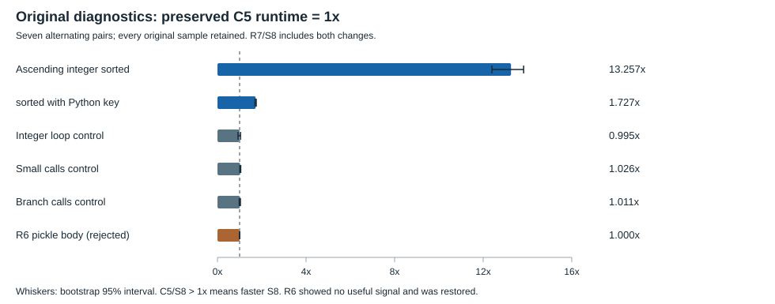
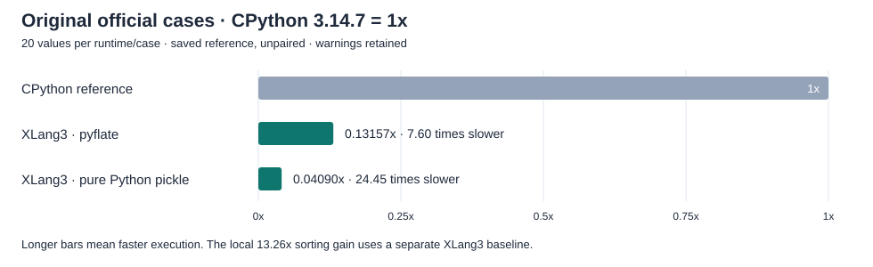

S8 removes general comparison dispatch from sorting when every computed key is an exact Int64. The unchanged 50, 000-element ascending diagnostic improved by 13.257x against the preserved C5 runtime across seven alternating pairs, with bootstrap 95% interval [12.395x, 13.826x]. The Python key callback form improved by 1.727x. This is a local diagnostic result for the combined R7/S8 candidate; the goal of beating CPython across real workloads remains unmet.

S8 passed the complete checkpoint validation: 398 core fixtures, 11 compatibility sections, three expected failures, nine CTests, two SQLite API checks and the unchanged default 11-case gate. Both original official cases completed 20 values at the unchanged 300-second definition cap, with stable source 110/Release 178 hashes and valid process watches. Both remain slower than CPython 3.14.7, and both original instability warnings are retained. The broader CPython-win goal remains unmet.

Each ratio below is preserved C5 runtime elapsed time divided by candidate elapsed time. A value above 1x means a faster candidate. All seven pairs and every timed sample remain retained; nothing was trimmed or retried. These ratios are separate from the official CPython comparison.

| Unchanged diagnostic | Candidate | Median speed | Bootstrap 95% interval | Outcome |
|---|---|---:|---:|---|
| Ascending integer `sorted` | R7/S8 | 13.257141x | 12.395083–13.826162x | Qualifies for full validation |
| Ascending integer `sorted`, Python key | R7/S8 | 1.727066x | 1.692531–1.750229x | Retained diagnostic |
| Integer loop | R7/S8 | 0.995293x | 0.928071–1.041153x | Control retained |
| Small Python function calls | R7/S8 | 1.025816x | 1.009610–1.049925x | Control retained |
| Branching Python function calls | R7/S8 | 1.011180x | 0.983303–1.034845x | Control retained |
| Original pure Python pickle body | R6 | 1.000489x | 0.993390–1.006751x | Rejected; verified C5 restored |

The sorting decision was declared before S8 results: median plain-sort gain strictly above 1.10x and lower bootstrap bound strictly above 1x, seven alternating pairs, 50, 000 resamples and seed 20261008. Every child runs the original five-row diagnostic with one warm invocation and three timed samples per case. The separate R6 rule required more than 1.02x and a lower bound above 1x; its neutral result failed that rule. R6's real public C++ proof showed that the same-owner publication optimization activated, but the original pickle workload did not benefit. Its engine/test proposal and all failure/restore evidence remain inspection artifacts, outside the current source change.

| Original pickle diagnostic, same 2, 460 dumps | CPython 3.14.7 | XLang3 | Evidence scope |
|---|---:|---:|---|
| Preserved C5 | 0.2121355 s | 4.2574951 s | Historical single body |
| Initial R6 | 0.2064368 s | 4.2722637 s | Single body; later rejected by seven pairs |
| R7 module-slot binding | 0.2033214 s | 4.2476415 s | Fresh single body, unpaired against C5 |
| R7/S8 | 0.2045847 s | 4.2472928 s | Fresh single body, exact bytes and round trips |

These body invocations retain the original benchmark function, seeded objects, protocol 5, 41 outer loops, three objects and 20 dumps per object. Pure `_Pickler`/`_Unpickler` identity, byte signatures and round trips passed. Their small historical C5/R7/S8 differences provide no useful whole-pickle gain. They are parity diagnostics, not normalized pyperformance scores.

| Official original benchmark | CPython 3.14.7 | Current R7/S8 | Speed with CPython = 1x | Status |
|---|---:|---:|---:|---|
| `pickle_pure_python`, protocol 5 | 0.257498 ± 0.004003 ms | 6.295706 ± 0.635718 ms | 0.04090x | 20 values each; XLang3 about 24.450x slower; warning retained |
| `pyflate`, original BZip2 input | 0.344929 ± 0.010505 s | 2.621685 ± 0.079011 s | 0.13157x |20 values each; XLang3 about 7.601x slower; warning retained |

The CP row comes from October 7; the XLang3 row is October 8. They are unpaired saved-reference comparisons. The pinned benchmark and interpreter versions match. Saved dependency METADATA hashes do not establish every historical package source/data byte. The [older full 97 matrix](pyperformance-xlang3-full-refresh-vs-cpython3147-fast-20261008.md) describes the earlier source 56 runtime and remains historical; this checkpoint does not rerun or replace its completion counts or overall score.

R7 binds module globals through existing guarded module-slot metadata instead of repeating name resolution at the same activated call site. It adds no owning cache payload or persistence across activations. Its standalone original pickle body provided only a 0.23% historical difference, so no isolated R7 performance claim is made.

S8 changes the generic native `sorted` builtin. Whole-key-set Int64 proof excludes bool, float, NaN, bigint, subclasses and user objects. Already requested-order runs preserve entries, including equal keys. Only strictly opposite runs without equal neighbors reverse directly; unordered integer keys use a raw signed comparator in the existing stable sort. All other keys keep the original generic comparator. Iterable collection, once-per-element Python keys, full-call key ownership, output handling and pure Python libraries remain intact. Code comments explain the performance rationale and the stability guards.

The remaining pipeline still collects through iterator/next into a growing vector, builds owning key/value entries, invokes Python keys through public runtime entry and copies values into an output list. The local arithmetic `add3` benchmark can use a narrowly recognized inline IR shape and skip a Python frame; real pickle methods and native-to-Python callbacks execute a broader frame/binding path. Those are source-backed reasons the selected local-loop wins cannot be extrapolated to all pure Python workloads; they are not a claim that one unmeasured path dominates.

`pyflate` is the bounded affected official case: its original timed decoder calls `bytes(sorted(L))` on byte-derived exact integer values. The original input and post-timer MD5 remain pinned, and the decoder stays Python. A complete official score requires 20 values and the unchanged 300-second limit. An incomplete or failed attempt must retain all raw streams, worker partials and process-watcher evidence. The strict-idle attempt completed 20 values, mean 2.621684839995578s, with no observed compiler overlap/scanner error and unchanged hashes. Its raw instability warning is retained; XLang3 coefficient of variation is 3.01375% for pyflate and 10.09765% for pure Python pickle. These are saved-reference comparisons, not a paired before/after speedup.

The eight owned source paths are the module call opcode header, functional builtins source, both fixture runners, and the new module-binding and integer-sort fixtures with their expected outputs. The publication plan lists their exact source 110 hashes and the separate raw evidence/proposal/controller inspection copies. It excludes control binaries and avoids duplicating the prior C5 source archive.

The [terminal original pyflate receipt](data/sorted-exact-int-s8-original-official-pyflate-strict-idle-20261008.json) pins its [20-value official JSON](data/sorted-exact-int-s8-original-official-pyflate-strict-idle-20261008-fast.json), split raw logs and original process watcher. The [full validation](data/sorted-exact-int-s8-full-validation-20261008.json) pins the [original pure Python pickle score](data/sorted-exact-int-s8-full-validation-20261008-official-pickle-pure-python-fast.json) and default gate. Means and sample standard deviations above are calculated from all 20 values; calibration/warmup values are excluded.

Both earlier pyflate preflights remain evidence: the [strict name guard failure](data/sorted-exact-int-s8-original-official-pyflate-20261008.json) and the [verified-identity guard failure](data/sorted-exact-int-s8-original-official-pyflate-idle-resume-20261008.json) each have an empty raw-child list. The latter rejected the missing pinned worker after it exited. [All26 synthetic activity-policy tests](data/verified-idle-msbuild-policy-tests-20261008.json) passed, but no timed case used that exception. The sole timed attempt used the original strict watcher after the worker exited. No failed timed values were discarded or resampled.

The unchanged callback-boundary workload is included as a tracked diagnostic source. Root's existing native-CPU costs note also retains the rejected R6 result and the distinction between historical XLang3 gains and CPython ratios. Those two owned files accompany the eight engine/test paths; unrelated working changes are excluded.

Reproducibility: the measured candidate is the exact 110-file worktree and 178-file Release pinned by the [registered source inventory](data/sorted-exact-int-s8-registered-source-20261008.json) and terminal receipts. This checkpoint commits the eight owned engine, fixture and runner changes, the unchanged diagnostic and documentation. Other dirty source paths remain preserved and excluded from this checkpoint; their byte identities are recorded in the source inventory and prior compiled-source archives. These measurements therefore do not establish that the two runtime edits alone, or a clean main checkout, reproduce every reported score.
