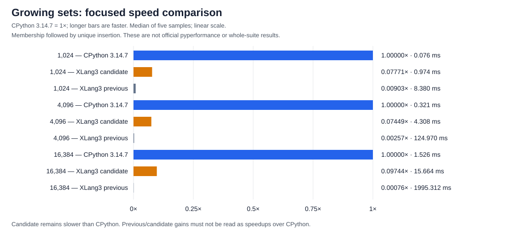

# Growing sets: remove quadratic insertion/index rebuilds (2026-10-06)

NetworkX's unchanged Python breadth-first search repeatedly checks
`w not in seen` followed by `seen.add(w)`. XLang3 previously scanned every
stored entry on insertion. Every insertion also invalidated the lazy
membership index, so the next membership check rebuilt every bucket. The
combined workload was quadratic even with distinct string keys.

The runtime now probes the existing hash buckets when inserting. An append
updates both hash and object-identity chains in constant amortized time while
the index has room. Crossing half-capacity invalidates the index for one
geometric rebuild. Small sets keep their allocation-free scan; ordered
entries remain authoritative. Arbitrary mutations still invalidate the index.
The comments beside `set_note_append` describe why unconditional invalidation
must not be restored.

Python equality/truth callbacks can mutate the set. The insertion path owns
the compared values and restarts unsuccessful probes when the content version
changes, reusing the query's single hash calculation. A successful equality
completes insertion even if the callback removed the entry, matching the
CPython 3.14.7 behavior verified by the fixture. This is a generic native set
runtime change; NetworkX remains Python code.

## Focused measurements

[The probe](../../benchmarks/diagnostics/set_growing_scaling_probe.py) constructs
its distinct string inputs outside the timed region, then times membership
followed by unique insertion. Each row reports the median of five retained
samples. These are focused wall-clock measurements, not official pyperf results
or a whole-suite speedup. Runs were sequential, after the previous graph run
finished and with no build running.

| Entries | Previous XLang3 | Candidate XLang3 | CPython 3.14.7 | Previous / candidate | Candidate / CPython |
| ---: | ---: | ---: | ---: | ---: | ---: |
| 1,024 | 8.380 ms | 0.974 ms | 0.076 ms | 8.60x | 12.87x slower |
| 4,096 | 124.970 ms | 4.308 ms | 0.321 ms | 29.01x | 13.42x slower |
| 16,384 | 1,995.312 ms | 15.664 ms | 1.526 ms | 127.38x | 10.26x slower |

A fourfold input increase previously cost about sixteen times as much. With
the candidate it costs about four times as much. Removing quadratic growth
does **not** mean XLang3 now beats CPython: this workload still has a roughly
tenfold gap at the largest size.

The [chart data](set-growing-index-20261006.csv) uses CPython time divided by
each runtime's time, so values below 1x mean slower than CPython. The
[renderer](../../benchmarks/diagnostics/summarize_set_growing.py) reads retained
JSON only; it does not run a benchmark.

Raw samples:

- [Previous XLang3](data/set-growing-control-20261006.json).
- [Candidate XLang3](data/set-growing-candidate-20261006.json).
- [CPython 3.14.7](data/set-growing-cpython3147-20261006.json).

## Validation and provenance

The [registered fixture](../../tests/fixtures/core/set_growing_index.py) passes
under both runtimes. It covers growth boundaries, duplicate insertion,
construction/frozensets, removals, clear/update, numeric equivalence,
collisions, and equality/truth callbacks that mutate the target. The full
XLang3 fixture suite, runtime/interpreter C++ tests, SDK stream/call test, and
graph producer/consumer also pass.

The [complete unchanged fixed Release gate](data/set-growing-index-fixed-release-gate-20261006.json)
passes all 11 cases with 21 repeats, 5 warmups, and the original 10% threshold.
Its largest candidate/baseline ratio is 1.035; none exceeds the threshold.
The official NetworkX rerun is still running. Its
[shortest-path attempt](data/networkx-set-growing-shortest-300s-timeout-20261006.txt)
completed six worker batches but reached the 300-second full-case cap before
publishing a result. The preceding runtime-protocol candidate also timed out
in all three cases at that cap. Repeated graph loading takes about 34 CPU
seconds per process, so a longer-cap retry is needed to obtain final samples.
No official graph timing or whole-suite improvement is claimed yet.

The executable path remains
`D:\CantorAI\xlang3\build-repro\main-verify-20261006\Release\xlang3.exe`;
the reference remains `C:\Python\Python314\python.exe`, version 3.14.7.
The fixed accepted regression baseline in `build-repro/Release` is unchanged.
The candidate also contains the validated I/O/descriptor protocol fixes and
other pre-existing worktree changes; it is not a clean-checkout measurement.
The [normalized source audit](data/set-growing-checkpoint-source-audit-20261006.json)
confirms that every actual runtime source change belongs to this checkpoint.
Other dirty status entries have no normalized content difference; the two
excluded content edits are a diagnostic-header comment and a blank test line.
Those edits were preserved, and no extra rebuild was required for them.

SHA-256 hashes (executable, runtime DLL):

- Previous: `8764D542781B69A7C71D0EAEE94B1FC67F02313B9332D8FEBBE4B1F20F76277E`,
  `5C9FD3500EC4B1F278A9BE49D6C864C743FB1922BE1F488770184DE0D922F191`.
- Candidate: `303F2E8BDCA58C4B555D13ADD7BFC41EEF9E0019F4780A0C9729596CE07DF177`,
  `4AA9D085D74402A8AF62A7F4E4605B45B0840B28D895225778DD74C7F7FD8FD1`.

The preceding Release executable/DLL were preserved before editing the set
implementation. Both focused XLang3 measurements ran at the same normal
candidate path, before and after the completed build. The control archive
was not used as a new run location. The goal to beat CPython remains active.
