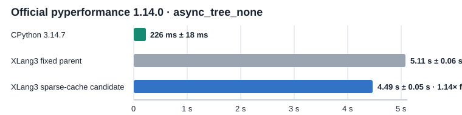

# Sparse per-instruction cache storage trial (2026-10-05)

## Result

Accepted as a measured XLang3 improvement. The official pyperformance 1.14.0
`async_tree_none` case is repeatably **1.14–1.15× faster** than the preserved
Release parent. The final rebuilt candidate measured **4.49 s**, compared with
**5.11 s** for the fixed parent. This closes part of the gap, but XLang3 is
still **19.83× slower** than CPython **3.14.7** on this case (226 ms in the
same fast-mode harness).

| Runtime | `async_tree_none` | Relative to fixed XLang3 parent |
|---|---:|---:|
| CPython 3.14.7 | 226 ms ± 18 ms | 22.6× faster |
| XLang3 fixed Release parent | 5.11 s ± 0.06 s | 1.00× |
| XLang3 sparse-cache candidate | 4.49 s ± 0.05 s | 1.14× faster |

Two order-reversed fast-mode pairs agreed: 5.11 s → 4.47 s (1.14×) and
5.12 s → 4.46 s (1.15×). The final rebuilt candidate stayed at 4.49 s. Each
file contains the official pyperf samples; the comparison used
`pyperf compare_to`. The CPython reference used the same Python 3.14.7
pyperformance 1.14.0 harness, workload, dependency site, and compatibility
shim.

## Design and diagnosis

The VM previously constructed a large `XlangVMInstrCache` record for every IR
instruction in each frame. Most instructions cannot own an adaptive cache.
Function execution metadata already identifies the instructions that can, so
frame storage now keeps a compact IP-to-cache-slot index and allocates the
large payload only at those sites. This reduces per-frame initialization and
memory traffic without changing cache ownership or cache guards.

Monitoring callbacks can visit any instruction, including those without an
adaptive cache. Their smaller per-IP generation and `DISABLE` mask therefore
remain dense in a separate side array. This preserves event suppression and
restart behavior without adding monitoring fields to every large cache
record. The code comments in `xlang_frame.h` and this storage regression test
record that design constraint.

A user-mode native IP sample over five official async-tree executions showed
samples in cache construction, `Value` assignment, release, and hash lookup
paths. That profile is a statistical lead rather than timing attribution: the
sampler suspends and resumes the active thread, so its sample counts do not
prove how much elapsed time each function consumes. The sparse allocation
change is accepted because the official pyperf A/B independently measured the
gain.

## Validation

- Full fixture suite under **Python 3.14.7**: passed.
- Release interpreter CTest: passed.
- Full Release CTest: 54/55 passed. The sole failure remains
  `xlang3_cli_visual_studio_debugpy_launch`, whose existing assertion reports
  `Visual Studio profile does not use xlang3.exe directly`.
- Complete 11-case fixed Release gate against `build-repro/perf-control`:
  passed at 21 order-balanced pairs and five warmups. The largest candidate /
  baseline ratio was **1.0345×** (`function_calls`), below the 1.10 limit.

The current candidate and fixed baseline are identified in the gate JSON by
their executable and runtime DLL hashes. Raw official pyperf output and logs,
the fixed-gate JSON and log, and the raw native sample are kept beside this
report in `doc/performance/data/`.

- [Final rebuilt XLang3 pyperf JSON](data/async-tree-sparse-cache-candidate-final-fast-20261005.json) and [log](data/async-tree-sparse-cache-candidate-final-fast-20261005.log)
- [CPython 3.14.7 pyperf JSON](data/async-tree-sparse-cache-cpython3147-fast-20261005.json) and [log](data/async-tree-sparse-cache-cpython3147-fast-20261005.log)
- [First fixed-control / candidate pair](data/async-tree-sparse-cache-control-fast-20261005.json) / [candidate](data/async-tree-sparse-cache-candidate-fast-20261005.json)
- [Reverse fixed-control / candidate pair](data/async-tree-sparse-cache-control-r2-fast-20261005.json) / [candidate](data/async-tree-sparse-cache-candidate-r2-fast-20261005.json)
- [Complete fixed Release gate JSON](data/sparse-instr-cache-fixed-release-gate-20261005.json) and [log](data/sparse-instr-cache-fixed-release-gate-20261005.log)
- [Five-tree native IP sample](data/async-tree-official-xlang3-native-samples-repeat5-20261005.json)
- [Fresh all-97 comparison against CPython 3.14.7, with chart and complete status CSV](pyperformance-xlang3-sparse-instr-cache-vs-cpython314-fast-20261005.md)

The overall goal remains open: this change does not make XLang3 faster than
CPython on async-tree, and it does not address the remaining slow or failing
pyperformance cases.
