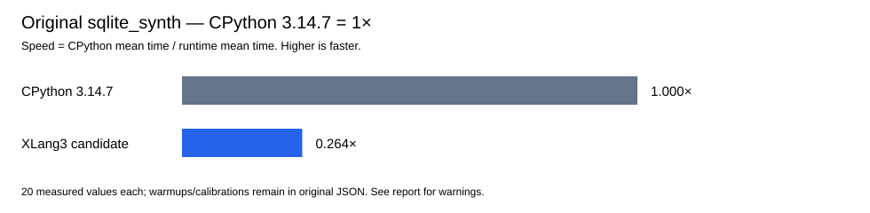

# SQLite aggregate/cursor and combined runtime checkpoint

Validation status: `validated`. Original sqlite_synth comparison follows below.

Own native `_sqlite3` supplies the aggregate bridge. The `sqlite3` wrapper and aggregate algorithms remain Python.

| Evidence | Outcome |
|---|---|
| R5 focused candidate | First five groups passed; replacement after one fetch failed. Full original seven-group fixture retained. |
| Retained cursor CP/X observation | CP replacement after first row succeeded; R5 XLang3 required exhaustion. This isolates native statement progress from temporary ownership. |
| R6 v1 / v2 | Unbuilt review proposals, preserved; SQL string ownership and writer bypasses corrected in v3. |
| New generic cursor CPython 3.14.7 | All eight groups passed; exact unchanged baseline reused. |
| Combined seven-API CPython probe | Native access violation `0xC0000005`, buffered stdout empty. Preserved as failure evidence, not a parity pass. |

The standalone original sqlite_synth run completed with 20 values before the complete correctness/gate acceptance. Its raw JSON, log and terminal receipt are preserved as unaccepted supplemental evidence; it does not replace the selected controller's fresh official run.

| Selected candidate phase | Exit |
|---|---:|
| focused-sqlite-native-aggregate | 0 |
| focused-sqlite-cursor-completion | 0 |
| focused-identity-last-use | 0 |
| focused-hash-exception-preservation | 0 |
| focused-exact-string-hash | 0 |
| focused-cursor-writer-guards | 0 |
| ctest-inventory | 0 |
| cpp-native-sqlite | 0 |
| manual-old-xlang-sqlite-api | 0 |
| manual-python-sqlite3-api | 0 |
| full-fixtures-core-compat-expected | 0 |
| fixed-gate | 0 |
| official-sqlite-synth | 0 |
| official-sqlglot-v2-parse | 0 |

Additional terminal evidence `sqlite-aggregate-cursor-r6-validation-20261008.json`: `failed_candidate-focused`.

| Additional phase | Exit | Registered tests reported |
|---|---:|---:|
| candidate-focused | 1 |  |

Additional terminal evidence `sqlite-identity-hash-combined-validation-20261008.json`: `failed_focused-identity-last-use`.

| Additional phase | Exit | Registered tests reported |
|---|---:|---:|
| focused-sqlite-native-aggregate | 0 |  |
| focused-sqlite-cursor-completion | 0 |  |
| focused-identity-last-use | 1 |  |

Additional terminal evidence `sqlite-cursor-r6-extra-focused-20261008.json`: `terminal_all_executed_checks_passed_harness_count_corrected`.

| Additional phase | Exit | Registered tests reported |
|---|---:|---:|
| cursor-eight-groups | 0 |  |
| writer-guards | 0 |  |
| cpp-native-sqlite | 0 | 9 |

Controller incorrectly expected 11 registered CTests; actual configured tree has 9 matching tests, all passed. Two API scripts require direct execution because they are not registered in this cached build. Original controller ended with assertion; no test rerun.

Additional terminal evidence `sqlite-cursor-writer-guard-isolated-cpython3147-20261008.json`: `isolated_reference_diagnostic_complete`.

| Isolated operation | Exit code | Native access violation | Assertions passed |
|---|---:|---|---|
| execute | 0xC0000005 | True | False |
| fetchone | 0x00000000 | False | True |
| fetchall | 0x00000000 | False | True |
| next | 0x00000000 | False | True |
| close | 0x00000000 | False | True |
| executescript | 0x00000000 | False | True |
| executemany | 0xC0000005 | True | False |

Isolated reference completion preserves crashes and differences; it does not establish whole candidate parity.

Controller fixture counts: `{"compatibility_sections": 11, "core": 380, "expected_failures": 3}`.

CPython 3.14.7 = **1×**. Speed is CPython mean time divided by runtime mean time; higher is faster. The saved CP reference and fresh candidate are unpaired official fast runs, not a paired improvement claim.

| Runtime | Mean ± sample SD (ms) | Values | CV | Speed vs CPython |
|---|---:|---:|---:|---:|
| cpython3147 | 0.001833 ± 0.000011 | 20 | 0.60% | 1.0000× |
| xlang3_candidate | 0.006943 ± 0.000382 | 20 | 5.51% | 0.2640× |

All 20 official values per runtime are in the sample CSV; calibration and warmups remain in original raw JSON.

Official log warning lines (full raw log retained):

> WARNING: the benchmark result may be unstable
> * Not enough samples to get a stable result (95% certainly of less than 1% variation)
> Use --quiet option to hide these warnings.

Completed cursors now copy current rows, advance before return, cache description and detach/finalize SQL. SQL/script text is owned before callback-capable cleanup. Same-cursor writers are guarded.

The lookahead guard is intentionally stricter than CPython's unlock-before-step implementation, whose cached Statement object owns its native storage. Our representation owns a raw statement; unrestricted reentrant parity is not claimed.

SQLite still does not publish callback edges through the existing SDK GC-reference facility. Factory→connection cycles need explicit close. The pre-existing scalar registration failure double-destroy remains separate. No full DB-API or whole-suite speed win is claimed.

Independent SQLGlot native-body profiling references are unscored and are not sqlite_synth timing evidence:

- [sqlglot-body-profile-validation-20261008.json](data/sqlite-aggregate-combined-checkpoint-20261008-sources/doc/performance/data/sqlglot-body-profile-validation-20261008.json)
- [sqlglot-parse-body-native-export-ranges-20261008.md](data/sqlite-aggregate-combined-checkpoint-20261008-sources/scratch/performance/sqlglot-parse-body-native-export-ranges-20261008.md)

Raw-source inventory and SHA-256 receipt: [manifest](data/sqlite-aggregate-combined-checkpoint-20261008-manifest.json).

The selected combined receipt also covers identity R2 and hash runtime changes. Source inventory and all declared source bytes are archived; stdout and stderr remain distinct. Failure or incomplete official output is unscored. This SQLite page does not turn the separate SQLGlot or String diagnostic into a SQLite speed claim.
