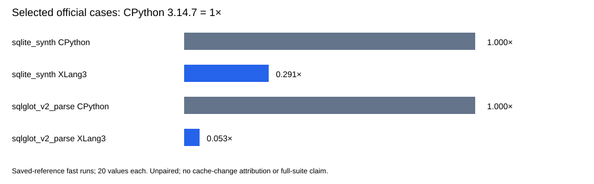

# Native SQLite prepared-statement cache checkpoint

Decision: **held**. Measurements below preserve the original official workload and all paired observations. The callback diagnostic is a negative-control screen and does not establish a whole-suite speed gain.

The own native `_sqlite3` module now keeps a configurable 128-entry connection LRU. It leases a prepared VM before parameter callbacks, prepares a separate VM for overlapping identical SQL, and makes a successful completed statement reusable only after reset and cleared bindings. Eviction, invalidation and close detach ownership before callback-capable destruction. Comments beside these paths explain the fast reuse and lifetime guards; Python aggregate algorithms remain Python.

The appended optional package-host `value_index` callback preserves ABI version 24 and existing prefixes. The native cache-size argument uses type-level index lookup, owned result transport and original pending exceptions. It does not read the mutable public `operator.index` function or ordinary instance overrides. Existing numeric-subclass and omitted-parameter-count limitations remain explicit.

Validation passed 382 core fixtures, 11 compatibility sections, 3 expected failures, 8 focused paths, 9 configured CTests and 2 direct SQLite API checks. The complete fixed 11-case gate retains 21 paired repeats, 5 warmups and 10% tolerance. Actual native C++ tests establish eight identical fresh-cursor INSERTs use one explicit prepare; disabled caching uses one per execute, capacity 2 obeys LRU, and nested/overlapping statements preserve independent leases and factory cleanup.

The R3 CPython 3.14.7 fixture failed because calling Cursor.close after Connection.close also raises ProgrammingError. R4 replaces only that invalid cleanup assumption with deletion/collection, while retaining the strict closed-fetch error and seven expected groups. Both original CP receipts and raw logs are archived. The first candidate controller refused a transient external CTest before any workload phase; that failed preflight receipt is preserved. Actual compiled source bytes, 12 owned changes, 44-source inventory and pre-trial raw snapshots are pinned separately from normalized scratch proposals.

## Original official SQLite pairs

The unchanged original `sqlite_synth` completed three alternating serial pairs against the preserved accepted Release. The median within-pair mean-time ratio is **1.095×**; the candidate is faster in 3 of three pairs. Each run keeps all 20 measured values, for 60 values per runtime. CPython 3.14.7 manages these runs and is not a timed runtime in this paired comparison. No values or outliers are removed.

| Pair | Order | Accepted control mean (ms) | Candidate mean (ms) | Control / candidate |
|---|---|---:|---:|---:|
| 1 | control → candidate | 0.006669 | 0.006091 | 1.095× |
| 2 | candidate → control | 0.006694 | 0.006048 | 1.107× |
| 3 | control → candidate | 0.006647 | 0.006087 | 1.092× |

[All 120 paired SQLite values](data/sqlite-statement-cache-checkpoint-20261008-original-sqlite-paired-values.csv), [six run statistics and warnings](data/sqlite-statement-cache-checkpoint-20261008-original-sqlite-paired-run-statistics.csv), and [three pair ratios](data/sqlite-statement-cache-checkpoint-20261008-original-sqlite-paired-summary.csv) retain the observations and alternating order. The mean ratio is calculated separately within each pair; the reported result is the median of those three ratios.

## Callback negative control

| Callback negative control | Median pair control / candidate |
|---|---:|
| string_dict_get | 0.910× |
| python_key_dict_get | 1.018× |
| builtin_hash_string | 0.994× |
| builtin_hash_python_key | 0.998× |
| direct_python_hash_method | 0.981× |
| saved_python_hash_method | 1.003× |
| ordinary_python_hash_function | 1.003× |
| ordinary_python_hash_wrapper | 1.011× |

Seven alternating pairs retain five raw samples per row/process, 16,384 operations per sample and all checksums: 560 timings. Each displayed ratio is the median of seven within-pair median-time ratios, **not** the ratio of pooled medians. Ratios above 1× favor the candidate. No confidence interval or significance test is supplied, and no samples/outliers are removed.

The string-key dictionary control measures **0.910×**, corresponding to 9.87% more time per sample. All seven within-pair ratios are below 1× across both execution orders. The slowdown's cause is unresolved; these observations do not establish code layout or another particular cause. A passed fixed gate does not erase this additional negative-control evidence.

## Selected official comparisons with saved CPython 3.14.7

These two original fast-mode benchmarks completed with all 20 measured values per runtime. CPython was measured October 7; the candidate is fresh. The comparison is unpaired and cannot attribute changes to the cache implementation. CPython mean time / XLang3 mean time is shown with CPython = 1×. This checkpoint does **not** include a new full 97-definition pyperformance run.

| Benchmark | Runtime | Mean ± sample SD (ms) | CV | Speed vs CPython |
|---|---|---:|---:|---:|
| sqlite_synth | cpython3147_saved | 0.001833 ± 0.000011 | 0.60% | 1.000× |
| sqlite_synth | xlang3_candidate | 0.006306 ± 0.000682 | 10.81% | 0.291× |
| sqlglot_v2_parse | cpython3147_saved | 0.988288 ± 0.010773 | 1.09% | 1.000× |
| sqlglot_v2_parse | xlang3_candidate | 18.646830 ± 1.067614 | 5.73% | 0.053× |

[Official raw values](data/sqlite-statement-cache-checkpoint-20261008-official-values.csv), [variation](data/sqlite-statement-cache-checkpoint-20261008-official-summary.csv), [paired raw values](data/sqlite-statement-cache-checkpoint-20261008-paired-values.csv), and [all pair ratios](data/sqlite-statement-cache-checkpoint-20261008-paired-summary.csv) retain the full observations.

Exact source identities, terminal validation, fixed-gate/raw phase logs, all six paired official JSON/log files, saved CPython receipts, callback logs and the Release build log are in the [owned manifest](data/sqlite-statement-cache-checkpoint-20261008-manifest.json). The original SQLite benchmark source is archived byte for byte. Candidate executable/DLL identities are pinned without adding binaries to Git. The twelve changed source files are archived and listed explicitly. Held/rejected exports include documents only in the owned staging list; source staging requires an accepted decision.

Saved CPython executable/DLL, benchmark Python sources and compatibility hook are pinned by the reused receipts. Dependency METADATA does not prove every historical package/data byte. Existing SQLite GC-edge and conservative cursor-reentrancy limits remain in the raw validation receipt. No whole-suite or overall CPython win is claimed.

Official warning lines (full logs archived):

> WARNING: the benchmark result may be unstable
> * the standard deviation (682 ns) is 11% of the mean (6.31 us)
> Use --quiet option to hide these warnings.
> WARNING: the benchmark result may be unstable
> * Not enough samples to get a stable result (95% certainly of less than 1% variation)
> Use --quiet option to hide these warnings.
