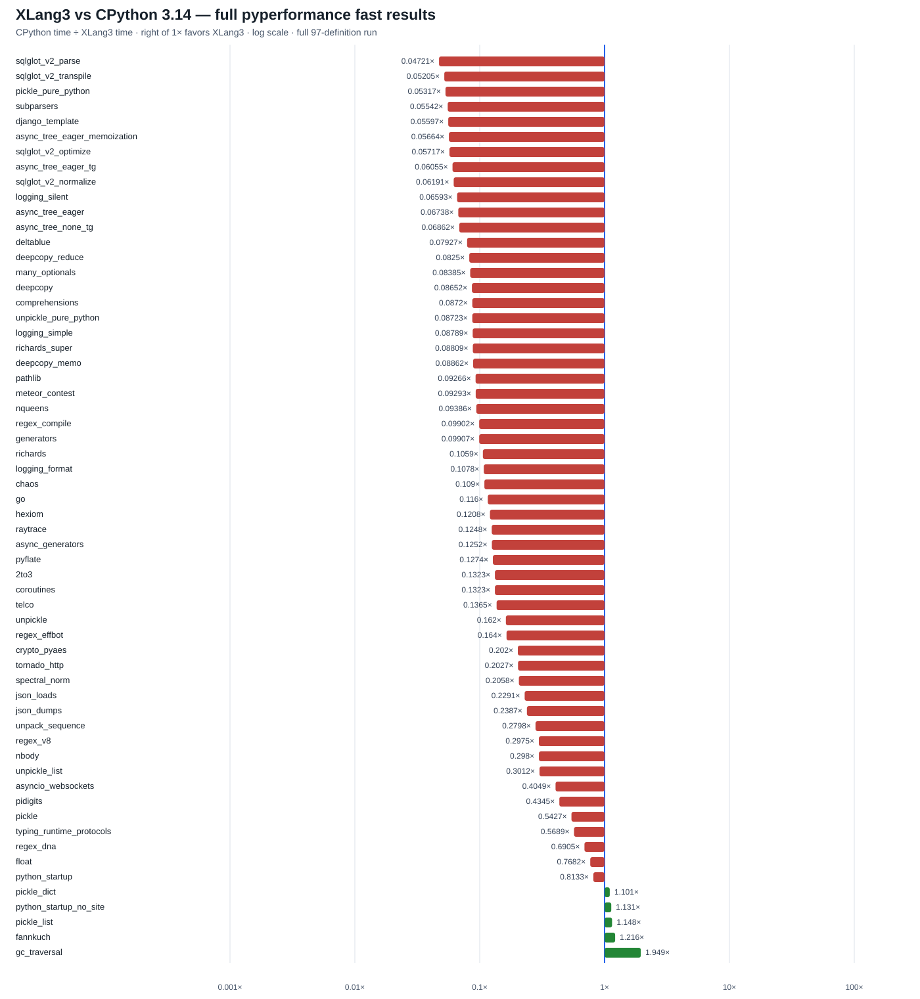

# Preserve string-subclass results from `str()` — 2026-10-06

## Correctness fix and benchmark coverage

`str(obj)` rejected a value returned by `obj.__str__` whenever that value was
an XLang3 `str` subclass. CPython 3.14.7 accepts the subclass and preserves its
identity. Django's pure-Python `SafeString.__str__` returns `self`, so this
runtime mismatch killed the `django_template` pyperformance worker before it
could produce a timing.

The generic `str()` implementation now accepts a subclass result only when it
has XLang3's valid stored string payload, then returns that same `Value`.
Ordinary non-string results still raise `TypeError`. The guard and reason are
documented beside the code in
[`sequence_builtins.cpp`](../../src/builtins/sequence_builtins.cpp). The
`object_type_model` fixture checks subclass identity and still checks rejection
of an invalid `__str__` result.

The fix does not implement Django or change its Python code. It makes XLang3's
generic builtin follow CPython's behavior and avoids allocating a replacement
string when `__str__` returns a valid string subclass.

## Validation

- CPython 3.14.7 and XLang3 produced matching output for the extended
  `object_type_model` fixture.
- The full fixture runner, `xlang3_interpreter_tests.exe`, and
  `xlang3_runtime_value_tests.exe` passed.
- The complete 11-case fixed Release regression gate passed. Candidate/control
  ratios ranged from 0.992× to 1.025×, within its 10% per-case limit. See the
  [gate report](data/release-regression-str-subclass-fix-20261006.json).
- The official pyperformance 1.14.0 `django_template` case now completes in
  the full XLang3 run at **532 ms**. A separate focused fast comparison measured
  **536 ms** in XLang3 and **29.8 ms** in CPython 3.14.7 (**17.99× slower**).
  Those focused samples warn about stability; the full-run result is also
  fast-mode directional evidence.

## Updated full pyperformance comparison

The corrected XLang3 build attempted all **97** definitions with a 120-second
per-definition cap. **56 completed** and **41 failed or timed out**. The
comparison has **60 matched subtests**, with **5 XLang3 wins** and a geometric
mean CPython/XLang3 speed ratio of **0.16001×**. Values above 1× favor XLang3.
The chart uses horizontal bars; bars extending right of 1× are XLang3 wins.

| Subtest | CPython 3.14.7 | XLang3 | CPython / XLang3 |
| --- | ---: | ---: | ---: |
| `sqlglot_v2_parse` | 1.010 ms | 21.40 ms | 0.0472× |
| `sqlglot_v2_transpile` | 1.302 ms | 25.02 ms | 0.0520× |
| `pickle_pure_python` | 273.5 µs | 5.145 ms | 0.0532× |
| `subparsers` | 8.151 ms | 147.08 ms | 0.0554× |
| `async_tree_eager_memoization` | 189.1 ms | 3.339 s | 0.0566× |
| `django_template` | 29.8 ms | 532.0 ms | 0.0560× |

The five measured wins are `gc_traversal` (**1.949×**), `fannkuch`
(**1.216×**), `pickle_list` (**1.148×**), `python_startup_no_site`
(**1.131×**), and `pickle_dict` (**1.101×**).

The XLang3 run still has 41 unsuccessful definitions. Its log and status CSV
retain each timeout and worker failure; a failed worker is not treated as a
performance score. The CPython full-run log marked `django_template` failed,
so its independently measured focused result is overlaid in a separate
reference JSON for the 60-subtest chart. No other CPython measurements were
replaced.

### Reproducibility artifacts

- [Full XLang3 pyperf JSON](data/pyperformance-xlang3-strsubclass-fixed-all-fast-20261006.json)
- [Full XLang3 runner log](data/pyperformance-xlang3-strsubclass-fixed-all-fast-20261006.log)
- [All 97 definition statuses](data/pyperformance-xlang3-strsubclass-fixed-all-fast-20261006-all-97-status.csv)
- [Matched and unmatched subtests](data/pyperformance-xlang3-strsubclass-fixed-all-fast-20261006-subtests.csv)
- [Focused XLang3 `django_template` result](data/pyperformance-django-template-selfstr-fix-20261006.json)
- [Focused CPython 3.14.7 `django_template` result](data/pyperformance-django-template-cpython314-selfstr-fix-20261006.json)
- [CPython full reference with the focused Django result added](data/pyperformance-cpython314-clean-release-full-fast-20261002-plus-django-template-20261006.json)
- [Fixed Release regression report](data/release-regression-str-subclass-fix-20261006.json)

The XLang3 run used CPython **3.14.7** at `C:\Python\Python314`,
pyperformance **1.14.0**, the shared Python 3.14 benchmark dependency site,
and the unchanged executable path
`D:\CantorAI\xlang3\build-repro\main-verify-20261006\Release\xlang3.exe`.
The candidate executable and runtime DLL SHA-256 hashes are
`7FB9FD272F16D0374596DA1149F61226F3011BB2EC80539F70900CDBB68B357D` and
`CCC5EC8DDA34F0686799FCBEF0080907B30F27D79F8E44D0C28B9A9EE4C33259`.

This compatibility fix makes one additional benchmark measurable; it does not
materially close the overall performance gap. The speed objective remains
open, especially for Python-level SQLGlot, pickle, argparse, and asyncio work.
