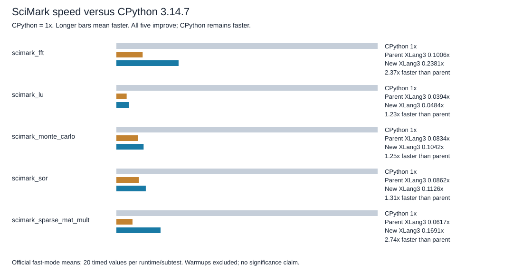

# Subscription dispatch and Python setter frames

This follow-up starts from the validated array checkpoint `e4417566` on main.
The candidate remains in `build-repro/main-verify-20261006/Release`; the
accepted fixed regression baseline remains `build-repro/Release`. All Python
management and references use `C:/Python/Python314/python.exe`, version 3.14.7.

## Measured cause

The [extended diagnostic](../../benchmarks/diagnostics/native_subscription_dispatch_probe.py)
constructs arrays and binds saved methods before timing. With 100,000
operations, the first control measured array subscription reads at 418 ns and
writes at 458 ns per operation. Saved native methods took 254 and 231 ns.
A simple Python wrapper setter was more expensive: subscription assignment
took 1,714 ns per operation versus 787 ns through the saved Python setter.
These are diagnostic timings, not pyperformance results.

The VM already dispatches ordinary Python getters on its existing frame stack.
Native getters still repeated generic lookup/binding, and setters used generic
runtime calls, including evaluator re-entry for Python setters. Indexed local
binding does not remove this operation boundary or its allocations.

CPython 3.14.7's
[`slot_mp_ass_subscript`](https://github.com/python/cpython/blob/v3.14.7/Objects/typeobject.c#L9471-L9489)
passes self, key and value in a three-element argument vector and discards the
method result. Its
[`vectorcall_method`](https://github.com/python/cpython/blob/v3.14.7/Objects/typeobject.c#L2809-L2823)
uses special-method lookup. The generic
[`STORE_SUBSCR`](https://github.com/python/cpython/blob/v3.14.7/Python/bytecodes.c#L991-L998)
uses `PyObject_SetItem`; its specialization family includes dict and list
writes. This is distinct from CPython's specialized Python getter path, which
pushes the getter frame and continues the evaluator. The XLang3 improvement
reuses its existing normal Python frame path for setters; it does not translate
the setter body or SciMark algorithms into C++.

## Implementation and invariants

Own-class plain Python/native methods use class identity and the globally
unique class version as guards. Other descriptors and inherited methods retain
special-method resolution. Native callbacks retain the current callable and
operands while invoking the existing runtime callback path, so an index callback
can mutate the class safely. Cached targets remain non-owning.

Python setters use the standard VM argument binding, frame stack, tracing and
exception propagation. `DiscardReturnValue` preserves the setter's observable
return event while preventing its return value from overwriting the container
register. Consumed temporary memoryviews retire when that frame returns.
`SetItem` is registered in the sparse cache allocation/cleanup metadata;
omitting that registration caused the first prototype's access violation and
is now covered by a direct C++ metadata test.

The fixture compares against CPython: ignored returns, instance shadowing,
class mutation at a warmed site, inherited overrides, mutation inside native
index conversion, property descriptors, generator setters, temporary exports,
profile return events and exception tracebacks. An existing property binding
gap in special-method resolution was also repaired through the real Python
getter; it remains Python code.

## First paired prototype evidence

The [order-balanced diagnostic](data/subscription-dispatch-frame-paired-20261007.json)
runs seven bounded repeats, each in both executable orders, retaining every
worker sample and matching start/end binary hashes. Candidate time divided by
control time is below 1 for an improvement:

| Path | Candidate / control time | Control / candidate speed |
|---|---:|---:|
| Array subscription read | 0.447 | 2.239x |
| Saved native getter | 0.956 | 1.046x |
| List read | 0.965 | 1.036x |
| Array subscription write | 0.341 | 2.933x |
| Saved native setter | 1.006 | 0.994x |
| List write | 1.070 | 0.935x |
| Python wrapper read | 0.690 | 1.449x |
| Saved Python getter | 0.674 | 1.485x |
| Python wrapper write | 0.297 | 3.368x |
| Saved Python setter | 0.630 | 1.588x |

The initial apparent slowdown of saved native calls was not reproduced in the
paired diagnostic. List writes retained a roughly 7% slower median, motivating
one further change: fetch the sparse cache only inside the instance dispatch
branch. Primitive container writes do not use method caches.

All fixtures, eight selected C++/SDK/serialization tests and the
[complete fixed gate](data/release-subscription-dispatch-frame-fixed-gate-20261007.json)
passed for the first paired prototype. Its DLL SHA-256 is
`55125F848A7E7E2966D73B5ACBFCD67D0B7C3D5F9E0B6B2A81254B62E277176F`.
The subsequent lazy-cache build is a new candidate and needs fresh validation
and official SciMark evidence before an engine commit. No official suite gain
or CPython win is established by these diagnostic factors.

## Lazy cache access candidate

The [second order-balanced diagnostic](data/subscription-dispatch-lazy-paired-20261007.json)
retains the same seven bounded repeats and both executable orders. Array read
and write factors are 2.289x and 2.969x versus the preserved XLang3 parent;
Python wrapper setter operations are 3.370x faster. The list-write time ratio
is now 1.020 rather than 1.070. This short diagnostic does not establish a
significant list regression or an official suite score. Saved native setter
time remains essentially unchanged at 1.006x the control time.

The candidate DLL SHA-256 is
`990237AD095D6865F54A0A5974AD94E55B95A5D29E06E3EF59AB80DFE9474FFF`.
Full fixtures and all eight C++/SDK checks return 0. The
[validation record](data/subscription-dispatch-lazy-validation-20261007.json)
tracks the unchanged default gate separately; official SciMark verification
will be recorded after that gate completes. The implementation is uncommitted
at this stage.

The lazy-cache candidate's complete default fixed gate has now passed with all
11 cases, 21 paired repeats, five warmups and the unchanged 10% threshold.
The [source identities](data/subscription-dispatch-lazy-source-identity-20261007.json)
record the compiled engine/test inputs and preserved control. Official
SciMark is now running under the same 300-second complete-definition cap,
with start/end identity recording and profiling disabled. Its results will
be compared with both the parent array checkpoint and CPython 3.14.7.

## Complete official SciMark results

The final unprofiled fast run completes all five subtests with 20 timed values each under the unchanged 300-second definition cap. Exit status is 0, and start/end executable and DLL hashes match in the [provenance](data/pyperformance-xlang3-subscription-dispatch-scimark-fast-20261007-provenance.json). Calibration and warmups are excluded. The pyperf stability warnings are preserved; these are nominal fast-run means, without a significance claim.

| Subtest | CPython 3.14.7 seconds | Parent XLang3 seconds | New XLang3 seconds | Parent / new speed | New speed, CPython = 1x |
|---|---:|---:|---:|---:|---:|
| scimark_fft | 0.2505606 | 2.4915596 | 1.0524028 | 2.367x | 0.2381x |
| scimark_lu | 0.0766407 | 1.9469581 | 1.5846478 | 1.229x | 0.0484x |
| scimark_monte_carlo | 0.0602609 | 0.7225054 | 0.5781364 | 1.250x | 0.1042x |
| scimark_sor | 0.1052482 | 1.2213980 | 0.9349846 | 1.306x | 0.1126x |
| scimark_sparse_mat_mult | 0.0032494 | 0.0526619 | 0.0192180 | 2.740x | 0.1691x |

The implementation materially improves every official SciMark subtest relative to the validated array parent. It remains slower than CPython in every case. The [five-row CSV](data/subscription-dispatch-scimark-20261007-subtests.csv), [candidate raw values](data/pyperformance-xlang3-subscription-dispatch-scimark-fast-20261007.json), [parent raw values](data/pyperformance-xlang3-native-array-final-consumers-scimark-fast-20261007.json) and [CPython raw values](data/pyperformance-cpython314-clean-release-full-fast-20261002.json) retain the comparison evidence. This subset does not replace the frozen all-97 report or establish that the full goal is achieved.

The final candidate passes all fixtures, eight C++/SDK/serialization tests, the complete fixed baseline gate, the CPython-paired semantics fixture and order-balanced dispatch diagnostics. The source/test identities and unchanged run path are recorded separately. SciMark and pure-Python library algorithms remain Python; array subscriptions call XLang3's own native array methods, unchanged from the parent checkpoint.
