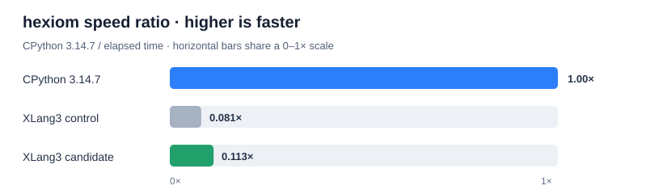

# Keep native `sum()` inside one VM entry for exact-int generators

The slow `hexiom` benchmark contains `sum(1 if ... else 0 for ...)` generator
expressions. Each exact integer yield previously saved the generator's VM
continuation and re-entered the interpreter for the next item. When native
`sum()` starts from exact integer zero, XLang3 now lets an unobserved generator
add exact integer yields directly into the live accumulator and continue in
the same VM entry. The generator still receives `None` as the result of each
`yield`, as it does when `sum()` calls `next()` repeatedly.

The fast path stops before exposing a yield if it encounters a non-integer,
int64 overflow, active exception handler, trace/debug/monitoring observer, or
performance counter. Those cases resume through the existing iterator and
addition code; overflow therefore keeps the existing promotion to BigInt.
The accumulator pointer is held only for the duration of the native `sum()`
call and cleared by a scope guard. The invariant and fallback are documented
beside the native builtin and the VM yield handler.

## Official pyperformance result

All runs used pyperformance **1.14.0** in rigorous mode on the official
`hexiom` benchmark. XLang3 and CPython both loaded the Python **3.14.7** library
from `C:\Python\Python314`.

| Runtime | Mean | Relative speed |
|---|---:|---:|
| CPython 3.14.7 | 5.03 ms ± 0.10 ms | 1.00× |
| XLang3 fixed Release control | 62.0 ms ± 3.6 ms | 0.081× CPython/XLang3 |
| XLang3 candidate | 44.5 ms ± 0.5 ms | 0.113× CPython/XLang3 |

`pyperf compare_to` reports the candidate **1.39× faster** than the fixed
XLang3 control. That is about **28% less time** on `hexiom`. CPython 3.14.7 is
still **8.86× faster** than the candidate, so this targeted gain does not
resolve the overall performance goal.

## Correctness and fixed Release gate

The new fixture checks exact-int accumulation, `None` sent back into the
generator, mixed-type fallback, int64 overflow promotion, a nonzero start,
ordinary iterable behavior, and a generator protected by `try/finally`. The
focused fixture passed, and the complete Python fixture runner passed. CTest
passed **54/55** tests; the sole failure is the existing
`xlang3_cli_visual_studio_debugpy_launch` configuration assertion that the
Visual Studio profile invoke `xlang3.exe` directly.

The complete fixed Release regression gate passed all 11 cases using 21
order-balanced pairs, five warmups, and its 10% per-case threshold. Its largest
candidate/control ratio was `list_append` at **1.014×**, within the gate.

| Build | `xlang3.exe` SHA-256 | `xlang3_runtime.dll` SHA-256 |
|---|---|---|
| Control | `3928C09A3BC954414A8F6F95AF125E229B4DD5977D25685B42D53E570CFB1684` | `4066CF48EDE4C5E98869920CA1954C2F531967B5FA12A49BFDF87F2CCD84887D` |
| Candidate | `EADF7F0E846790573E189BE930537E021D4718A99F17E96FB2D95135694F5DE3` | `DD81A0CD84510F9CA650A97989011D00304758E267BFE7E581BC9359AB33CE97` |

Raw results: [XLang3 control](data/pyperformance-hexiom-sumgen-control-rigorous-20261006.json), [XLang3 candidate](data/pyperformance-hexiom-sumgen-candidate-rigorous-20261006.json), and [CPython 3.14.7](data/pyperformance-hexiom-sumgen-cpython314-rigorous-20261006.json). The [fixed Release gate JSON](data/sum-generator-int-fixed-release-gate-20261006.json) retains all case measurements.

The [refreshed all-97 comparison](pyperformance-xlang3-sum-int-gen-vs-cpython314-fast-20261006.md) includes the new candidate: 46 definitions completed, 51 failed or timed out, and the matched-subtest geometric mean improved from 0.17493× to 0.17958× CPython/XLang3. The broader XLang3 speed gap remains substantial.
