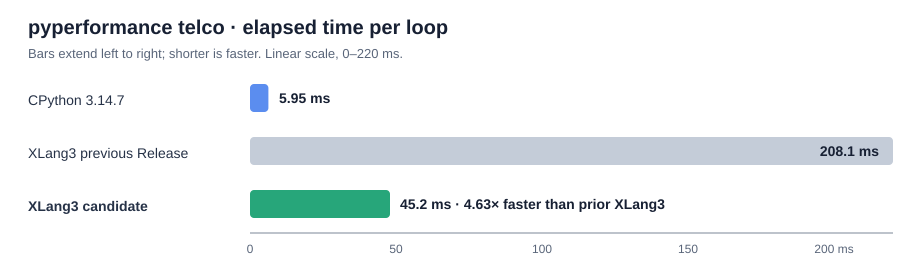

# Decimal signal-flag identity lookup for `telco` (2026-10-04)

## Result

The exact XLang3 Release build measured **45.2 ms** for the unchanged one-loop
pyperformance `telco` body, down from **208.1 ms** on the immediately preceding
Release build. An order-balanced 21-pair comparison reports **4.63× faster**
(candidate/control **0.2159×**, 95% interval **0.2122–0.2177**). The official
pyperformance 1.14.0 rigorous run measured **43.3 ± 3.2 ms**. CPython 3.14.7
measured **5.95 ms** for the same direct workload body, leaving XLang3 **7.66×
slower**. This is a substantial, measured reduction in the gap, not parity.

The official fast-mode result was 43.1 ± 2.4 ms; `pyperf compare_to` reports
the candidate **4.28× faster** than the saved 185 ms XLang3 comparison. A
second rigorous run on the rebuilt, safety-narrowed DLL measured **44.1 ± 4.0
ms**. Both rigorous pyperf runs warned that samples did not reach the requested
stability target, so the order-balanced same-source results provide the
stronger before/after evidence. The latest full 97-definition report is still
from the preceding candidate and must be refreshed before presenting a new
overall geometric mean.

## Diagnosis and change

The pre-change native profile recorded **12,507** successful quantize calls.
Within the profiled native quantize time of **196.7 ms**, updating `Rounded`
and `Inexact` flags accounted for **165.8 ms** (about **84%**). The profile
adds clock instrumentation and is not a normal benchmark score; its purpose
was to locate the dominant work. The raw measurements are in
[`telco-callmethod-decimal-profile-task-weakset-20261004.log`](data/telco-callmethod-decimal-profile-task-weakset-20261004.log).

`Context.flags` and `Context.traps` are ordinary dicts keyed by the stable
`Rounded` and `Inexact` signal class objects. Generic non-string dictionary
lookup and update compared each key through `value_key_equal` on every
quantize. The runtime now has an exact object-identity lookup for a key already
present in a plain dict. It only returns early when the identical object is
stored; missing keys and unsupported mapping shapes still use the regular
hash/equality path. The native `_decimal` quantize path uses that helper for
its signal lookups and flag updates. The comments in
[`mapping.h`](../../src/internal/xlang3/mapping.h),
[`mapping.cpp`](../../src/runtime/mapping.cpp), and
[`decimal_module.cpp`](../../src/runtime/modules/system/decimal_module.cpp)
document this fast path and its fallback boundary.

This improves XLang3's native counterpart of CPython's `_decimal` boundary.
`decimal.py` and `_pydecimal.py` remain Python implementations. The
`decimal_native_quantize.py` and `decimal_native_arithmetic.py` fixtures both
match their expected outputs under the Release candidate; together they cover
rounding modes, sticky flags, traps, context mutation, signed zero, and Python
method replacement.

## Measurements and validation

| Runtime / workload | Elapsed time | Ratio |
|---|---:|---:|
| CPython 3.14.7, direct unchanged body | 5.95 ms | 1.00× |
| XLang3 previous Release, direct unchanged body | 208.1 ms | 35.0× CPython time |
| XLang3 candidate Release, direct unchanged body | 45.2 ms | 7.60× CPython time |
| XLang3 candidate, official pyperformance rigorous | 43.3 ± 3.2 ms | 7.24× saved CPython result |
| Rebuilt candidate, official pyperformance rigorous repeat | 44.1 ± 4.0 ms | 7.41× saved CPython result |

- `xlang3_interpreter_tests.exe` passed.
- Both Decimal regression fixtures matched their checked-in expected output.
- The fixed 11-case Release gate passed after 21 order-balanced samples per
  case and five warmups on the rebuilt candidate; see the linked gate JSON
  below. All 11 cases passed, including `json_dumps` at 0.830× and `subparsers`
  at 0.867× candidate/baseline time.
- XLang3 executable SHA-256:
  `533991326CE1CCD5A73A0A1B47F32A14AC2C8574184B37D1D6BFEFE19DBA328E`.
- XLang3 runtime DLL SHA-256:
  `B9512157E75896C624477788DB6CC7EE12F5B71C50C00E928B4C6773518D4A28`.

The full fixture runner stopped earlier at `ctypes_pointer_return` because
this build environment's ctypes backend reports `libffi is unavailable`;
the Decimal fixtures were run directly and passed. That environment issue is
separate from this mapping change.

## Raw data

- [Official XLang3 fast-mode JSON](data/pyperformance-xlang3-telco-decimal-identity-flags-candidate-fast-20261004.json)
- [Official XLang3 rigorous JSON](data/pyperformance-xlang3-telco-decimal-identity-flags-candidate-rigorous-20261004.json)
- [Rebuilt XLang3 rigorous repeat JSON](data/pyperformance-xlang3-telco-decimal-identity-flags-final-rigorous-20261004.json)
- [Order-balanced XLang3 before/after samples](data/telco-decimal-identity-key-order-balanced-20261004.json)
- [Order-balanced XLang3 vs CPython 3.14.7 samples](data/telco-decimal-identity-key-vs-cpython314-order-balanced-20261004.json)
- [Fixed Release regression gate](data/decimal-identity-key-fixed-release-gate-rigorous-20261004.json)
- [CPython 3.14.7 official pyperformance reference](data/telco-decimal-cpython-fast-20261002.json)
