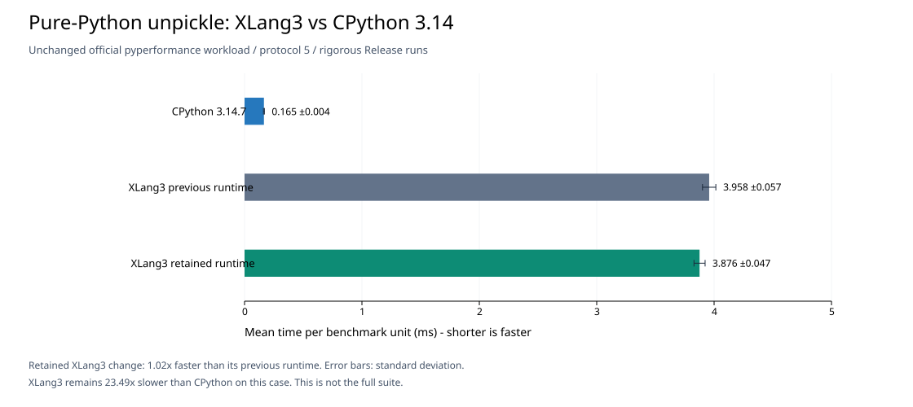

# Clear only the active VM cache payload (2026-09-30)

The retained generic VM cache-cleanup change passed both complete Release
gates and improves the unchanged official pure-Python unpickle case from
3.9581 ±0.0568 ms to 3.8761 ±0.0473 ms: **1.02× faster** (t = 12.16),
with 2.07% less time. A preliminary version with larger apparent gains was
rejected because its cleanup omitted an owning payload in fused instructions.
This is a targeted update, not a new all-97 pyperformance suite run.

`pickle.py` and other CPython pure-Python libraries remain Python. The change
is in shared XLang3 frame cleanup. XLang3 native counterparts remain allowed
only for modules that CPython itself implements natively, with compatible
Python-facing import names and API/ABI.

## Design and correctness

The preceding [native frame-cost profile](native-vm-frame-costs-20260930.md)
identified cache cleanup as 5.52–5.64% of positive diagnostic self-time in
unpickle. Previously, every touched site reset its entire 424-byte cache
record on return, visiting unrelated global, attribute, call, and monitoring
fields. [Sparse-storage alternatives](vm-cache-storage-trials-20260930.md)
did not improve the official benchmark and were removed.

The retained design keeps direct instruction-indexed storage. The last
adaptive domain does not describe every owning payload: fused `CallGlobal`
and `LoadModuleAttr` sites perform a global load before the call/attribute
operation. Attribute and call/method-call sites therefore clear global state
first, then their active payload. Global sites clear global state. Call and
CallMethod can delegate to each other but use the same call payload.
Unknown domains retain the conservative whole-record reset. Future cache
writers and fusions must preserve this multi-payload ownership rule.

Length/index specialization retains its non-owning scalar core across short
activations. Every specialized hit validates the current operand kind.
Indexing's Python-method payload still resets because its class/function
pointers may die between activations. Other domains reset their core, all
owning payloads are released on return, instruction cleanup order is retained,
and monitoring `DISABLE` masks still reset for every activation. No IR opcode
shapes, fusion eligibility rules, compiler settings, or library bodies changed.

The implementation comments explain these ownership and performance rules
beside `XlangVMFrame::clear_cache_if_owned`. The
[new fixture](../../tests/fixtures/core/vm_cache_materialization.py) covers
late cache sites, method mutation, monitoring disable/restart, owner release,
cross-activation scalar specialization, changing sequence kinds, negative and
invalid indices, Unicode indexing, and mutable Python length/index methods.
Its output is generated by CPython 3.14.7.

The [C++ interpreter tests](../../tests/cpp/interpreter_tests.cpp) directly
check that fused call/attribute caches release both their global and active
payload owners on pop. A diagnostic build with the two global resets removed
fails both new ownership assertions, as shown by the
[negative test output](data/cache-cleanup-incomplete-payloads-cpp-tests-20260930.txt).
The corrected complete interpreter-test executable passed with exit 0.

The candidate passed all 302 core fixtures, 11 compatibility sections, and
three expected failures. The saved
[engine patch](data/cache-domain-cleanup-trial-20260930.patch) applies to
`e4d9e90` with `git apply --unidiff-zero` and excludes test/report changes.

## Official benchmark evidence

The benchmark is unchanged pyperformance 1.14.0 `bm_pickle/run_benchmark.py`
with `--pure-python --protocol 5 unpickle`. Both ordinary runtimes are Release
builds, use separate import-cache directories, and exclude all native timing
probes. No builds or other benchmarks ran concurrently.

Each rigorous score contains 120 measured values from 40 worker processes,
plus calibration. The retained pair ran parent first, then candidate:

| Runtime | Mean ± standard deviation | Speed relative to parent |
|---|---:|---:|
| Parent XLang3 | 3.9581 ±0.0568 ms | 1.000× |
| Retained XLang3 | 3.8761 ±0.0473 ms | 1.021× |

Raw scores: [parent](data/unpickle-domain-cleanup-global-parent-rigorous-20260930.json),
[candidate](data/unpickle-domain-cleanup-global-candidate-rigorous-20260930.json).
The `.log` files retain the benchmark output.

The following scores belong to the **rejected incomplete-payload version**,
not the retained runtime. They are saved to explain why the earlier 3% gain
is not the final claim. The first pair measured 4.0140 ±0.0617 ms for parent
and 3.8800 ±0.0705 ms for candidate (1.03× faster, t = 15.66). The reverse
pair ran candidate first, then parent:

| Runtime | Mean ± standard deviation | Speed relative to this pair's parent |
|---|---:|---:|
| Parent XLang3 | 4.0109 ±0.0537 ms | 1.000× |
| Candidate XLang3 | 3.9725 ±0.3670 ms | 1.010× |

Pyperf reported this comparison as statistically insignificant. The candidate
median was 3.8762 ms, close to the first pair's mean, but its measured values
ranged from 3.7543 ms to 5.6741 ms. Do not remove the high values or present the
first pair's result as guaranteed on every run. Raw reverse scores:
[parent](data/unpickle-domain-cleanup-parent-reverse-rigorous-20260930.json),
[candidate](data/unpickle-domain-cleanup-candidate-reverse-rigorous-20260930.json).

An earlier fast screening pair of that rejected version measured parent
4.6517 ±0.6212 ms and candidate
3.9974 ±0.0963 ms. The parent run drifted through values between 3.95 ms and
5.95 ms. Its apparent 1.16× gain is not the performance claim for this change.
The [fast parent](data/unpickle-domain-cleanup-parent-fast-20260930.json) and
[fast candidate](data/unpickle-domain-cleanup-candidate-fast-20260930.json)
preserve the noisy evidence.
The rejected [source patch](data/cache-domain-cleanup-incomplete-payloads-trial-20260930.patch)
and its [first parent](data/unpickle-domain-cleanup-parent-rigorous-20260930.json)/
[first candidate](data/unpickle-domain-cleanup-candidate-rigorous-20260930.json)
scores preserve the full preliminary experiment. Its runtime SHA-256 was
`19810153965ADD7DFACCBE01E0640E753BA5231EA90EDC33597CDA113F6C0BA1`;
its CLI hash was the same as the corrected candidate. The preliminary
`cache-domain-cleanup-*-gate` files are superseded by the `*-global-*-gate`
files below. They did not include the new direct ownership assertions.

## Release validation and CPython comparison

Both complete default gates passed with exit 0: 11 unchanged cases, 21
balanced paired samples, five warmups, and the unchanged 10% per-case limit.
The [fixed-baseline gate](data/cache-domain-cleanup-global-fixed-baseline-gate-20260930.json)
detects cumulative degradation; the
[immediate-parent gate](data/cache-domain-cleanup-global-immediate-parent-gate-20260930.json)
isolates this change. Neither gate uses CPython as its baseline.

The table below is candidate time divided by the immediately previous XLang3
runtime's time. Values below 1.0 are faster. The smaller local workloads show
mixed effects, including small call/property costs. The release tolerance
does not make that slowdown a gain.

| Local gate case | Candidate/parent time | 95% interval | Result |
|---|---:|---:|---|
| `local_slots` | 0.966× | 0.965–0.973× | pass |
| `scalar_arithmetic` | 0.995× | 0.987–1.004× | pass |
| `range_for` | 1.007× | 0.999–1.025× | pass |
| `function_calls` | 1.004× | 0.994–1.012× | pass |
| `class_construct` | 0.995× | 0.991–1.011× | pass |
| `list_append` | 0.997× | 0.985–1.051× | pass |
| `property_access` | 1.014× | 1.001–1.023× | pass |
| `deepcopy_memo` | 0.975× | 0.961–0.986× | pass |
| `json_dumps` | 0.962× | 0.958–0.967× | pass |
| `gc_traversal` | 1.001× | 0.992–1.005× | pass |
| `subparsers` | 1.000× | 0.997–1.016× | pass |

The local JSON gain is not a new official `json_dumps` score. Official-suite
effects outside the measured unpickle case have not been rerun for this change.

Fresh CPython 3.14.7 measured **0.16504 ±0.00409 ms** with the identical
official workload and rigorous settings. Its
[raw score](data/unpickle-domain-cleanup-cpython314-rigorous-20260930.json)
contains 120 measured values. Speed is reference time divided by XLang3 time:

| Runtime / measurement | Time | Speed, CPython = 1.0× | Time relative to CPython |
|---|---:|---:|---:|
| CPython 3.14.7 | 0.16504 ms | 1.000× | 1.00× |
| Retained XLang3 | 3.87608 ms | 0.0426× | 23.49× longer |



The horizontal chart shows the retained XLang3 pair and the same-day CPython
reference, including standard-deviation bars. The CPython reference was
collected earlier in this investigation, before the fused-payload correction;
its workload and executable/runtime hashes are unchanged. XLang3 remains substantially
slower on this case; the goal of beating CPython remains unmet.
The [ReportLab renderer](../../benchmarks/diagnostics/render_cache_cleanup_comparison.py)
recreates the SVG from the three raw JSON scores without changing measurements.

A separate [exec-globals lifetime probe](../../benchmarks/diagnostics/exec_mapping_owner_probe.py)
reports owner release in CPython but retention in both the parent and corrected
XLang3 runtime. Its [CPython](data/exec-mapping-owner-cpython314-20260930.txt),
[parent](data/exec-mapping-owner-parent-20260930.txt), and
[candidate](data/exec-mapping-owner-candidate-20260930.txt) outputs preserve this
pre-existing discrepancy. It is not counted as a passing fixture or blamed on
this change; globals/snapshot ownership remains a separate investigation.

The reference is `Python 3.14.7 (tags/v3.14.7:823f032)` on 64-bit Windows,
verified with `python.exe -VV`. Its executable SHA-256 is
`4942B86A6597E5AEE0128DAA00050ED79BC21F6E709A78EB19CBFEB0C2F39AC9`;
its `python314.dll` SHA-256 is
`0F9857FFDFE010FE6B99328D58C2E3C7472CE75F336BF9C2AD9BD5BCA3BCE700`.

## Build identity and reproduction

Parent source is `e4d9e90`. The candidate contains the generic cache-cleanup
change above. Both executable/runtime pairs were preserved independently.
An explanatory source comment was added after measurement; it changes no
executable behavior.

| Binary | Parent | Candidate |
|---|---|---|
| `xlang3.exe` | `243F6A336E317FF60942217BFEA77632182B917B7A4DCCD72E7FD333356CC7C0` | `C6C554AA507EDB9B58308C4E2C933F2CB0F6653711E8C0FE0D1FA5DE6CAB182B` |
| `xlang3_runtime.dll` | `2C371933BDE80E66CE85122C3516278BCDD2674DE209B281A5DC9275C17FBEAA` | `9D683BFBD3664292D5DDD1C5092A8FF00C4316F9FCE939CC67AEA8B2C713F81D` |

Use the recorded source and separately preserved Release pairs. Set
`PYTHONPATH` to `benchmarks/diagnostics/pyperf_compat` and the benchmark
dependency environment's `Lib/site-packages`; use a separate
`PYTHONPYCACHEPREFIX` for each executable. Run:

```powershell
C:/Python/Python314/python.exe `
  C:/Python/Python314/Lib/site-packages/pyperformance/data-files/benchmarks/bm_pickle/run_benchmark.py `
  --rigorous --python <executable> `
  --inherit-environ PYTHONPATH,PYTHONPYCACHEPREFIX `
  --output <result.json> --pure-python --protocol 5 unpickle

C:/Python/Python314/python.exe tests/run_fixtures.py build/Release/xlang3.exe
C:/Python/Python314/python.exe benchmarks/check_regression.py `
  --baseline scratch/performance-baseline/xlang3.exe `
  --candidate build/Release/xlang3.exe `
  --output doc/performance/data/cache-domain-cleanup-global-fixed-baseline-gate-20260930.json
C:/Python/Python314/python.exe benchmarks/check_regression.py `
  --baseline scratch/performance-cache-storage-parent-20260930/xlang3.exe `
  --candidate build/Release/xlang3.exe `
  --output doc/performance/data/cache-domain-cleanup-global-immediate-parent-gate-20260930.json
```
