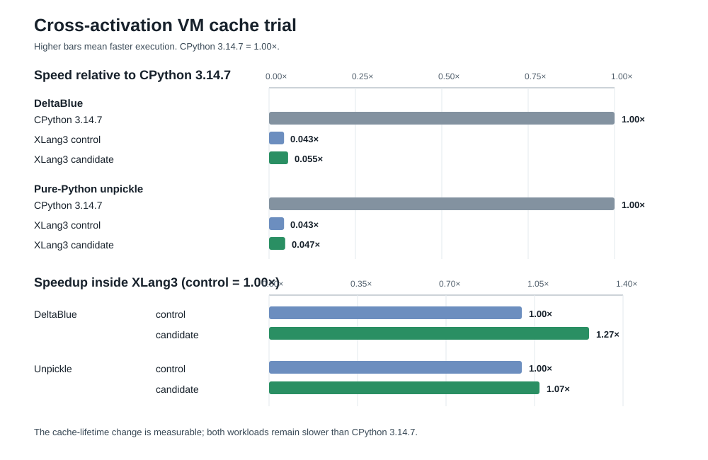

# Keep safe VM inline caches warm across calls

This trial uses CPython 3.14.7's evaluator as the implementation reference and
removes repeated XLang3 method and attribute lookup work across Python frame
returns. The standard-library bodies remain Python. The change is limited to
XLang3's VM cache lifetime and class invalidation tags.

## What CPython does that XLang3 was not doing

CPython's adaptive cache belongs to the bytecode site and remains warm across
calls to that code. A warmed `LOAD_ATTR_INSTANCE_VALUE` checks the current
type version and managed-value layout, then reads the value at a cached object
offset. `CALL_PY_EXACT_ARGS` checks the function version and exact argument
shape, copies arguments into a compact `_PyInterpreterFrame`, and switches the
active frame inside the existing evaluator. The cache stores guards and
offsets, rather than owning a reference to each cached Python object. See
CPython 3.14.7's
[`LOAD_ATTR` implementation](https://github.com/python/cpython/blob/v3.14.7/Python/bytecodes.c#L2266-L2364),
[`CALL_PY_EXACT_ARGS` implementation](https://github.com/python/cpython/blob/v3.14.7/Python/bytecodes.c#L3998-L4051),
and [attribute specialization](https://github.com/python/cpython/blob/v3.14.7/Python/specialize.c#L1345-L1374).

XLang3 already stores one instruction cache per IR site and uses indexed
locals. However, each VM frame owned its cache payloads, and frame return
cleared attribute and method caches because they could own `Value`s. Scalar
container-kind specializations survived; the class and function guards used
for ordinary attribute and `CallMethod` sites did not. Repeated calls to a
short Python function therefore repeated lookup and specialization analysis
that CPython had already done for that code site.

## Change and safety rules

Frame cleanup now retains only the non-owning cache fields for plain instance
attribute, instance-dictionary, slot, and selected class-owned method sites.
It drops every cached `Value` and vector as before. Cached method function
pointers remain valid while the current class owns them; a changed class gets
a new tag, so the fast path falls through before dereferencing a stale target.
Attribute caches also retain their existing bounds, name, descriptor, and
instance-layout checks. Descriptor and property caches, generic `Call` caches,
and caches with other owned payloads still reset on return.

Class versions are now globally unique cache tags, assigned when a class is
created and whenever class lookup state changes. That gives the VM the same
important invalidation property as CPython's type-version guard: if a class is
collected and a new class reuses its address, the old cache cannot mistake it
for the previous class. Comments beside the cache cleanup and version tag
document the ownership and invalidation rules for future VM changes.

## Results

Each row below is the arithmetic mean of two independent `--rigorous` pyperf
runs; each pair was run in opposite orders. Both pairwise comparisons were
significant in `pyperf compare_to -v`.

| Benchmark | XLang3 control | XLang3 candidate | XLang3 speedup | CPython 3.14.7 | Candidate speed, CPython = 1.00× |
|---|---:|---:|---:|---:|---:|
| `deltablue` | 62.8 ms | 49.6 ms | **1.27×** | 2.73 ms | 0.055× (18.2× slower) |
| `unpickle_pure_python` | 3.795 ms | 3.54 ms | **1.07×** | 0.16504 ms | 0.047× (21.4× slower) |

The DeltaBlue pair measured 63.0 ± 6.4 ms versus 49.7 ± 5.5 ms (`t=17.30`),
then 62.6 ± 5.8 ms versus 49.5 ± 6.0 ms in reverse order (`t=17.22`). Both
show **1.26–1.27×** faster execution. The unpickle pairs measured 3.80 ± 0.34
ms versus 3.62 ± 0.38 ms (`t=4.00`), then 3.79 ± 0.35 ms versus 3.46 ± 0.20
ms in reverse order (`t=9.02`), showing **1.05–1.10×** faster execution.
Individual runs reported pyperf variability warnings, so the opposite-order
agreement and paired significance are retained with the raw samples rather
than presenting either run as a precise absolute time.

The full all-97 pyperformance run has not been repeated for this candidate.
The previous full comparison remains in
[`pyperformance-xlang3-vs-cpython314-20260930.md`](pyperformance-xlang3-vs-cpython314-20260930.md).
This cache-lifetime change improves two hot cases but does not meet the goal
of beating CPython: XLang3 is still about 18× slower on DeltaBlue and 21×
slower on pure-Python unpickle. The broader profile still points to generic
`Call`, item access, loop dispatch, and frame switching as further targets.

## Validation and reproducibility

The Release runtime and `xlang3_interpreter_tests` built successfully. The
complete Python fixture runner and C++ interpreter test executable passed.
Both the fixed 11-case Release baseline gate and the immediate-parent 11-case
gate passed; reports are
[`fixed baseline`](data/class-cache-persistent-fixed-baseline-gate-20260930.json)
and
[`immediate parent`](data/class-cache-persistent-immediate-parent-gate-20260930.json).

The control executable and runtime hashes are `0663E505177E3DA867F4C0DEC26A47F44209D9B6D5A76A2534F647A939F14E91` and
`66C2DDDE263525C5946BDCF5D46FD9EF81FB082E48EF3E02D245B397574A0919`.
The candidate hashes are `9F0D28ED78921385DD8763837860B2E2EDB8FF671899E5669E9694CD95FB3BB3` and
`F8AB0AB4D59A9C5082E8C7A639E19C589E96043F3935D80DEB12979EDD479696`.

Raw official pyperf files preserve both orderings for each workload:

- [DeltaBlue control and candidate, first order](data/class-cache-persistent-control-deltablue-rigorous-20260930.json), [candidate](data/class-cache-persistent-candidate-deltablue-rigorous-20260930.json)
- [DeltaBlue control and candidate, reverse order](data/class-cache-persistent-control-repeat-deltablue-rigorous-20260930.json), [candidate](data/class-cache-persistent-candidate-repeat-deltablue-rigorous-20260930.json)
- [Unpickle control and candidate, first order](data/class-cache-persistent-control-unpickle-rigorous-20260930.json), [candidate](data/class-cache-persistent-candidate-unpickle-rigorous-20260930.json)
- [Unpickle control and candidate, reverse order](data/class-cache-persistent-control-repeat-unpickle-rigorous-20260930.json), [candidate](data/class-cache-persistent-candidate-repeat-unpickle-rigorous-20260930.json)
