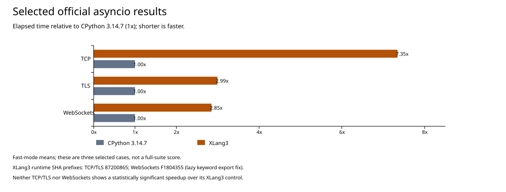

# Native Windows completion-queue trial (2026-10-01)

This trial replaces the Windows `_overlapped` completion-port shim's socket
polling with the OS completion queue. The Python `asyncio` event loop and
Task/Future implementations remain Python. `_overlapped` is a CPython-native
module, implemented here by XLang3 with the same Python import name.

The preceding [source comparison](windows-iocp-and-task-source-comparison-20261001.md)
found a 1 ms polling interval in the shim and a much larger completion latency
in the same-source native diagnostic. CPython 3.14.7's
[`overlapped.c`](https://github.com/python/cpython/blob/v3.14.7/Modules/overlapped.c#L203-L265)
creates an actual Windows completion port and waits for its completion packets.

## Runtime design

On Windows, `CreateIoCompletionPort` now registers socket/file handles with
an OS port, preserving completion keys and concurrency. An Overlapped object's
address identifies its stable native `OVERLAPPED` structure. Pending socket
operations post completion packets directly to that port; `GetQueuedCompletionStatus`
waits on it instead of scanning all operation records on a timer.

Synthetic posts use the same queue so another Python thread can wake an
infinite wait. The queue wait releases both the registry mutex and the VM
execution lock. The runtime reacquires them before constructing Python values
or touching operation-owned references. Native completion results preserve
error codes, transferred size, keys, and operation addresses.

Registered-handle waits retain their existing polling implementation, using a
short wait only while such registrations exist. The non-Windows implementation
also retains its registry queue. Closing a port through `_winapi.CloseHandle`
removes its registry associations and closes the OS handle. Cancelling a
pending operation during finalization waits for cancellation completion before
freeing the native structure and I/O buffers.

The code comments describe the latency reason, synthetic-post wakeup requirement,
lock ordering, and buffer-lifetime rule, so later changes preserve the design.

## First queue candidate: completion diagnostic

| 200-request native completion diagnostic | Control XLang3 | Native-queue XLang3 | CPython 3.14.7 |
|---|---:|---:|---:|
| Median | 4,575.8 us | 198.20 us | 82.2 us |
| Mean | 7,422.4 us | 474.29 us | 200.05 us |
| Minimum | 1,207.5 us | 122.0 us | 65.1 us |

The queue candidate median is 23.09x faster than the control in this diagnostic,
and still 2.41x slower than CPython. These samples include Python thread wakeup
and runtime costs and contain outliers. They do not establish a whole TCP/SSL
speedup. Preserve the [final candidate output](data/iocp-completion-latency-xlang3-native-final-20261001.txt)
alongside the [control](data/iocp-completion-latency-xlang3-control-20261001.txt)
and [CPython output](data/iocp-completion-latency-cpython314-20261001.txt).
The [first trial](data/iocp-completion-latency-xlang3-native-candidate-20261001.txt)
measured 276.65 us before event cleanup and wait-error compatibility fixes;
it is retained separately and does not identify the final binary.

## First queue candidate: correctness and identities

The new native completion fixture (`tests/native/overlapped_completion.py`)
passes under CPython and XLang3. It covers delayed receives, sends, completion
keys/addresses, cancellation errors, synthetic posts waking infinite waits,
queue timeouts, registered-handle wakeups, and cleanup. The owner-drop case
uses an explicit event on a socket not associated with an IOCP port, then
checks that Overlapped closes its owned event. CPython requires IOCP callers
to retain pending owners until their completion packets are drained.
`_winapi.WaitForSingleObject` now releases the VM lock during its wait and
raises an OSError on `WAIT_FAILED`, as CPython does. CMake registers the fixture as
a Windows CTest case. The existing synthetic completion wait fixture also
passes directly. Before the payload-readiness follow-up, CTest passed **54/54** in 44.79 seconds:
[complete output](data/iocp-native-final-ctest-20261001.log).

| Binary | Preserved control | Native-queue candidate |
|---|---|---|
| `xlang3.exe` | `07A9B84493AF7A63A0167681044EAF9FCA29683D4FCADCFE1CD9EE6135FFA565` | `C5F37B0A9238989B2DF678B1E2F2A00915C603A04BBC896A9B1573F71D897B84` |
| `xlang3_runtime.dll` | `FC938DE91D857AF7EE3599F568A8D32BEEB0F48DCFE903EC2469B263E163CC75` | `6A1AE55505F9E7E847A7F28F857CD18DC62888C984B473D96655939E192E02EA` |

Both use the validated clean-EOF SSL package with SHA-256
`55F3D436D0580AE980C8C1C07E1360D4EC65B3338155FB09FCC7FFD7C8C6A8C5`.
The control is preserved in `scratch/performance/iocp-control-20261001/`.
The unmeasured cache-cleanup trial was saved as a patch and removed from engine
source before this build; it does not affect this comparison.

The first queue candidate's fixed-baseline gate passed all 11 cases:
[JSON](data/iocp-native-fixed-regression-gate-final-20261001.json),
[log](data/iocp-native-fixed-regression-gate-final-20261001.log).
Its immediate-parent gate also passed all 11 cases:
[JSON](data/iocp-native-parent-regression-gate-final-20261001.json),
[log](data/iocp-native-parent-regression-gate-final-20261001.log).
Its candidate/control median time ratios ranged from 0.957x to 1.020x;
these cases are guards against unrelated regressions, not tests of IOCP latency.

## Official paired TCP/TLS results: first candidate rejected

The three runs finished sequentially with shared dependency sources and identical
compatibility hooks. Each benchmark transfers 100 chunks of 10 MiB and retains
its original payload-length assertion. The fast runs warn about measurement
instability; these values are preliminary means, not a rigorous suite result.

| Official benchmark | CPython 3.14.7 | Preserved XLang3 control | First native-queue candidate |
|---|---:|---:|---:|
| `asyncio_tcp` | 824 +/- 76 ms | 5.92 +/- 0.36 s | Failed payload assertion; no timing |
| `asyncio_tcp_ssl` | 4.33 +/- 0.22 s | 12.8 +/- 0.6 s | 13.3 +/- 0.4 s |

Pyperf reports the candidate **1.04x slower** than the control and **3.06x slower**
than CPython on TLS. The completion-latency improvement did not translate into
TLS throughput in this run. The candidate's TCP calibration worker failed
`data_len == CHUNK_SIZE * 100`, while the control completed, so this engine
candidate was not accepted. No speed ratio is assigned to that failed TCP case.

Raw data and logs:

- CPython: [JSON](data/iocp-official-cpython314-fast-20261001.json), [log](data/iocp-official-cpython314-fast-20261001.log).
- Control: [JSON](data/iocp-official-control-fast-20261001.json), [log](data/iocp-official-control-fast-20261001.log).
- First candidate: [JSON](data/iocp-official-candidate-fast-20261001.json), [log](data/iocp-official-candidate-fast-20261001.log).
- Pyperf comparisons: [control/candidate](data/iocp-official-control-candidate-fast-compare-20261001.log), [CPython/candidate](data/iocp-official-cpython314-candidate-fast-compare-20261001.log).

## Payload readiness follow-up

The [payload diagnostic](../../benchmarks/diagnostics/asyncio_stream_payload.py)
reports expected, sent, and received sizes and optionally checks content or
counts native completion packets. It uses the same write/drain/read shape and
can repeat transfers in one event loop; diagnostic timings are not scores.
CPython, the control, and the first candidate passed a single instrumented full
transfer. Repetition exposed the candidate's loss on the second transfer:
1,048,576,000 bytes sent but 1,048,313,856 received, missing 262,144 bytes.
Both [untraced](data/iocp-payload-candidate-untraced-repeat-20261001.log) and
[traced](data/iocp-payload-candidate-traced-repeat-20261001.log) attempts failed.

A trial deferred result publication to an overlapped-result query. It still
failed, with `ERROR_IO_INCOMPLETE` after Python treated the operation as ready.
A temporary native-state trace showed `pending=0`, `completed=0`, but Windows
`OVERLAPPED.Internal=259` (`STATUS_PENDING`):
[trace](data/iocp-payload-result-query-native-state-20261001.log).
The temporary stderr trace was removed after recording this evidence.

The current candidate also derives `Overlapped.pending` from the native status,
matching CPython's [pending getter](https://github.com/python/cpython/blob/v3.14.7/Modules/overlapped.c#L1557-L1562).
Pending `getresult()` raises error 996 and retains the pending operation, rather
than returning the initial zero result. Comments explain readiness and result
publication. The expanded fixture checks this error and repeated buffered reads.

The new candidate's runtime DLL SHA-256 is
`87200865397EF461E828E62CBE1B14AE5D29719502B7771E8F2BE7936E2D0942`;
its executable and SSL package hashes are unchanged. Both CPython and this
candidate pass the expanded fixture. **Ten consecutive full 1,000 MiB
workload transfers passed** (each exactly 1,048,576,000 bytes):
[complete output](data/iocp-payload-native-pending-repeat-20261001.log).
This establishes a focused correctness improvement, not an official speedup.
Two additional full transfers passed content checks, and the full CTest suite
passed **54/54** in 43.11 seconds:
[content output](data/iocp-payload-native-pending-content-20261001.log),
[CTest output](data/iocp-native-pending-ctest-20261001.log).
Both complete regression gates passed for the readiness candidate:
[fixed baseline JSON](data/iocp-native-pending-fixed-gate-20261001.json),
[fixed baseline log](data/iocp-native-pending-fixed-gate-20261001.log),
[parent JSON](data/iocp-native-pending-parent-gate-20261001.json),
[parent log](data/iocp-native-pending-parent-gate-20261001.log).
The parent median time ratios ranged from 0.955x to 1.025x, with all 11 cases
passing the unchanged threshold.

Both official reruns completed with the original payload assertions:

| Official benchmark | CPython 3.14.7 | Preserved XLang3 control | Readiness candidate | Candidate versus CPython |
|---|---:|---:|---:|---:|
| `asyncio_tcp` | 824 +/- 76 ms | 5.92 +/- 0.36 s | 6.05 +/- 0.64 s | 7.35x slower |
| `asyncio_tcp_ssl` | 4.33 +/- 0.22 s | 12.8 +/- 0.6 s | 13.0 +/- 0.5 s | 2.99x slower |

The TCP candidate's 11% standard deviation triggers pyperf's instability
warning. Pyperf hides both candidate/control differences as statistically
insignificant. These runs establish a correctness recovery from the first queue
candidate, not a bulk-throughput win over the preserved control. The two-case
geometric mean is 4.69x slower than CPython; it is not a full-suite aggregate.
Preserved evidence: [candidate JSON](data/iocp-official-native-pending-fast-20261001.json),
[log](data/iocp-official-native-pending-fast-20261001.log),
[control comparison](data/iocp-official-native-pending-control-compare-20261001.log),
[CPython comparison](data/iocp-official-native-pending-cpython314-compare-20261001.log).

## CPU and scheduling evidence

The unchanged 1,000 MiB payload diagnostic gained an optional `--timing` report
around `asyncio.run()`. With content checking disabled, all length assertions
still ran. Imports are excluded, while event-loop setup and shutdown are included.
These are individual diagnostic runs, not official benchmark measurements:

| Runtime | Wall seconds | Process CPU seconds | CPU/wall |
|---|---:|---:|---:|
| CPython 3.14.7 | 0.730 | 0.734 | 1.007 |
| Preserved XLang3 control | 5.374 | 5.328 | 0.991 |
| Readiness candidate | 5.821 | 5.672 | 0.974 |

The XLang3 bulk-transfer runs spend about 97-99% of wall time using CPU. This
supports investigating VM execution and Task/Future work next; eliminating
polling waits alone did not materially improve this workload. It does not
identify the fraction attributable to any individual Python function.
Raw outputs: [CPython](data/iocp-payload-cpu-cpython314-20261001.log),
[control](data/iocp-payload-cpu-control-20261001.log),
[candidate](data/iocp-payload-cpu-native-pending-20261001.log).

The [accelerator contract probe](../../benchmarks/diagnostics/asyncio_accelerator_contract.py)
passes under [CPython](data/asyncio-contract-cpython314-before-native-20261001.log)
and [XLang3](data/asyncio-contract-xlang3-before-native-20261001.log). It checks
callback context/order/deferred scheduling, removal, pending-result errors,
exception identity, cancellation messages/counters, eager task context,
awaited-by tracking, and Future result-cycle collection. CPython reports native
`_asyncio` classes while XLang3 uses the Python fallbacks. The probe separately
records their intentional subclass-await difference and does not pretend the
fallback supplies native accelerator behavior.

## WebSocket follow-up: a generic module-call failure

The official WebSocket fast run completed under CPython at 186 +/- 10 ms.
Both XLang3 builds failed before measuring: the first keyword call to the lazy
`concurrent.futures.ThreadPoolExecutor` export raised `AttributeError`. The
standard-library package provides that export through Python `__getattr__`.
Reading the attribute works; the VM's fused keyword method-call path skipped
the hook after an attribute miss. This is a generic call-dispatch defect.
The Python thread-pool library remains Python.

The control and candidate used identical XLang3 `_hashlib`/`_blake2` packages,
shared WebSocket 11.0.3 Python sources, and the same compatibility hooks.
No timing or ratio is assigned to either failed XLang3 attempt.
Evidence: [CPython JSON](data/iocp-websockets-cpython314-fast-20261001.json),
[CPython log](data/iocp-websockets-cpython314-fast-20261001.log),
[control failure](data/iocp-websockets-control-fast-20261001.log),
[candidate failure](data/iocp-websockets-native-pending-fast-20261001.log),
[shared native package hashes](data/iocp-websockets-common-native-package-hashes-20261001.txt).

The follow-up adds the missing hook only on attribute lookup failure, keeping
successful indexed/cached calls unchanged and avoiding caching computed lazy
exports. The expanded `module_getattr_call` fixture checks repeated keyword
access, constructors, callable objects, invalid keywords, hook exceptions, and
a first-access thread-pool submission. It passes under CPython and the fix,
and fails under the preserved pre-fix runtime. Both Windows and Python fixture
runners now include this fixture. Full CTest passed **54/54** in 44.41 seconds:
[output](data/lazy-module-keyword-ctest-20261001.log).
The complete fixed-baseline and immediate-parent gates each passed **11/11**:
[fixed JSON](data/lazy-module-keyword-fixed-gate-20261001.json),
[fixed log](data/lazy-module-keyword-fixed-gate-20261001.log),
[parent JSON](data/lazy-module-keyword-parent-gate-20261001.json),
[parent log](data/lazy-module-keyword-parent-gate-20261001.log).
The parent median ratios ranged from 0.983x to 1.009x.
The expanded fixture's direct results are preserved for
[CPython](data/lazy-module-keyword-cpython314-20261001.log),
[pre-fix failure](data/lazy-module-keyword-parent-20261001.log), and
[candidate](data/lazy-module-keyword-candidate-20261001.log).

The official WebSocket rerun completed at **531 +/- 50 ms**, **2.85x slower**
than CPython. A separate control applies exactly the same lazy-export fix to
the previous polling implementation, with the same native packages and Python
dependency sources. It completed at **562 +/- 65 ms**. Pyperf hides the
control/candidate difference as statistically insignificant. Unblocking the
benchmark is a correctness improvement; no throughput gain is established.
The native-queue candidate remains slower than CPython in all three measured
asyncio cases.

| WebSocket build | Runtime DLL SHA-256 |
|---|---|
| Lazy-export fix with polling completion path | `173CD5B02CAA5178A66A1D491ED0D5BE81DEF02689784FDC4C6D0CA7BD34AA4D` |
| Lazy-export fix with native queue and readiness fix | `F1804355B77C2F74E9C83AEC115E149C8A566B2BF4DB700DF923AB7BB5C1BBFA` |

The candidate executable is still `C5F37B0...897B84`, and both builds use the
same validated SSL package. The polling control was preserved in
`scratch/performance/websockets-lazy-module-polling-control-20261001/` before
restoring the candidate's source and validated executable/runtime DLL. No
build or other benchmark ran concurrently with either WebSocket measurement.

Raw data: [candidate JSON](data/websockets-lazy-module-native-pending-fast-20261001.json),
[candidate log](data/websockets-lazy-module-native-pending-fast-20261001.log),
[polling control JSON](data/websockets-lazy-module-polling-control-fast-20261001.json),
[control log](data/websockets-lazy-module-polling-control-fast-20261001.log),
[control comparison](data/websockets-lazy-module-control-compare-20261001.log),
[CPython comparison](data/websockets-lazy-module-cpython314-compare-20261001.log).

The horizontal chart uses CPython elapsed time as 1x; a longer bar means more
time and therefore slower execution. It identifies TCP/TLS and WebSockets'
separate measured candidates. Reproduce it with
[`plot_selected_asyncio_results.py`](../../benchmarks/diagnostics/plot_selected_asyncio_results.py)
and ReportLab; an optional PNG preview uses pypdfium2.

## Current candidate: repeated completion diagnostic

After the build and official measurements finished, all three runtimes ran
the unchanged 200-request completion diagnostic three times in different
orders. The median latency ranges were:

| Runtime | Three per-run medians (us) |
|---|---|
| CPython 3.14.7 | 182.45, 227.60, 110.40 |
| XLang3 polling, with lazy-export fix | 15,183.35, 14,951.40, 15,242.10 |
| XLang3 native queue/readiness, with lazy-export fix | 114.05, 202.70, 177.25 |

The native queue removes the polling latency floor in this diagnostic. The
CPython and native-queue medians overlap, with no consistent winner across
the three runs. The much larger polling result than the preceding historical
trial demonstrates sensitivity to Windows timer/thread scheduling. These
diagnostic gains are not a full-suite score or a speedup in TCP/TLS/WebSockets.

Raw runs:

- CPython: [1](data/iocp-completion-latency-cpython314-readiness-20261001.txt), [2](data/iocp-completion-latency-cpython314-keyword-fix-round2-20261001.txt), [3](data/iocp-completion-latency-cpython314-keyword-fix-round3-20261001.txt).
- Polling: [1](data/iocp-completion-latency-polling-keyword-fix-20261001.txt), [2](data/iocp-completion-latency-polling-keyword-fix-round2-20261001.txt), [3](data/iocp-completion-latency-polling-keyword-fix-round3-20261001.txt).
- Native queue: [1](data/iocp-completion-latency-native-keyword-fix-20261001.txt), [2](data/iocp-completion-latency-native-keyword-fix-round2-20261001.txt), [3](data/iocp-completion-latency-native-keyword-fix-round3-20261001.txt).
