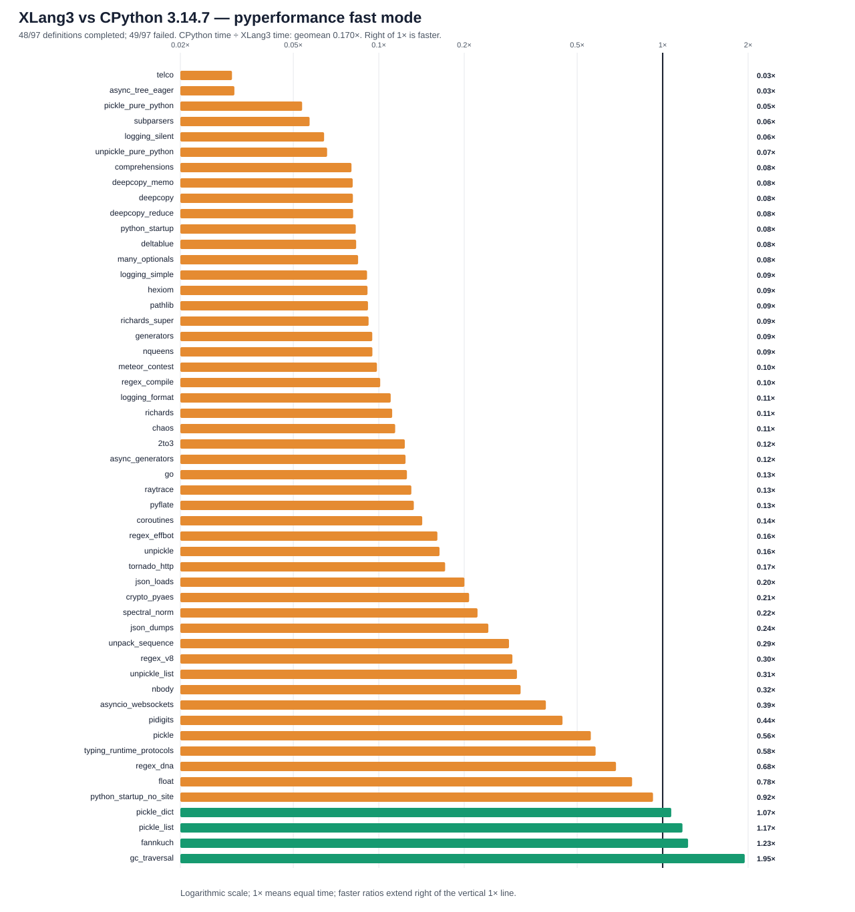

# XLang3 vs CPython 3.14.7: corrected full pyperformance run

The corrected XLang3 run attempted all **97** pyperformance 1.14.0 definitions in `--fast` mode. It completed **48** definitions and recorded **49** failures/timeouts. The command returned exit code 1 because pyperformance treats those benchmark failures as an unsuccessful suite; every definition was attempted.

Of **52** matched subtests, XLang3 was faster on **4**. The geometric mean of CPython time divided by XLang3 time was **0.16972×**; values over 1× favor XLang3. Fast-mode samples carry stability warnings and are directional evidence.

## Run configuration

- XLang3 Release executable SHA-256: `2AE30FA9A56B11E9BF3298D5A48CA33357C9FF93C097FD29A8B9D485769A1E63`.
- XLang3 runtime DLL SHA-256: `C58DC9AEFD3E4F1F017A23E90715553050910974189D80C75415A5D2A897B081`.
- CPython reference: pyperformance 1.14.0 on CPython 3.14.7; XLang3 loaded `Python 3.14 standard library`.
- The XLang3 `PYTHONPATH` contains the Windows pyperf compatibility shim and the shared benchmark dependency site-packages. No Python 3.13 standard-library overlay was used.
- Each XLang3 benchmark definition had a 120-second cap covering pyperf worker calibration and measurement. Overrides: async_tree*=30s, async_tree_eager=300s.

## Largest slowdowns and wins

| Subtest | CPython 3.14.7 | XLang3 | CPython / XLang3 |
|---|---:|---:|---:|
| `telco` | 5.755 ms | 189.3 ms | 0.030× |
| `async_tree_eager` | 86.62 ms | 2793 ms | 0.031× |
| `pickle_pure_python` | 273.5 µs | 5.094 ms | 0.054× |
| `subparsers` | 8.151 ms | 142.8 ms | 0.057× |
| `logging_silent` | 70.03 ns | 1.091 µs | 0.064× |

Measured wins:

- `gc_traversal`: **1.945×** (1.199 ms vs 2.332 ms).
- `fannkuch`: **1.229×** (263.6 ms vs 324 ms).
- `pickle_list`: **1.174×** (3.938 µs vs 4.625 µs).
- `pickle_dict`: **1.072×** (24.63 µs vs 26.41 µs).

## Failure breakdown

- 28 definitions: Benchmark died.
- 21 definitions: Benchmark timed out.

The [all-97 status CSV](performance/pyperformance-xlang3-fixed-positional-binder-vs-cpython314-fast-20261004-all-97-status.csv) retains every benchmark definition and failure status. The [matched subtest CSV](performance/pyperformance-xlang3-fixed-positional-binder-vs-cpython314-fast-20261004-subtests.csv) contains raw per-subtest means and speed ratios.

## Raw evidence

- XLang3 pyperf JSON: [`pyperformance-xlang3-fixed-positional-binder-full-fast-20261004.json`](performance/data/pyperformance-xlang3-fixed-positional-binder-full-fast-20261004.json).
- Runner status log: [`pyperformance-xlang3-fixed-positional-binder-full-fast-20261004.log`](performance/data/pyperformance-xlang3-fixed-positional-binder-full-fast-20261004.log).
- CPython 3.14.7 pyperf JSON: [`pyperformance-cpython314-clean-release-full-fast-20261002.json`](performance/data/pyperformance-cpython314-clean-release-full-fast-20261002.json).
- Earlier runs that used a Python 3.13 standard library are retained separately; this run supersedes them as the same-version Python 3.14 comparison.

Benchmark worker failures have several causes, including unavailable optional benchmark dependencies, XLang3 native-module gaps, and interpreter compatibility bugs. The status CSV gives case-level failure details, and the runner log preserves worker tracebacks when available. A worker death is not a performance score; inspect its case-specific cause before treating it as a speed result.
